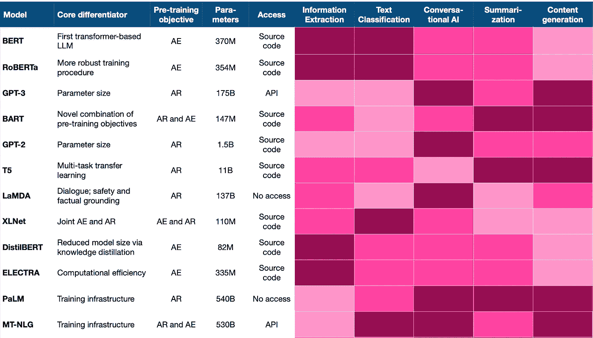
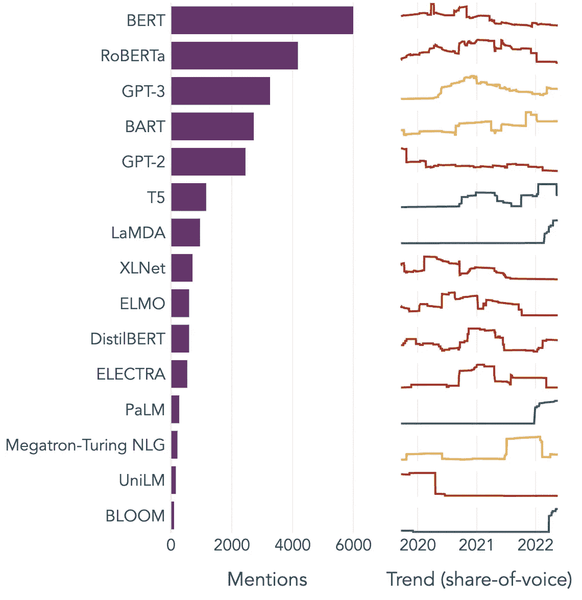
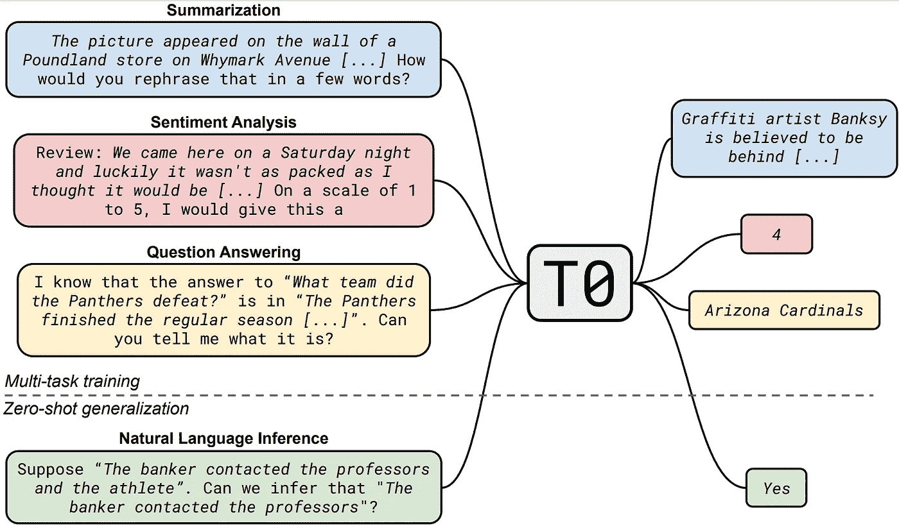
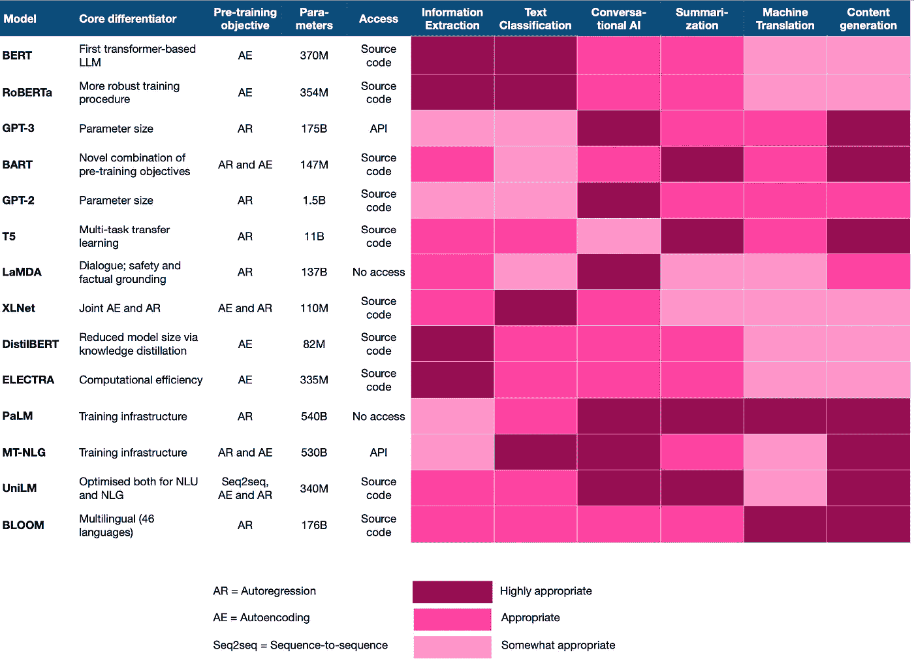

# 为您的 NLP 用例选择正确的语言模型

> 原文：<https://towardsdatascience.com/choosing-the-right-language-model-for-your-nlp-use-case-1288ef3c4929>

## *理解、选择和部署大型语言模型的指南*

大型语言模型(LLM)是经过训练以产生文本的深度学习模型。凭借这种令人印象深刻的能力，LLM 已经成为现代自然语言处理(NLP)的骨干。传统上，他们由学术机构和 OpenAI、微软和英伟达等大型科技公司进行预培训。其中大部分随后可供公众使用。这种即插即用的方法是迈向大规模人工智能采用的重要一步——企业现在可以专注于针对特定用例微调现有的 LLM，而不是花费大量资源来训练具有一般语言知识的模型。

然而，为您的应用程序选择正确的模型可能很棘手。用户和其他利益相关者必须在语言模型和相关创新的活跃环境中前进。这些改进解决了语言模型的不同组成部分，包括它的训练数据、预训练目标、架构和微调方法——你可以就这些方面中的每一个写一本书。在所有这些研究的基础上，围绕巨大语言模型的人工通用智能的营销热潮和迷人光环使事情更加模糊不清。

在本文中，我解释了 LLM 背后的主要概念和原则。目标是为非技术利益相关者提供直观的理解，以及与开发人员和人工智能专家有效交互的语言。对于更广泛的覆盖面，文章包括了大量 NLP 相关出版物中的分析。虽然我们不会深入语言模型的数学细节，但是这些可以很容易地从参考资料中检索到。

文章的结构如下:首先，我将语言模型置于不断发展的 NLP 环境中。第二部分解释了 LLM 是如何构建和预训练的。最后，我描述了微调过程，并提供了一些模型选择的指导。

# 语言模型的世界

## 弥合人机差距

语言是人类思维的一种迷人技能——它是交流我们丰富的世界知识的通用协议，也是更主观的方面，如意图、观点和情感。在人工智能的历史上，有过多次用数学手段近似(“建模”)人类语言的研究浪潮。在深度学习时代之前，表示基于简单的代数和概率概念，如单词的一键表示、序列概率模型和递归结构。随着过去几年深度学习的发展，语言表示在精确度、复杂性和表现力方面都有所增加。

2018 年，在新变压器架构的基础上推出了 BERT 作为第一个 LLM。从那以后，基于变压器的 LLM 获得了强劲的发展势头。语言建模因其普遍的有用性而特别吸引人。虽然许多现实世界的 NLP 任务(如情感分析、信息检索和信息提取)不需要生成语言，但假设生成语言的模型也具有解决各种更专业的语言挑战的技能。

## 尺寸很重要

学习是基于参数进行的，这些参数是在训练过程中为实现最佳预测质量而优化的变量。随着参数数量的增加，模型能够获得更多的粒度知识并改进其预测。自 2017-2018 年推出第一批 LLMs 以来，我们看到参数大小呈指数级爆炸——突破性的伯特用 3.4 亿个参数训练，威震天-图灵 NLG，2022 年发布的模型，用 530 亿个参数训练——增加了一千多倍。

*图 1:语言模型的参数大小随时间呈指数增长【11】*

因此，主流不断用越来越多的参数让公众惊叹。然而，有批评的声音指出，模型的性能并没有随着模型大小的增加而增加。另一方面，模型预训练可能会留下相当大的碳足迹。缩小规模的努力对抗了蛮力方法，使语言建模的进展更可持续。

## 语言模型的生命

LLM 领域竞争激烈，创新短暂。下图显示了 2018 年至 2022 年期间最受欢迎的前 15 名 LLM，以及他们在一段时间内的话语权份额:

*图 2:前 15 个最受欢迎的语言模型的提及和声音份额【12】*

我们可以看到，大多数模型在相对较短的时间后会逐渐淡出人们的视线。为了保持领先，用户应该监控当前的创新，并评估升级是否值得。

大多数 LLM 遵循相似的生命周期:首先，在“上游”，模型被预先训练。由于对数据大小和计算的严格要求，这主要是大型科技公司和大学的特权。最近，也有一些合作努力(例如[大科学研讨会](https://bigscience.huggingface.co/))来共同推进 LLM 领域。Cohere 和 AI21 Labs 等少数资金雄厚的初创公司也提供预培训的法律硕士。

发布之后，该模型被专注于应用程序的开发人员和企业在“下游”采用和部署。在这个阶段，大多数模型都需要对特定的领域和任务进行额外的微调。其他的，如 GPT-3，更方便，因为他们可以在预测期间直接学习各种语言任务(零或少射预测)。

最后，时间敲门，一个更好的模型即将出现——要么有更多的参数，更有效地利用硬件，要么对人类语言的建模进行更根本的改进。带来实质性创新的模型可以产生完整的模型家族。比如 BERT 住在 BERT-QA，DistilBERT，RoBERTa，都是基于原来的架构。

在接下来的部分中，我们将关注这个生命周期中的前两个阶段——预培训和部署的微调。

# 前期培训:法律硕士是如何诞生的

大多数团队和 NLP 实践者不会参与 LLM 的预培训，而是参与它们的微调和部署。然而，要成功地选择和使用一个模型，重要的是要理解“幕后”发生了什么。在本节中，我们将了解 LLM 的基本要素:

*   培训用数据
*   输入表示
*   培训前目标
*   模型架构(编码器-解码器)

这些不仅会影响选择，还会影响 LLM 的微调和部署。

## 培训用数据

用于 LLM 训练的数据大多是涵盖不同风格的文本数据，如文献、用户生成的内容和新闻数据。在看到各种不同的文本类型后，生成的模型开始意识到语言的细节。除了文本数据之外，代码经常被用作输入，教导模型生成有效的程序和代码片段。

不出所料，训练数据的质量对模型性能有直接影响，也对模型所需的大小有直接影响。如果您在准备训练数据方面很聪明，您可以在减少模型大小的同时提高模型质量。一个例子是 T0 模型，它比 GPT-3 小 16 倍，但在一系列基准任务上优于它。诀窍在于:它不仅仅使用任何文本作为训练数据，而是直接使用任务公式，从而使其学习信号更加集中。图 3 展示了一些培训示例。

*图 3: T0 接受了针对各种语言任务的明确任务公式的训练*

关于训练数据的最后一点说明:我们经常听说语言模型是以无监督的方式训练的。尽管这让它们很有吸引力，但从技术上来说这是错误的。相反，格式良好的文本已经提供了必要的学习信号，省去了手动标注数据的繁琐过程。要预测的标签对应于句子中的过去和/或未来单词。因此，注释是自动和大规模发生的，使得该领域的相对快速的进展成为可能。

## 输入表示

一旦收集了训练数据，我们需要将它打包成模型能够消化的形式。神经网络以代数结构(向量和矩阵)为基础，语言的最佳代数表示是一个持续的追求——从简单的单词集到包含高度分化的上下文信息的表示。每一个新的步骤都让研究人员面临自然语言无尽的复杂性，暴露了当前表示法的局限性。

语言的基本单位是单词。在 NLP 的初期，这产生了天真的单词包表示法，将文本中的所有单词放在一起，不管它们的顺序如何。考虑这两个例子:

在单词袋的世界里，这些句子会得到完全相同的表示，因为它们由相同的单词组成。显然，它只包含了它们的一小部分含义。

顺序表征包含了关于词序的信息。在深度学习中，序列的处理最初是在顺序感知的**递归神经网络** (RNN)中实现的。[2]然而，更进一步说，语言的基本结构不是纯粹的顺序结构，而是层次结构。换句话说，我们讨论的不是列表，而是树。相距较远的单词实际上比相邻的单词具有更强的句法和语义联系。考虑下面的例子:

在这里，*她的*指的是*那个*的女孩。当 RNN 到达句子的结尾，最后看到*她的*时，它对句子开头的记忆可能已经褪色，因此不允许它恢复这种关系。

为了解决这些长距离依赖性，提出了更复杂的神经结构来建立对上下文的更有区别的记忆。这个想法是将与未来预测相关的单词保留在记忆中，而忘记其他单词。这是长短期记忆(LSTM)[3]细胞和门控循环单位(GRUs)[4]的贡献。然而，这些模型并不针对要预测的特定位置进行优化，而是针对一般的未来环境。此外，由于其复杂的结构，它们甚至比传统的 rnn 训练更慢。

最后，人们摒弃了循环，提出了**注意力机制**，并将其整合到**转换器**架构中。[5]注意力允许模型在预测过程中在不同的单词之间来回聚焦。根据每个单词与要预测的特定位置的相关性对其进行加权。对于上面的句子，一旦模特到达*的位置，她的*、*女孩*在处的权重会比*高，尽管事实上它在线性顺序中要远得多。*

迄今为止，注意力机制最接近人类大脑在信息处理过程中的生物工作。研究表明，注意力学习层次句法结构，包括一系列复杂的句法现象(参见[BERTology 初级读本](https://direct.mit.edu/tacl/article/doi/10.1162/tacl_a_00349/96482/A-Primer-in-BERTology-What-We-Know-About-How-BERT)及其中引用的论文)。它还允许并行计算，因此，更快和更有效的训练。

## 培训前目标

有了合适的训练数据表示，我们的模型就可以开始学习了。有三个用于预训练语言模型的通用目标:序列到序列的转导、自回归和自动编码。所有这些都要求模型掌握广泛的语言学知识。

编码器-解码器架构以及变换器模型处理的原始任务是**序列到序列的转换**:将序列转换成不同表示框架中的序列。经典的序列到序列的任务是机器翻译，但其他任务，如总结，经常以这种方式制定。请注意，目标序列不一定是文本，它也可以是其他非结构化数据(如图像)以及结构化数据(如编程语言)。序列间 LLM 的一个例子是 BART 系列。

第二个任务是**自回归**，这也是最初的语言建模目标。在自回归中，模型学习根据以前的标记预测下一个输出(标记)。学习信号受到企业单向性的限制——模型只能使用来自预测令牌右侧或左侧的信息。这是一个主要的限制，因为单词可以依赖于过去以及未来的位置。例如，考虑动词*书写*如何在两个方向上影响下面的句子:

在这里，*纸张*的位置被限制为可写的东西，而*学生*的位置被限制为人类，或者，无论如何，另一个能够书写的智能实体。

许多今日头条的 LLM 都是自回归的，包括 GPT 家族、PaLM 和 BLOOM。

第三项任务—自动编码—解决了单向性问题。自动编码非常类似于经典单词嵌入的学习。[6]首先，我们通过在输入中隐藏一定比例的标记(通常为 10-20%)来破坏训练数据。然后，该模型学习基于周围环境重建正确的输入，同时考虑前面和后面的标记。自动编码器的典型例子是 BERT 系列，其中 BERT 代表变压器的双向编码器表示。

## 模型架构(编码器-解码器)

语言模型的基本构件是编码器和解码器。编码器将原始输入转换为高维代数表示，也称为“隐藏”向量。等一下——藏起来了？事实上，在这一点上没有什么大秘密。当然你可以看看这个表示，但是一个冗长的数字向量对人类来说没有任何意义。需要我们模型的数学智能来处理它。解码器以可理解的形式再现隐藏的表示，例如另一种语言、编程代码、图像等。

*图 4:编码器-解码器架构的基本模式(英德翻译示例)*

编码器-解码器架构最初是为递归神经网络引入的。自从引入基于注意力的变压器模型以来，传统的递归已经失去了它的流行性，而编码器-解码器的思想仍然存在。大多数自然语言理解(NLU)任务依赖于编码器，而自然语言生成(NLG)任务需要解码器，序列到序列的转换需要这两个组件。

在这里，我们不会深入讨论 Transformer 架构和注意机制的细节。对于那些想掌握细节的人来说，要准备好花大量的时间来思考这个问题。在原始论文之外，[7]和[8]提供了极好的解释。对于轻量级的介绍，我推荐吴恩达[序列模型课程](https://www.coursera.org/learn/nlp-sequence-models)中的相应章节。

# 在现实世界中使用语言模型

## 微调

语言建模是一项强大的上游任务——如果你有一个成功生成语言的模型，那么恭喜你——这是一个智能模型。然而，拥有一个充满随机文本的模型的商业价值是有限的。相反，NLP 主要用于更有针对性的下游任务，如情感分析、问题回答和信息提取。是时候应用**迁移学习**并重用现有的语言知识来应对更具体的挑战了。在微调过程中，模型的一部分被“冻结”,其余部分用特定领域或特定任务的数据进一步训练。

显式的微调增加了 LLM 部署的复杂性。它还可能导致模型爆炸，每个业务任务都需要自己的微调模型，升级为不可维护的各种模型。因此，人们已经努力使用少量或零次学习来消除微调步骤(例如，在 GPT-3 [9])。这种学习发生在预测过程中:模型被输入“提示”——任务描述和潜在的几个训练示例——以指导其对未来示例的预测。

虽然实现起来要快得多，但零次或少次学习的便利因素被其较低的预测质量抵消了。此外，许多这些模型需要通过云 API 来访问。在开发的开始阶段，这可能是一个受欢迎的机会——然而，在更高级的阶段，它可能会变成另一个不想要的外部依赖。

## 为您的下游任务选择正确的模型

看着人工智能市场上新语言模型的持续供应，为特定的下游任务选择正确的模型并与最先进的技术保持同步可能是棘手的。

研究论文通常根据特定的下游任务和数据集对每个模型进行基准测试。标准化的任务套件如[强力胶](https://super.gluebenchmark.com/)和[大工作台](https://github.com/google/BIG-bench)允许对大量 NLP 任务进行统一的基准测试，并提供比较的基础。尽管如此，我们应该记住，这些测试是在高度控制的环境下准备的。截至目前，语言模型的泛化能力相当有限，因此，转移到现实生活的数据集可能会显著影响模型的性能。评估和选择合适的模型应包括对尽可能接近生产数据的数据进行实验。

根据经验，预训练目标提供了一个重要的提示:自回归模型在文本生成任务上表现良好，如对话式人工智能、问题回答和文本摘要，而自动编码器擅长“理解”和结构化语言，例如用于情感分析和各种信息提取任务。旨在用于零射击学习的模型理论上可以执行各种任务，只要它们接收到适当的提示——然而，它们的准确性通常低于微调模型。

为了使事情更具体，下面的图表显示了流行的 NLP 任务如何与 NLP 文献中突出的语言模型相关联。基于多个相似性和聚集度量来计算关联，包括嵌入相似性和距离加权共现。评分较高的模型-任务对，如 BART /文本摘要和 LaMDA /对话式 AI，表明基于历史数据的良好匹配。

*图 5:语言模型和下游任务之间的关联强度【12】*

# 关键要点

在本文中，我们已经讨论了 LLM 的基本概念和创新发生的主要方面。下表总结了最流行的 LLM 的主要特性:

*表 1:最流行的大型语言模型的特性总结*

让我们总结一些选择和部署 LLM 的一般准则:

1.在评估潜在模型时，要清楚自己在人工智能旅程中的位置:

*   一开始，尝试通过云 API 部署 LLM 可能是个好主意。
*   一旦您找到了适合产品市场的产品，就可以考虑在您这边托管和维护您的模型，以便对您的应用程序进行更多的控制并进一步提高模型性能。

2.为了与您的下游任务保持一致，您的 AI 团队应该基于以下标准创建一个模型的短列表:

*   学术文献中的基准结果，重点是你的下游任务
*   预训练目标和下游任务之间的一致性:考虑 NLU 的自动编码和 NLG 的自回归
*   先前报告的这种模型-任务组合的经验(参见图 5)

4.然后，应该对照您的真实任务和数据集来测试入围的模型，以获得对性能的第一感觉。
5。在大多数情况下，通过专门的微调，您可能会获得更好的质量。然而，如果你没有内部技术技能或预算进行微调，或者如果你需要完成大量的任务，可以考虑少量/零尝试学习。
6。LLM 的创新和趋势是短暂的。当使用语言模型时，关注它们的生命周期和 LLM 环境中的整体活动，并寻找机会来提高你的水平。

最后，要意识到 LLM 的局限性。虽然它们拥有惊人的、类似人类的语言表达能力，但它们的整体认知能力与我们人类相去甚远。这些模型的世界知识和推理能力严格限于它们在语言表层找到的信息。他们也不能及时了解事实，可能会毫不犹豫地向你提供过时的信息。如果您正在构建一个依赖于生成最新甚至原始知识的应用程序，请考虑将您的 LLM 与其他多模态、结构化或动态知识源相结合。

# 参考

[1]维克多·桑等人 2021。[多任务提示训练使零射击任务泛化](https://arxiv.org/abs/2110.08207)。更正，abs/2110.08207。
[2]约舒阿·本吉奥等译 1994。[学习具有梯度下降的长期依赖性是困难的](https://ieeexplore.ieee.org/document/279181)。 *IEEE 神经网络汇刊*，5(2):157–166。
[3]塞普·霍克雷特和于尔根·施密德胡贝尔。1997.[长短期记忆](https://dl.acm.org/doi/10.1162/neco.1997.9.8.1735)。*神经计算*，9(8):1735–1780。
[4] Kyunghyun Cho 等 2014。[关于神经机器翻译的性质:编码器-解码器方法](https://arxiv.org/abs/1409.1259)。第八届 SSST 会议记录，第八届统计翻译句法、语义和结构研讨会，第 103-111 页，卡塔尔多哈。
[5]阿希什·瓦斯瓦尼等 2017。你需要的只是关注。载于*神经信息处理系统进展*，第 30 卷。[6]托马斯·米科洛夫等人，2013 年。[词和短语的分布式表示及其组合性](https://arxiv.org/abs/1310.4546)。更正，abs/1310.4546。
【7】杰伊·贾拉马尔。2018.[图示变压器](https://jalammar.github.io/illustrated-transformer/)。
[8]亚历山大·拉什等 2018。[带注释的变压器](https://nlp.seas.harvard.edu/2018/04/03/attention.html)。
[9]汤姆·布朗等著 2020。[语言模型是一次性学习者](https://arxiv.org/abs/2005.14165)。第 34 届国际神经信息处理系统会议论文集，NIPS'20，美国纽约红钩。Curran Associates Inc .
[10]Jacob Devlin 等人 2019。 [BERT:用于语言理解的深度双向转换器的预训练](https://arxiv.org/abs/1810.04805)。在*计算语言学协会北美分会 2019 年会议记录:人类语言技术*，第 1 卷(长和短论文)，第 4171-4186 页，明尼苏达州明尼阿波利斯。
[11]朱利安·西蒙 2021。[大型语言模型:新摩尔定律？](https://julsimon.medium.com/large-language-models-a-new-moores-law-66623de5631b)
【12】基础数据集:领先的人工智能智库在专业人工智能资源、技术博客和出版物中发表的 2018-2022 年超过 32 万篇关于人工智能和自然语言处理的文章。

除非另有说明，所有图片均为作者所有。