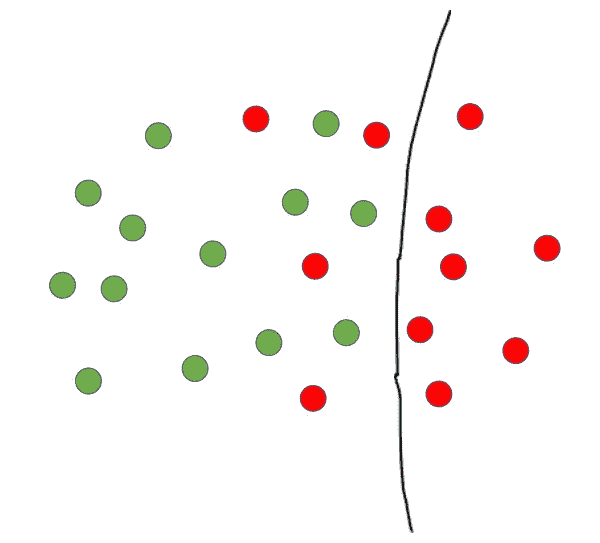

# 机器学习问题中的类不平衡:实践指南

> 原文：<https://towardsdatascience.com/class-imbalance-in-machine-learning-problems-a-practical-guide-4fb81eee0041>

## 来自应用数据科学战壕的五个教训

照片由 [Unsplash](https://unsplash.com?utm_source=medium&utm_medium=referral) 上的 [Piret Ilver](https://unsplash.com/@saltsup?utm_source=medium&utm_medium=referral) 拍摄

C 类不平衡是数据科学文献中最普遍的话题之一，其中一个类比另一个类丰富得多。仅在 Medium 上搜索“阶级失衡”就会发现许多标题如下的文章:

*   *“处理用于分类的类不平衡数据集”*
*   *“如何用 Python 和 SMOTE 毫不费力地处理类不平衡”*
*   *“停止使用 SMOTE 处理阶级失衡”*
*   *“一种适用于类别不平衡数据的损失函数:焦点损失”*
*   *“阶层失衡:一个令人头疼的分类问题”*

这的确令人头痛。你应该重新平衡吗？使用 SMOTE？*不是*用 SMOTE？用焦损怎么样？感觉就像你可以花几个月的时间做实验，但仍然会有你没有尝试过的事情。这是数据科学家的西西弗斯山。

我写这篇文章的目的是打破常规，解释五个我认为对理解类不平衡最重要的概念，这是为业务领域的数据科学家写的，他们的实验时间预算有限。我将以一套简单的“经验法则”作为结束，你可以在下一个不平衡的 ML 问题中用作实践指南。

让我们开始吧。

## 1.阶级失衡是常态，而不是例外

在典型的 ML 应用中，类别不平衡是正常的和预期的。例如:

*   在信用卡欺诈检测中，大多数交易是合法的，只有一小部分是欺诈性的。
*   在垃圾邮件检测中，情况正好相反:[今天全球发送的大多数](https://dataprot.net/statistics/spam-statistics/)电子邮件都是垃圾邮件。
*   在广告转化预测中，大多数用户会忽略该广告，只有一小部分会点击它。
*   在用户流失预测中，大部分用户会留在平台上，只有一小部分会‘流失’(即离开平台)。

失衡只是我们生活现实的一部分。事实上，相反的情况很少见:在现实世界中，你很少会遇到分类问题，因为所有的类出现的频率都是一样的。换句话说，许多现实世界的 ML 问题都是“大海捞针”。

## 2.阶级不平衡本身不是问题

尽管有些文章中提到了这一点，但失衡本身实际上并不是问题所在。相反，当处理一个不平衡的 ML 问题时，有 3 件事可能出错:

**选择了错误的指标。**准确性是一个不好的度量，用来量化 ML 模型在不平衡问题上的性能:如果阳性率仅为 1%，那么一个将所有东西都标记为阴性的朴素分类器根据定义具有 99%的准确性。这在理论上听起来不错，但在实践中却很糟糕。这个问题当然可以通过选择更合适的指标来避免，例如固定召回率下的精确度、固定召回率下的精确度、PR-AUC 或 ROC-AUC。

**训练/发球歪斜。**这是指当用于训练模型的数据与推理时使用的数据不同时出现的问题，例如，因为训练数据已被手动重新平衡。训练/服务不对称的问题在于，训练数据上的性能并不能很好地代表服务时的性能，模型最终可能会比预期的更差。例如，如果在训练时，我们以 10 倍的因子对底片进行下采样，那么，在最坏的情况下，生产中的精度可能比预期的差 10 倍。

**数据稀缺。**在不平衡问题中，可能很难收集足够大量的标记阳性样本来训练具有合理性能的 ML 模型。例如，如果您只有 10 到 100 个正样本，模型可能很容易记住这些样本，导致过度拟合模型，泛化能力很差。问题越不平衡，可用于训练模型的阳性样本就越少。

请注意，在这三种情况下，不平衡本身都不是问题所在。例如，在 100 万张底片和 100 万张 10K 底片上训练一个模型是完全可以的，只要你避免使用精确度作为衡量标准。

## 3.向上采样少数民族类可能不是一个好主意

对少数类进行上采样，即将负样本的副本添加到训练数据中，通常被推荐为解决不平衡问题的首要尝试之一(例如[这里的](https://machinelearningmastery.com/tactics-to-combat-imbalanced-classes-in-your-machine-learning-dataset/))。动机是实现更平衡的正/负比率，并因此在训练模型之前“修复”类不平衡。然而，上采样实际上会损害模型性能有两个原因。

首先，上采样引入了训练/服务偏斜，即训练数据不再代表服务数据。当您在训练数据上选择一个[操作点](https://medium.com/towards-data-science/deploying-your-machine-learning-model-is-just-the-beginning-b4851e665b11)时，该操作点在现实世界中可能是次优的。[萨缪尔·马赞蒂](/your-dataset-is-imbalanced-do-nothing-abf6a0049813)在合成数据上证明了这种效应:在对训练数据中的少数类进行上采样后，看不见的数据的对数损失从 1.28 增加到 2.3，这是一个显著的下降。他的结论是:

> 你的数据集不平衡？什么都不做！

其次，上采样的另一个潜在问题是**数据泄漏**:如果你首先对数据进行上采样，然后将数据分成训练和验证部分，你的模型可以简单地记住训练数据中的积极因素，并在验证数据上实现人为的强劲表现，导致你认为模型比实际情况好得多。如果必须进行上采样，请始终在将数据拆分为训练和验证折叠后进行，而不是在此之前。

## 4.谨慎对多数类进行缩减采样

对多数类进行下采样指的是在训练数据中随机删除多数类的某一部分。例如，您可能决定只保留原始多数类的 10%、1%或更小的比例。在两种情况下，您会考虑这样做:

*   当训练数据不适合内存时(而您的 ML 训练管道要求它在内存中)，或者
*   当模型训练花费不合理的长时间(几天到几周)，导致太长的迭代周期，并且阻止你快速迭代。

在这些情况下，对多数类进行下采样是合理的。但是，记住这样做肯定会损害模型性能，这一点很重要。为什么？

随机下采样假设所有样本的信息量相同，因此我们可以简单地保留它们的随机子集。但是很明显，这种假设是错误的:一些样本比其他样本信息丰富得多，即那些更接近分类问题的决策边界的样本。当您随机缩减取样时，您可能会从数据中丢弃一些最具信息性的样本，从而导致模型性能比您没有丢弃任何样本时更差。

红色和绿色两类分类问题的卡通。靠近决策边界(黑线)的点比远离决策边界的点更能提供信息。(图片由作者提供)

因此，一个更好的想法可能是**域过滤器**，而不是随机下采样:一个简单的启发式规则，减少大部分多数类，同时保留几乎所有的少数类。例如，如果一个规则可以保留 99%的肯定信息，但只有 1%的否定信息，这将是一个很好的域过滤器。然后，在您的 ML 模型之前，在训练时间和推理时间应用该规则。以下是一些好的人口过滤器示例:

*   在信用卡欺诈预测中，过滤新信用卡，即没有购买历史的信用卡。
*   在垃圾邮件检测中，过滤来自以前从未见过的地址的电子邮件。
*   在电子商务产品分类中，过滤包含特定关键字或关键字组合的产品。
*   在广告转化预测中，针对用户群体的特定人口统计细分进行过滤。

想出一个好的领域过滤器需要领域知识，所以一个好的技巧是从项目涉众那里获得想法，他们最了解问题领域，然后在数据上验证这些想法。

## 5.超参数应该是最后一个需要试验的东西

某些 ML 模型 API 公开了超参数，这些超参数声称可以使模型更好地处理不平衡数据。例如，XGBoost 和 LightGBM 都有一个名为`scale_pos_weight`的参数，它在每次增强迭代计算梯度时增加正样本的权重。

然而，在实践中，调整这种超参数的影响可能没有那么大。例如， [Jason Brownlee](https://machinelearningmastery.com/xgboost-for-imbalanced-classification/) 显示，通过网格搜索调整`scale_pos_weight`参数，ROC-AUC 从 0.9572 提高到 0.9599，仅提高了 0.0027。

因此，我的建议是，超参数，尤其是那些特定于阶级不平衡的超参数，应该是最后才试验的。相反，如果模型性能是可接受的，那么尽快将模型部署到生产中，这样您就可以确认建模管道实际上正在工作，并且[性能是预期的](https://medium.com/towards-data-science/is-my-model-really-better-560e729f81d2)。如果模型性能不可接受，与其调整超参数，不如投资于数据质量:收集更多的训练数据，构建更好的特征，并确保标注正确。

## 结论:不平衡问题的“经验法则”

让我用一些简单的“经验法则”来总结不平衡分类问题:

*   如果你至少有 1K-10K 阳性，训练集适合内存，并且模型可以在合理的时间(小时)内被训练，那么你是好的。这是一个很好的训练数据集。只要确保不使用准确性作为性能指标。
*   如果您至少有 1K 10K 正样本，但训练集不适合内存，或者模型训练时间太长(几天到几周)，请考虑缩减采样负样本，以便能够更快地迭代。更好的是，尝试设计一个好的群体过滤器，这样您可以在不牺牲模型性能的情况下获得迭代速度。
*   如果你有<1K positives, your training set may be too small, especially so if the model has a large number of degrees of freedom (such as neural nets or tree ensembles). The model may overfit to such a small number of positives. Try to collect more training data, in particular positives.

Lastly, always remember the principle of [杠杆](https://medium.com/towards-data-science/the-most-effective-creatives-maximize-leverage-not-hours-worked-20ed0070fdd7):作为一名数据科学家，总有无限多的“闪亮新事物”可以尝试，但你应该不断问自己，哪些东西有望为你的时间投资带来最大回报。有许多解决类不平衡的技术，我没有在这里介绍，但是在实践中，您可以做的最有效的事情是坚持使用最简单的方法，并尽快部署您的模型。

## 在你走之前…

*喜欢这个内容吗？在我的* [*个人资料页面*](/@samuel.flender) *找到更多我的文章。在 Medium 上关注/订阅，这样你就不会错过我以后写的新帖。* [*成为中等会员*](/@samuel.flender/membership) *这样可以无限阅读文章。请务必在*[*LinkedIn*](https://www.linkedin.com/in/sflender/)*和/或*[*Twitter*](https://twitter.com/samflender)*上关注我！*