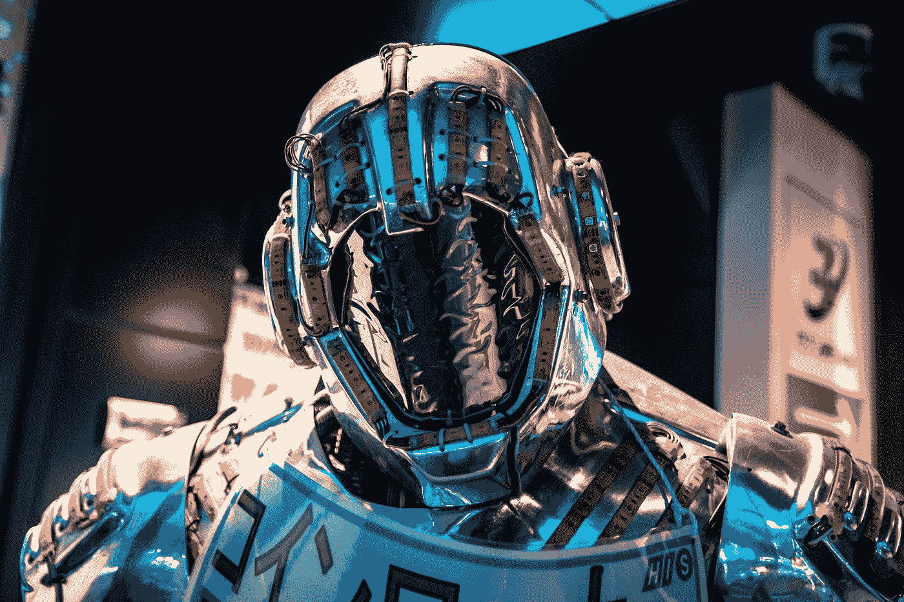
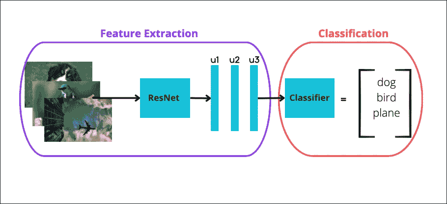
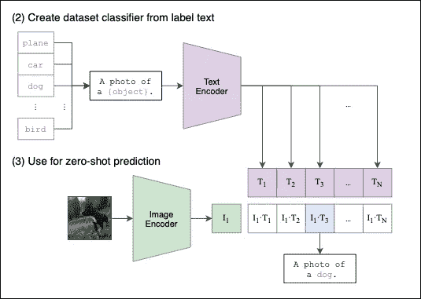
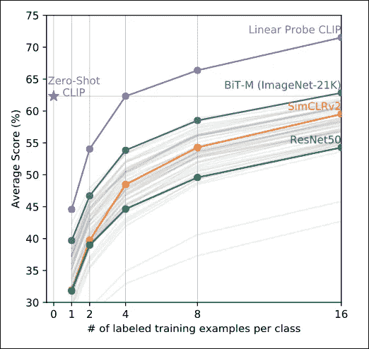
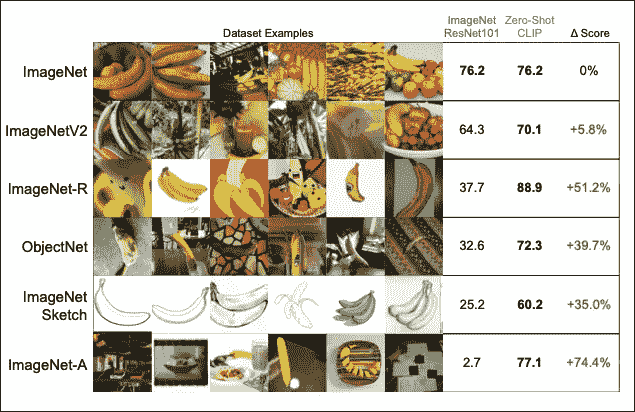
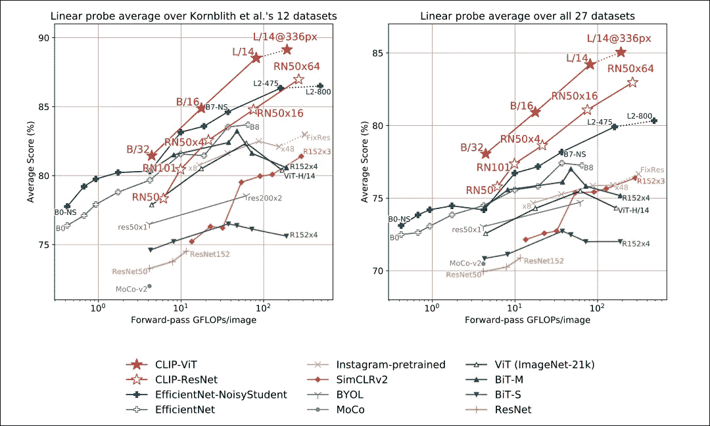
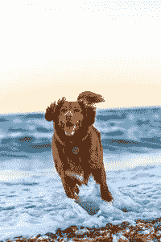
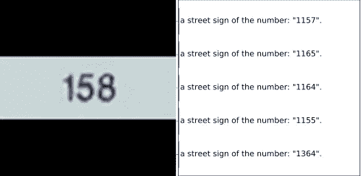

# CLIP:open AI 最有影响力的人工智能模型——以及如何使用它

> 原文：<https://towardsdatascience.com/clip-the-most-influential-ai-model-from-openai-and-how-to-use-it-f8ee408958b1>

## 了解该模型如何工作——包括编码示例

照片由 [Maximalfocus](https://unsplash.com/es/@maximalfocus?utm_source=medium&utm_medium=referral) 在 [Unsplash](https://unsplash.com?utm_source=medium&utm_medium=referral) 上拍摄

最近的 AI 突破，***【DALLE】*【1】*****稳定扩散*【2】**有什么共同点？

它们都使用了 ***CLIP 的*【3】**架构的组件。因此，如果你想掌握这些模型是如何工作的，理解**夹子**是一个先决条件。

此外， [**夹**已用于索引](https://twitter.com/haltakov/status/1351271379103002632)上的照片。

但是 **CLIP** 是做什么的，为什么它是 AI 社区的一个里程碑？

让我们开始吧！

# 剪辑—概述

**剪辑**代表***C****onstastive****L****语言-****I****法师* ***P*** *再训练:*

> CLIP 是一个开源、多模态、零镜头的模型。给定图像和文本描述，该模型可以预测与该图像最相关的文本描述，而无需针对特定任务进行优化。

让我们来分解一下这个描述:

*   **开源:**模型由 **OpenAI** 创建并开源。我们稍后将看到如何使用它的编程教程。
*   **多模态:** *多模态*架构利用多个领域来学习特定的任务。**剪辑**结合了*自然语言处理*和*计算机视觉*。
*   **零距离:** *零距离学习*是一种对看不见的标签进行归纳的方法，没有经过专门的分类训练。例如，所有的 [ImageNet](https://www.image-net.org/update-mar-11-2021.php) 模型都被训练识别 1000 个特定的类。**夹**不受此限制。
*   **const astic Language:**通过这种技术， **CLIP** 被训练理解相似的表征应该靠近潜在空间，而不相似的表征应该远离潜在空间。这将在后面的例子中变得更加清楚。

## 关于 CLIP 的有趣事实:

*   **CLIP** 使用数量惊人的 **4 亿个图文对进行训练。**作为比较，ImageNet 数据集包含 120 万张图像。
*   最终调好的**剪辑**模型在 256 **V100 GPU** 上训练了两周。对于一个关于 **AWS Sagemaker** 的按需培训，这至少要花费 20 万美元！
*   该模型使用 32，768 幅图像的小批量进行训练。

## 夹住动作

让我们直观地演示一下**夹子**的作用。我们稍后将更详细地展示一个编码示例。

首先，我们从 Unsplash 中选择一个自由图像:

照片由[андрейкурган](https://unsplash.com/@anamnesis33)在 [Unsplash](https://unsplash.com?utm_source=medium&utm_medium=referral) 上拍摄

接下来，我们为 CLIP 提供以下提示:

*   “一个戴着无沿帽的女孩”。
*   一个戴着帽子的女孩。
*   一个戴着无沿帽的男孩。
*   一个骑自行车的女孩。
*   **‘一条狗’。**

显然，第一个描述更好地描述了图像。

**CLIP** 通过分配一个标准化概率，自动找到哪个文本提示最恰当地描述了图像。我们得到:

模型**成功**定位最合适的图像描述。

还有**，CLIP** 可以准确的识别出它从未见过的类和对象。

如果您有一个大的图像数据集，并且您想要将这些图像标记到特定的类/类别/描述中， **CLIP** 会自动为您完成这项工作！

接下来，我们将展示**夹子**是如何工作的。

# 剪辑架构

**CLIP** 是一个深度学习模型，它使用了来自其他成功架构的新颖想法，并引入了自己的一些想法。

让我们从第一部分开始，*对比预训练:*

## 对比预训练

**图 1** 显示了*对比预培训*流程的概述。

假设我们有一批`N`图像与它们各自的描述配对，例如`<image1, text1>`、`<image2, text2>`、`<imageN, textN>`。

对比预训练的目的是联合训练一个*图像*和一个*文本编码器*，产生图像嵌入[ `I1`、`I2`……`IN`和文本嵌入[ `T1`、`T2`……`TN`]，其方式是:

*   正确的<image-text>嵌入对`<I1,T1>`、`<I2,T2>`(其中`i=j`)的余弦相似度被最大化。</image-text>
*   **以对比的方式**，相异对`<I1,T2>`、`<I1,T3>` … `<Ii,Tj>`(其中`i≠j`)的余弦相似度被最小化。

**图 1:**夹** ( [来源](https://arxiv.org/pdf/2103.00020.pdf))的**对比预训练步骤

让我们一步一步来看看会发生什么:

1.  模型接收一批`N` <图文>对。
2.  *文本编码器*是标准的*变压器*型号，带有 **GPT2 样式的修改【4】。***图像编码器*可以是 *ResNet* 或**视觉转换器【5】**。
3.  对于批次中的每幅图像，*图像编码器* 会计算一个图像矢量。第一幅图像对应于`I1`矢量，第二幅图像对应于`I2`，依此类推。每个向量的大小为`de`，其中`de`是潜在维度的大小。因此，该步骤的输出是`N X de`矩阵。
4.  类似地，文本描述被压缩成文本嵌入[ `T1`，`T2` … `TN` ]，产生一个`N X de`矩阵。
5.  最后，我们将这些矩阵相乘，并计算每个图像和文本描述之间的成对余弦相似度。这产生了一个`N X N`矩阵，如图**图 1** 所示。
6.  目标是最大化对角线上的余弦相似性——这些是正确的<image-text>对。以对比的方式，非对角线元素的相似性应该最小化(例如，`I1`图像由`T1`描述，而不是由`T2`、`T2`、`T3`等描述)。</image-text>

**一些额外的备注:**

*   该模型使用**对称交叉熵损失**作为其优化目标。这种类型的损失最小化了图像到文本的方向以及文本到图像的方向(记住，我们的对比损失矩阵保持了`<I1,T2>`和`<I2,T1>`余弦的相似性)。
*   对比预培训并不是全新的。在之前的车型中引入，并由**CLIP【6】**进行适配。

## 零射击分类

我们现在已经预训练了我们的*图像*和*文本编码器*，我们已经为*零镜头分类*做好了准备。

**基线** 首先，我们来提供一些背景。前变形金刚时代是如何实现少镜头分类的？

很简单**【7】**:

*   下载一个高性能预训练的 *CNN* 比如 *ResNet* ，用它进行特征提取，得到图像特征。
*   然后，使用这些特征作为标准分类器的输入(例如*逻辑回归*)。分类器以**监督方式训练，**图像标签作为目标变量(**图 2** )。
*   如果你选择***K-shot*******学习，*** 你在分类阶段的训练集应该只包含每个类的 **K** 实例。*
*   *当`**K**<10`时，该任务被称为**少镜头分类**学习。相应地，对于`**K**=1`，我们有**一次性分类**学习。如果我们使用所有可用的数据，这是一个完全监督的模型(老式的方法)。*

**

***图 2:** 具有特征提取的图像分类( [I](https://arxiv.org/pdf/2103.00020.pdf) 作者的图像)*

*注意上面的关键字**‘受监督的’**——分类器应该事先知道类别标签。使用与分类器配对的图像提取器也被称为**线性探头评估。***

***CLIP 的竞争优势
T13**CLIP**如何进行零次分类的过程如图**图 3:*****

**

***图三:**零拍分类使用**剪辑** ( [来源](https://arxiv.org/pdf/2103.00020.pdf))*

*同样，这个过程很简单:*

*首先，我们提供一组文本描述，如`a photo of a dog`或`a cat eating an ice-cream`(我们认为最能描述一个或多个图像的任何内容)。这些文本描述被编码到文本嵌入中。*

*然后，我们对图像做同样的事情——图像被编码成图像嵌入。*

*最后， **CLIP** 计算图像和文本嵌入之间的成对余弦相似度。具有最高相似度的文本提示被选为预测。*

*当然，我们可以输入多个图像。 **CLIP** 巧妙的缓存了输入的文本嵌入，这样就不需要为其余的输入图像重新计算了。*

*就是这样！我们现在已经总结了**夹子**是如何端到端工作的。*

# *寻找数据的问题*

***CLIP** 使用 30 个公共数据集进行预训练。用大量数据拟合大型语言模型是很重要的。*

*然而，很难找到具有成对图像-文本描述的健壮数据集。大多数公共数据集，比如 *CIFAR* ，都是只有一个单词标签的图像——这些标签就是目标类。但是**剪辑**被创建来使用完整的文本描述。*

*为了克服这种差异，作者没有排除这些数据集。相反，他们进行了一些特征工程:单个单词标签，如`bird`或`car`被转换成句子:`a photo of a dog`或`a photo of bird`。在*牛津-IIIT Pets* 数据集*，*上，作者使用了提示:`A photo of a {label}, a type of pet`。*

*有关预训练技术的更多信息，请查看原始论文[3]。*

# *人工智能中剪辑的影响*

*最初，我们声称**剪辑**是人工智能社区的一个里程碑。*

*让我们看看为什么:*

## *1.作为零触发分级机的卓越性能*

***CLIP** 是一个零镜头分类器，所以首先针对少量镜头学习模型测试 **CLIP** 是有意义的。*

*因此，作者针对由高质量预训练模型之上的线性分类器组成的模型测试了**剪辑**，例如 *ResNet* 。*

*结果如**图 4 所示:***

**

***图 4:** 根据少数镜头分类，CLIP 相对于其他型号的性能([来源](https://arxiv.org/pdf/2103.00020.pdf))*

***CLIP** 明显优于其他分类器。*

*另外， **CLIP** 能够匹配 16-shot 线性分类器 *BiT-M* 的性能。换句话说， *BiT-M 的*分类器必须在每类至少 16 个样本的数据集上进行训练，以匹配**剪辑的**分数，而**剪辑**无需微调即可获得相同的分数。*

*有趣的是，作者将 **CLIP** 评估为线性探针:他们仅使用 **CLIP 的** *图像编码器*来获取图像特征，并将其输入线性分类器——就像其他模型一样。即使在这种设置下， **CLIP 的**少数镜头学习功能也是非常出色的。*

## *2.对分布变化的无与伦比的鲁棒性*

***分配移位**是一件大事，尤其是对于生产中的机器学习系统。*

***注:你可能知道*分配移位*为*概念漂移*，虽然从技术上讲它们是不一样的。***

> *分布偏移是当模型的训练数据随时间变化时发生的现象。因此，久而久之，模型的效率下降，预测变得不那么准确。*

*事实上，分配转移并不是意料之外的事情——它将会发生。问题是，如何及早发现这种现象，以及需要采取什么措施来“重新校准”您的模型？这个不好解决，取决于很多因素。*

*幸运的是，关于人工智能的新研究正朝着创造能适应分布变化的模型的方向发展。*

*这就是作者测试**剪辑的**鲁棒性的原因。结果显示在**图 5:***

**

***图 5:** 根据分布偏移，CLIP 对 ResNet 的性能([来源](https://arxiv.org/pdf/2103.00020.pdf))*

*关于**夹子**有两件事非常重要:*

1.  ***CLIP** 在 ImageNet 上实现了与 SOTA *ResNet* 模型相同的精度，尽管 **CLIP** 是零镜头模型。*
2.  *除了最初的 *ImageNet* 之外，我们还有类似的数据集作为分布转移基准。似乎 ResNet*正在与这些数据集作斗争。然而， **CLIP** 可以很好地处理未知图像——事实上，该模型在 *ImageNet* 的所有变化中保持了相同的精确度！**

## *3.计算效率*

*在 *GPT-2* 之前，计算效率是理所当然的(某种程度上)。*

*如今，在一个模型需要用数百个 8k 美元的 GPU 训练数周的时代，计算效率问题得到了更认真的解决。*

*CLIP 是一个更加计算友好的架构。这一成功的部分原因是因为 **CLIP** 使用了一个*视觉转换器*作为默认的*图像编码器*组件。结果如**图 6 所示:***

**

***图 6:** 各种模型每幅图像的浮点运算次数([来源](https://arxiv.org/pdf/2103.00020.pdf))*

*显然， **CLIP** 与其他型号相比，能够更好地利用硬件资源。这也意味着在培训云服务(如 **AWS Sagemaker** )时可以节省额外的资金。此外，**图 6** 显示与其他型号相比，**夹子**在**硬件操作**与**精度分数**方面提供了更好的可扩展性。*

*还有**数据效率**的问题。作者表明**剪辑**在零镜头设置中比类似模型更具数据效率。但是，它们没有解决**片段在预训练阶段的**数据效率问题。然而，在这方面可能没有太多事情可做，因为 **CLIP** 使用两种类型的变压器——变压器本质上是数据密集型模型。*

## *4.研究兴趣增加*

*CLIP 的成功引发了对文本到图像模型的兴趣，并推广了**对比预训练**方法。*

*除了 **DALLE** 和**稳定扩散，**我们可以用 **CLIP** 作为 *GANs* *中的 [*鉴别器*。](https://twitter.com/sayantandas_/status/1351830997403254785)**

*此外， **CLIP** 的发布激发了类似的基于 CLIP 的出版物，这些出版物扩展了模型的功能，例如***dense CLIP*【8】**和***CoCoOp*【9】*。****

*此外，微软发布了***X-CLIP*【10】***用于视频语言理解的 **CLIP** 的最小扩展。**

> ****奖励信息:**一款类似于猜字谜的 app，名为 [paint.wtf](https://paint.wtf/) ，使用 **CLIP** 对你的画进行排名。试试吧——超级好玩！**

# **如何使用剪辑编码示例**

**接下来，我们将展示如何使用 **HugginFaces 库来使用**剪辑**。****

**首先，让我们从 Unsplash 中选择 3 张图片。我们之前使用了第一个:**

****

**照片由[андрейкурган](https://unsplash.com/@anamnesis33)在 [Unsplash](https://unsplash.com?utm_source=medium&utm_medium=referral) 上拍摄**

****

**理查德·布鲁约在 [Unsplash](https://unsplash.com?utm_source=medium&utm_medium=referral) 上拍摄的照片**

****

**奥斯卡·萨顿在 [Unsplash](https://unsplash.com?utm_source=medium&utm_medium=referral) 上的照片**

**我们将使用以下库:**

**接下来，我们加载**剪辑**模型的权重，tokenizer 图像处理器:**

**此外，我们用 Python 加载了上面的 Unsplash 图像:**

**最后，我们为**片段**提供一些文本提示。**

**目标是让 **CLIP** 将 3 个不清晰的图像分类成特定的文本描述。请注意，其中一个是误导性的，让我们看看是否可以混淆模型:**

**该模型成功地将所有 3 幅图像分类！**

**注意两件事:**

1.  ****CLIP** 可以理解每个图像中的多个实体及其动作。**
2.  ****CLIP** 为每幅图像分配最具体的描述。例如，我们可以将第二幅图像描述为`‘a dog’`和`‘a dog at the beach’`。然而，该模型正确地判定`‘a dog’`短语更好地描述了第二幅图像，因为没有海滩。**

**请随意使用这个例子。完整的例子是[这里的](https://jovian.ai/nkafr/clip)。
使用带有文字描述的图片，了解**剪辑**的工作原理。**

# **局限性和未来工作**

**虽然**夹子**是革命性的型号，但仍有改进的空间。作者指出了有进一步发展潜力的领域。**

*   ****准确度得分:CLIP** 是一个最先进的零射击分类器，直接挑战特定任务的训练模型。事实上**剪辑**与 *ImageNet* 上完全监督的 *ResNet101* 的精确度相当惊人。然而，仍然有监督模型获得更高的分数。作者强调， **CLIP** 鉴于其惊人的可扩展性，可能会获得更高的分数，但这将需要天文数字的计算机资源。**
*   ****多义性:**作者陈述**片段**患有多义性。有时，由于缺乏上下文，模型无法区分某些单词的含义。请记住，我们之前提到过，一些图像只标记了类别标签，而没有全文提示。作者提供了一个例子:在牛津-IIIT 宠物数据集中，`‘boxer’`这个词指的是一个狗品种，但是其他图片认为`‘boxer’`是一个运动员。这里，罪魁祸首是数据的质量，而不是模型本身。**
*   ****特定任务学习:**虽然 **CLIP** 可以区分复杂的图像模式，但该模型在一些琐碎的任务中会失败。例如，模型与手写数字识别任务进行斗争(**图 7** )。作者将这种错误分类归因于训练数据集中缺少手写数字。**

****

****图 7:** 数字分类([来源](https://arxiv.org/pdf/2103.00020.pdf))**

# **结束语**

**毫无疑问，CLIP 是 AI 社区的一个重要模型。**

**本质上， **CLIP** 为革新人工智能研究的新一代文本到图像模型铺平了道路。当然，不要忘记这个模型是开源的。**

**最后但同样重要的是，还有很大的改进空间。在整篇论文中，作者暗示许多**剪辑的**限制是由于低质量的训练数据。**

# **感谢您的阅读！**

**我每个月写一篇关于 AI 的有影响力的论文的深度分析。
**保持连接！****

*   **订阅我的[简讯](https://towardsdatascience.com/subscribe/@nikoskafritsas)！**
*   **在 Linkedin 上关注我！**
*   **[**加入介质**](/@nikoskafritsas/membership) **！**(附属链接)**

# **参考**

1.  **Aditya Ramesh 等人 [*分层文本条件图像生成与剪辑潜伏*](https://arxiv.org/pdf/2204.06125.pdf)*(2022 年 4 月)***
2.  **罗宾·龙巴赫等人 [*用潜在扩散模型合成高分辨率图像*](https://arxiv.org/pdf/2112.10752.pdf)*(2022 年 4 月)***
3.  **亚历克·拉德福德等 [*从自然语言监督中学习可转移的视觉模型*](https://arxiv.org/pdf/2103.00020.pdf)*(2021 年 2 月)***
4.  **亚历克·拉德福德等人 [*语言模型是无监督的多任务学习器*](https://d4mucfpksywv.cloudfront.net/better-language-models/language-models.pdf) ( *2019* )**
5.  **Dosovitskiy 等人 [*一幅图像抵得上 16x16 个字:变形金刚在尺度上的图像识别*](https://arxiv.org/abs/2010.11929) *(2020)***
6.  **张宇豪等*【2020】从成对的图像和文本中对比学习医学视觉表征***
7.  ***田，杨等 [*反思少镜头图像分类:一个好的嵌入就够了？*](https://arxiv.org/pdf/2003.11539.pdf)*【2020】****
8.  **饶永明等[*DenseCLIP:带上下文感知提示的语言引导密集预测*](https://arxiv.org/abs/2112.01518)**
9.  **周开阳等[*视觉语言模型的条件提示学习*](https://openaccess.thecvf.com/content/CVPR2022/papers/Zhou_Conditional_Prompt_Learning_for_Vision-Language_Models_CVPR_2022_paper.pdf)(*2022 年 3 月)***
10.  **倪博林等 [*扩展通用视频识别的语言-图像预处理模型*](https://arxiv.org/abs/2208.02816)*(2022 年 8 月)***