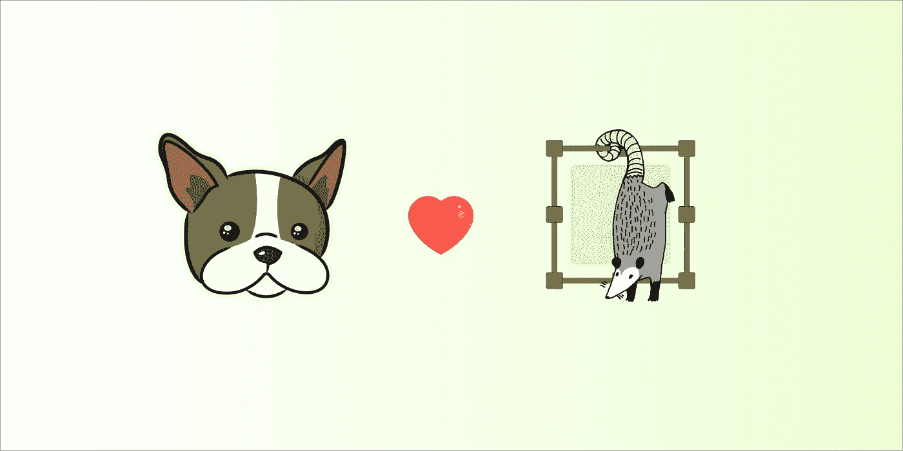
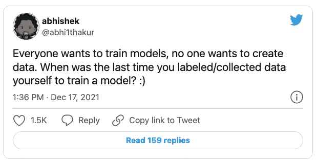
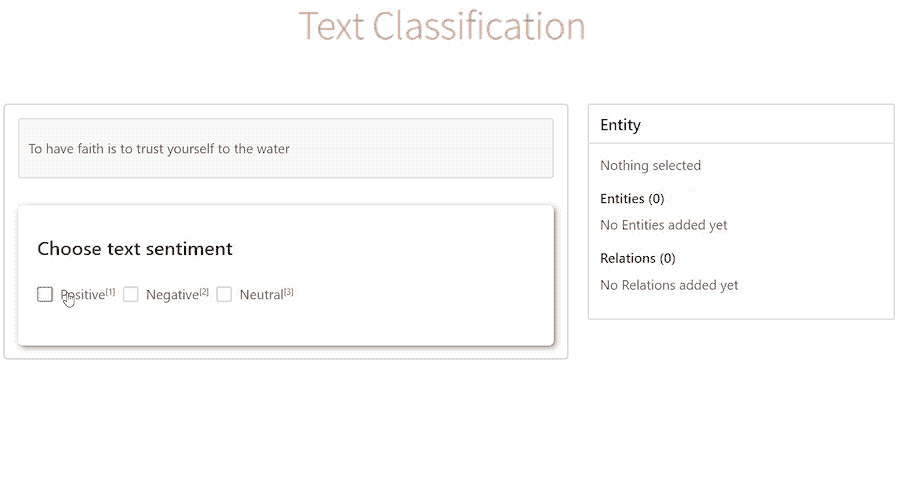
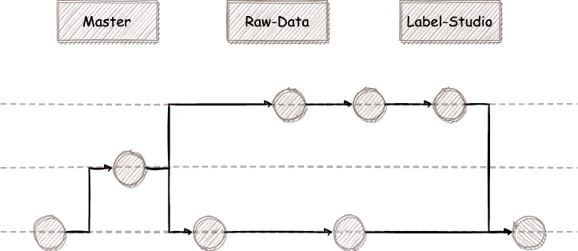

# 使用 DagsHub 注释和 Label Studio 结束数据循环

> 原文：<https://towardsdatascience.com/closing-the-data-loop-with-dagshub-annotations-and-label-studio-8bd328d3785a>

DagsHub x Label 工作室，作者图片

## 不需要在平台之间移动数据、遭受同步问题、破坏项目结构或执行繁琐的任务。

关于带有准确一致标签的干净数据的重要性，已经说了很多。整个[以数据为中心的范例](https://www.forbes.com/sites/gilpress/2021/06/16/andrew-ng-launches-a-campaign-for-data-centric-ai/?sh=2433317f74f5)在很大程度上依赖于使数据标签更加一致来提高模型性能。那么，为什么数据科学界没有迅速采用这种方法呢？可能有许多原因，但一个反复出现的说法是[标记是一个太乏味的任务](https://dagshub.com/blog/challenges-in-labeling-unstructured-data/)，一个很难迭代、管理和扩展的任务。

经[阿拜石](https://twitter.com/abhi1thakur)许可

# DagsHub 集成了 Label Studio

标签是一项如此重要的任务，但它比想象中的要复杂。知道了这一点，我们决定 DagsHub 应该帮助消除这个障碍。对于这种集成，我们有许多强有力的候选人，但脱颖而出的是 Label Studio——一个强大的开源工具，它通过一个强大而活跃的社区支持许多非结构化和结构化数据类型的标记。

# 支持的数据类型:

*   计算机视觉—图像和视频
*   音频和语音应用
*   NLP，文档，聊天机器人，抄本
*   时间序列
*   结构化数据—表格、HTML、自由格式
*   多领域应用

来自官方标签工作室网站

DagsHub 上的每个存储库都带有一个完全配置好的 [Label Studio workspace](https://dagshub.com/docs/reference/label_studio/) 。此工作区允许您对数据进行注释，并可以访问所有项目文件。通过直接从 [DagsHub 存储](https://dagshub.com/docs/reference/dagshub_storage/)中获取数据，因此您不再需要将数据移动、复制或拉至第三方平台。这大大减轻了与标记相关的负担，即管理和同步数据和标签。

# 数据标注的 Git 流程

标注工作流相当于开发一个新功能。它应该在一个隔离的环境中完成，能够比较、分析和合并更改，或者回滚并恢复以前的版本。知道标签通常是外包的，这些能力变得更加重要，以确保其成功。

基于这些需求和贴标机面临的挑战，DagsHub 为 Label Studio 添加了一些配料，并创建了其独特的开源版本。它提供 Git 体验，遵循行业最佳实践，确保标签和数据的完全[可再现性、可伸缩性和有效的版本控制](https://dagshub.com/blog/data-science-workflows-to-track-experiments/)。

按作者标记非结构化数据、图像的 Git 流程

# DagsHub 和 Label Studio 的工作流程

在 DagsHub 上创建新的标签项目时，您可以将其与活动分支的尖端相关联。它标记了项目的起点，并将使 DagsHub 存储上托管的所有文件在选定的提交下可用于标记。一旦获得有价值的结果，您就可以使用 Git 直接将注释版本化并提交到远程分支。一旦任务完成，您就可以在 DagsHub 上创建一个 pull 请求，在这里审阅者可以看到并评论每个注释。

# 如何用 DagsHub 对 Label Studio 项目进行版本化？

为了对任何工件进行版本控制，它需要有一个单一的真实来源。为了提供注释的真实来源，我们创建了`.labelstudio`目录，以开源格式保存每个任务的注释。当创建一个新的标记项目时，DagsHub 解析这个目录的选定提交，并将现有的注释加载到它们相关的任务中。这样，我们只需点击一个按钮就可以回滚到以前的版本。

# Label Studio 和 DagsHub 入门

在这一节中，我将逐步指导您如何在遵循推荐的 Git 流程的同时使用 Label Studio 和 DagsHub 注释。主要目标是帮助您获得实践经验，同时受益于我的领导。为此，我将使用我的“[埃隆在哪里](https://dagshub.com/nirbarazida/where-is-elon)”项目，在那里我注释埃隆·马斯克的图像。我假设您已经在 DagsHub 上有了一个项目，并且版本化数据已经准备好进行注释。

作者图片

# 步骤 1:创建 Label Studio 工作区。

导航到 DagsHub 存储库中的 Annotations 选项卡，并创建一个新的工作区。这个过程可能需要 2-3 分钟，因为 DagsHub 会在幕后启动 Label Studio 机器。

在 DagsHub 上创建一个 Label Studio 工作空间，图片由作者提供

# 步骤 2:创建标签工作室项目

在“新建注释项目”菜单中，选择要与项目关联的远程分支的尖端。它标记了项目的起点，并将使 DagsHub 存储上托管的所有文件在选定的提交下可用于标记。为了在隔离的环境中工作，我们将为标签项目创建一个新的分支。默认的项目名称基于创建它的注释者；但是，你可以随心所欲地改变它。

在 DagsHub 上创建一个 Label Studio 项目，Image by author

# 步骤 3:选择要注释的文件

第一次启动项目时，您需要选择要注释的文件(也称为任务)。您可以通过选中文件名旁边的框来选择特定文件或整个目录。

**注意:**你可以给 Git 和 DVC 远程主机上的文件添加注释。作为一个经验之谈的角色:*“如果你能看到文件，你就可以对它进行注释。”*

选择要在 DagsHub 上批注的文件，按作者排序的图像

# 步骤 4:配置 Label Studio

你可以配置 [Label Studio 的标签界面](https://labelstud.io/guide/setup.html)，使用其中一个很棒的模板。如果你需要一个[定制模板](https://labelstud.io/guide/setup.html#Customize-a-template)，你可以使用基本的 HTML 创建它。

注意:如果您选择使用模板，您需要手动设置项目的标签。

在 DagsHub 上配置 Label Studio，图片由作者提供

# 步骤 5:注释数据

就这么简单，您可以开始用[注释您的数据](https://labelstud.io/guide/labeling.html#main)。不需要将数据移动到不同的平台，改变其结构或同步任何东西。您可以开始处理任务，并将注释保存到 DagsHub 的数据库中。

注释 DagsHub 上的数据，图片由作者提供

# 步骤 6:提交对 Git 的更改

在任何时候，您都可以使用 [Git 将项目状态版本化，并将](https://git-scm.com/docs/git-commit)变更提交回您在步骤 2 中选择的分支，或者创建一个新的分支并提交给它。提交将包括特殊的“. labelstudio”目录。您可以添加一个常用格式的注释文件(JSON、COCO、CSV、TSV 等)。)提交。

将注释提交给 DagsHub 上的 Git，按作者排序的图像

利用 Git 的功能，您现在可以无缝地迭代第 5 步和第 6 步，比较不同的版本，合并结果，或者回滚更改。

# 步骤 7:创建一个拉取请求

当您对标签感到满意时，意味着它们是准确和一致的，您可以将它们合并到主分支。使用 DagsHub，通过标签进行通信是拉取请求的一部分，而无需转移到第三方平台。审查者可以在每个标签上留下他的评论，并记录整个过程，便于管理。一旦完成任务，将它合并到项目的主分支中只需点击一下按钮。

# 摘要

标注非结构化数据伴随着各种挑战，其中许多是工作流的副产品，与标注任务本身无关。DagsHub Annotations 和 Label Studio 集成旨在帮助克服这些挑战并创建顺畅的标签工作流程。它执行 DevOps 繁重的工作，并为您提供管理和扩展贴标流程所需的工具。

如果您对整合有任何问题、想法或想法，我们很乐意在我们的 [Discord channel](https://discord.gg/y3T7zxuS) 上听到！我们迫不及待地想看到你的惊人的项目变得更大，准确和一致的标签。