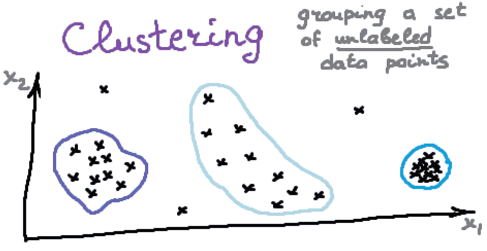
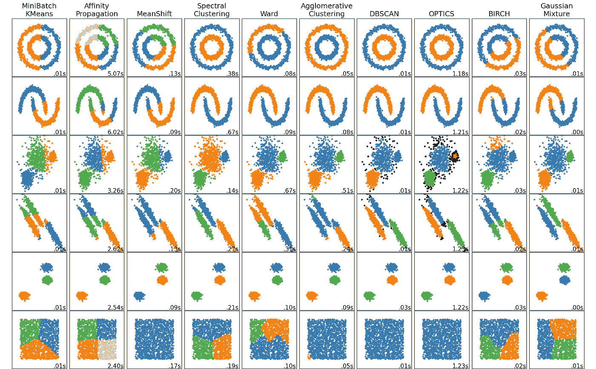
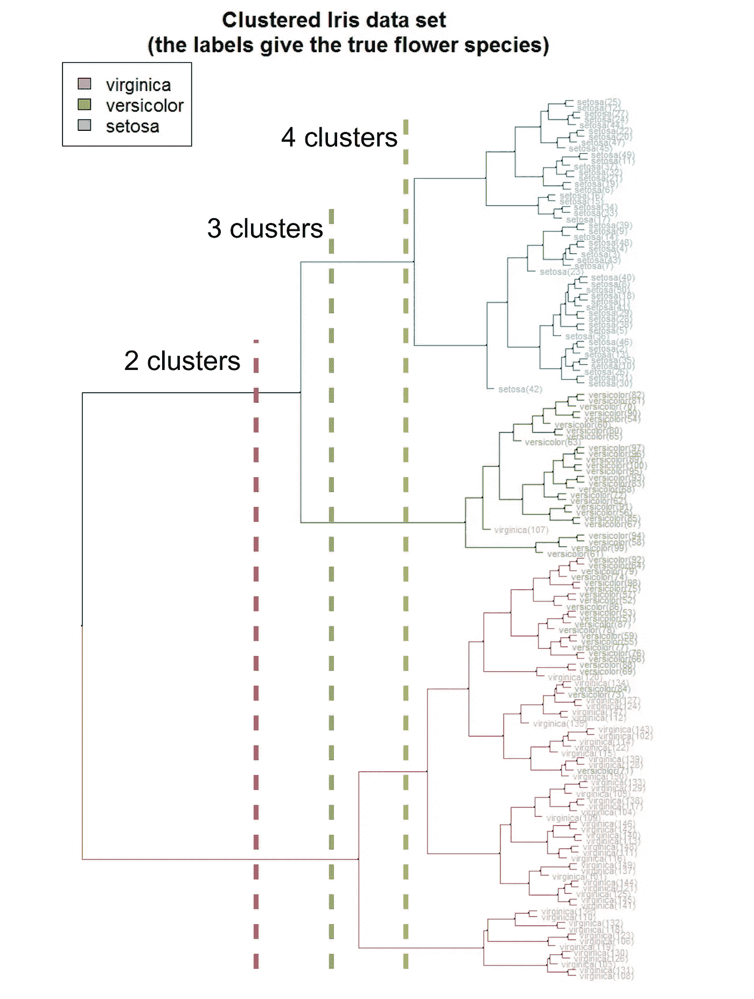
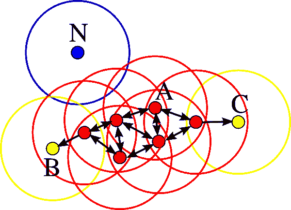
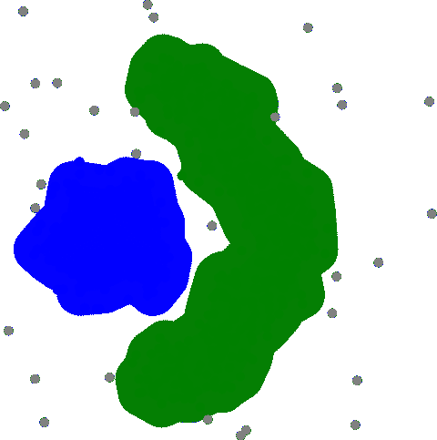
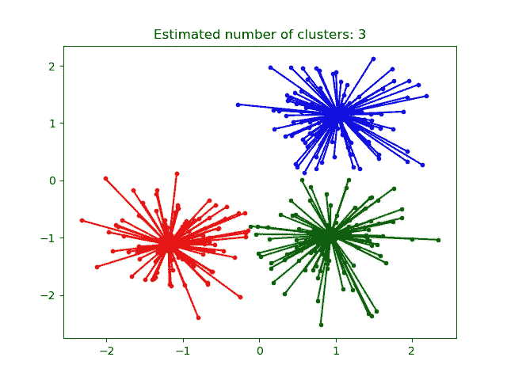
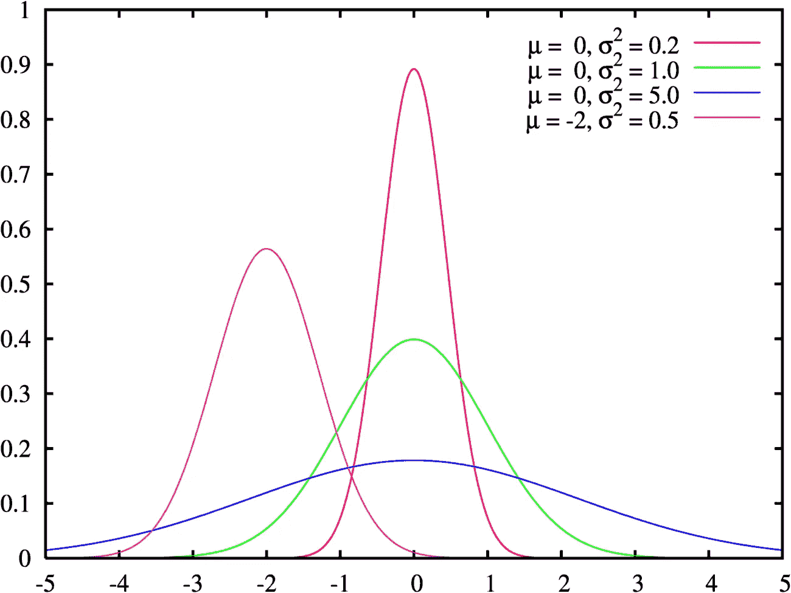

# 聚类备忘单

> 原文：<https://towardsdatascience.com/clustering-cheat-sheet-dcf72259abb6>

## 在 11 分钟内你应该知道的关于聚类的所有事情

聚类。作者图片

在本文中，您将找到一个完整的集群备忘单。在 11 分钟内，你将能够知道它是什么，并刷新你对主要算法的记忆。

聚类(也称为*聚类分析*)是将相似的实例分组到聚类中的任务。更正式地说，聚类是将**未标记数据点**的群体分组为聚类的任务，其方式是同一聚类中的数据点彼此之间比其他聚类中的数据点更相似。

聚类任务可能是无监督学习中最重要的，因为它有许多应用，例如:

*   *数据分析*:一个庞大的数据集往往包含几个大的聚类，分别对其进行分析，可以得出有趣的见解；
*   *异常检测*:如前所述，位于低密度区域的数据点可视为异常；
*   *半监督学习*:聚类方法通常可以帮助你为分类任务自动标记部分标记的数据；
*   *间接聚类*任务(聚类有助于获得良好结果的任务):推荐系统、搜索引擎等。，以及
*   *直接聚类*任务:客户细分、图像细分等。

Scikit Learn 的聚类算法。[图像来源](https://scikit-learn.org/0.15/auto_examples/cluster/plot_cluster_comparison.html)

所有的聚类算法**都需要数据预处理和标准化**。大多数聚类算法在大量特征的情况下表现较差，因此有时建议在聚类之前使用*维度缩减*的方法。

# k 均值

K-Means 算法基于*质心*概念。*质心*是聚类的几何中心(所有聚类点的坐标的平均值)。首先，随机初始化质心(这是基本选项，但还有其他初始化技术)。之后，当质心移动时，我们迭代执行以下两个步骤:

*   *更新聚类*——为每个数据点分配一个质心最近的聚类数，以及
*   *更新聚类的质心* —计算聚类元素的新平均值以移动质心。

K-均值算法的收敛性。[公共领域](https://en.wikipedia.org/wiki/K-means_clustering#/media/File:K-means_convergence.gif)

算法的优点和缺点是直观的。它简单而快速，但需要关于聚类数的初始知识。它也不能很好地检测复杂形状的聚类，并且可能导致局部解决方案。为了选择好的聚类数目，我们可以使用从数据点到聚类质心的距离平方和*作为度量，并选择该度量停止快速下降时的数目( [*肘方法*](https://en.wikipedia.org/wiki/Elbow_method_(clustering)) )。为了找到全局最优解，可以多次运行算法，选择最佳结果( *sklearn* 中的`n_init`参数)。*

这个算法的一个加速版本是**小批量 K-Means** 。在这种情况下，我们使用随机子样本而不是整个数据集进行计算。还有很多其他的修改，很多都是在 *sklearn* 中实现的。

**优点**:

*   简单直观；
*   扩展到大型数据集；
*   因此，我们也有质心，可以用来作为标准的集群代表。

**缺点**:

*   关于群集数量的知识是必要的，并且必须作为参数来指定；
*   不能很好地处理大量的特征；
*   仅很好地分离凸的和均匀的簇；
*   可能导致较差的本地解决方案，因此需要运行几次。

# 分层聚类

分层聚类(也称为**分层聚类分析(HCA)** 或**凝聚聚类**)是一系列聚类算法，在分析过程中构建聚类的层次结构。

它被表示为一个树状图(一个树形图)。树的*根*(通常是上部或左侧元素)是一个包含所有数据点的大型集群。*叶*(底部或右侧元素)是微小的簇，每个簇只包含一个数据点。根据生成的树状图，你可以选择所需的分离成任意数量的聚类。

iris 数据集上的层次聚类树状图示例。改编自[公共领域](https://commons.wikimedia.org/wiki/File:Iris_dendrogram.png)

这类算法需要计算聚类之间的距离。为此使用了不同的度量标准(简单关联、完全关联、平均关联、质心关联等)。)，但其中最有效也最受欢迎的是**沃德距离**或沃德联动。

要了解更多关于测量聚类之间距离的不同方法，请阅读本文:

  

**优点**:

*   简单直观；
*   当数据具有层次结构时效果很好。
*   不需要知道集群的数量。

**缺点**:

*   需要额外的分析来选择聚类的结果数量；
*   仅很好地分离凸的和均匀的簇；
*   贪婪算法可能会导致较差的局部解。

# 谱聚类

谱聚类方法基于图论和线性代数。该算法使用*相似度矩阵*(包含每对数据点的相似度)的*谱*(一组*特征值*)进行降维。然后它使用这个低维空间中的一些聚类算法(`sklearn.cluster.SpectralClustering`类使用 K-Means)。

由于维数降低，该算法可以检测复杂的聚类结构和形状。它还可以用于在图形中搜索聚类。然而，由于其计算复杂性，它不能很好地处理大型数据集。

**优点**:

*   可以检测复杂的团簇结构和形状；
*   可用于在图形中搜索聚类。

**缺点**:

*   关于群集数量的知识是必要的，并且必须作为参数来指定；
*   不能很好地处理大量的实例；
*   当簇的大小非常不同时不能很好地处理。

# 基于密度的噪声应用空间聚类

DBSCAN 缩写代表*带噪声应用的基于密度的空间聚类*。

根据该算法，聚类是由低密度区域(数据点彼此远离)分隔的高密度区域(数据点彼此靠近)。

DBSCAN 算法的中心概念是一个*核心样本*的想法，这意味着样本位于一个高密度的区域。如果至少有`min_samples`个其他实例(通常包括 **A** )位于距 **A** 的`eps`距离内，则数据点 **A** 被视为岩心样本。

DBSCAN 核心样本示例。min_samples=4，核心样本标记为红色。[公共领域](https://en.wikipedia.org/wiki/File:DBSCAN-Illustration.svg)

因此，聚类是一组彼此靠近的核心样本和一些靠近核心样本的非核心样本。其他样本被定义为异常值(或异常值)并且不属于任何聚类。这种方法被称为**基于密度的聚类**。它允许您不将簇的数量指定为参数，而是查找复杂形状的簇。

DBSCAN 聚类。[公共领域](https://commons.wikimedia.org/wiki/File:DBSCAN-density-data.svg)

DBSCAN 算法的扩展或推广是**光学**算法(*排序点以识别聚类结构*)。

**优点**:

*   关于聚类数量的知识不是必需的；
*   还解决了*异常检测*任务。

**缺点**:

*   需要选择和调整密度参数(`eps`)；
*   不能很好地处理稀疏数据。

# 亲和传播

相似性传播算法也不需要关于聚类数量的知识。但是与 DBSCAN 不同，DBS can 是一种基于密度的聚类算法，相似性传播基于在数据点之间传递消息的思想。基于某个距离函数(即*欧几里德距离*)计算成对相似性，然后该算法收敛于某个数量的*标准代表*。然后使用这少量的*标准代表*来描述数据集，这些代表被识别为特定集群上最具代表性的实例。

Scikit Learn 的仿射传播聚类。[图像来源](https://scikit-learn.org/stable/auto_examples/cluster/plot_affinity_propagation.html)

这种算法的结果常常不尽如人意，但它有许多强大的优势。然而，它的主要缺点是计算复杂性(由于需要计算*所有可能的数据点对*的距离)不允许它用于大型数据集。

**优点**:

*   关于聚类数量的知识不是必需的；
*   因此，我们也有集群的*标准代表*。
    与 K 均值质心不同，这些实例不仅仅是平均值，而是来自数据集的真实对象。

**缺点**:

*   由于计算复杂性，比其他算法慢得多；
*   不能很好地处理大量的实例；
*   仅很好地分离凸簇和同质簇。

# 均值漂移

均值漂移算法首先在每个数据点的中心放置一个一定大小的圆(圆的半径是一个叫做`bandwidth`的参数)。之后，它迭代计算每个圆的平均 T2(圆内各点的平均坐标)并移动 T4。执行这些*均值偏移*步骤，直到算法收敛并且圆圈停止移动。

您可以在这里看到均值漂移算法的可视化效果:

  

均值漂移收敛到密度最大的局部区域。然后所有彼此足够接近的圆形成一个集群。因此，同时解决了*密度估计*任务，并计算出聚类质心。

与 DBSCAN 一样，该算法代表了一种基于密度的方法，因此在处理稀疏数据时效果不佳。

**优点**:

*   关于聚类数量的知识不是必需的；
*   只有一个超参数:圆的半径*；*
*   求解*密度估计*任务并计算聚类质心；
*   找不到实际不存在的簇结构。

**缺点**:

*   不能很好地处理稀疏数据和大量特征；
*   不能很好地处理大量的实例；
*   不能很好地处理复杂形状的簇:倾向于将这些簇切成碎片。

# 桦树

桦树代表*使用层次结构的平衡迭代减少和聚类*。

这种分层聚类算法是专门为大型数据集设计的。在大多数情况下，它的计算复杂度为 *O(n)* ，因此只需要对数据集进行一次扫描。

在训练期间，它会创建一个包含足够信息的树状图，以便将每个新数据实例快速分配给某个集群，而不必将所有实例的信息存储在内存中。与其他聚类算法相比，这些原则允许为给定的一组内存和时间资源获得最佳质量。它们还允许执行*在线学习*的增量集群输入数据实例。

**优点**:

*   是专门为非常大的数据集设计的；
*   显示给定的一组内存和时间资源的最佳质量；
*   允许实现联机群集。

**缺点**:

*   不能很好地处理大量的功能。

# 高斯混合模型

高斯混合模型( *GMM* )是一种概率算法，可以解决多达三个无监督学习任务:*聚类*、*密度估计*、*异常检测*。

该方法基于*期望最大化*算法，并假设数据点是从一组(*混合*)高斯分布中生成的。这种算法会导致较差的局部解，因此需要运行几次，只保留最佳解( *sklearn* 中的`n_init`参数)。

众所周知，在一般情况下，高斯分布有两个参数:平均值的向量和方差的矩阵。然后，如果已知数据可以分成`M`维空间中的`N`个簇，那么算法的任务就是选择`N`个μ向量(带有`M`个元素)和`N`个σ矩阵(带有`MxM`个元素)。

在一维空间的情况下，μ和σ都是标量(单个数)。

一维空间中不同参数的高斯(正态)分布。[公共领域](https://commons.wikimedia.org/wiki/File:Normal_distribution_pdf.png)

在下图中，你可以看到二维空间中的两种分布。每个分布都有以下参数:

*   平均向量的两个值(x 和 y 坐标)；
*   方差矩阵的四个值(主对角线的方差和其他元素的协方差)。

GMM 的例子。[图像来源](https://scikit-learn.org/stable/auto_examples/mixture/plot_gmm_pdf.html)

为了选择一个好的集群数量，你可以使用 *BIC* 或 *AIC* (贝叶斯/阿凯克信息标准)作为度量，并选择具有最小值的模型。另一方面，你可以使用**贝叶斯 GMM** 算法。该模型只需要一个大于可能的聚类数的值，就可以自己检测出最佳的聚类数。

此外，高斯混合模型是一个*生成模型*，这意味着您可以从中采样新的实例。还可以在任何给定的位置估计模型的密度。

**优点**:

*   完美地处理由不同形状和大小的高斯分布混合生成的数据集；
*   同时解决了*密度估计*和*异常检测*任务；
*   *是一个创成式模型*，所以可以生成新的实例。

**缺点**:

*   关于聚类数量的知识是必要的，并且必须被指定为一个参数(不是在*贝叶斯 GMM* 的情况下)；
*   *期望最大化*算法会导致局部解不佳，所以需要多次运行；
*   无法很好地扩展大量功能；
*   假设数据实例是由混合高斯分布生成的，那么就很难处理其他形状的数据。

# 如何选择一种聚类算法？

正如您所看到的，聚类任务非常困难，并且有各种各样的应用程序，因此几乎不可能建立一些通用的规则来选择聚类算法—它们都有优点和缺点。

当你**对你的数据**有一些假设 **时，事情会变得更好，所以*数据分析*可以帮助你。集群的数量大概是多少？它们彼此相距很远还是相交？它们的形状和密度相似吗？所有这些信息可以帮助你更好地解决你的任务。**

如果集群的数量未知，一个好的初始近似值是*对象数量的平方根*。您也可以首先运行一个不需要将集群数量作为参数的算法( *DBSCAN* 或 *Affinity Propagation* )，并使用结果值作为起点。

另一个重要的问题仍然是质量的评估——你可以尝试所有的算法，但如何决定哪一个是最好的？这方面有很多衡量标准——从*同质性*和*完整性*到*轮廓*——它们在不同的任务中表现出不同。理解这些指标以及如何成功地使用它们需要经验，这超出了本文的范围。

尽管如此，我还是设法列出并回顾了所有主要的聚类算法和方法。希望这能帮助你并激励你更深入地进行聚类分析。

本文是以下内容的一部分:

  

您可能还对以下内容感兴趣:

  

# 感谢您的阅读！

*   我希望这些材料对你有用。在媒体上关注我以获得更多类似的文章。
*   如果您有任何问题或意见，我将很高兴得到任何反馈。在评论里问我，或者通过 [LinkedIn](https://www.linkedin.com/in/andimid/) 或者 [Twitter](https://twitter.com/dimid_ml) 联系。
*   为了支持我作为一名作家，并获得数以千计的其他媒体文章，使用[我的推荐链接](https://medium.com/@andimid/membership)获得媒体会员资格(不收取额外费用)。