# 编写智能战舰代理程序

> 原文：<https://towardsdatascience.com/coding-an-intelligent-battleship-agent-bf0064a4b319>

## 发展一种从随机猜测到超人表现的策略

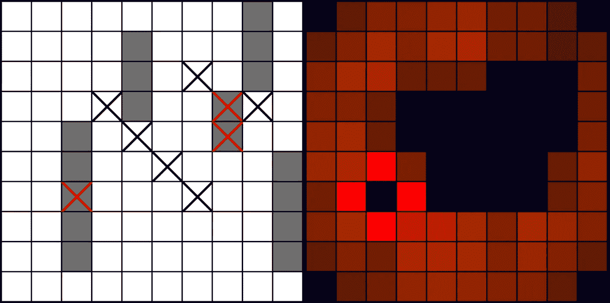

使用概率搜索的战列舰游戏示例。图片作者。

战舰似乎是一个非常流行的测试各种人工智能策略的格式。在网上你可以找到各种各样的方法，从强化学习到遗传算法到蒙特卡罗方法。关于这个话题的最受关注的媒体之一是由 Vsauce2 频道制作的 Youtube 视频。在视频中，他们描述了一种基于概率的算法，这种算法导致的策略远比人类玩家合理使用的策略复杂。这个视频引导我[到了数据遗传学的尼克·贝里的博客文章](https://www.datagenetics.com/blog/december32011/)，他非常详细地描述了这个算法。他的文章以一个相对较弱的算法开始，但他将其构建成一个强大的解决方案，可以显著优于许多其他方法。他对算法的解释非常精彩，但是我找不到他实现的任何源代码。我决定重新创建他的策略，并把源代码公开发布给任何想摆弄或修改它的人。对于那些想要的人来说，一切都可以在我的 [Github](https://github.com/aydinschwa/Battleship-AI/tree/main) 上找到。

# 战舰规则

我假设任何阅读这篇文章的人都熟悉战舰的基本规则，但我将快速回顾一些对 AI 实现特别重要的规则。首先，没有船只可以重叠:虽然船只可以与其他船只相邻，但它们不能堆叠在一起。第二，一旦对手的船的所有方格都被击中，对手必须宣布他们的船被击沉。这是至关重要的信息，因为它表明我们不再需要在这个特定的地区继续射击。最后，棋盘上总共有五艘船，长度分别为五、四、三、三和二。

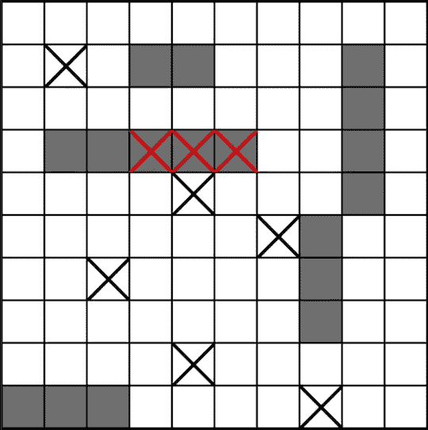

战列舰甲板的例子。红色 X 表示命中，黑色 X 表示未命中。图片作者。

# 初始策略

一个显而易见的策略是尝试完全随机地猜测，尽管这很糟糕。正如您所料，这会导致非常差的性能。如果没有别的，这个策略将会给我们一个性能的下限，我们可以用它来作为其他策略的基准。

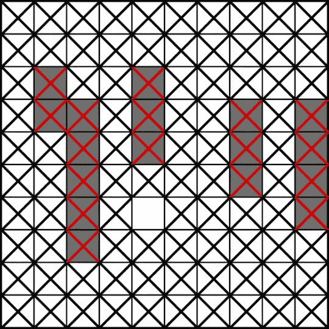

使用随机猜测的示例游戏。图片作者。

我用这种策略模拟了 100 万次游戏，以生成一个游戏时长的分布。对于随机策略，一场游戏的中值长度是 97，这意味着在大多数情况下，当它击沉最后一艘船时，它非常接近于覆盖所有 100 个方格。下图显示了完成一场游戏所需击球次数的分布。

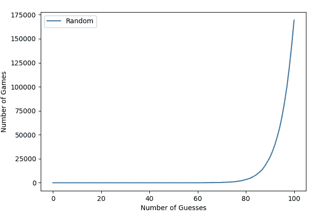

作者图片

改进我们策略的第一步是将点击量考虑在内。当算法击中一个里面有船的方块时，它不应该只是移动到下一个随机的方块。它应该向被击中的方格附近的方格开火，这样它就能击沉船只。借用尼克·贝里的术语，我们称之为狩猎/目标战略。当算法处于搜索模式时，它会像以前一样随机触发。然而，当它击中一个有船在里面的方块时，策略转换到目标模式。我们将维护一个“目标方块”列表，算法应该优先于所有其他方块。当击中时，与击中方块相邻的所有方块都被添加到目标列表中。在随后的回合中，该算法将从列表中一次弹出一个方块，并向它们开火。当列表为空时，算法切换回搜索模式。

这是一个简单的算法，但是相对于随机猜测策略已经有了很大的改进。正如你在下面看到的，一旦算法击中一艘船，它就会在相邻的方格中布满子弹。这更让人想起一个(坏的)人类对手会怎么玩。

狩猎/目标策略示例游戏。图片作者。

狩猎/目标策略的平均游戏时间是 65 步。不太好，因为我们在搜索所有敌舰的时候仍然覆盖了超过一半的区域。然而，该算法有时确实很幸运。在 1，000，000 次模拟中，最短的游戏时间是 24 分钟。

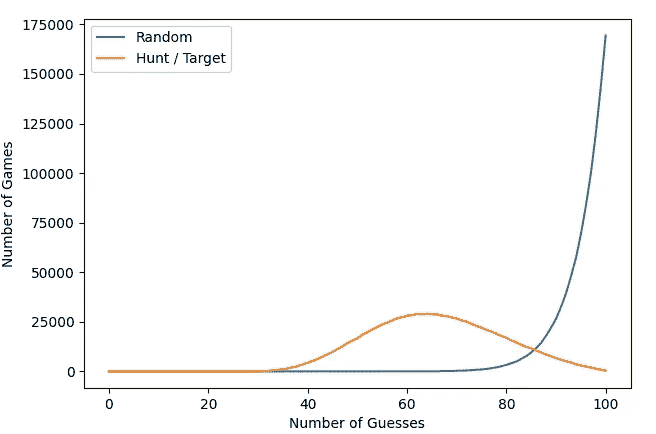

作者图片

接下来，我们将寻求改进算法搜索船只的方式。我们可以想象只有一艘船在甲板上。让我们假设我们想要做的只是追捕游戏中最长的船，即航母(长度为 5)。我们不需要在每个方格上开火来找到它，相反我们可以意识到当载体在棋盘上时，载体**必须**接触某些方格。看看下面的图片。要将载体安装到板上而不接触其中一个标有 x 的方块是不可能的。

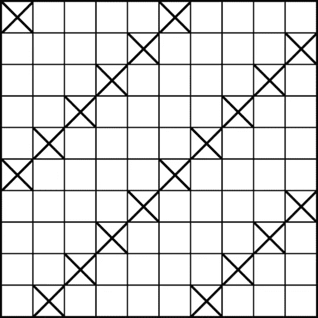

搜索五号航母的射击模式。图片作者。

当算法搜索载波时，它应该从上面的模式中随机选择镜头。创建这种模式很简单。纸板是零索引的，这意味着行和列的范围从 0 到 9。我们将行和列的索引相加，并检查它们是否能被 5 整除。如果是的话，这个正方形就在我们的射击模式中。我们可以把这个想法推广到任何长度的船。

注意，船的长度越小，这种方法消除的方块就越少。然而，即使对于巡逻艇(长度为 2)，这种新的射击模式也消除了棋盘上一半的方格。

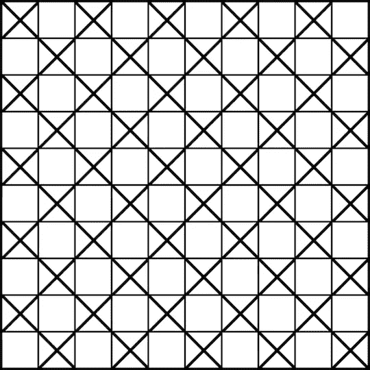

狩猎长度为 2 的巡逻艇的射击模式。图片作者。

该算法将需要使用仍然在板上的最小的船的模式。在游戏开始时，射击模式将是巡逻艇的射击模式。然而，当巡逻船被消灭时，射击模式将切换到下一个最小的船的模式。为了让这种策略发挥最大效果，我们需要运气，希望算法首先击中较小的船只。

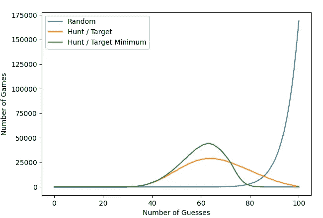

作者图片

在原始和改进的搜索/目标策略之间有一些边际收益。值得注意的是，原始策略的最坏情况比改进后的策略要糟糕得多。在最坏的情况下，最初的策略击中了所有 100 个方块，而改进的版本从未超过 88 个方块。

# 概率策略

为了进一步改进算法的目标策略，我们转向一种新的方法。我们可以使用概率来告知我们的决定，而不是在目标阶段选择随机方块来猜测。如果我们假设船只是随机放置的，我们更有可能在棋盘的中间看到一艘船，而不是在边缘或角落。这仅仅是因为有更多的方法可以把船放在棋盘的中心而不是外面。考虑一个像第四行第四列那样的中央广场。载体可以以 10 种不同的方式水平放置，也可以以 10 种不同的方式垂直放置。这使得正方形的权重为 20。相比之下，第 0 行第 0 列的角方块只有两种放置载体的方式，权重为 2。通过对棋盘上的每个方格进行这些计算，我们可以生成一张“热图”,显示哪些方格上最有可能有载体。我们可以对每艘船都这样做，并结合概率得到船上所有船的概化热图。为了找到下一个要开火的方块，我们选择热图中具有最高值的方块。

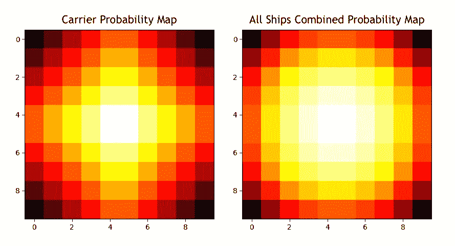

航母的初始概率热度图(左)与所有舰船的综合热度图(右)。图片作者。

一旦计算机开了一枪，它就会收到关于这一枪是命中还是未命中的信息。我们可以使用这些信息来重新计算和更新热图。在失误之后，船只被放置在失误附近的方格中的可能性减少了，所以失误周围的方格降低了概率。

当一艘船被击中时，我们人为地对被击中的方格进行加权，这样算法就会找出剩余的方格并击沉它。在船被击沉后，我们移除这些人为的概率权重，因为它们不再有用。这将阻止算法向已经被摧毁的船只附近的空间开火。

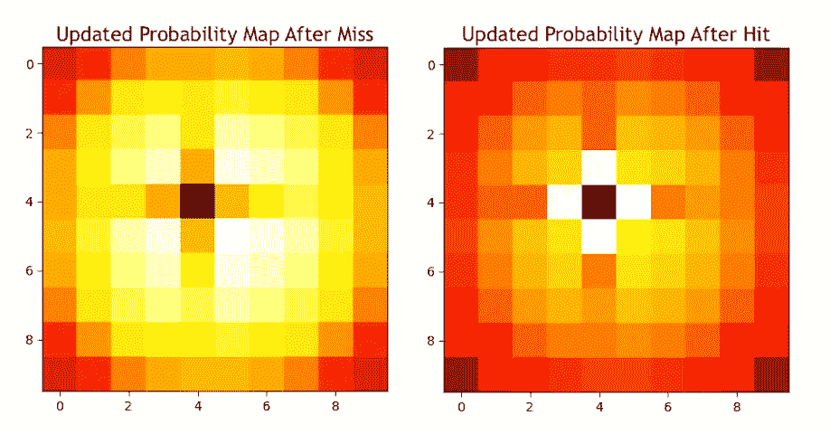

两种潜在的现实:未命中(左)和命中(右)。当出现失误时，失误周围的方块权重较低。当有击中时，击中周围的方块被赋予更高的权重。图片作者。

对击中后算法选择方块的方式可以进行最后的改进。如果算法在水平方向上击中了一艘船，那么它应该优先考虑水平方向上相邻的方块。垂直定向的船只也是如此。

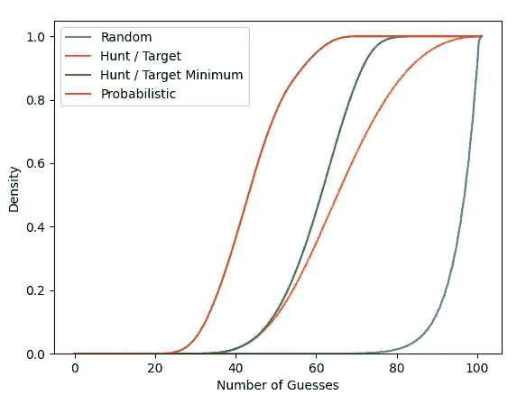

所有策略的博弈长度分布(左)，所有策略的累积分布函数(右)。图片作者。

我们看到这一新策略的效率大幅提高。一场游戏的中值长度是 43，100 万次模拟中最短的游戏是 18 步。下面是一个完整的概率策略游戏示例。

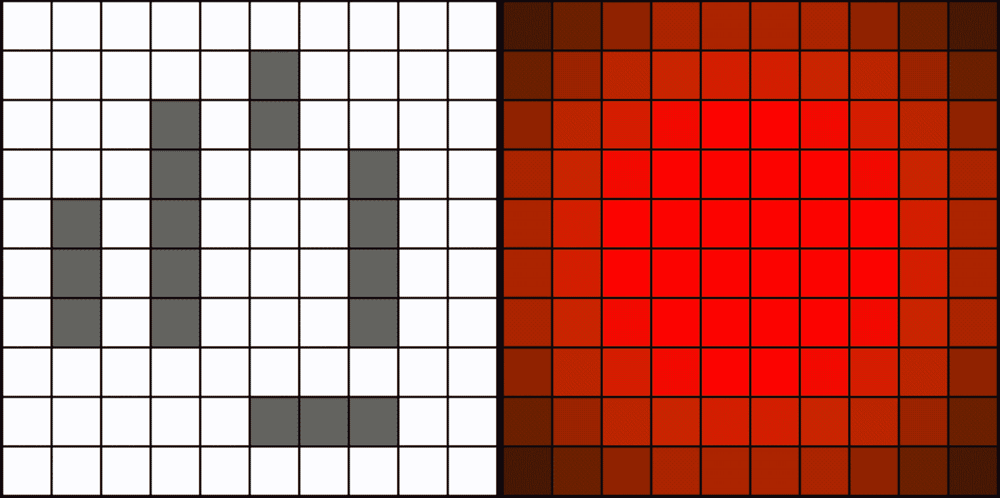

一个用概率算法玩的示例游戏。作者 GIF。

对于我上面的 Pygame 可视化，我不得不从头开始编写热图着色系统。如果任何读者对如何改进着色以使其更接近 Matplotlib 产生的情节有想法或建议，我绝对愿意听取他们的意见。

# 潜在的改进

我想指出的是，这种算法是为了在随机性存在的情况下实现最佳性能而设计的。然而，大多数对手不会随意将他们的船放在棋盘上。有些人可能更喜欢把他们的船放在棋盘的角落或边缘。这种算法在这种策略下表现不佳，因为它假设大多数船只将位于中心位置。为了说明这一点，我们可以考虑人为地加重棋盘外侧的方块。

我也认为如果人工智能在许多游戏后修改它的策略会很有趣。如果对手倾向于在一局接一局的船只布局游戏中采用相似的策略，那么我们可以对对手喜欢放置船只的棋盘区域进行加权。

# 最后的想法

我想感谢 Nick Berry 在战舰上的[精彩帖子](https://www.datagenetics.com/blog/december32011/)，希望我能够用自己的实现来公正地处理它。如果你没看过他的解释，我强烈推荐。

如果你觉得这篇文章有趣，你可能想看看我的源代码，它在 [Github](https://github.com/aydinschwa/Battleship-AI/tree/main) 上公开。感谢阅读！