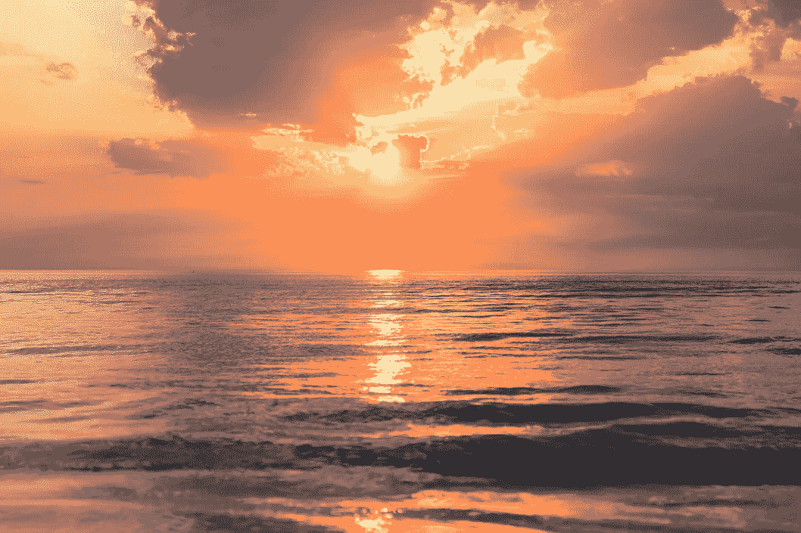

# 用 Python 编写你自己的 GIF Creator 项目

> 原文：<https://towardsdatascience.com/coding-your-own-gif-creator-project-with-python-3c3c1348dfb0>

## 使用 Python 从图像开发自己的 GIF 文件


照片由 [Unsplash](https://unsplash.com?utm_source=medium&utm_medium=referral) 上的 [Dariusz Sankowski](https://unsplash.com/@dariuszsankowski?utm_source=medium&utm_medium=referral) 拍摄

图像构成了我们生活的一个重要部分，无论是在互联网上，还是在书籍、杂志上。它们有助于更快地掌握相关信息，并更有效地向观察者传达特定的信息。处理这些图像也是编程的一个重要部分，尤其是在计算机视觉和图像处理领域。

观看单个图像很有趣，但将它们组合在一起创建一个小的动画文件，为图像添加更多的意义和价值，让观察者获得更多的信息，这是非常有趣的。虽然视频或电影是由一堆配对在一起的图片组成的，但它们通常很长。

然而，1987 年开发的 ***图形交换格式*** (GIF)最高支持每像素 8 位，可以包含 256 种索引颜色。它们可以用来显示静止图像或小的动画文件，通常持续几秒钟。这些 GIF 文件就像动画书一样，有助于交流独特的想法、幽默和情感，或者传达有意义的表达。

在本文中，我们将在图像的帮助下进行 GIF 创作项目，当这些图像按顺序配对在一起时，有助于产生特定的意义或动作。我们将利用两个基本的 Python 编程库，并用一些简单的代码开发我们的项目。我还将介绍一些额外的改进，以增强读者可以尝试的项目功能。

在开始这个项目之前，我建议阅读我以前的一篇文章，其中涵盖了七个基本的编程技巧，可以遵循这些技巧来提高 Python 编程语言的生产率。下面提供了到以下文章的链接，包括如何修复一些常见的低效编程实践的简要指南。

[](/7-python-programming-tips-to-improve-your-productivity-a57802f225b6) [## 提高生产力的 7 个 Python 编程技巧

### 通过修正一些常见的不良编程实践，使您的 Python 编码更加有效和高效

towardsdatascience.com](/7-python-programming-tips-to-improve-your-productivity-a57802f225b6) 

# 用 Python 开发 GIF creator 项目:

在这一节中，我们将通过利用一组描述特定动作的图像来开发一个 GIF 文件。通过编辑相似图像的列表，或者说明特定活动的某些图像，我们可以相应地计算 GIF 文件。

我在这个 gif 文件中使用了以下三张免费图片——来自 Unsplash 的图片 1(日出)、图片 2(日落)和图片 3(夜晚)。读者可以自由地为他们各自的 GIF 文件实现他们自己的图像。



照片由[塞巴斯蒂安·加布里埃尔](https://unsplash.com/@sgabriel?utm_source=unsplash&utm_medium=referral&utm_content=creditCopyText)、[雷切尔·库克](https://unsplash.com/@grafixgurl247?utm_source=unsplash&utm_medium=referral&utm_content=creditCopyText)和[罗西奥·吉伦](https://unsplash.com/@rocioguillen?utm_source=unsplash&utm_medium=referral&utm_content=creditCopyText)在 [Unsplash](https://unsplash.com/?utm_source=unsplash&utm_medium=referral&utm_content=creditCopyText) 拍摄

一旦开发人员选择了他们想要的图像，我们就可以通过导入我们将用于这个项目开发的基本库来开始这个项目。

## 导入基本库:

我们将在这个项目中使用的两个基本库是 Pillow (PIL)库和 glob 模块。我们利用这些库来处理图像和存储图像的目录。pillow library 允许我们加载相应的图像并对它们执行操作。这些操作包括相应地调整大小和保存信息。glob 模块允许我们直接访问特定目录中特定格式的所有图像，从而加快这个项目的计算速度。

```
# Importing the essential libraries
from PIL import Image
from glob import glob
```

我们可以利用的另一个库是内置的 os Python 模块，它允许我们在操作系统上执行操作。使用这个库，一旦 GIF 文件被创建，我们就可以通过我们的程序直接打开它。

## 初始化所需的参数:

我们将为这个 GIF creator 项目创建的主要参数是图像列表，其中包含每个帧的相应图像，另一个参数用于存储指定目录中的图像列表。我们将考虑的其他变量是图像尺寸的宽度和高度，以及用于存储创建的 GIF 文件的名称。下面提到了各个参数和变量的代码块。

```
# Mention the Resizing Dimensions and save file name
w = 1024
h = 1024
image_name = "Day_Cycle_1024.gif"

# Creating a list of images
image_list = []
_images = glob("images/*.jpg")
```

一旦我们定义了这个代码块所需的基本变量和参数，我们就可以继续开发循环周期，用存储的图像创建所需的 GIF 文件。

## 开发循环周期:

在下一步中，我们将遍历包含存储图像的图像目录(在。jpg 格式)并检索每个单独的图像。使用 pillow 库，我们将打开存储在目录中的每个图像，并将它们调整到所需的宽度和高度。请注意，调整大小的步骤对于保持整个 GIF 文件的纵横比不变至关重要。一旦调整了每张图片的大小，我们可以将它们存储在一个列表文件中，通过这个列表文件可以创建 GIF 文件。下面提到了以下步骤的代码块。

```
# Creating the for loop with the respective images
for _image in _images:
    # Opening each individual image
    file = Image.open(_image)
    # Resizing the images to a single matching dimension
    file = file.resize((w, h))
    # Creating a list of all the images
    image_list.append(file)
```

## 创建 GIF 文件:

创建 GIF 文件的最后一步是以 GIF 文件格式存储列表中创建的所需图像。我们可以利用 pillow 库中的 save 命令来创建所需的 GIF 文件。创建以下内容所需的主要属性是图像名称(我们之前定义的)、保存文件的格式、要附加到原始图像的图像列表、保存状态、持续时间和循环。一旦 Python 代码成功运行，我们最终可以打印出 GIF 文件已创建。下面提到了创建 GIF 文件的代码块。

```
# Create the GIF File
image_list[0].save(image_name, format='GIF',
                    append_images=image_list[1:],
                    save_all=True,
                    duration=500, loop=0)

print("The GIF file is successfully created!")
```

创建保存文件后，您可以直接从 Python 代码的相应工作目录中访问它。

## 完整的代码和其他提示:


创建的 GIF 图像

如果读者已经准确地遵循了所有的步骤，现在就可以访问创建的 GIF 文件了。一旦 GIF 文件被创建并从工作目录中被访问，上面显示的 GIF 图像可以在 Python 文件夹中查看，代码就是在这个文件夹中运行的。

该项目的完整代码在下面提供给读者，以便于阅读。

```
# Importing the essential libraries
from PIL import Image
from glob import glob

# Mention the Resizing Dimensions and save file name
w = 1024
h = 1024
image_name = "Day_Cycle_1024.gif"

# Creating a list of images
image_list = []
_images = glob("images/*.jpg")

# Creating the for loop with the respective images
for _image in _images:
    # Opening each individual image
    file = Image.open(_image)
    # Resizing the images to a single matching dimension
    file = file.resize((w, h))
    # Creating a list of all the images
    image_list.append(file)

# Create the GIF File
image_list[0].save(image_name, format='GIF',
                    append_images=image_list[1:],
                    save_all=True,
                    duration=500, loop=0)

print("The GIF file is successfully created!")
```

我建议观众检查并自己尝试进一步改善项目的其他生活质量改进如下:

1.  为各种图像格式创建一个列表/循环，例如。png，。jpeg 和。tif 文件，这样所有的图像，不管是什么格式，都可以包含在正在创建的 GIF 文件中。在当前项目中，只有。jpg 文件被认为来自各自的图像文件夹。
2.  一旦程序被执行，利用操作系统库模块或其它类似的库直接显示 GIF 文件。执行这一步骤将允许开发者跳过每次程序运行时必须从工作目录访问创建的 GIF 文件。

# 结论:


赫克托·j·里瓦斯在 [Unsplash](https://unsplash.com?utm_source=medium&utm_medium=referral) 上拍摄的照片

> “什么时候使用迭代开发？您应该只在您希望成功的项目上使用迭代开发。”——***马丁福勒***

图像是生活的重要组成部分。在这个美丽的世界上有太多值得崇拜的东西，而图像是感知我们生活的世界的最美妙的方式之一。从图像向前推进一步的是 GIF 文件，它由许多图像编辑在一起构成，以创建有意义或有趣的内容。

在本文中，我们探索了一个简单的 Python 项目，借助两个基础库 Pillow 和 glob，我们可以轻松地开发这个项目。我们利用一些基本的变量和参数来创建一个基本的循环代码块，通过它我们可以迭代图像来创建所需的 GIF 文件。可以对建议的进行进一步的改进，以增强其实用性。

另一方面，我为我的观众缺乏连续的内容感到抱歉，因为我在过去的两个月里非常忙。然而，在接下来的几个月里，我会更加自由，能够提供更多的内容。敬请关注更多酷炫项目！

如果你想在我的文章发表后第一时间得到通知，请点击下面的[链接](https://bharath-k1297.medium.com/subscribe)订阅邮件推荐。如果你希望支持其他作者和我，请订阅下面的链接。

[](https://bharath-k1297.medium.com/membership) [## 通过我的推荐链接加入媒体

### 阅读 Bharath K(以及媒体上成千上万的其他作家)的每一个故事。您的会员费直接支持…

bharath-k1297.medium.com](https://bharath-k1297.medium.com/membership) 

如果你对这篇文章中提到的各点有任何疑问，请在下面的评论中告诉我。我会尽快给你回复。

看看我的一些与本文主题相关的文章，你可能也会喜欢阅读！

[](/the-ultimate-replacements-to-jupyter-notebooks-51da534b559f) [## Jupyter 笔记本的终极替代品

### 讨论 Jupyter 笔记本电脑的最佳替代方案，用于解释数据科学项目

towardsdatascience.com](/the-ultimate-replacements-to-jupyter-notebooks-51da534b559f) [](/7-best-research-papers-to-read-to-get-started-with-deep-learning-projects-59e11f7b9c32) [## 开始深度学习项目的 7 篇最佳研究论文

### 七篇最好的研究论文经受住了时间的考验，将帮助你创造惊人的项目

towardsdatascience.com](/7-best-research-papers-to-read-to-get-started-with-deep-learning-projects-59e11f7b9c32) [](/visualizing-cpu-memory-and-gpu-utilities-with-python-8028d859c2b0) [## 用 Python 可视化 CPU、内存和 GPU 工具

### 分析 CPU、内存使用和 GPU 组件，以监控您的 PC 和深度学习项目

towardsdatascience.com](/visualizing-cpu-memory-and-gpu-utilities-with-python-8028d859c2b0) 

谢谢你们坚持到最后。我希望你们都喜欢这篇文章。祝大家有美好的一天！