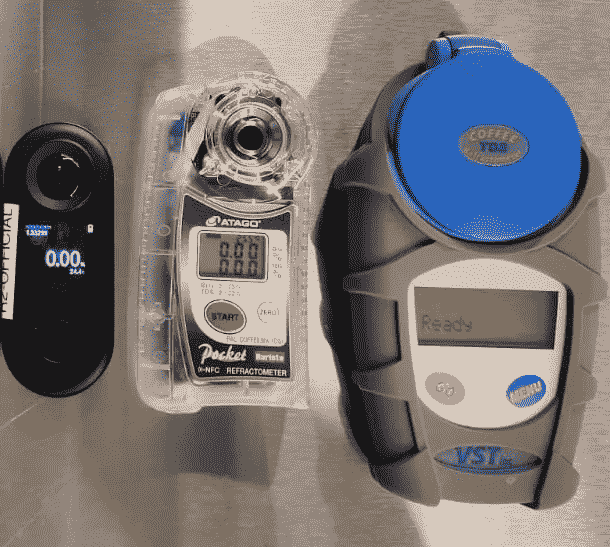
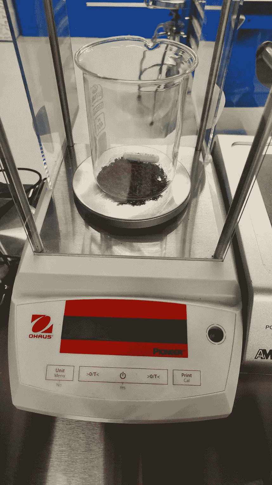
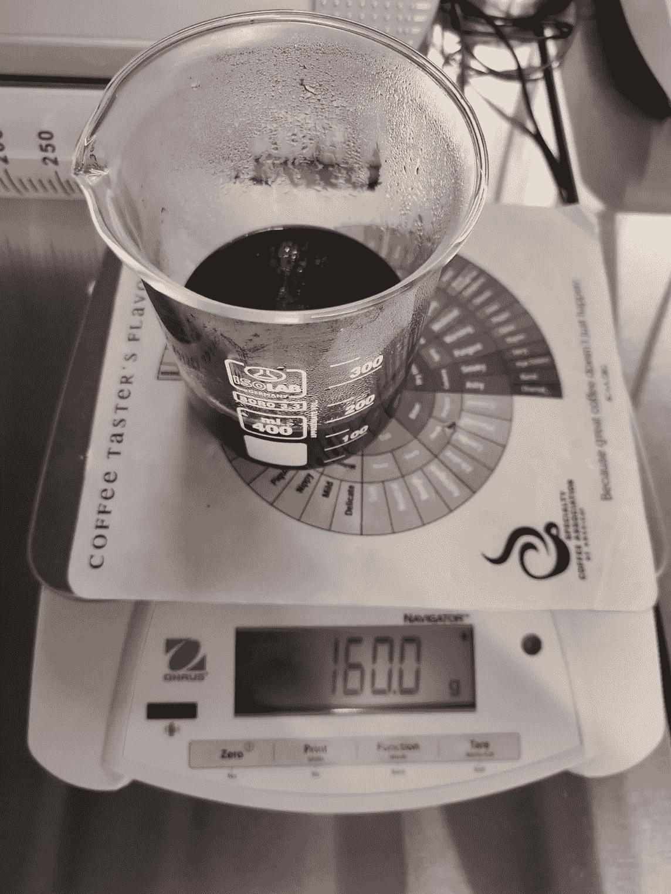
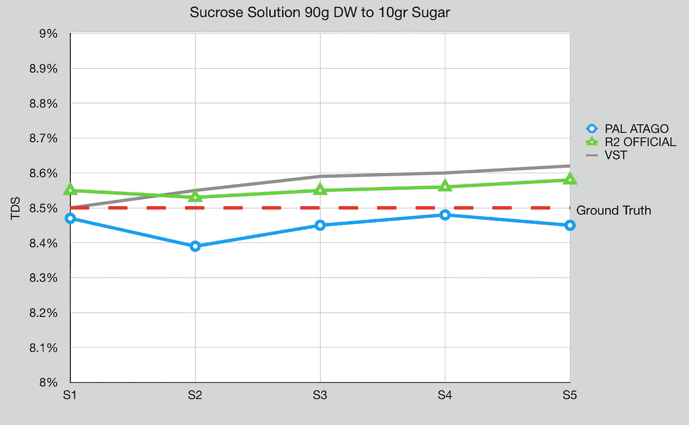
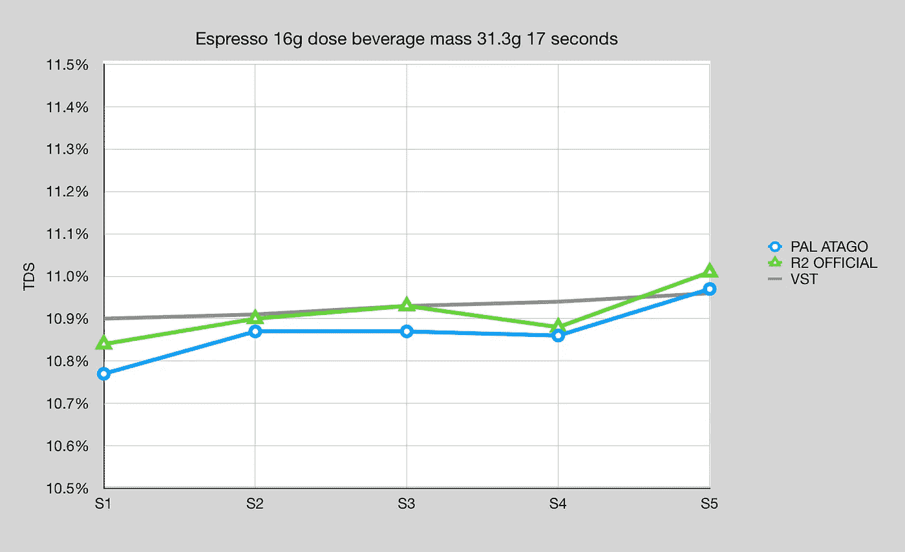
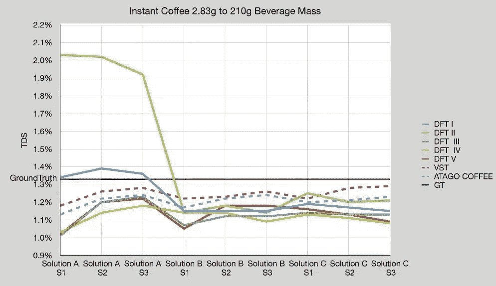
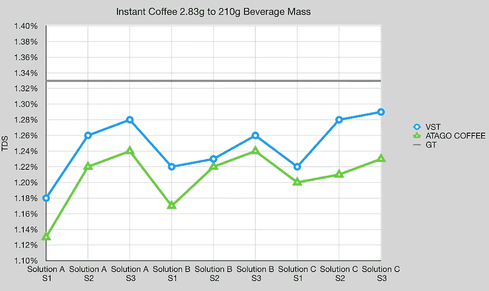
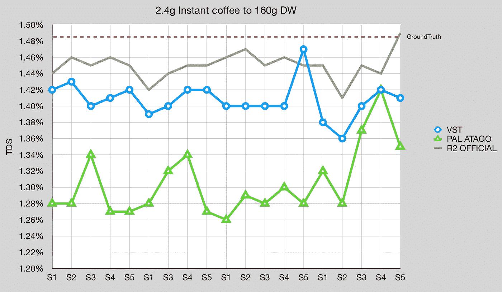
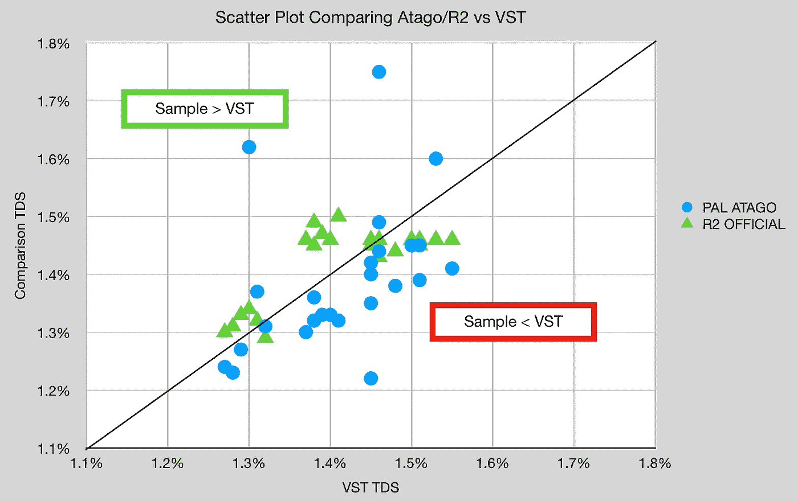

# 咖啡折光仪的精确度:R2 与 VST 的比较

> 原文：<https://towardsdatascience.com/coffee-refractometer-accuracy-vst-vs-difluid-r2-304036bc55f6>

## 咖啡数据科学

## 单设备性能试验

*作者:罗伯特、乔和杰里米*

DiFluid 最初在今年早些时候推出了一款小型、价格合理的折光仪。[少数](https://medium.com/towards-data-science/rethinking-refractometers-vst-atago-and-difluid-part-1-b5fdb0e5731e)研究的准确性表明，该设备可能对某些咖啡表现得足够好，但随着样本(即过滤强度咖啡)中信号强度的下降，担忧会增加。更麻烦的是不同设备的制造差异。DiFluid 继续迭代，他们在今年秋天推出了 R2。

所有图片由作者提供

因此，用 R2 做了更多的实验，将其与 VST 和阿塔戈折射仪进行比较。R2 的价格为 200 美元，比 VST 的 700 美元便宜得多，但是 R2 在准确性和精确度方面付出了代价吗？

数据是在[苏格拉底咖啡](https://www.instagram.com/socraticcoffee)收集的，我们反复进行了一些实验，以更好地了解 R2 的性能。

# 数据

使用 5 台 DiFluid R2 设备、1 台 VST、1 台 Atago Coffee 和 1 台 Atago RX-5000i 收集数据。使用了几种解决方案，每种都提供了不同的见解:

1.  蔗糖溶液(白利糖度测量的基础；公认的规范性数据；硬件的“干净”评估)
2.  浓度为**浓缩咖啡**的速溶咖啡(高咖啡可溶物浓度，不可溶物干扰最小；蔗糖增加了难度，需要软件将折光率读数转换为咖啡可溶物)
3.  **过滤器**浓度的速溶咖啡(低咖啡可溶物浓度，不可溶物干扰最小；与速溶咖啡相比，信号强度降低，但与现实世界的解决方案相比，噪音相对较低，因为速溶咖啡几乎完全是咖啡可溶物——99.9%
4.  **浓缩咖啡**(高咖啡可溶物浓度的实际应用；噪声增加但信号强的困难测试解决方案)
5.  **过滤**咖啡(低咖啡可溶物浓度的实际应用；最困难的测试解决方案，信号减少，噪声增加，测试硬件和软件的鲁棒性)

每次实验前，所有折光仪都归零。所有数据都是在室温下收集的。还使用了精确到 0.001 克的精密标尺。

在第一轮实验中，我们主要关注单个器件的性能。在实验开始时，有一个设备被选为 R2 的官方设备。这是在收集任何数据之前随机选择的。关于多器件性能的更多数据将在稍后讨论，以使讨论更加简洁。

# 浓缩咖啡浓度

对于典型的咖啡师来说，DiFluid 以前在浓缩咖啡范围内表现得足够好。对于蔗糖，所有三种折光率仪具有相似的性能(图 1)。

图 1:蔗糖溶液

对于浓缩咖啡来说也是如此，但事实真相并不为人所知(图 2)。

图 2:浓缩咖啡的浓度

# 过滤浓缩速溶咖啡

回想一下我们之前的[结果](https://medium.com/towards-data-science/rethinking-refractometers-vst-atago-and-difluid-part-1-b5fdb0e5731e)，过滤强度样本显示 VST 和 Atago 略低于地面真实值(图 3)。我们可以将图表分离到 VST 和阿塔哥。这是几个已知基本事实的解决方案之间的差异。

图 3:左:原味速溶咖啡；右图:放大 VST 和阿塔戈，来自这篇[文章](https://medium.com/towards-data-science/rethinking-refractometers-vst-atago-and-difluid-part-1-b5fdb0e5731e)

我们可以用 DiFluid R2 官员重复这个实验。如图 5 所示，相对于 groundtruth，R2 装置似乎比原来的双流体装置具有更小的可变性。有趣的是，它似乎比 VST 和 Atago 更接近于事实。

图 5: VST，阿塔哥，R2 过滤强度下的速溶咖啡

# 过滤咖啡

对于过滤强度，我们可以将 Atago 和 R2 与 VST 进行比较，假设 VST 是最准确的，尽管根据之前的图，这一假设受到质疑。

该测试是在 4 种浓度稍有不同的酿造品上进行的，并且从每种酿造品中取出一些测试样品。所有四次酿造都以相同的浓度开始(15g 进，220g 出)，最后两次酿造分别在酿造后加入 12g 和 32g 水。

图 6:过滤咖啡中的 R2/阿塔哥 vs VST

我们可以对这些样本三胞胎进行排序，看看它们的表现如何，R2 和 VST 的表现相当不错。

图 7:R2/阿塔哥 vs VST 在过滤咖啡，排序对

该数据没有解决从之前的数据中观察到的问题之一——制造可变性。这个话题将在不久的将来讨论。

这些发现为一些结论提供了证据:

1.  二流体 R2 在多种测试条件下表现良好。
2.  对于地面真相的数据，特别是过滤强度的速溶咖啡，R2 在地面真相方面的表现优于 VST。

如果你愿意，可以在推特、 [YouTube](https://m.youtube.com/channel/UClgcmAtBMTmVVGANjtntXTw?source=post_page---------------------------) 和 [Instagram](https://www.instagram.com/espressofun/) 上关注我，我会在那里发布不同机器上的浓缩咖啡照片和浓缩咖啡相关的视频。你也可以在 [LinkedIn](https://www.linkedin.com/in/dr-robert-mckeon-aloe-01581595) 上找到我。也可以关注我在[中](https://towardsdatascience.com/@rmckeon/follow)和[订阅](https://rmckeon.medium.com/subscribe)。

# [我的进一步阅读](https://rmckeon.medium.com/story-collection-splash-page-e15025710347):

[我未来的书](https://www.kickstarter.com/projects/espressofun/engineering-better-espresso-data-driven-coffee)

[我的链接](https://rmckeon.medium.com/my-links-5de9eb69c26b?source=your_stories_page----------------------------------------)

[浓缩咖啡系列文章](https://rmckeon.medium.com/a-collection-of-espresso-articles-de8a3abf9917?postPublishedType=repub)

工作和学校故事集