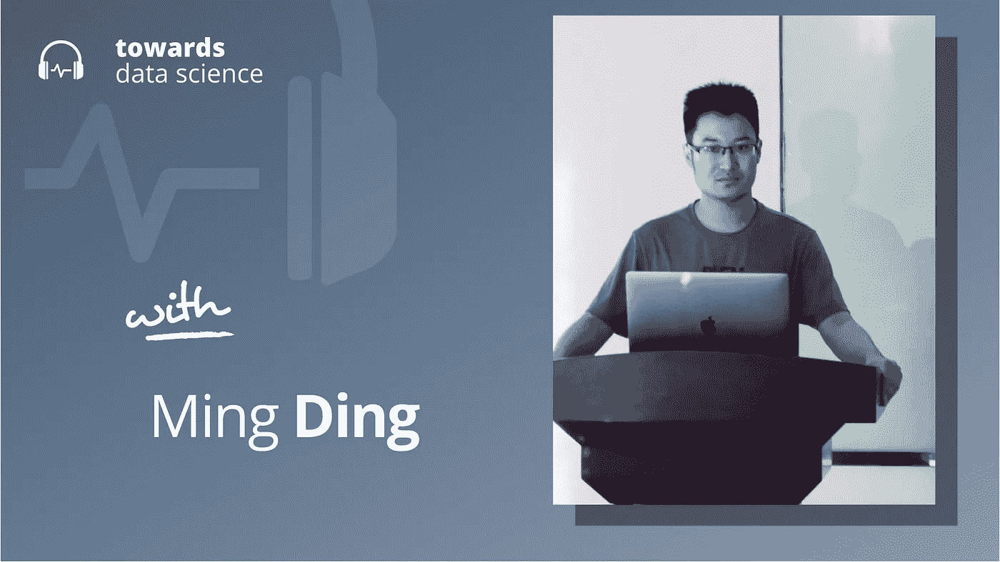

# 图像生成和大规模语言建模

> 原文：<https://towardsdatascience.com/cogview-image-generation-and-language-modelling-at-scale-8d358a0686d2>

## [播客](https://towardsdatascience.com/tagged/tds-podcast)

## 丁明谈建设中国 DALL-E 的挑战

*编者按:TDS 播客由杰雷米·哈里斯主持，他是人工智能安全初创公司墨丘利的联合创始人。每周，Jeremie 都会与该领域前沿的研究人员和商业领袖聊天，以解开围绕数据科学、机器学习和人工智能的最紧迫问题。*

**注意:**由于录制问题，这一集的播客只有文字稿。你可以在下面找到这一集的摘要，然后是完整的书面采访。

2021 年初，OpenAI 发布了 DALL-E，这是一个强大的模型，可以从任意文本提示中生成图像。但就在 DALL-E 在加利福尼亚建造的同时，一个非常相似的模型正在 10000 公里外的中国开发。

该模型被称为 CogView，参与其开发的主要研究人员之一是清华大学的研究员丁明。

众所周知，CogView 是一个巨大的成就:一个 40 亿参数的模型，需要大量的计算预算和大量的软件工程和硬件来组合。但它也为国际人工智能研究的世界提供了一个迷人的窗口，比较跨语言生成模型的难度，以及英语和汉语之间的差异如何影响语言模型学习它们的速度。

在这一集的 TDS 播客中，Ming 和我一起谈论了构建 CogView 的挑战，它与 DALL-E 的比较，以及更多关于人工智能研究的国际方面。

以下是我在对话中最喜欢的一些观点:

*   CogView 基于 VQ-VAE(矢量量化变分自动编码器)架构。像典型的变分自动编码器(VAEs)一样，VQ-VAE 学会接受输入并将其压缩成潜在的表示，该表示可用于重建相同的输入。然而，VAEs 将输入映射到一个连续的潜在空间，而 VQ-VAEs 将输入映射到一个离散的潜在空间，有效地将它们归类到一个大但有限的类别集中。CogView 的 VQ-VAE 首先被训练重建图像，然后一个单独的语言模型被用来将用户输入的文本映射到 VQ-VAE 的潜在空间，图像在那里生成。
*   尽管它们的功能非常相似，但 Ming 指出，很难将 CogView 与 DALL-E 进行比较，原因有二。首先，CogView 是在中文文本/图像对上训练的，而 DALL-E 是在英文上训练的，这意味着每个模型的提示不能在苹果到苹果的基础上进行比较。但是第二，OpenAI 还没有发布 DALL-E 模型，所以 CogView 的团队只能比较有限的一组公开的 DALL-E 文本提示及其相应的图像输出。
*   Ming 解释说，像 CogView 这样的图像生成系统的指标仍然不完善。例如，在某些情况下，它们的趋势与人类的判断相反，根据某些度量标准被评为高等级的图像对人类观察者来说一点也不吸引人。Ming 特别强调，到目前为止，对生成图像质量的定量测量更多地关注纹理，而对人类感知更重要的其他特征(如物体的形状)关注不够。
*   Ming 认为有前途的一种方法是评估生成图像的质量，不是通过直接测量这些图像的属性，而是通过使用图像字幕模型将图像转换回字幕，然后可以与输入到 CogView 的原始文本提示进行比较。无论这一策略最终能否奏效，它都强调了为生成性学习任务定义良好的衡量标准需要多少创造力。
*   OpenAI 决定不发布他们的 DALL-E 模型，而 Ming 和他的同事选择开源发布 CogView。Ming 认为这一决定是合理的，因为 CogView 的功能还没有发展到足以允许恶意使用的程度。然而，他确实认为这种情况在未来可能会改变:在未来两年左右的时间里，Ming 预计真实感图像的生成是可能的。他预计，随之而来的将是更大的风险，并可能需要政府干预和企业审计。

## 文字记录:

Jeremie :大家好，欢迎回到迈向数据科学播客。在今天的节目中，我将与清华大学的研究员丁明进行对话，他是 NeurIPS 论文的第一作者，该论文介绍了 CogView:一种由明和他的同事在今年早些时候开发并开源的生成式文本到图像模型。

据说，CogView 是一项巨大的成就。这是一个有 40 亿个参数的模型，需要大量的计算预算和大量的软件工程和硬件。

但它也为国际人工智能研究的世界提供了一个迷人的窗口，以及比较不同语言之间的生成模型的困难——以及英语和汉语之间的差异如何影响语言模型学习它们的速度。在本期“走向数据科学”播客中，Ming 和我一起讨论了构建 CogView 的挑战，它与同期开发的 DALL E 的比较，人工智能研究的国际方面，以及更多更多内容。

**杰雷米**:我真的很兴奋能有这次谈话，因为 CogView 是迅速崛起的中国人工智能生态系统中如此重要的一部分。这是中国人尝试大型语言和视觉模型的一个很好的例子。是什么让你决定参与这个项目？

**明**:我其实很早的时候就开始这个方向了，可能比去年这个时候还要早。在此之前，没有人成功地使用文本在一般领域生成图像。我的意思是，在有限的领域有很多成功的案例，例如，人脸，动物或类似的东西，但没有人成功地将文本输入转化为图像。

我以前在阿里巴巴实习的时候做过一些图像生成的工作。在那里，我主要专注于生成与时尚相关的图像，以及一些通用领域的图像。然后突然之间，OpenAI 真正开始了他们的文本到图像的工作。我们发现他们的想法与我们极其相似，所以我们迅速要求更多的资源，使用更大的数据集和更多的参数来训练一个大模型。这原来是 CogView，我们终于在 NeurIPS 上发表了。

**杰里米**:这也是一个快速的转变，对吗？如果我没记错的话，CogView 的最大版本——40 亿参数版本——是在 OpenAI 的 DALL-E 模型之后四五个月推出的，对吗？

**明**:实际上，在 OpenAI 发布他们的之前，我们已经完成了所有的代码和小型模型变体*。*

杰瑞米:我没意识到已经这么近了。这也是一个非常有趣的项目——我的意思是，通用的文本到图像转换在两年前还只是科幻小说。你能告诉我一些让这一切发生的架构吗？我记得，它是基于 VQ-VAE 模型，所以如果你能从解释 VAE 部分开始，这可能对任何不熟悉变分自动编码器的人有帮助。

**明** : VQ 和原来的很不一样。VAE 试图将输入映射到一组连续的潜在变量。虽然 VQ-VAE 的第一阶段是相似的，但中间层使用字典将连续的表示转化为离散的表示。所以你把初始层后得到的向量量化成从学习过的字典中提取的记号。VQ-VAE 的第二步是通过自回归模型对离散潜在特征的分布进行建模，因此不需要像普通 VAE 那样对潜在变量的 KL 散度和先验进行建模。

Jeremie :你有一个离散的潜在空间，而不是试图在一个连续的潜在空间中编码一些东西。因此，本质上，您是将输入映射到不同标签或不同类的有限集合。我假设那些离散的嵌入比连续的嵌入更容易让模型学习？

**明**:对。事实上，采用像 VQ-VAE 这样的离散嵌入策略的一大优势是，它允许我们处理像语言这样内在离散的数据(从某种意义上说，单词是意义的离散包，你不能连续地从一个单词移动到另一个单词)。因此，VQ-VAE 以一种自然的方式打开了语言建模的大门——特别是像 GPT 这样的自回归语言模型。

语言数据的分布实际上很难参数化，因为它们太复杂了。如果我们处理的分布更简单，我们可以使用高斯混合模型，或者类似的模型。但是，如果您正在建模一个非常复杂的分布，比如文本数据中的下一个单词概率，或者一般情况下图像中的像素亮度，那么您需要一个更健壮的方法。

目前，最佳实践是使用像 GPT 这样的转换器，它只是通过字典学习分布。每次你想预测下一个单词的时候，你可以看看这个分布，找出一个在预测的分布下概率最高的单词。

这是一个非常灵活的方法，但是它确实有一个问题。语言词典中可能有成千上万的单词，并且迫使下游图像生成模型学习每个单词的语义表示是难以管理的。连续的单词嵌入太复杂了。如果您想将这些单词作为输入提供给另一个模型，例如图像生成模型，您需要一种方法来降低数据的复杂性，将其简化为更易于管理的形式。VQ-VAE 让我们做到了这一点，通过将复杂和连续的单词嵌入转化为少量简单、离散的表示，这些表示不会淹没下游的模型。

**杰雷米**:你认为自回归模型会在更广泛的图像生成方面开始统治 GANs 吗？看起来事情正朝着那个方向发展。

**明**:是啊，肯定是。如果你问我，有三个原因让我们看到 GANs 直到最近一直占据主导地位。首先，甘斯很早就表现出色，激发了研究人员的想象力。我应该知道——以前我是一名研究甘斯的研究员。

但第二个问题是，生成性自回归模型实际上非常慢。原因不是因为车型大；这是因为自回归模型逐令牌生成其输出。例如，生成一幅 65000 像素的图像需要 65000 个推理步骤。如果没有生成前一个标记，就不能生成一个标记或一个像素。这意味着您不能像使用 GAN 那样在 GPU 上并行化图像生成任务。这个速度和并行瓶颈是我们用 CogView2 解决的。因此，也许在未来我们将开始看到非常快速的自回归模型，与基于扩散或基于 GAN 的模型相比，它具有更好的性能。

最后，还有一个问题是，当前的自回归模型总是基于变压器架构，其中包括自关注机制，这会导致速度变慢，特别是在以非常高的分辨率工作时。因此，我们还需要像局部注意力这样的特殊技术来降低这种复杂性——这也是我们一直在用 CogView2 做的工作的一部分。

但我的感觉是，自回归模型将在未来几年主导计算机视觉。

Jeremie :对于变形金刚来说，似乎有更多容易改进的地方。例如，我们看到 DeepMind 的 Gopher 模型的效率提高了 25 倍，这仅仅来自于架构和培训流程的优化。有趣的是，您的工作还显示，只需稍加调整，您就可以解决许多并行化问题，并获得更高效的输出生成。

你认为持续的架构调整会在未来几年推动变形金刚取得更多进展吗，或者你认为从现在开始的大部分进展会来自于或多或少地扩大我们今天拥有的相同技术？

**明**:这其实是一个很有意思的话题。一般来说，哪些技术能够成功加速变形金刚和人工智能相关的计算，很大程度上取决于你的数据。如果你正在训练一个 NLP 模型，只是为了句子，那么你不能用其他技术来代替注意力，因为注意力在 NLP 中非常重要。但是我们发现在计算机视觉中，注意力实际上并不重要。例如，在基于视觉的分类问题的背景下，其他作品也发现了同样的事情。例如，元形成者发现，平均池和其他一些操作可以在不降低性能的情况下取代变形者的注意力。所以答案从根本上取决于数据和任务。

因此，当涉及到生成任务时，我认为注意力也可以被更轻量级的操作所取代。自那以后，有其他论文表明，在某些情况下，转移注意力可以提高效率——因此，架构调整能让我们在图像生成领域走多远还有待观察。

但是，回到文本到图像生成的例子。我们不仅想塑造形象；我们还需要理解文本。这需要一个更强大的架构，减少针对特定任务的优化。所以这迫使我们不得不回到最初的注意力机制。因此，我的预测是，在几个月后，对于像图像分类或分割这样的任务，我们可能会发现自我注意力被取代了，但对于像图像生成或图像字幕这样的跨模态任务，我们会发现原来的注意力机制保留了下来。

用定制组件取代自我关注的想法是一个有趣的反潮流，尤其是考虑到我们最近看到的围绕变形金刚的整合。我真的很好奇这种情况是否会持续下去。

因此，特别关注一下 CogView 模型，我很想知道它在性能方面与 DALL-E 相比如何。我知道这个模型有点小——我想 DALL-E 大约有 120 亿个参数，而 CogView 有 40 亿个参数。但是当我们比较两个不同的模型时，我们需要考虑的不仅仅是参数的数量。

**明**:很有意思，NeurIPS 的评测人员也问过我们类似的问题，但是很难将 CogView 与 DALL-E 进行比较，因为 DALL-E 不是一个开源项目。因此，我们只能看到 OpenAI 随 DALL-E 论文一起提供的例子，但很难评估它们有多大的代表性，或者它们与 DALL-E 训练数据有多相似。

虽然很难进行公平的比较，但我们至少可以通过查看 OpenAI 与 DALL-E 一起发布的一些指标来比较 CogView 和 DALL-E，并查看它们与 CogView 的对比情况。虽然我们发现，根据其中一些指标，我们实际上获得了更好的性能，但很难知道如何进行比较。一个关键问题是，众所周知，图像生成的指标很差，最终只有人工评估才是图像质量的可靠指标。

**杰里米**:这些指标是什么？你如何看待它们与人类评价不一致？

明:一个流行的度量标准是 FID(弗雷歇初始距离)。为了计算 FID，您需要将生成的图像输入到一个视觉模型中，比如 Inception V3。然后，你观察一个更深层次网络中神经元的活动，并与你在模型中输入真实图像时看到的活动进行比较。直觉告诉我们，一个生成的狗的图像和一个真实的狗的图像都应该引起网络深层的“狗”神经元放电。因此，由真实图像和生成的图像引起的点火模式越相似，生成的图像的质量就越高。

这有一个固有的限制:它适用于有真实图像可以比较的情况。但是生成的图像可能被设计成根本不对应于真实对象，这使得 FID 对于一般领域的图像质量评价是不利的。

但也许更令人担忧的是，我们经常发现 FID 和人类的判断在某些情况下是完全不相关的。

**杰雷米**:为什么会这样？

**明** : FID 和盗梦空间配乐是为了捕捉生成图像的“真实感”。但 InceptionNet 倾向于锁定对人类不太重要的功能。特别是，人类专注于形状和颜色来推导图像的含义，而 InceptionNet 往往更关注纹理。所以你经常会发现，那些纹理生动、逼真但形状完全不正确的场景会有非常高的盗梦空间分数。

这就是为什么我们在我们的 CogView 论文中设计了一个不同的指标。我们获取一个文本提示，用它以通常的方式生成一个图像，然后使用这个图像，我们尝试重建原始的文本提示。这里的想法是图像越好，即时重建应该越好。

Jeremie :这就像你在设计一个超级笨重的自动编码器，你将文本映射到图像，图像映射到文本，然后查看你的重建误差。在某种程度上，这就像你过去可以去谷歌翻译，来回翻译一段文本，直到它变得乱码，但随着算法变得更好，它变得更加强大。

**明**:正是。我认为重建误差通常有助于更好的度量。

杰瑞米:这很有道理。你在论文中还提到了微调——你使用 CogView 并针对特定的下游任务进行微调，比如风格学习和超分辨率。那些管道看起来像什么？

**明**:风格学习和超分辨率其实差别很大。基于样式的微调与预训练非常相似，因为它只是使用特定样式中的一些图像，并在文本提示中添加该样式的单词。所以我们只是增加标题，用精选的图片进行训练。以这种方式，模型可以学习用于一种风格的单词之间的相关性，以及如何在图像中表达该风格。

超分辨率是一个不同的故事。假设我们给 CogView 一个类似“Big Ben”的提示。我们将得到一个大本钟的图像，天空和其他建筑物围绕着它。但是现在假设我们把提示改成类似于“大本钟的特写镜头”。在第二种情况下，我们希望看到更多的细节，实际上是更高的分辨率。因此，该模型清楚地知道一个细节层次，它并不总是在提示时显示。有挤出更多的潜力。

但生成图像的质量受到模型分辨率的限制，而模型分辨率又取决于它生成的标记数量。我们可以通过训练模型来专门将较短的令牌序列映射到较长的令牌序列来克服这一点，比如说，从 16 x 16 分辨率的图像到 32 x 32 分辨率的图像。然后，我们可以使用滑动窗口将生成的图像的每个部分放大到更高的细节水平。

微调过程足够短，我们并没有真正教给模型任何新东西——我们更多的是让它揭示它已经拥有的知识。总之，我们只用了大约 20 个小时的训练时间就完成了这项任务。从这个意义上说，这很像即时工程——一个快速、低计算量的过程，它精炼系统的输出，以确保它揭示了它已经包含的所有知识。

**杰里米**:这和我想问的另一个问题有关。一个 40 亿个参数的模型是相当大的，我想实现它会有很多技术上的挑战。为了让你的基础设施或模型发挥作用，最困难的事情是什么？

**明**:最大的问题其实是不稳定。这是所有大型模型的问题，但在我们的 cae 中更明显，因为我们特定任务所需的数据是非常异构的:它包括文本和图像。我们论文中的一个发现是，训练过程的不稳定性水平实际上取决于数据，而异构数据通常会导致更大的不稳定性。我们最终使用基于算法的方法解决了这个问题。我们通过开发一种新的结构改变了转换器的体系结构，我们称之为三明治层范式，并使用了另一种操作，我们称之为精确瓶颈松弛，这两种操作在本文中都有讨论。

但是 OpenAI 和谷歌可以用其他不需要这些变通办法的方法来解决不稳定问题。他们可以获得更多的计算能力，特别是谷歌可以使用优化的硬件，如 TPU 和 BF16 格式的数据，这更适合机器学习。由于某些图层中的值可能会变得非常大，因此提高浮点精度非常重要。

我们现在使用的这种老式 GPU，可以追溯到 A100 之前，不支持 BF16 格式。在 OpenAI，他们对这个问题的解决方案只是使用一些工程技术将某些图层的数据映射回单精度，以及各种其他技巧。他们在论文中讨论了其中的一些技巧，但不是非常详细——更重要的是，在我们进行项目时，OpenAI 的论文还没有发表，所以我们必须找到另一种解决方案。

我们决定改变变压器的架构。这种方法非常成功，也在最近的一些论文中被“发现”——比如脸书人工智能研究所的 NormFormer。我已经和他们的作者谈过了，他们的手法其实和我们很像。

Jeremie :有趣的是，人工智能训练现在比过去更像是一个硬件问题。

我想把工作重心转移到与语言更相关的方面。当我们看英语这样的语言时，我们的字典有一定的维度——每个单词背后都有一定的含义。英语语言转换器通常使用 500 维，word2vec 以前使用 200 到 300 维，但粗略地说，我们谈论的是 300 到 500 维来表示英语单词。汉语也是如此吗？或者说，两种语言中每个标记的信息量有所不同吗？

**明**:这个话题很有意思。首先，我应该注意到 word2vec 的维数并不总是最优的:容量更大的模型可能会发现更大的维数更优越。当然，还有用于嵌入的抽象级别的问题，以及我们是在处理单词级、音节级还是字符级嵌入。在一般情况下，你会发现通过使用更高的维度，你会做得更好。

在标记化部分，不同的语言有更多的不同。目前很多方法都是看音节或者字符层面，或者其他的子词方法。这很有用，因为英语单词有词根和时态，以及传达特定含义的其他成分。

但在中国，一切都不一样。中文书写包含单个字符，通常具有明确的含义。有时它们在普通短语中聚集在一起，但单个字符是语义承载元素，而英语单词中的单个音节不是。汉语缺少时态；在英语中，你可以在动词后面加上“ed”来表示动作发生在过去，而在汉语中，时态是从上下文中推断出来的。

因此，目前中文建模比英文建模容易。当一个语言模型第一次学习英语时，它必须学会所有这些在中文中没有的变化的细微差别。这需要大量的时间和计算，否则这些时间和计算将被花费在更抽象的推理上。

这让我回想起我在高中和大学学习中文的日子。很明显，它是一种比英语更有逻辑性的语言，因此更容易学习(或者至少，口头形式是，字符更难学！).所以在某种程度上，也许我不应该对机器也更容易学习感到惊讶。

当我们谈到语言的话题时，现在已经有一段时间了，人工智能的研究大部分是用英语进行的。但是这些天，第一次有一个真正大规模的令人印象深刻的人体工程在中国进行。

中国发表的大部分研究是倾向于英文还是中文？你认为语言障碍对跨境合作有什么影响？

**明**:是的，即使在中国，对英语语言数据的研究仍然很多。这背后的一个主要驱动力是需要将我们的模型的性能与在英语世界中构建的模型的性能进行对比。然而，这不仅仅适用于中国的研究人员:如果中国、俄罗斯和法国的研究人员想要衡量他们的模型的有效性，并将其与社区中其他人发布的内容进行比较，他们都必须用英语训练模型。

这在很大程度上是为什么我们的语言建模至今如此关注英语。但我们也在研究一些方法，让我们能够更专注于中文工作，同时不牺牲我们衡量自己相对于他人工作进展的能力。这很重要，因为最终，如果我们希望中国消费者从语言建模中受益，我们需要能够用中文执行语言生成。从这个角度来看，我们不得不如此关注英语语言生成，这是一个真正的劣势:大模型很昂贵，如果它们只对基准测量有用，它们就不会带来经济价值。这项工作的大部分集中在提出通用标记器，使我们的模型能够同时学习英语和汉语，有效地创建双语模型，在中国创造经济价值，同时也可与国外开发的英语模型相媲美。

Jeremie :这很有意思，我从未想过语言障碍会成为非英语研究的负担。

我想问的 CogView 项目的另一个方面是是否向公众发布这个模型的问题。显然，CogView 现在是开源的，所以您已经决定发布它。相比之下，OpenAI 以安全考虑和对恶意使用的担忧为由决定不发布 DALL-E，这一想法是人们可能会用它来伪造证据，或产生虚假信息等等。当你决定发布 CogView 时，你考虑过这种可能性吗？

**明**:我们决定把这个模型公布出来，让更多的研究人员能够接触到它，让更多的人意识到这种模型应用到图像上的力量。我不认为滥用目前是一个非常大的问题。我们的系统目前还不存在——也许两年后，新模型将能够以一种潜在的强烈负面社会影响的方式生成非常逼真的图像，我可以看到发布这些模型会有多大的风险。

**杰瑞米**:我们如何能够提前猜测一个模特在产生真正的负面社会影响之前要有多好？

似乎不可能知道。当 GPT-3 API 发布测试版时，甚至 OpenAI 也没有意识到它的全部功能——其中一些功能被发现被恶意使用(以网络钓鱼、虚假信息生成和传播等形式)。当然，我们应该考虑到类似的令人讨厌的意外的可能性，即使模型乍一看似乎没有令人担忧的能力水平？

**明**:对。我的意思是，我的观点是，因为技术本身实际上是整个行业努力的产物，没有一个实验室不发布模型的决定会产生很大影响。将需要其他方法来有效管理这些系统的社会影响——包括新的法律和法规。不发布一个模型实际上并不是事情计划中的一个重要因素。

**杰雷米**:这是一场非常有趣的辩论，我完全同意政府必须在其中发挥作用，按照事情发展的速度，这可能是迟早的事。

政府已经开始考虑的一个领域是人工智能安全，这让我想到了我想问你的最后一件事。中国人工智能社区如何看待人工智能安全和人工智能比对等问题？

我知道你不是比对研究人员，这完全没问题，但在西方，特别是在美国，有一个相当小且快速增长的研究人员社区，他们担心人工智能的长期未来风险。这是中国正在讨论的事情吗？

**明**:我认为人工智能的社会影响问题在美国和中国都没有得到充分的讨论。

还有相关的问题和挑战。例如，考虑“远程监督”关系提取的情况，在这种情况下，我们训练语言模型从从网络上爬取的文本中单词(或音节等)的共现中学习。随着像 GPT-3 这样的模型的出现和广泛使用，越来越多的基于网络的内容本身将是人工智能生成的——所以我们冒险在前几代人工智能的输出上训练人工智能系统。因此，这些较旧的系统正在引入一种非常具有挑战性的噪声，这种噪声有可能使基于网络的爬行在未来无法用作数据集生成的手段。

例如，在 BAAI(北京人工智能研究院)和其他机构，他们可能会就人工智能模型的安全性进行一些内部讨论，但他们从根本上缺乏控制人工智能安全进程的权力，因为人工智能模型正在世界各地开发。这里需要全球协调。

杰雷米:如此复杂的问题——我完全同意。我的意思是，这需要某种全球协作。这是不可避免的。无论如何，中国和美国将不得不讨论这个问题，其他国家也是如此。

非常感谢你，明。迷人的聊天。

**明**:非常感谢。