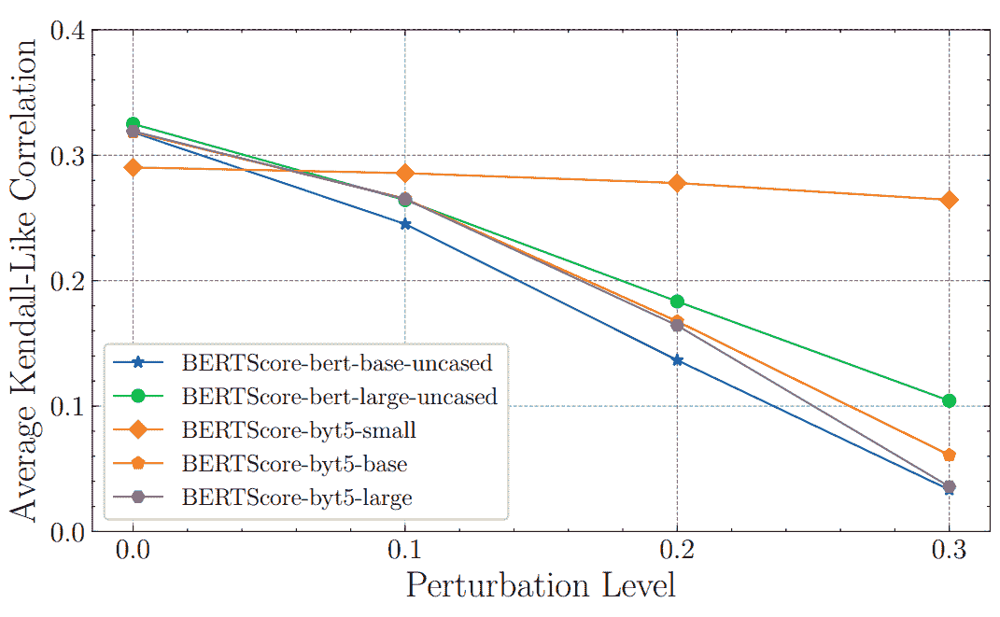
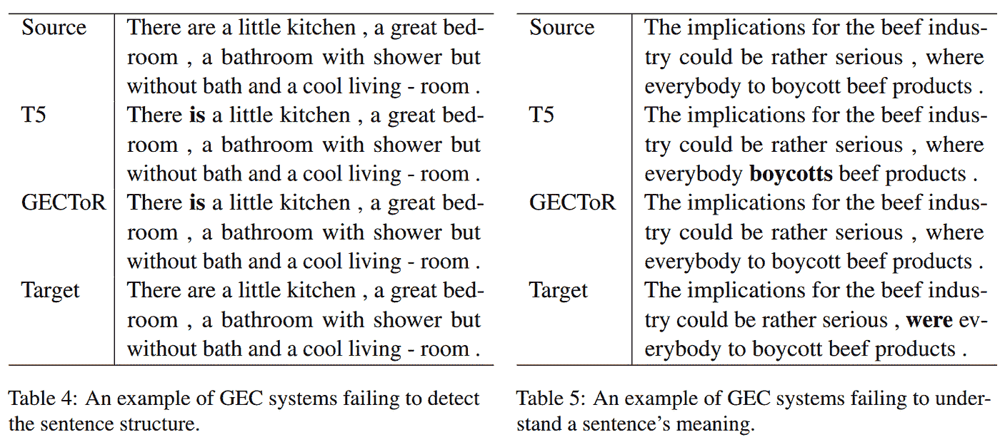

# 科林 2022 亮点

> 原文：<https://towardsdatascience.com/coling-2022-highlights-921fd53b712c>

## 更强大的评估指标，不理解任何东西的语言模型，以及对语法错误纠正的更好评估

照片由来自 Pixabay 的 [hyungname](https://pixabay.com/users/hyungname-9864966/) 拍摄。

[COLING 2022](https://coling2022.org/) 于 10 月中旬在韩国庆州举行。

这次自然语言处理(NLP)会议收到了来自世界各地的 2253 份提交材料，其中只有 632 份(28.1%)被 1935 名评审人员和 44 名项目委员会的高级区域主席接受出版。

对于这些亮点，我选择了 6 篇文章，保留了我的注意力。

## [层或表示空间:是什么让基于 BERT 的评估度量变得健壮？](https://aclanthology.org/2022.coling-1.300.pdf)

*作者 Doan Nam Long Vu(达姆施塔特技术大学)、Nafise Sadat Moosavi(谢菲尔德大学)和 Steffen Eger(比勒费尔德大学)*

最近自然语言生成的度量依赖于预先训练的语言模型，例如 BERTScore、BLEURT 和 COMET。这些度量标准与标准基准上的人工评估高度相关。然而，对于那些在他们的训练数据中没有被很好地代表的风格和领域，这些度量的表现如何还不清楚。

换句话说，这些指标是否稳健？

作者发现，BERTScore 对字符级扰动并不稳健。例如，从句子中插入/删除一些字符将显著降低与人类评价的相关性。

图 2 来自 Doan Nam Long Vu(达姆施塔特技术大学)、Nafise Sadat Moosavi(谢菲尔德大学)和 Steffen Eger(比勒菲尔德大学)的论文。

作者表明，使用具有字符嵌入的模型，如 ByT5，而不是标准的 BERT 模型，可以使 BERTScore 更健壮，特别是如果我们使用来自第一层的嵌入。

在我看来，这是一项杰出的工作，可能应用于广泛的自然语言生成任务。

我从这篇论文中得出的结论是，基于单词嵌入的度量标准(如原始的 BERTScore)可能不擅长评估涉及用户生成文本的任务，即可能包含大量语法错误的文本，如来自在线讨论平台的文本。在我看来，用 ByT5 对 BERTScore 的这种改编可以提高对用户生成文本的评估。

*注:这篇论文获得了大会优秀论文奖。*

## [语法纠错:我们到了吗？](https://aclanthology.org/2022.coling-1.246.pdf)

*Muhammad Reza qo rib(新加坡国立大学)和 Hwee Tou Ng(新加坡国立大学)*

本文首先表明，最近的语法错误纠正方法(GEC)在标准基准上似乎优于人类。

有趣的是，作者发现评估的 GEC 系统实际上未能纠正标准 GEC 基准的大量句子，这在人类中没有观察到。

GEC 系统在纠正不自然的短语、长句和复杂的句子结构方面似乎更容易失败。

Muhammad Reza Qorib(新加坡国立大学)和 Hwee Tou Ng(新加坡国立大学)论文中的表 4 和表 5

作者得出结论，GEC 系统离人类的表现还很远，但目前的基准对 GEC 系统来说有点太容易了。他们建议建立新的基准，关注 GEC 体系仍然难以纠正的语法错误。

我特别喜欢这项工作，因为它指出了 GEC 系统的一些实际限制。虽然最近的工作赞扬了 GEC 系统的超人性能，但这篇论文有助于**降低期望值，并激励未来的研究工作**进一步改进 GEC 系统，以便它们最终能够实现与人类相当的性能。

所以回答一下论文的标题:N **o，GEC 系统还没有出现。**

## 机器阅读，快与慢:模型何时“理解”语言？

*作者:Sagnik Ray Choudhury(密歇根大学、哥本哈根大学)、Anna Rogers(哥本哈根大学)和 Isabelle Augenstein(哥本哈根大学)*

这是另一项表明大型语言模型什么都不懂的工作。

他们评估了 5 种语言模型的两种语言学技能:比较和共指消解。

他们的结果清楚地表明，所有的模型都依赖于特定的词汇模式，而不是人类用来出色完成这些任务的信息。

他们表明，通过将模型暴露于分布外的反事实扰动。模型不知道如何处理它们，表现明显不佳。因此，有人认为这些模型只是记忆词汇模式，而不是“理解”

我发现这篇论文特别有趣，因为它选择了一种方法来证明计算机和人类处理文本的方式不同。

## [关于资源丰富的机器翻译预训练和随机初始化的互补性](https://aclanthology.org/2022.coling-1.445.pdf)

*由常通赞(中国石油大学)、(JD 探索学院)、(JD 探索学院)、(悉尼大学)、(中国石油大学)和陶大成(悉尼大学 JD 探索学院)*

资源丰富的机器翻译是尚未明显受益于预训练语言模型(LM)的任务之一。

通过这项工作，作者提出了一项研究，以更好地理解预训练语言模型在资源丰富的情况下何时以及如何对初始化机器翻译系统有用。

他们首先表明，虽然它对翻译准确性几乎没有影响，但使用预训练的 LM 进行初始化会导致更平坦的损失场景和更平滑的词汇概率分布。

根据这些观察，他们假设使用预训练的 LM 进行初始化可以为域外数据集带来更好的翻译准确性，而随机初始化将更好地翻译域内数据集。他们用实验证实了这些假设。

最后，他们提出了预训练 LM 和随机初始化的**协调，以在同一训练中获得它们的最佳效果。**

我不确定这项工作最终是否会推动预训练 LM 在资源丰富的机器翻译中的集成。尽管如此，我认为值得一提的是，研究人员仍在积极致力于此。

## [缓解神经机器翻译的注意力不均衡](https://aclanthology.org/2022.coling-1.466.pdf)

*作者:孙(人工智能实验室)、(南京大学、实验室)、辛(南京大学)、(南京大学)*

先前的工作表明，机器翻译中的所有注意力并不同等重要。

根据这一观察，这项工作提出了一种新颖的“头部面具”，以迫使模型更好地平衡注意力头部之间的训练。

描述了两种非常简单的头部屏蔽方法:随机屏蔽和屏蔽重要头部。

他们观察到，使用这两种方法，不同语言对的 BLEU 都有(轻微的)改善。随机遮罩似乎表现更好，尽管它看起来并不显著。然而，重要头部屏蔽在训练期间更好地成功平衡头部之间的重要性。

我特别喜欢**方法**的简单性。这种头部屏蔽**可以在现有的机器翻译框架**中轻松实现。

## [作为无监督机器翻译的释义生成](https://aclanthology.org/2022.coling-1.555.pdf)

*由孙晓菲(浙江大学，香农。艾)、田(加州大学)、孟玉贤(香农。艾)、彭南云(美国加州大学)、(浙江大学)、李继伟(浙江大学香农。AI)，还有春帆(北京大学)*

可用于训练的监督释义生成的大多数训练数据集是英语的，限于几个领域，并且很小。

为了减轻这些限制，无监督的释义生成已在最近的工作中提出。这些方法只需要大量感兴趣语言的文本。

在这篇文章中，作者提出了一种新的方法，灵感来自无监督机器翻译(UMT)。

UMT 需要训练源语言和目标语言的两个语料库。两种语言的单词嵌入首先被联合学习并用于初始化机器翻译系统。然后，使用自动编码和反向翻译损耗的组合来改进该翻译系统的模型。

对于释义生成，我们没有源语言和目标语言。他们建议在领域(或主题)层面进行工作。来自 UMT 的源和目标语言成为源和目标域。为了获得这些域，他们在一些单语数据集上执行 LDA 和 k-means 聚类，其中每个聚类(潜在地)是不同的域。然后，他们为多个领域对训练 UMT 模型。最后，在由先前训练的多个 UMT 模型生成的 2500 万个句子对上训练单个 MT 模型。

他们通过大量的实验来评估他们的方法，以证明对以前工作的改进。这个评价很有说服力:

*   他们使用了 3 种不同的自动度量标准:iBLEU、BLEU 和 ROUGE
*   他们从以前的工作中复制了几个基线系统
*   他们在 4 个不同的基准上进行实验
*   他们进行了人体评估

作为一个在无监督机器翻译技术上做了很多工作的人，我期待它在某个时候被应用于释义，但找不到如何应用。在本文中，**单语数据的主题/领域聚类似乎是其工作的主要原因**。

虽然这些改进令人信服，但我不明白为什么它能如此有效。在这篇论文中，对于集群的需求并没有很好的动机，但是它似乎是这项工作的一个关键部分。此外，他们没有详细讨论为什么他们的方法比以前的工作更好。这项工作解决了以前的无监督释义生成方法的局限性？

## 结论

我在这里只选择了发表的 632 篇论文中的几篇。我鼓励你们仔细看看[的全部会议记录](https://aclanthology.org/events/coling-2022/)和研讨会。

如果你对机器翻译的最新进展感兴趣，你也可以看看我的 AMTA 2022 亮点:

  

如果你想支持这项工作，[请在 Medium](https://medium.com/@bnjmn_marie) 上跟随我。