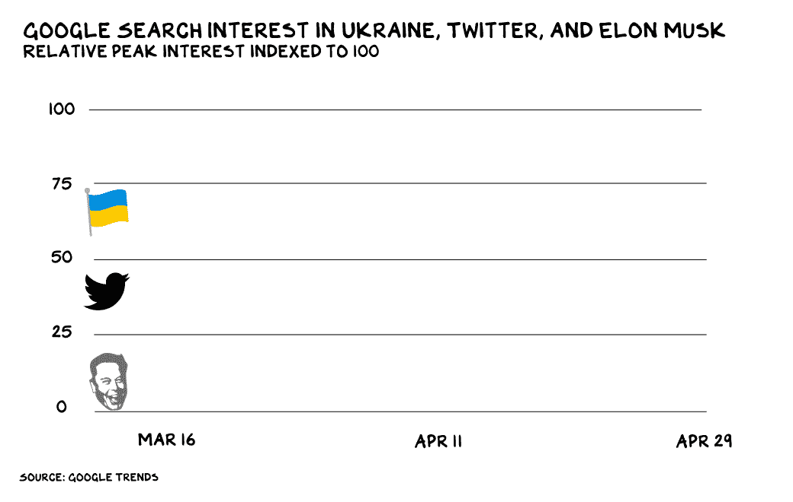

# 合作、同情和意识(3 C)是构建人工智能和拯救人类的关键

> 原文：<https://towardsdatascience.com/collaboration-compassion-and-consciousness-3-cs-are-the-keys-to-building-ai-and-saving-8930023074c7>

## 意见

## 在这篇文章中，我探索“坏”人工智能；如果我们不做点什么会有什么影响，它在我们的社会中有多普遍，我们如何才能拯救自己？

# 人工智能(AI)能控制我们吗？

1963 年，斯坦利·米尔格拉姆做了一个实验，以了解是什么让人们服从权威。这个实验以米尔格拉姆实验而闻名。

资料来源:Wikimedia.org

设置如下:

每当学习者(L)给出错误答案时，实验者(E)要求教师(T)向学习者(L)提供电击。电击逐渐上升到 750 伏，这种电击甚至可以杀死学习者。实际上，没有电击，但是老师(T)不知道。教师(T)只能听到每个电击等级的声音，这些声音是录音的。

实验发现，大多数教师(T)最终对学习者(L)施加了最大的电击，如果电击是真实的，可能会杀死学习者(L)。一些实验者抗议在实验过程中给予电击，但还是继续实验。

这个实验表明，我们大多数人会顺从地听从权威的命令，甚至会杀人。我们在历史上一次又一次地经历过这种情况，人们按照命令杀死他人，当后来被问及他们为什么这样做时，他们的回答是“*我只是按照命令*”。

**如果米尔格拉姆实验中的实验者(E)是一个智能机器算法(或 AI)而不是人类实验者(E)发出命令，会怎么样？**可能老师(T)连实验者是机器人都不知道。随着语音生成的发展，算法甚至不需要在理解环境或上下文方面变得智能。它可能只是一台“哑机器”，在不知道上下文的情况下发出命令。人们会遵守这些命令吗？我认为很有可能我们大多数人都会。

上面提到的场景是遥远的未来，还是我们已经在经历的事情？

# 人已经被智能算法以某种方式控制了吗？

当机器人接管世界时，我不是相信世界末日的人之一。然而，我们已经可以看到一种趋势，即人工智能算法正在塑造我们的观点并控制人们的思想。

像 Meta、Tiktok 和 Twitter 这样的社交媒体公司给我们提供信息，我们开始形成观点。斯科特·盖尔威在他的文章中把社交媒体称为大规模杀伤性武器:大规模分散注意力的武器，其目的是转移人们对物质生活的注意力。例如，我们可以看到在乌克兰-俄罗斯战争中。随着普京输掉一场信息战，他继续在一场我们正在失去兴趣的真正的战争中杀死数千人。

> 我们越来越多地进入虚拟世界，以至于忘记了现实世界，因此可以很容易地被大规模控制，由算法通过虚拟世界向我们提供信息或数据。

情况可能会变得更糟:鉴于我们在米尔格拉姆实验中看到的情况，**如果一些坏演员(或权威)决定大规模地使用人工智能来控制人们的思想，那么我们听从命令发动战争和杀害他人的日子就不远了。我们已经可以在社交媒体上看到这一点，人们在不了解对方的情况下互相争斗、表达仇恨和诋毁。看看社交媒体上的仇恨，正在进行的乌克兰-俄罗斯战争真的有可能将我们引向第三次世界大战。**

# 是否为时已晚，或者我们能从“坏”人工智能中拯救世界？

有两种方法可以控制“坏”人工智能的增长:a)通过规章制度，b)我们，人民，意识到并开始做一些事情。

## 规程

就我个人而言，我从来不喜欢监管，因为它会创建一个自上而下的结构。谁来监管监管者？如果监管者变成了坏演员，那该怎么办？然而，有时它是我们不得不接受的一种必要的邪恶。

最近一段时间，我们可以看到政治家们正在赶上人工智能可以造成什么样的危害，并能够提出良好的法规。例如，最近来自欧盟的[数字服务法案](https://eur-lex.europa.eu/legal-content/EN/TXT/HTML/?uri=CELEX:52020PC0825&from=en) (DSA)提案将让用户更好地理解如何向他们推荐内容，以及如何做出适度的决定。如果平台出错，用户也将享有恢复权利。这可能会解决一些问题，但还不够。一些流氓国家和政客总是有可能滥用法规来控制人民的自由。米尔格拉姆的实验已经表明，我们可以很容易地屈服于权威，所以如果我们仅仅依靠法规，“坏”人工智能的危险会更大。此外，监管者需要大量时间来建立良好的监管。

## 合作、同情和意识(3 C)

我们对付“坏”人工智能的最好办法是我们这些人。我们必须更加意识到正在发生和可能发生的事情，并建立我们自己想要使用的解决方案。考虑到当今大多数人工智能解决方案对人类和社会的巨大影响，无论如何，脱离人类和社会环境来构建解决方案是有害的。

**不同人才之间的合作**使我们能够弥合不同心态之间的理解差距，分享知识，并团结人民和价值观。因此，它有助于创造**同情心**，并利用群体智慧、多样性和包容性为这些社区的长期利益服务。然而，重要的是不仅要有象征性的多样性，还要有真正的观点多样性。

另一个关键要素是**意识**。由于这个世界上存在如此多的分歧，我们需要明白，在内心深处我们都是一体的，我们所联系的所有群体(民族、宗教、性取向、性别、肤色等)都只是我们头脑中的一个幻觉。我们有同样的恐惧，同样的渴望，和相似的梦想，我们所有的命运都是一样的。因此，我们的意识是集体的。

J.克里希那穆提— Ojai 1982 —与科学家的讨论 2 —心理痛苦

如果我们想要生存并面对未来世界和来自坏演员(和人工智能)的挑战，我们必须带着同情和意识一起合作。否则我们会让智能机器自相残杀，互相争斗，互相压制。我们已经可以看到由大型科技巨头构建的这样的人工智能算法压制不同意见的人。

另一方面，由三个 C(协作、同情和意识)构建的人工智能将帮助我们消除地方性的社会学和历史偏见以及社会中存在的其他不平等。 AI 不会挑战现状，除非这个过程是特意设计来这么做的。

# 用 3C 的人工智能很难实现吗？

> "永远不要怀疑一小群有思想、有奉献精神的公民能够改变世界."—玛格丽特·米德

从文明之初，控制人民就一直是国王和领袖们的目标。在过去，通过权力和力量，现在在人工智能时代将通过数据和知识控制我们的思想。这是非常可怕的，只需点击一个按钮，使用算法，这种控制可以更有效地大规模进行。

> 但与此同时，在地球的历史上从未有过，由于获取知识的途径被大众化，如此多的人也获得了力量——互联网、连通性和知识。坏演员可以使用的同样的工具，我们这些人也可以出于好的理由获得和使用。有史以来第一次，这么多人有能力做出改变。

机器没有那么聪明，但是如果我们不够警惕和警觉，我们就会被坏人控制。因此，在为时已晚之前，我们有责任用 3C 的(协作、同情和意识)来构建人工智能和未来的解决方案。

*小传:出于文章中提到的原因，我创办了 Omdena，一个构建人工智能解决方案的合作平台。随时查看* [*网站*](https://omdena.com/) *以及所做的工作。*

## 参考

[1][https://www . creative-resolution . com/post/building-ethical-and-inclusive-ai-through-bottom-up-community-collaboration](https://www.creative-resolution.com/post/building-ethical-and-inclusive-ai-through-bottom-up-community-collaboration)