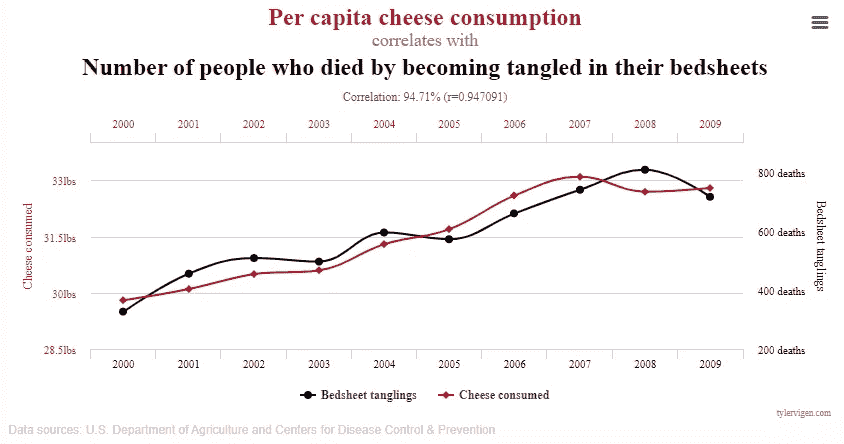
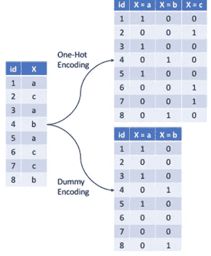

# 决定数据科学项目成败的常见问题

> 原文：<https://towardsdatascience.com/common-issues-that-will-make-or-break-your-data-science-project-64e976c21a14>

## 关于发现数据问题、为什么它们是有害的以及如何正确解决它们的有用指南

在 [Unsplash](https://unsplash.com?utm_source=medium&utm_medium=referral) 上由[张志勇](https://unsplash.com/@danielkcheung?utm_source=medium&utm_medium=referral)拍摄的照片

我相信大多数人都熟悉[调查](https://www.forbes.com/sites/gilpress/2016/03/23/data-preparation-most-time-consuming-least-enjoyable-data-science-task-survey-says/?sh=64c32c3d6f63)，该调查表明数据科学家花费大约 80%的时间准备和管理数据。那是一周 5 天中的 4 天！

虽然这听起来很疯狂(或者很无聊)，但是您很快就会意识到为什么会有这种趋势，我认为这表明了数据清理和数据验证的重要性。

> 垃圾进，垃圾出。

在任何分析项目中，获得正确的数据都是成功的一半以上。事实上，任何花哨或复杂的模型都不足以补偿低质量的数据。

对于刚开始涉足这个领域的新手来说(对我来说肯定是这样)，我理解在处理一个新的数据集时，很难知道到底要注意什么。

考虑到这一点，我想提出一个指南，介绍您在旅途中的某个时间点可能会遇到的常见数据问题，以及如何正确处理这些问题以及它们各自的利弊的框架。

这篇博文并不是一个详尽的列表，而是在预处理和解释数据时你会发现的最关键和最常见的列表。

# 1.处理重复

重复数据是同一表中相同数据的简单重复实例，在大多数情况下，应该完全删除重复数据。

如今，大多数编程语言中都有内置函数可以帮助检测重复数据，例如，r 中的[重复](https://www.rdocumentation.org/packages/base/versions/3.6.2/topics/duplicated)函数。

关于处理重复项，理解主键的概念也很重要。

主键是表中每一行的唯一标识符。每一行都有自己的主键值，根本不应该重复。例如，在客户表中，这可能是客户 ID 字段，或者在事务数据集中，这可能是事务 ID。

识别表中的主键是检查重复项的好方法。具体来说，主键中不同值的数量需要等于表中的行数。

如果它们相等，那么很好。如果不是，你需要进一步调查。

主键不一定只有一列。多个列可以构成一个表的主键。

# 2.缺少值

通常，有两种类型的缺失值:NA(不可用的缩写)和 NAN(非数字的缩写)。

NA 表示由于未知原因丢失数据，而 NAN 表示有一个结果，但不能用计算机表示，例如，一个虚数或如果您不小心将任何数除以零。

缺失的值会导致我们的模型失败或导致错误的解释，因此，我们需要找到解决它们的方法。处理缺失值主要有两种方法:忽略缺失值的观测值或插补。

在大规模数据集的情况下，我们可以简单地丢弃所有丢失的数据，但是，我们有丢失信息的风险，这不适合小数据集。

另一方面，价值插补可分为单变量插补和多变量插补。我以前写过一篇关于插补的博文，如果你有兴趣深入探讨这个话题，请随意查看。

实际上，单变量插补是指使用平均值、中值或众数替代基于单个列的值。另一方面，多变量插补考虑多个列，并涉及算法的使用。例如，估算连续变量的最简单模型是分类变量的线性回归或 k 均值聚类。多变量插补通常优于单变量插补，因为它能更准确地预测缺失数据。

需要判断处理缺失值的最佳方式。也可能有这样的情况，在数据集中，零支付的索赔被表示为 NA 而不是 0。在这个特定的场景中，简单地用 0 替换 NA 是有意义的。在其他情况下，需要更多的考虑。

# 3.极端值

离群值是与其他数据点有很大不同的数据点。它们会扭曲分析或模型。

确定异常值的一种方法是将四分位间距(IQR)标准应用于变量，如果观察值高于上四分位 1.5*IQR，低于四分位 1.5*IQR，则视为异常值。

箱线图通常将这些点绘制为经过须点的点，这被认为是检测异常值的单变量方法。直方图在可视化分布和发现潜在异常值方面同样出色。对于两个变量，考虑使用散点图。

如何处理离群值？你可以保留、删除、封顶，或者用平均值、中间值或随机数来估算。

# 4.相关性考虑

这与其说是一个数据问题，不如说是一个如何解释相互关联的变量的提醒。

机器学习模型非常擅长学习输入数据和输出预测之间的关系。但是，他们缺乏因果推理。因此，得出结论时必须小心，不要过度解读变量之间的关联。

统计学中有一句名言，“相关性并不意味着因果关系”。

一个变量与另一个变量相关，但不一定有直接影响，这有几个原因。这些原因可能包括伪相关性、异常值和混杂因素。

我们将在这里更详细地讨论它们。

> 相关性并不意味着因果关系。

## 4.1 虚假关联

伪相关是指两个变量以某种方式相关，但实际上它们之间没有真正的关系。

泰勒·维根拍摄的图片——虚假关联

从上面的图表可以看出，一个滑稽的例子是奶酪消费和纠缠在床单上导致死亡之间的关系。显然，这两个变量之间没有任何逻辑因果关系，这种相关性只不过是巧合。

这是你可以在这里找到[的许多其他例子之一](https://www.tylervigen.com/spurious-correlations)。

## 4.2 异常值引起的相关性

相关性有时也可能由异常值驱动。

我们可以通过移除异常值来测试这一点，结果相关性会显著降低。正如上一节所提到的，这强调了在探索数据集时识别异常值的重要性。

或者，我们也可以计算 Spearman 相关性，而不是 Pearson 相关性，因为 Spearman 计算相关性是基于值的等级顺序，因此不受异常值的影响。

## 4.3 混杂变量引起的相关性

混杂因素可能是相关性被误解的最常见原因。如果变量 X 和 Y 是相关的，如果 Z 的变化引起 X 和 Y 的变化，我们称 Z 为混杂变量。

例如，假设您想要调查两组之间的死亡率，一组由酗酒者组成，另一组由从不饮酒者组成。死亡率是反应变量，饮酒量是你的独立变量。

如果你发现酗酒者更容易死亡，那么似乎可以凭直觉得出结论，饮酒会增加死亡风险。然而，饮酒可能不是两组间唯一不同的死亡率影响因素。例如，那些从不饮酒的人可能有更健康的饮食或更少吸烟，这两者也对死亡率有影响。这些其他影响因素(饮食和吸烟习惯)被称为混杂变量。

那么，我们如何解决这个问题呢？对于少量的混杂因素，我们可以使用一种称为分层的方法，即抽样数据，其中混杂变量变化不大，然后检查每组中自变量和因变量之间的关系。

回到我们之前的例子，我们可以将样本分为吸烟者和非吸烟者两组，然后检查每组中酒精消费量和死亡率之间的关系。

理论上，这表明我们应该包括所有与响应变量有关系的解释变量。不幸的是，有时并非所有的混杂因素都有可能被收集或准确测量。此外，添加过多的解释变量可能会引入多重共线性，并增加回归估计值的方差。

这是精确度和偏差之间的权衡。随着我们开始包含更多的变量，我们减少了预测中的偏差，但多重共线性增加了，因此方差也增加了。

# 5.特征工程

特征工程是选择原始数据并将其转换为用于训练模型的特征的过程。

在准备数据集时，我们需要知道每一列中的变量是什么类型，以便可以适当地使用它们来解决回归或分类问题。

一些重要的考虑事项包括:

*   我的特征和它们的属性是什么？
*   我的特征如何相互作用以适应模型？
*   如何调整原始要素以表示原始预测值？

通过检查汇总统计数据，我们通常能够确定我们的特征的属性。然而，选择或构建正确的特性并不是一件容易的事情，这通常取决于领域中的经验和专业知识。

然而，下面是你可以考虑为你的项目做的 3 个特征工程的例子。

## 5.1 算法无法处理的分类变量

对于无法处理分类变量的算法，如逻辑回归和支持向量机，它们期望所有变量都是数字，流行的方法是将它们转换为 *n* 数字变量，每个变量取值 1 或 0。这被称为一键编码。

回归问题使用了一种稍微不同的一次性编码，称为哑编码。不同的是，一键编码产生了 *n-1* 个数值变量。

作者图片

正如你所看到的，对于哑编码，如果我们知道两个变量的值，我们可以很容易地推导出第三个变量的值。具体来说，如果两个变量的值为 0，这意味着第三个变量的值为 1。这样做，我们避免给我们的回归模型冗余信息，可能导致不可识别性。

像 Python 和 R 这样的通用编程语言中有一些包支持一键编码和虚拟编码。

## 5.2 具有高基数的分类变量

高基数意味着有太多的唯一值。

决策树和广义线性模型(GLMs)等算法无法处理高基数的分类数据。

决策树分割特征，使得每个子树变得尽可能同质。因此，随着基数的增长，拆分的数量也在增长，从而增加了模型的复杂性。

另一方面，GLMs 为分类数据的每个级别创建虚拟变量。因此，对于每个具有 *n* 类别的分类变量，模型将生成 *n-1* 个附加参数。这并不理想，因为它会导致过度拟合和较差的样本外预测。

处理高基数分类变量的一种流行方法是宁滨，它是组合相似分类变量类的过程。这种分组通常需要商业环境的领域知识或从数据探索中获得的知识，例如，通过检查级别的频率和分析感兴趣的变量和响应变量之间的关系。对类别进行宁滨后，可以使用一键编码将类别变量转换为值为 1 和 0 的虚拟数值变量。

宁滨的一些例子包括将国家分组为大洲，或者将预期寿命分组为 0-50 岁和 50 岁以上。

## 5.3 数据集中的大量特征或变量

与高基数相似，当数据集中有太多要素时，我们会面临长训练时间和过度拟合的挑战。拥有太多的功能也会使数据可视化变得困难。

作为一名数据科学的初学者，我记得有一个误解，即在构建模型时，变量越多越好。这显然不是事实。

减少变量的数量对于简化数据集至关重要，因此我们只需关注那些实际上有意义且可能携带最多信号而非噪声的要素。

有几种方法可以减少功能的数量，但在这里我将分享 4 种你可能想考虑的方法:

1.  **领域知识:**如果经验或专业知识告诉您某些变量在预测响应变量方面表现良好，则手动使用领域知识。例如，债务收入比是用来评估一个人的信誉和预测违约概率的常用指标。
2.  **降维:**通过将点投影到一个更低维度的空间来减少变量的数量。目标是获得一组新的特征，这些特征比原来的少，但仍然保留尽可能多的信息。一种流行的降维技术被称为主成分分析(PCA)。PCA 下的新特征应该解释原始特征，换句话说，高度相关但不与任何新特征相关。我以前写过关于 PCA 算法的文章[这里](/feature-selection-dimensionality-reduction-techniques-to-improve-model-accuracy-d9cb3e008624)如果你有兴趣了解更多细节的话。

*   **子集选择:**通过一个叫做逐步回归的过程，找到表现良好的变量子集，去掉多余的变量。这可以通过向前选择或向后排除过程来实现。正向选择包括从没有变量开始，在每一步增加一个变量，对模型拟合产生最大的改进。另一方面，反向选择包括从所有变量开始，在每一步中去除一个对模型拟合度影响最小的变量。
*   **收缩:**LASSO 和 Ridge regression 等技术通过在残差平方和(RSS)中增加一个惩罚项，将过拟合和欠拟合的可能性降到最低。我不会讲太多细节，但是可以在这里随意阅读这些技术。

# 6.不平衡数据集

当我们有明显稀疏的少数类和丰富的少数类时，就会出现不平衡的数据集。

这是分类问题中的一个问题，因为我们的模型没有获得足够的关于少数类的信息来进行准确的预测。具体来说，由于不平衡，模型更有可能显示出对多数阶级的偏见，这可能导致误导性的结论。

不平衡数据集的常见例子可以在欺诈检测、客户流失和贷款违约中找到。

让我们以欺诈检测为例。欺诈交易通常只占大型数据集中的很小一部分(你会希望如此，否则每个人都会避免使用银行)。假设每 1000 笔交易中可能只有 1 起欺诈案件，占整个数据集的 0.1%。如果机器学习算法简单地预测 100%的交易不是欺诈性的，在这个特定的例子中，它将具有 99.9%的准确率，这在表面水平上看起来可能非常高。

但是，如果银行要实施这种模式，它很可能无法标记未来的欺诈交易，这对银行来说成本很高。

用抽样方法处理不平衡数据有几种方法:

*   **欠采样:**这是我们减少多数类样本数量的地方。欠采样的缺点是我们会丢失很多有价值的数据。
*   **过采样:**这是我们增加少数类样本数量的地方。过采样的缺点是我们创建了过多的重复数据点，这可能会导致我们的模型过拟合。
*   **合成少数过采样技术(SMOTE):** SMOTE 旨在欠采样和过采样之间取得平衡。SMOTE 的优势在于，我们不会创建副本，而是创建与原始数据点略有不同的数据点。

就像我在这篇博文的开头所说的，这绝不是你需要注意的事情的详尽清单，但是我希望这篇指南不仅能帮助你在未来更加意识到这些问题，还能帮助你学会如何处理它们。

如果你在这篇文章中发现了任何价值，并且还不是一个媒体会员，如果你使用下面的链接注册会员，这对我和这个平台上的其他作者来说意义重大。它鼓励我们继续推出像这样的高质量和信息丰富的内容——提前感谢您！

  

不知道接下来要读什么？这里有一些建议。

     