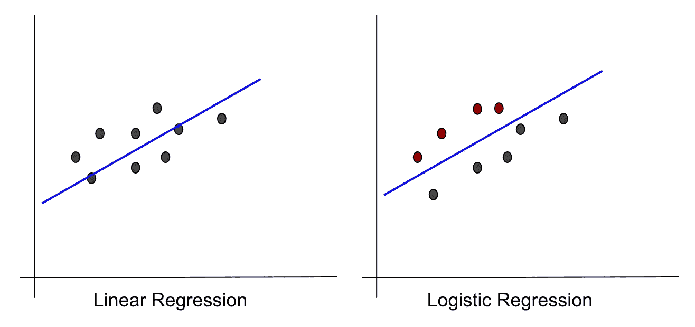
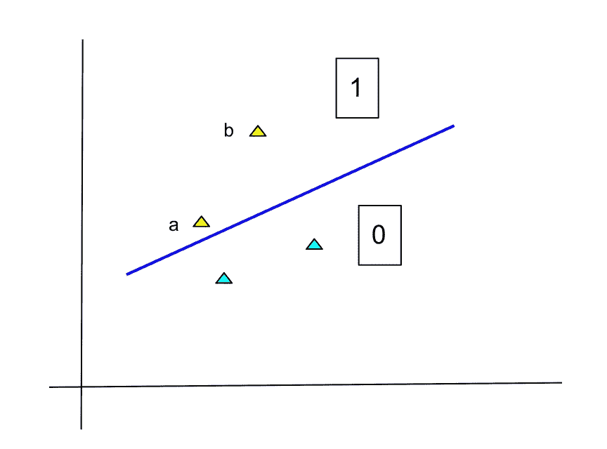

# 比较线性回归和逻辑回归

> 原文：<https://towardsdatascience.com/comparing-linear-and-logistic-regression-11a3e1812212>

## 一个入门级数据科学面试问题的探讨

数据科学面试的深度各不相同。有些面试非常深入，测试候选人对高级模型或复杂微调的了解。但许多面试都是在入门级别的情况下进行的，试图测试候选人的基础知识。在这篇文章中，我们将看到一个可以在这样的采访中讨论的问题。尽管这个问题非常简单，但讨论带来了机器学习基础的许多有趣方面。

> 问题:线性回归和 Logistic 回归有什么区别？

这两者之间实际上有许多相似之处，首先是他们的名字听起来非常相似。它们都使用直线作为模型函数。他们的图表看起来也非常相似。



作者图片

但是尽管有这些相似之处，它们在方法和应用上是非常不同的。我们现在将强调这些差异。为了进行比较，我们将使用在讨论任何机器学习模型时通常考虑的以下几点:

*   假设或模型族
*   输入和输出
*   损失函数
*   最优化技术
*   应用

我们现在将比较线性回归(LinReg)和逻辑回归(LogReg)在这些点上的差异。让我们从应用程序开始，让讨论步入正轨。

# 应用


图片由 Rajashree Rajadhyax 提供

线性回归用于根据其他量来估计一个量。举个例子，想象一下，作为一名学生，你在暑假经营一个柠檬水摊。你想算出明天会卖出多少杯柠檬水，这样你就可以买足够的柠檬和糖。从你长期销售柠檬水的经验中，你已经弄清楚了销售与一天中的最高温度有很大的关系。因此，您希望使用预测的最高温度来预测柠檬水销售。这是一个经典的 LinReg 应用，在 ML 文献中一般称为预测。

LinReg 还用于找出特定输入如何影响输出。在柠檬水摊位示例中，假设您有两个输入——最高温度和当天是否是假日。你想知道最高温度和假日哪个对销售影响更大。LinReg 将有助于识别这一点。

LogReg 主要用于分类。分类是将输入分类到许多可能的篮子中的一个的行为。分类对人类的智力如此重要，以至于说“大部分智力都是分类的”一点都不会错。分类的一个很好的例子是临床诊断。考虑老年人，可靠的家庭医生。一位女士走进来，抱怨不停地咳嗽。医生进行各种检查，在许多可能的情况中做出选择。一些可能的情况相对无害，比如喉咙感染。但是有些很严重，比如肺结核甚至肺癌。基于各种因素，医生决定她患了什么病，并开始适当的治疗。这是分类在起作用。

我们必须记住，估算和分类都是猜测任务，而不是计算。在这类任务中没有确切或正确的答案。猜测任务是机器学习系统擅长的。

# 模范家庭

ML 系统通过检测模式来解决猜测问题。他们从给定的数据中检测模式，然后使用它来执行任务，如估计或分类。在自然现象中发现的一个重要模式是关系模式。在这个模式中，一个量与另一个量相关。在大多数情况下，这种关系可以用数学函数来近似。

从给定的数据中识别一个数学函数被称为“学习”或“训练”。学习有两个步骤:

1.  函数的“类型”(例如线性、指数、多项式)由人来选择
2.  学习算法从给定的数据中学习参数(如直线的斜率和截距)。

因此，当我们说 ML 系统从数据中学习时，它只是部分正确。选择函数类型的第一步是手动的，并且是模型设计的一部分。函数的类型也称为“假设”或“模型族”。

在 LinReg 和 LogReg 中，模型族都是线性函数。众所周知，直线有两个参数——斜率和截距。但是这只有在函数只接受一个输入时才成立。对于大多数现实世界的问题，有不止一个输入。这些情况下的模型函数称为线性函数，而不是直线。一个线性函数有更多的参数需要学习。如果模型有 n 个输入，则线性函数有 n+1 个参数。如上所述，这些参数是从给定的数据中学习的。出于本文的目的，我们将继续假设该函数是带有两个参数的简单直线。LogReg 的模型函数稍微复杂一些。这一行是有的，但它与另一个功能相结合。我们一会儿就会看到这一点。

# 输入和输出

正如我们上面所说，LinReg 和 LogReg 都是从给定的数据(称为训练数据)中学习线性函数的参数。训练数据包含什么？

通过记录一些真实世界的现象来准备训练数据(RWP)。例如，最高气温和柠檬水销售之间的关系是一个 RWP。我们看不到潜在的关系。我们所能看到的是每天的温度和销售额。在记录观测值时，我们指定一些量作为 RWP 的输入，另一些量作为输出。在柠檬水的例子中，我们将最高温度称为输入，将柠檬水的销售额称为输出。


作者图片

我们的训练数据包含成对的输入和输出。在本例中，数据将包含每天最高温度和柠檬水销售量的行。这就是 LinReg 的输入和输出。

LogReg 执行的任务是分类，所以它的输出应该是一个类。我们假设有两个类，分别叫 0 和 1。模型的输出也应该是 0 或 1。

然而，这种指定输出的方法并不十分恰当。请参见下图:



作者图片

黄色的点属于 1 级，浅蓝色的点属于 0 级。这条线是我们的模型函数，它将两个类分开。根据该分隔符，黄色点(a 和 b)都属于 1 类。但是，b 点的隶属度比 a 点的隶属度确定得多，如果模型只是简单地输出 0 和 1，那么这个事实就失去了。

为了纠正这种情况，LogReg 模型产生每个点属于某个类的概率。在上面的例子中，点‘a’属于类 1 的概率低，而点‘b’的概率高。由于概率是介于 0 和 1 之间的数字，因此 LogReg 的输出也是如此。

现在请看下图:


作者图片

这张图和前面的一样，只是增加了 c 点。该点也属于第 1 类，并且实际上比 b 点更确定。但是，按照点与直线的距离成比例地增加点的概率是错误的。直观地说，一旦你离开这条线一段距离，我们或多或少就能确定这些点的隶属关系。我们不需要进一步增加概率。这符合概率的本质，概率的最大值可以是 1。

为了使 LogReg 模型能够产生这样的输出，line 函数必须连接到另一个函数。第二个函数称为 sigmoid，其等式为:


因此，LogReg 模型看起来像:


作者图片

sigmoid 函数也称为“逻辑函数”,这就是“逻辑回归”这个名称的由来。

如果有两个以上的类，LogReg 的输出是一个向量。输出向量的元素是输入属于该特定类别的概率。例如，如果临床诊断模型的第一元素具有值 0.8，则意味着该模型认为患者有 80%的概率患感冒。

# 损失函数:

我们看到 LinReg 和 LogReg 都从训练数据中学习线性函数的参数。他们是如何学习这些参数的？

他们使用一种叫做“最优化”的方法。优化的工作原理是为给定的问题生成许多可能的解决方案。在我们的例子中，可能的解决方案是(斜率，截距)值的集合。我们使用性能指标来评估这些解决方案。最终选择在这一措施上被证明是最佳的解决方案。

在 ML 模型的学习中，性能度量有时被称为“损失”,帮助我们计算它的函数被称为“损失函数”。我们可以将此表示为:

```
Loss = Loss_Function (Parameters_being_evaluated)
```

术语“损失”和“损失函数”具有负面含义，这意味着更低的损失值表示更好的解决方案。换句话说，学习是一种优化，旨在找到产生最小损失的参数。

我们现在将看到用于优化 LinReg 和 LogReg 的常见损失函数。请注意，在实际应用中使用了许多不同的损失函数，因此我们可以讨论最常见的损失函数。

对于 LinReg 参数的优化，最常见的损失函数称为误差平方和(SSE)。该函数接受以下输入:

1)所有的训练数据点。对于每个点，我们指定:

a)输入，如最高数据温度、

b)输出，如售出的柠檬水玻璃杯的数量

2)带参数的线性方程

然后，该函数使用以下公式计算损耗:

```
SSE Loss = Sum_for_all_points(
Square_of(
output_of_linear_equation_for_the_inputs — actual_output_from_the_data point
))
```

LogReg 的优化度量是以非常不同的方式定义的。在 SSE 函数中，我们提出以下问题:

```
If we use this line for fitting the training data, how much error will it make?
```

在设计 LogReg 优化的度量时，我们会问:

```
If this line is the separator, how likely is it that we will get the distribution of classes that is seen in the training data?
```

因此，这一措施的输出是一种可能性。测量函数的数学形式使用对数，因此命名为对数似然(LL)。在讨论输出时，我们看到 LogReg 函数包含指数项(e '提升到' z '的项)。对数有助于有效处理这些指数。

你应该很直观地明白，优化应该使 LL 最大化。这样想:我们要找到使训练数据最有可能的那条线。然而在实践中，我们更喜欢可以最小化的度量，所以我们只取 LL 的负值。因此，我们得到负对数似然(NLL)损失函数，尽管根据我的说法，称它为损失函数是不太正确的。

所以我们有两个损失函数:LinReg 的 SSE 和 LogReg 的 NLL。请注意，这些损失函数有许多名称，您应该熟悉这些术语。

# 摘要

尽管线性回归和逻辑回归看起来和听起来非常相似，但实际上它们是完全不同的。LinReg 用于估计/预测，LogReg 用于分类。诚然，它们都使用线性函数作为基础，但 LogReg 进一步增加了逻辑函数。它们使用训练数据和生成模型输出的方式不同。这两者还使用了非常不同的损失函数。

进一步的细节可以探究。为什么选择 SSE？可能性是如何计算的？为了避免更多的数学运算，我们在这里没有深入研究优化方法。但是，您必须记住，LogReg 的优化通常需要迭代梯度下降法，而 LinReg 通常可以使用快速封闭形式的解决方案。我们可以在另一篇文章中讨论这些和更多的问题。