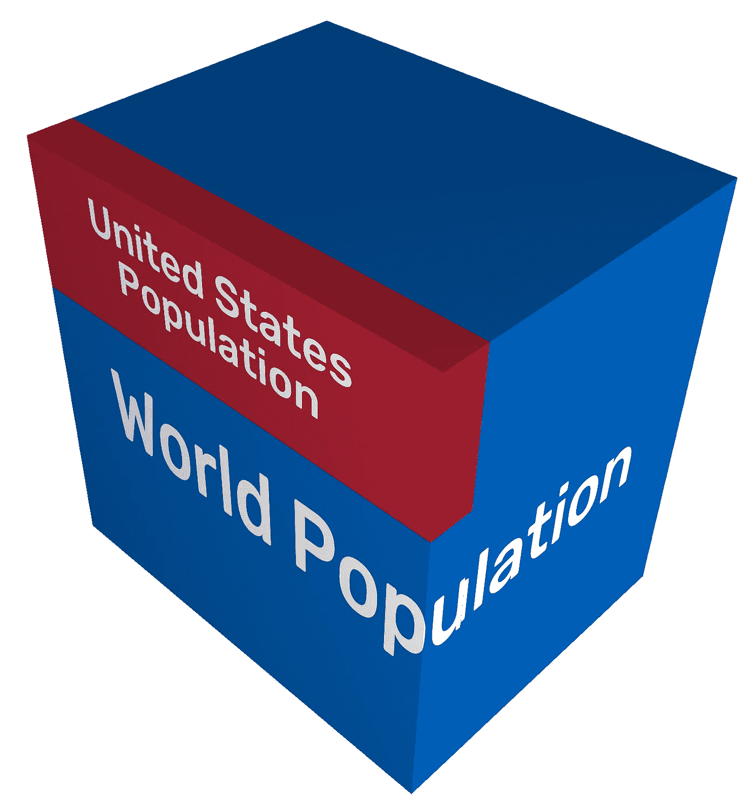
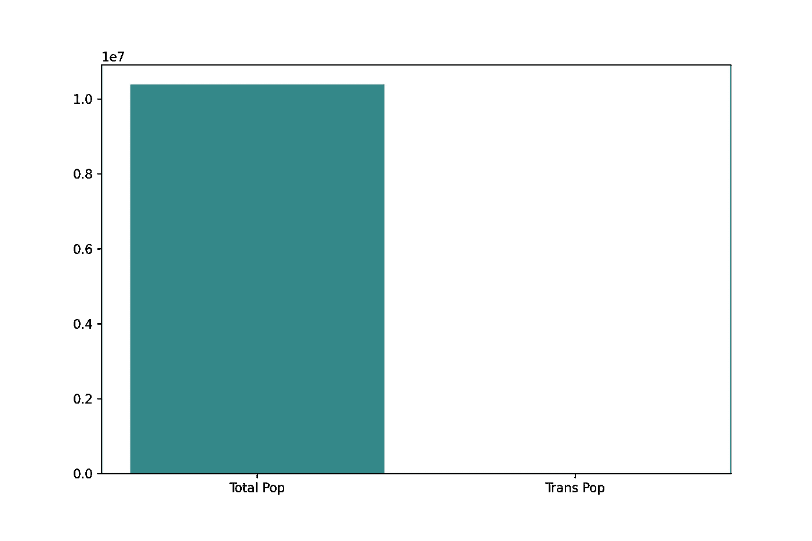

# 比较无与伦比的| 3D 数据可视化

> 原文：<https://towardsdatascience.com/comparing-the-incomparable-3d-data-visualization-69980d64e2d2>

## 一个网络工具，可以显示非常不同的数字

你很少看到数据可视化比较数字从遥远的数量级。当然，这有一个很好的理由:如果一个数字在另一个数字旁边缩小，它可能不会占据足够的空间来具有任何视觉意义。也就是说，我们可以从巩固相距甚远的数字之间的关系中获得很多洞察力。出于这个原因，我已经开始尝试三维数据可视化，以显示相距太远而无法在二维空间中读取的相对数字。

我写这篇文章有两个目标。我想提供一个快速的工具来直观地比较相差几个数量级的数字。我还想鼓励非传统的数据可视化方法，而不仅仅是一个噱头。从不同的角度看数字，我们可以用新的方式理解它们。

这种方法有一些限制。三维的量比 2D 的量更神秘。如果你把一个罐子里的糖果倒出来，铺在桌子上，估计里面的糖果数量就容易多了。通过将信息放入三维空间，我在折叠它，但我也允许更多的信息同时出现在同一个地方。(把你的糖果放在罐子里会更有效率。)此外，尽管在屏幕上花了很多时间，我们还是以三维的方式感知世界。我们对三维空间的日常理解赋予了图像具体的意义。

# 净值

这个项目的灵感来自两年前流行的两个引人注目的数据可视化。他们以两种不同的、意想不到的方式展示了同样的信息。一幅是汉弗莱·杨的《抖音》，画中显示，如果一粒大米代表 10 万美元，那么杰夫·贝索斯的财富就相当于 58 磅。另一个是马特·科罗斯托夫(Matt Korostoff)的[互动可视化，只有长时间滚动，你才能看到贝佐斯的巨大净资产(这是 3D 的一种替代方式，允许你显示非常不同的数量)。这两种想象都向我展示了财富不平等——一个我已经意识到的问题——比我想象的还要严重。这些图片让我将极度财富的规模概念化。](https://mkorostoff.github.io/1-pixel-wealth/)

埃隆·马斯克的净资产，2670 亿美元，2022 年 8 月 16 日；2019 年美国家庭净资产中值为 121，760 美元。来源:彭博新闻，美联储

因为埃隆·马斯克已经取代杰夫·贝索斯成为世界首富，所以我把他的净资产想象成了现实。

# *p 值*

我已经可视化了两个 [p 值](https://online.stat.psu.edu/statprogram/reviews/statistical-concepts/hypothesis-testing/p-value-approach)阈值的统计显著性。创建这个图像帮助我更好地理解这些阈值意味着什么。p 值表示在测试数据集中的变量时，零假设(变量没有统计显著相关性的假设)的概率。足够低的 p 值使您能够宣布关系具有统计显著性，这里我们可以看到深蓝色和浅蓝色两个阈值具有统计显著性。0.05 是典型的标准(深蓝色)，0.005 是更严格的阈值(浅蓝色)。

在这些图像中，较小的数量嵌套在较大的数量中。对于 p 值示例，这种技术并不罕见，因为 p 值是概率的一个分数表达式。以嵌套形式显示相加为整体的部分是很常见的，比如在饼图中。更不寻常的是，p<=0.005 is imaged as a chunk taken out of p<=0.05\. I have chosen to work this way for a couple of reasons. In these visualizations, the smaller numbers are small enough relatively that the “bites” taken from their larger neighbors aren’t all that substantial. In addition, this technique allows the small figures to appear closer and for all information to stack neatly into a single prism.

# Population

As a way of considering where Americans stand in our larger global context, I’ve made this visualization of U.S. population as nested in to the total world population.

2019 Populations: United States Population, 332 million; World Population, 7.84 billion. Source: World Bank

Because my approach is unusual, and I’m comfortable with the library, I’ve used [Babylon . js](https://www.babylonjs.com/)*写出这些可视化效果。这是一个为 3D 艺术制作的 JavaScript 库。虽然它没有像 D3.js 这样的数据专用库那样多的现成数据 viz 功能，但它很灵活，并且是空间数字驱动的。通过一些努力和创造性，巴比伦可以用来显示数据。*

# 数量级|视觉参考

在我的最后一个例子中，我使用了同样的技术来显示连续的数量级(10 的幂)。这个示例包含一些交互性，欢迎您点击查看代码。当您比较相差几个数量级的值时，此示例可用作快速参考。如果您没有时间为一组特定的数字创建可视化效果，您仍然可以通过对照该可视化效果检查每个数字的 10 次方来获得一个大概的参考。

# 自己做

我在这个链接上创建了一个资源[，这样您就可以创建自己的三维数据可视化来比较两个值。如果您正在进行一个数据科学项目，希望比较两个相距甚远的数字，这个资源可能会对您有用。下面，我详细介绍了一个如何使用这个工具的例子。请注意，它在台式机或笔记本电脑的网络浏览器中效果最佳。](https://howshekilledit.github.io/3d-data-viz/)

利用美国人口普查局最近的数据，我[估计](https://github.com/howshekilledit/3d-data-viz/blob/main/trans_pop_by_state.ipynb)在北卡罗莱纳州有 9868 名自我认同的跨性别者。根据人口普查局最近的家庭脉动调查，它是美国邻近地区跨性别人口比例最小的州。如果我使用 Matplotlib 创建一个跨性别人口与该州 1039 万总人口的条形图，跨性别人口会变得非常小。你实际上看不到它。

了解不同的人口统计群体在人口中所占的百分比是很重要的，同时，在图表上隐藏一个小群体可能是有害的。例如，当涉及到政策制定时，即使是小团体也得到了发展壮大所需要的代表和资源，这一点很重要。当一个群体处于系统性劣势时，这一问题尤为紧迫。

正如你在下面看到的，如果我使用 3D 方法，北卡罗来纳州的跨性别人口就变得可见了。要使用这个在线工具，我只需将[导航到链接](https://howshekilledit.github.io/3d-data-viz/)，点击每个数字字段来修改它。然后，我通过点击和输入标签字段来添加标签。作为一个半隐藏的临时演员，我还可以更改标题。可视化完成后，您可以截图。您可以使用自己选择的设计软件进行进一步的编辑。

资料来源:家庭脉搏调查，第 3.5 阶段(2022 年)，美国社区调查，5 年数据(2020 年)

当我第一次开始编写驱动本文的代码时，我尝试了几种不同的设计策略来查看不同的数字。除了 3D 之外，我还尝试创建二维甚至一维的参考，它们会随着时间的推移而动画化。我最终专注于 3D，因为它方便紧凑。(上面唯一需要动画的可视化是数量级参考，这是因为这些数字跨越了十个数量级。)整个过程让我意识到，即使是同样的数量，看起来也会有所不同，这取决于你如何对待它。这种探索让我们对数据有了新的了解。

*除特别注明外，所有图片均为作者所有。*