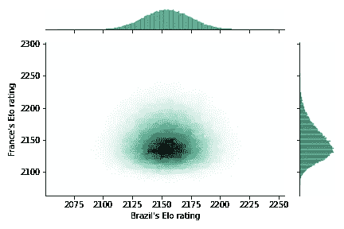
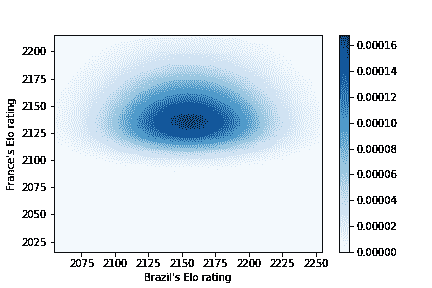
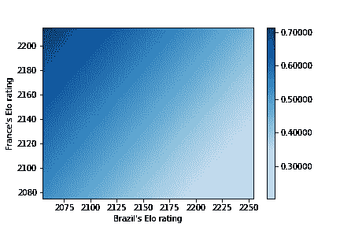
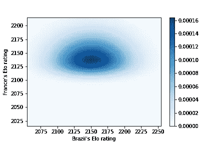
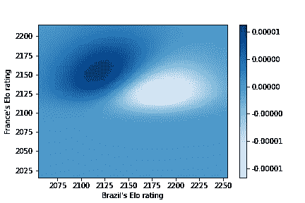

# 比较事物:贝叶斯方法

> 原文：<https://towardsdatascience.com/comparing-things-the-bayesian-approach-b9a26ddb5ef1>

## 如何进行包含不确定性的概率比较

比较东西很难。当比较所依据的信息只是部分的或不确定的时候，情况更是如此。当心那些提供单一数字的人，他们声称，这些数字利用并抓住了所有的不确定性。幸运的是，贝氏帮你搞定了。让我们在回答一个重要问题时，看看如何进行适当的概率比较:哪个国家有最好的国家足球队？

# 评级团队

一种流行的对运动队或个人运动员进行评级的方法是所谓的 ELO 评级系统，由 Arpad Elo 博士开发。它最初是用来给国际象棋选手排名的，但现在已经成功应用于其他领域，包括足球。

ELO 系统给每个队分配一定的分数。积分越多，球队越好。每次两队比赛时，他们根据一个简单的公式交换分数。您可以在 [eloratings 网站](https://www.eloratings.net/about)上找到更多详细信息。简而言之，赢的队得到奖励分，而输的队失去分。被交易的点数取决于对立球队之间的初始分差、比赛结果中的净胜球、比赛的赌注以及哪支球队在主场比赛。

ELO 系统的一个方便的数学属性是，基于两个队的评级，我们可以计算出如果他们现在比赛，他们中的每一个赢另一个的概率。我已经用这个属性在[模拟了 2020 年欧洲杯小组赛](https://medium.com/geekculture/an-elo-based-simulation-of-the-uefa-euro-2020-group-stage-876a6b8a2408)，对哪支球队进一步晋级的预测证明是相当准确的。

在撰写本文时，根据 ELO 排名，前两个国家队是巴西队和法国队，分别获得 2155 分和 2116 分。巴西排名更高，他们战胜法国的概率由下式给出

返回 0.56 或 56%。这是假设他们在中立场地比赛，即任何一方都没有主队优势。

太好了。但是这 56%真的意味着目前巴西是更好的球队吗？我们能有多确定？

# 评级系统的不足之处

像 ELO 这样的评级系统有两个主要问题。首先，他们仅仅基于比赛结果，而忽略了所有其他可用的信息。第二，他们毫无保留地依赖于对团队质量的点估计。让我们看看我说的这些是什么意思。在这最后的足球部分，请耐心听我说——我们现在要讨论的也适用于所有其他类型的比较！

## 忽略数据中没有的内容

虽然过去的比赛是球队未来表现的可靠预测，但它们并不能解释球场外发生的事情。

根据 transfermarkt.com 的说法，两名法国球员(保罗·博格巴和恩戈洛·坎特)在撰写本文时受伤。这两名球员对球队至关重要，他们每人至少 5000 万€的市值反映了这一点。他们可能为球队过去的良好表现做出了贡献，但无法在即将到来的比赛中有所帮助。在巴西方面，预计没有主要球员会错过下一场比赛。

这一观察有两个结果:首先，我们不太确定法国的 ELO 评分，因为它是在受伤发生之前就已经确定的。第二，由于这两名球员的缺席，我们可以预计法国队的获胜机会将会减少。

## 依靠点估计

我们之前说过，ELO 系统依赖于对团队质量的点估计。这意味着一个团队的技术和形式的所有复杂性被简化为一个单一的数字，ELO 分数。如果一个队由于运气赢得了最后一场比赛，他们的得分将与他们输了的情况不同，即使他们的实际技能在两种情况下是相同的。

## 比较事物需要什么

因此，我们得出了在进行比较时需要考虑的三个关键因素，无论是在足球还是其他领域。

*   首先，我们需要能够表达我们用于比较的测量的不确定性(在这些伤害之后，ELO 评分仍然准确吗？).
*   其次，我们需要能够根据我们的外部知识随意改变衡量标准(看起来法国队在两名重要球员缺阵的情况下获胜的机会更小)。
*   第三，我们需要一种比单个数字更好的方法来获取我们用来进行比较的指标(单个数字的指标会受到随机性的影响)。

> 为了进行适当的比较，我们需要一个能够捕捉不确定性的指标，我们可以根据外部知识进行转换，并且这不是一个单一的数字。

我们如何进行满足这三个要求的比较？进入贝叶斯！

# 走向贝叶斯

在[贝叶斯统计](/the-gentlest-of-introductions-to-bayesian-data-analysis-74df448da25)中，我们分析的所有变量都是用概率分布来描述的，而不是单一的数字。在我们的案例中，2116 这个数字无论如何也无法描述法国国家队的所有技术、状态和动力。但是我们可以指定一个围绕这个数字的分布，它会做得更好。

不过，让我们从巴西开始吧。对于这支队伍，我们对他们的评级没有太大的异议，也许除了这样一个事实，那就是围绕它肯定有一些不确定性。让我们假设他们的评级可以用正态分布来描述，均值等于 2155，巴西的 ELO 评级，标准偏差为 20，以反映他们的真实技能实际上可能更低或更高。

现在回到法国。我们需要他们的 ELO 得分分布在两个方面与巴西不同:

*   首先，它应该更宽泛，以反映法国评级的不确定性。
*   第二，它应该稍微倾斜，以反映在缺乏关键参与者的情况下，他们实际上更有可能比 2116 更低而不是更高的评级。

为了实现这两个效果，让我们用一个偏态正态分布来描述法国分数，其均值为 2116，标准差为 40，偏态参数设置为 3。

我们可以从两个团队的评级分布中抽取许多值，并绘制它们的密度图，以查看它们之间的比较情况。

各队之前的排名分布。图片由作者提供。

看起来我们达到了我们想要的。我们刚刚定义的两个分布在贝叶斯术语中被称为*先验分布*，因为我们是在观察两个队相互比赛之前提出它们的。

让我们来画出两队排名的*联合分布*。这显示了每对可能得分的概率。我们可以看到，非零概率的斑点向下倾斜到法国的较低评级，并且纵向拉伸程度大于横向拉伸程度(请注意轴的比例略有不同)。

各队的联合排名分布。图片由作者提供。

我们现在可以使用我们的先验分布来推导巴西赢得比赛的概率。这归结为简单地检查巴西的排名高于法国的频率:`(b_sample > f_sample).mean()`返回 0.63，即 63%。这高于我们之前的 56%,反映了我们对法国分数的主观不确定性。

> 贝叶斯方法允许我们将关于世界的外部知识注入到统计分析中，以使其更加准确。

请注意我们是如何将我们关于世界的外部知识注入到统计分析中，以使其更加准确。但是贝叶斯方法最好的事情还在后面:我们如何基于数据进化我们先前的信念！

# 让你的信念进化

我们现在站在这样的立场上，巴西现在更有可能成为一支更好的球队，如果他们现在互相比赛，有 63%的机会赢下 Frace。想象一下，他们做到了，法国赢了。这是否意味着我们错了？法国队真的是一支更好的球队吗？还是这一个游戏没有足够强的证据来这么宣称？贝叶斯框架给出了所有的答案！

然而，为了得到它们，我们需要对概率分布进行一些计算。我们之前所做的先验抽样对于估计获胜几率已经足够好了，但是现在我们需要一个更严格的方法。让我们从重新计算我们的前科开始。

我们将使用 *empiricaldist* 包来做这件事。这是一个建立在*熊猫*基础上的很好的小工具，可以很容易地定义和计算概率分布。首先，我们需要提供分布的分位数，也就是可能的评级值。平均正负 100 应该够好了。然后，对于每个评级值，我们根据我们选择的先验分布计算确切的概率:巴西为正态分布，法国为偏态分布。最后，我们对结果进行归一化，以确保概率总和为 1，就像它们在分布中一样。

基于这些，我们可以重新绘制之前的联合概率图。这一次，我们将把它建立在概率网格的基础上。这是一个数据框，其中列表示巴西可能的评级值，行索引表示法国的评级，单元格保存相应评级对的概率。

各队的联合排名分布。图片由作者提供。

你可以自己验证一下，结果的剧情和之前的是一样的。但是这种呈现数据的方式让我们可以进行有趣的计算。

再一次，想象法国赢了巴西。对于每一对可能的分数，出现这种结果的可能性有多大？这个答案叫做*可能性。*这是观察结果的概率，在这种情况下，法国队获胜，这是两队排名分数的所有可能组合。让我们计算并绘制它！

请注意我们在将 *X* 和 *Y* 传递给 *get_p_win* 函数时是如何交换它们的。这是因为法国队是赢家，其得分存储在 Y 变量中，上述函数计算得分作为第一个参数传递的球队赢第二个参数的概率。这是结果图。

法国赢巴西的可能性。图片由作者提供。

不出所料，当法国的评级高而巴西的评级低时(左上角)，法国获胜的可能性最大。但是这种结合的可能性相当小——见上文。那么，我们如何将我们之前对每支球队评级的信念与法国的意外胜利结合起来呢？

我们简单地将先验与可能性相乘，并再次归一化，以得到*后验分布，*它反映了我们在观看比赛后对收视率的看法。

各队的联合后验排名分布。图片由作者提供。

这种分配应该更有利于法国。由于通过查看两个独立的图并不能清楚地看到这一点，所以让我们想象一下先验和后验之间的区别。

后关节和前关节的区别。图片由作者提供。

白色区域是先验概率高于后验概率的地方，深蓝色区域是后验概率较高的地方。现在很明显，我们对巴西评级的信心下降了，而对法国的信心上升了。但这是否意味着我们不再认为巴西是一支更好的球队？让我们再次通过计算巴西队获胜的概率来找出答案，他们是否应该再次比赛。

这将返回 0.53，即 53%。法国队赢得我们想象中的比赛是一个不太可能的结果，但这并不足以让我们相信他们是更好的球队。总的来说，我们仍然认为袖手旁观巴西是目前的顶级足球国家队，尽管他们的优势并不大！

感谢阅读！如果你对如何更严格地将贝叶斯思维应用于统计数据分析感兴趣，请查看我关于主题的介绍性文章[。要了解贝叶斯思维如何帮助我们更好地理解日常生活问题，请查看](/the-gentlest-of-introductions-to-bayesian-data-analysis-74df448da25)[这篇文章](/on-the-importance-of-bayesian-thinking-in-everyday-life-a74475fcceeb)。

另外，可以随意看看我在 DataCamp 上教的 Python 课程中的 [**贝叶斯数据分析。它从最基本的概率开始，通过贝叶斯 A/B 测试和决策分析逐步发展到更高级的主题，如用马尔可夫链蒙特卡罗模拟方法拟合和评估贝叶斯回归模型。**](https://www.datacamp.com/courses/bayesian-data-analysis-in-python)

如果你喜欢这篇文章，为什么不订阅电子邮件更新我的新文章呢？并且通过 [**成为媒介会员**](https://michaloleszak.medium.com/membership) ，可以支持我的写作，获得其他作者和我自己的所有故事的无限访问权限。

需要咨询？你可以问我任何事情，也可以在这里为我预约 1:1<http://hiretheauthor.com/michal>**。**

**你也可以试试我的另一篇文章。不能选择？从这些中选择一个:**

**</on-the-importance-of-bayesian-thinking-in-everyday-life-a74475fcceeb>  </the-gentlest-of-introductions-to-bayesian-data-analysis-74df448da25> [## 贝叶斯数据分析最温和的介绍

towardsdatascience.com](/the-gentlest-of-introductions-to-bayesian-data-analysis-74df448da25) </bayesian-tricks-for-everyday-use-2b51da45f3ec> **