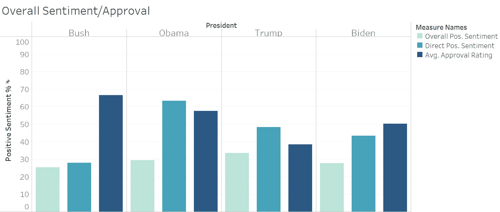
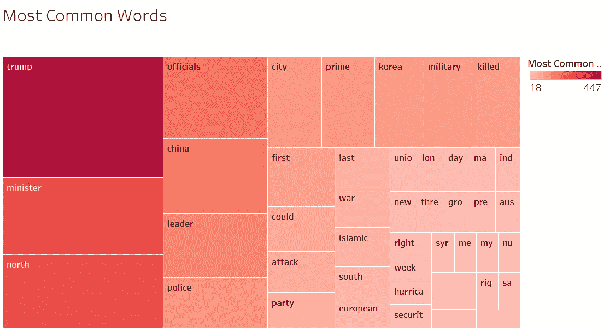
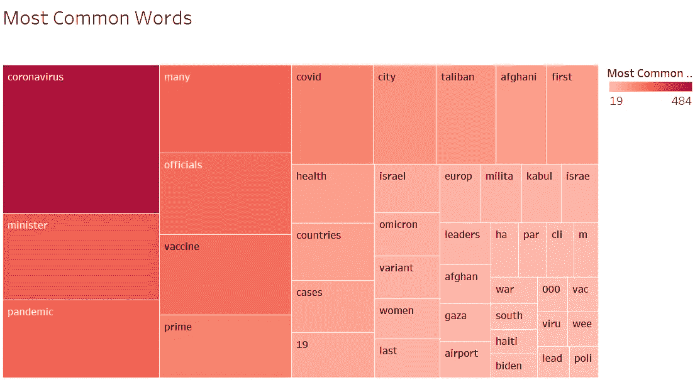
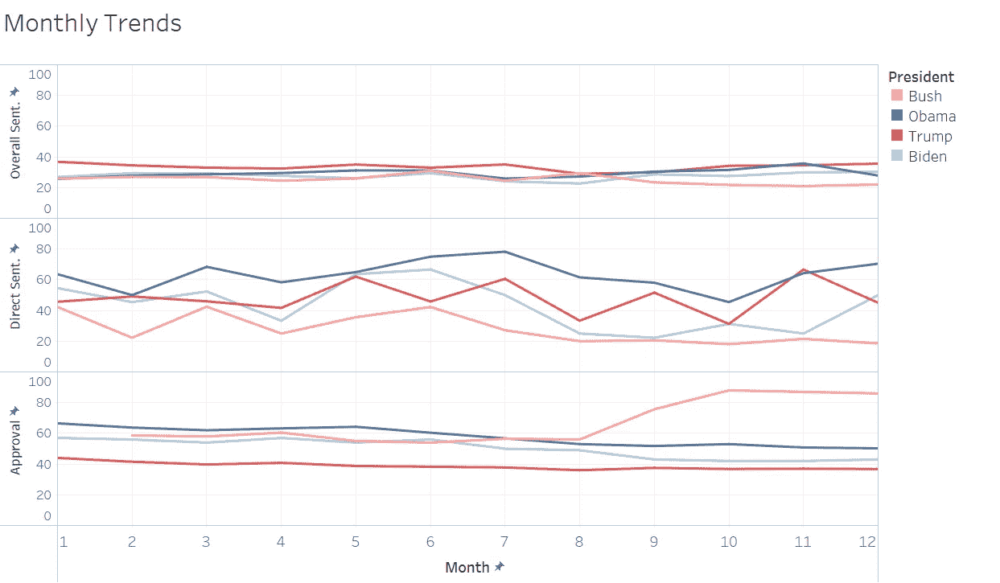
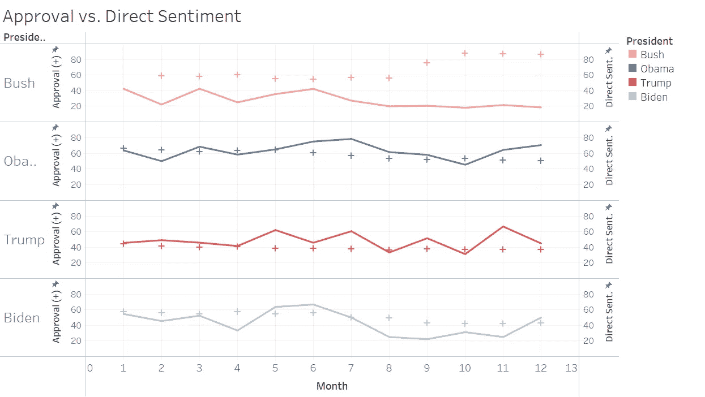
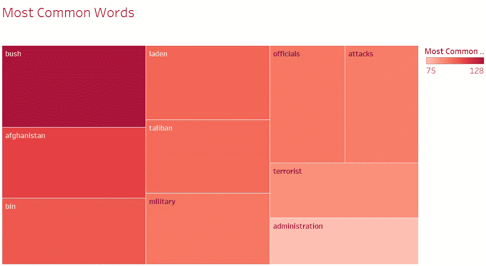

# 比较美国总统的第一年

> 原文：<https://towardsdatascience.com/comparing-u-s-presidents-first-years-eefecb30a3d5>

## 可视化新闻情绪，最常见的词，布什，奥巴马，特朗普和拜登的支持率

作者创建的 Tableau 仪表板

在这个项目的第一部分 [**中，我用 tensorflow 创建了一个情感分析的模型。我用这个模型对过去四位美国总统执政第一年的新闻文章摘要进行了情感分析。文章摘要通过《纽约时报》的 API 获得。**在第二部分，我用 Tableau 形象化了这个分析的结果。我还列出了每位总统每个月最常用的十个单词。最后，我将盖洛普****](/nyt-sentiment-analysis-with-tensorflow-7156d77e385e)**<https://news.gallup.com/home.aspx>*****的总统支持率包括在内，看看新闻情绪如何与公众支持率相关(或背离)。******

**最终的结果就是这个[**Tableau Dashboard**](https://public.tableau.com/app/profile/anne.bode/viz/NYTSentimentTableau/PresidentialSentimentandApproval#1)。**

***你可以看看这个* [***jupyter 笔记本***](https://jovian.ai/abode118/most-common-words) *来看看我到底是如何使用 python 库 nltk 来提取每个总统/月份组合的十个最常见的单词，忽略像‘the’、‘and’、‘he’等停用词的。注意，首先需要加载****president _ df _ final . JSON****，这是本项目*[***part 1***](/nyt-sentiment-analysis-with-tensorflow-7156d77e385e)**的输出文件之一。****

# ***总体情绪/认可***

******

***总统对新闻的正面评价(总体提及和直接提及)和支持率(作者图片)***

***在上图中，有几件事很突出。首先，所有的消息都是坏消息。对所有总统来说，平均整体新闻情绪只有 25-35%是正面的。说到半空的杯子！第二个观察，包含奥巴马名字(直接提及)的新闻摘要非常正面——大约 65%！最后的观察——布什的平均支持率非常高。稍后将变得清楚的是，这主要是由于 911 袭击后他的支持率大幅上升。***

# ***最常见的单词***

## ***所有总统***

******

***历届总统第一年最常使用的词汇(图片由作者提供)***

***在所有总统的第一年，有些词很突出。阿富汗，塔利班，军事，战争，中国，冠状病毒，本拉登等。都出现在大量的摘要中。布什是第四个被提及最多的词，这意味着他的名字在第一年被直接提及了很多次。当我们按总统筛选时，这个图表变得更加有趣。比如，我们来比较一下特朗普和拜登的第一年。***

## ***法宝***

******

***特朗普第一年最常用的词(图片由作者提供)***

***当过滤特朗普时，我们看到特朗普第一年的最大新闻显然是特朗普。然而，当我们过滤拜登的时候，他的名字几乎没有出现在我们的视野中(右下方)。他的第一年完全被新冠肺炎占据了。***

## ***拜登（姓氏）***

******

***拜登第一年最常用的词(图片由作者提供)***

# ***每月趋势***

******

***按总裁划分的月度趋势(图片由作者提供)***

***在上图中，我们可以看到每位总统的以下月度趋势:总体新闻情绪、直接提及新闻情绪和支持率。我们再次看到，所有总统的总体新闻情绪都是负面的。全年直接提及对奥巴马非常有利。考虑到 NYT 的左倾，特朗普的支持率也高得惊人。最后，我们可以看到布什的支持率从 9 月份开始飙升，这解释了我们之前看到的非常高的平均支持率。***

***从 9 月到 12 月对布什的直接新闻情绪与支持率之间的差异来看，直接提到总统可能是非常负面的，因为世界上发生的事件，而不一定是因为新闻机构的政治倾向。《纽约时报》在 9/11 之后的日子里可能不会说布什总统的坏话，但新闻内容是极其负面的，而且他的名字碰巧被涉及到。相反也可能是真的，这可以解释为什么直接提到特朗普是非常积极的。这并不是说 NYT 在为他唱赞歌，但也许 2017 年的世界只是处于相当不错的状态。鉴于 2001 年发生了 9/11，2009 年发生了大衰退，2021 年发生了全球性的疫情，也许 2017 年还不算太糟糕。***

# ***支持率与直接新闻情绪***

******

***每位总统的支持率(+)与直接新闻情绪(直线)(图片由作者提供)***

***以上，我们对每位总统的月度支持率和直接新闻情绪进行了直接对比。这里有几件事很突出。首先，有时坏消息有利于总统批准。9/11 袭击后的布什显然就是这种情况，当时整个国家团结起来，爱国主义高涨。尽管新闻非常明显是负面的(包含布什名字的新闻摘要从 9 月到 12 月只有大约 20%是正面的)，他的支持率还是直线上升。如果我们过滤布什和 9 月，我们会看到下面的前 10 个词，都与袭击有关。***

## ***布什，九月***

******

***布什上任第一年 9 月最常使用的词汇(图片由作者提供)***

***有点讽刺的是，我们可以看到完全相反的情况发生在拜登第一年的 8 月。虽然最常见的词非常相似，但它们对他的支持率产生了相反的影响。9/11 事件 20 年后，美国狼狈地从阿富汗撤军，导致了负面的直接新闻情绪(8 月和 9 月约有 20%的正面消息)，但拜登受到了指责。他的支持率从 8 月份的 49 下降到 9 月份的 43，并在今年剩下的时间里保持稳定。在这种情况下，坏消息情绪对总统批准来说是坏消息。***

## ***拜登，奥古斯特***

******

***拜登上任第一年八月最常用的词(图片由作者提供)***

# ***结论***

***对于从事项目工作的人来说，项目中最令人满意的部分通常是让代码正确运行，构建一个按预期工作的模型，等等。然而，如果没有结果可以显示，代码正常运行或模型按预期工作就没有意义。这就是为什么我推动自己构建项目的第一部分，并在 Tableau 中可视化结果(使用一些额外的、易于获取的数据)。***

***探索仪表板格式的数据真的很有趣。它允许我进一步深入数据中的低谷和高峰。最常见的词汇让我更好地理解了在特定时间哪些话题在推动国家叙事。将数据可视化可以让某些趋势变得清晰，这是熊猫的数据框架所做不到的。***

***总之，如果我没有将结果可视化，我的项目就不会完成。我很高兴我强迫自己写下并发表了这篇文章！我希望你很高兴你读了它:)***

## ****参考文献***

***盖洛普公司《总统支持率——乔·拜登》*Gallup.com*，2021 年 2 月 5 日，[news . Gallup . com/poll/329384/president-approval-ratings-Joe-Biden . aspx](http://news.gallup.com/poll/329384/presidential-approval-ratings-joe-biden.aspx)。***

***盖洛普公司《总统支持率——唐纳德·特朗普》【Gallup.com】2016 年 11 月 16 日，[news . Gallup . com/poll/203198/president-approval-ratings-Donald-trump . aspx](http://news.gallup.com/poll/203198/presidential-approval-ratings-donald-trump.aspx)。***

***盖洛普公司《总统支持率——巴拉克·奥巴马》*Gallup.com*，2016 年 4 月 21 日[news . Gallup . com/poll/116479/Barack-Obama-presidential-job-approval . aspx](http://news.gallup.com/poll/116479/barack-obama-presidential-job-approval.aspx)。***

***盖洛普公司《总统支持率——乔治·w·布什》*Gallup.com*，2013 年 6 月 11 日，[news . Gallup . com/poll/116500/president-approval-ratings-George-bush . aspx](http://news.gallup.com/poll/116500/presidential-approval-ratings-george-bush.aspx)。***