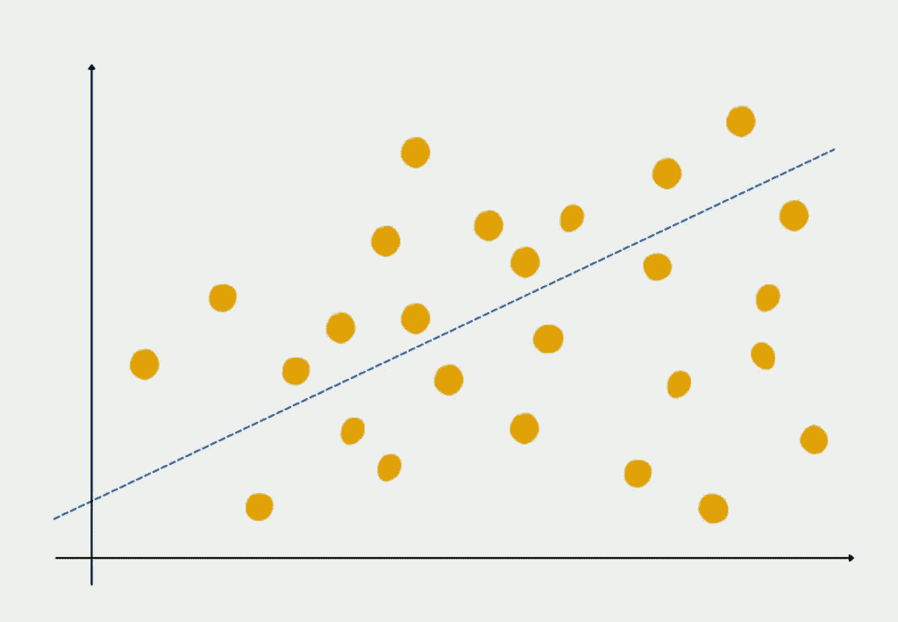

# 主成分分析综合指南

> 原文：<https://towardsdatascience.com/comprehensive-guide-to-principal-component-analysis-bb4458fff9e2>

## 主成分分析的理论解释

当您想要减少大型[数据](https://databasecamp.de/en/data)集中的变量数量时，可以使用主成分分析(简称:PCA)。PCA 试图只留下那些在[数据](https://databasecamp.de/en/data)集中仍然解释大部分方差的变量。因此，[与其他特征强烈相关的所有特征都被移除。](https://databasecamp.de/en/statistics/correlation-and-causation)

# 我们什么时候用主成分分析？

当[数据集](https://databasecamp.de/en/data)具有相互[相关](https://databasecamp.de/en/statistics/correlation-and-causation)的变量，即相互依赖时，各种算法，如[线性回归](https://databasecamp.de/en/ml/linear-regression-basics)，会出现问题。对于这样的模型，重要的是我们在不减少[数据](https://databasecamp.de/en/data)的信息内容的情况下减少维度。

PCA 的另一个应用是在聚类分析中，比如 k-means 聚类，我们需要预先定义聚类的个数。减少[数据集](https://databasecamp.de/en/data)的维度有助于我们获得信息的第一印象，并能够估计，例如，哪些是最重要的变量，以及[数据集](https://databasecamp.de/en/data)可能有多少个聚类。

# PCA 是如何工作的？

主成分分析的核心思想是，一个数据集中可能有几个变量测量同一事物，即相关的。因此，不同的维度可以组合成更少的所谓主成分，而不会损害数据集的有效性。例如，体型与鞋码有很高的相关性，因为在许多情况下，高个子也有较大的鞋码，反之亦然。因此，如果我们把鞋码作为一个变量从数据集中去掉，信息量并没有真正减少。

在[统计](https://databasecamp.de/en/statistics)中，一个数据集的信息量是由方差决定的。这表示数据点离中心有多远。方差越小，数据点越接近平均值，反之亦然。因此，较小的方差表明平均值已经是数据集的良好估计值。

在第一步中，PCA 试图找到最大化数据集的解释方差的变量。然后，逐步添加更多的变量来解释方差的剩余部分，因为方差，即与均值的偏差，包含了最多的信息。如果我们想基于它训练一个模型，就应该保留它。

第一步，主成分分析试图找到一条尽可能使它和数据点之间的距离最小的直线。该程序与[线性回归](https://databasecamp.de/en/ml/linear-regression-basics)中的程序相同。因此，该线是数据集所有单个特征的总和，并形成第一主成分。

第一主成分|图片:作者

然后尝试创建与第一主分量正交(即垂直)的第二条线，并再次最小化到数据点的距离。这些线必须彼此正交，因为主成分不应该彼此相关，并且因为垂直线也很可能解释不包含在第一成分中的方差。

# 目标是多少个主成分？

基本上，在主成分的数量和剩余的信息内容之间有一个[相关性](https://databasecamp.de/en/statistics/correlation-and-causation)。这意味着，随着更多的组成部分，你也解释了更多的差异，从而有更多的信息包含在数据集中。而极少的成分，则意味着维度大大降低了，这就是主成分分析的目的。

然而，根据 Kaiser (1960 ),有一个很好的参考点，根据这个参考点可以选择组件。应该只选择方差大于 1 的主成分。因为只有这些成分比数据集中的单个变量能解释更多的变化，这可能并确实导致维数减少。

# 如何解释主成分？

主成分本身很难解释，因为它们是各维度的线性组合。因此，它们代表了几个变量的加权混合。但是，在实际应用中，这些变量的组合也可以具体解释。

例如，考虑一个包含各种个人信息的数据集，比如年龄、体重、身高、信用度、收入、储蓄和债务。例如，在这个数据集中，可能出现两个主要成分。第一个主成分大概由信用度、收入、储蓄和债务等维度组成，这些变量的系数很高。例如，这个主成分可以被解释为这个人的财务稳定性。

# 主成分分析我们需要什么要求？

与类似的统计分析相比，为了获得有意义的结果，主成分分析只有几个必须满足的要求。[数据集](https://databasecamp.de/en/data)应具备的基本属性有:

*   特征之间的[相关性](https://databasecamp.de/en/statistics/correlation-and-causation)应该是线性的。
*   [数据集](https://databasecamp.de/en/data)应该没有异常值，即严重偏离质量的单个[数据](https://databasecamp.de/en/data)点。
*   如果可能，变量应该是连续的。
*   [样本](https://databasecamp.de/en/statistics/population-and-sample)越大，PCA 的结果越好。

并非所有的[数据集](https://databasecamp.de/en/data)都可以直接用于主成分分析。必须确保[数据](https://databasecamp.de/en/data)近似为[正态分布](https://databasecamp.de/en/statistics/normal-distribution)和区间比例，即两个数值之间的区间始终具有相同的间距。例如，日期是按时间间隔计算的，因为从 1980 年 1 月 1 日到 1981 年 1 月 1 日的时间间隔与从 2020 年 1 月 1 日到 2021 年 1 月 1 日的时间间隔相同(闰年除外)。最重要的是，区间缩放必须由用户自己判断，并且不能通过标准化的统计测试来检测。

# Python 中的主成分分析

有许多程序可以自动计算主成分分析，并且可以将结果与不同数量的成分进行比较。在 [Python](https://databasecamp.de/en/python-coding) 中，这在模块“Scikit-Learn”的帮助下工作，在这里我们还将仔细查看其[示例](https://scikit-learn.org/stable/auto_examples/decomposition/plot_pca_iris.html#sphx-glr-auto-examples-decomposition-plot-pca-iris-py)。

在该应用中，使用了所谓的[虹膜数据集](https://archive.ics.uci.edu/ml/datasets/iris)。这是机器学习领域中一个流行的训练数据集。这是来自生物学的数据，更精确的信息来自所谓的鸢尾属植物。对于每一朵花，花瓣的长度和宽度以及所谓的萼片都是可用的。我们将有关植物的信息存储在变量 X 中，将相应花朵的名称存储在变量 y 中。

在我们的例子中，我们试图将这四个维度减少到三个主要部分，以便能够在三维图中可视化它们。数据的实际转换发生在三行代码中。首先，我们需要设置一个 PCA 对象，其中包含所需数量的组件。然后，我们可以将其应用于我们的数据集，并最终将四维值转换为三维值:

在 Matplotlib 的帮助下，我们的结果可以在三维图中可视化，并且可以看到，即使在三维空间中，同一花卉物种的植物仍然彼此接近。因此，数据集的真实信息内容没有丢失。

主成分分析和虹膜数据集|图片:作者

# 这是你应该带走的东西

*   主成分分析用于大型数据集中的降维。
*   它有助于基于它的机器学习模型的数据预处理，如聚类分析或线性回归。
*   数据集中必须满足某些先决条件，PCA 才有可能实现。例如，特征之间的相关性应该是线性的。

# 关于主成分分析主题的其他文章

*   你可以在我们的同事 Studyflix 找到关于主成分分析的详细解释，包括一个说明性的视频。
*   对驱动因素分析的已知、当前和新的要求。载于:凯勒等人(编辑。):Marktforschung der Zukunft——门还是机器？，威斯巴登，2016 年，第 231–243 页。
*   电子计算机在因素分析中的应用。载于:教育和心理测量，1960 年第 1 期，第 141-151 页。

*如果你喜欢我的作品，请在这里订阅***或者查看我的网站* [*数据大本营*](http://www.databasecamp.de/en/homepage) *！还有，medium 允许你每月免费阅读* ***3 篇*** *。如果你希望有****无限制的*** *访问我的文章和数以千计的精彩文章，不要犹豫，点击我的推荐链接:*[【https://medium.com/@niklas_lang/membership】](https://medium.com/@niklas_lang/membership)每月花$***5****获得会员资格**

* [## 学习编码:13 个免费网站帮助你开始

### 一旦你决定要学习编码，你会被众多的在线工具宠坏，这些工具可以帮助你…

towardsdatascience.com](/learn-coding-13-free-sites-to-help-you-do-it-9b2c1b92e573)  [## 随机森林算法简介

### 算法是如何工作的，我们可以用它来做什么

towardsdatascience.com](/introduction-to-random-forest-algorithm-fed4b8c8e848)  [## 借助《哈利·波特》理解 MapReduce

### MapReduce 是一种允许并行处理大型数据集的算法，例如，在多台计算机上…

towardsdatascience.com](/understanding-mapreduce-with-the-help-of-harry-potter-5b0ae89cc88)*