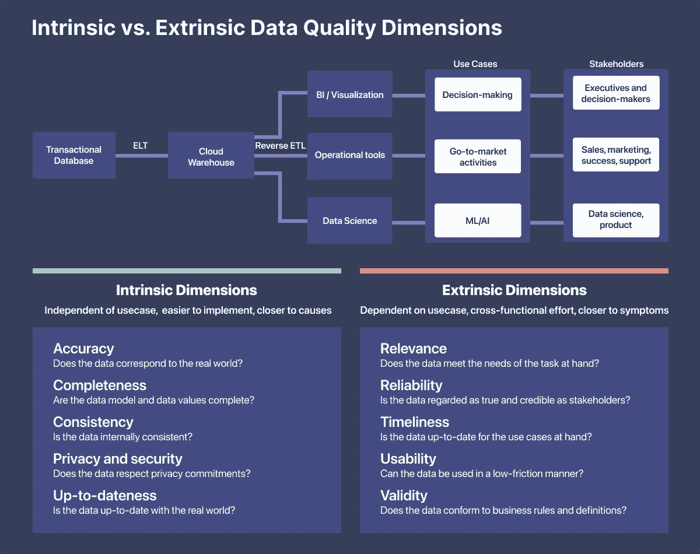

# 确保数据质量的概念和实践

> 原文：<https://towardsdatascience.com/concepts-and-practices-to-ensure-data-quality-f3f0a95acbbf>

## 有许多潜在的数据质量问题，也有许多改进的方法。这篇文章描述了保持数据信任的两条准则、三个概念和四个最佳实践。

解决数据质量似乎就像推一块巨石上山。但是我们可以建造高度计、氧气罐和耐力来帮助我们前进。图片由作者提供。

# TL；博士:

1.  存储和使用数据是不够的。数据驱动型企业需要相信他们的数据是健康可靠的。
2.  将数据质量问题分组到维度中，通过指标衡量最高优先级的维度，并围绕最重要的指标建立 SLA，使您专注于影响最大的数据质量问题。
3.  指标只是数字，除非它们是可操作的。涉众需要知道度量标准与他们有什么关系。
4.  良好的数据实践可以降低数据质量问题的发生频率，并防止已经发生的问题演变成更大的问题。
5.  主动保护和提高数据质量可以保护您团队的时间，扩大您的影响力，并增加信任度。

—

糟糕的数据质量会分散团队的时间，增加数据基础设施的复杂性，并削弱对数据的信任。但这并不止于此。在组织层面上，[数据质量问题](https://www.metaplane.dev/blog/how-low-quality-data-hurts-business-performance)会[导致企业损失数百万](https://www.gartner.com/smarterwithgartner/how-to-improve-your-data-quality)收入，降低运营效率，并导致糟糕的业务决策。

不幸的是，修复数据质量不是一蹴而就的事情。这也不仅仅是承认数据质量问题的存在。打个比方，数据质量并不完全不同于个人的生物健康。

虽然着手“变得健康”(拥有高质量的数据)是一个令人钦佩的目标，但如果不清楚你希望改变哪些品质(维度)，就很难设定和达到任何有意义的基准([指标](https://www.metaplane.dev/blog/data-quality-metrics-for-data-warehouses))。

一旦你达到了对你来说更健康的样子，你需要继续监测这些品质，无论是你人体的血压还是你最重要的餐桌的新鲜度延迟次数，然后将你的数字与正在进行的目标进行比较，以保持这条道路。没有度量标准，就很难让自己负责任。

因此，保持数据健康的第一步是确定最重要的方面，比如最大限度地提高数据的可用性。第二步是跟踪这些维度的指标，例如数据利益相关者标记的问题数量。第三步是根据这些指标建立 SLA，比如 24 小时响应时间。

数据质量问题类别(维度)与如何衡量这些类别(指标)的示例。图片由作者提供。

# 关于数据质量推理的三个概念

在我们开始之前，我们应该澄清数据质量维度、数据质量指标和服务水平协议之间的区别，特别是因为这些术语在数据生态系统的其他地方也有使用。

*   **数据质量维度**是数据质量问题的主题类别。问题根据其重要性进行分组，如及时性、完整性或准确性。
*   **数据质量度量**描述了具体的、量化的维度度量。例如，及时性维度可以通过捕获表刷新延迟的小时数的度量来实现。
*   [**服务水平协议**](https://davidsj.substack.com/p/five-nines-three-nines-no-nines?utm_source=%2Fprofile%2F64081583-david-jayatillake&utm_medium=reader2) 是与业务目标相关的战略指标，数据团队对此负责。因此，如果度量是表刷新延迟的小时数，那么 SLA 可以测量过去一个季度中超过 12 小时的延迟数。

根据数据质量维度是独立于用例还是依赖于数据的使用方式，您可以进一步将其分为两类:

*   **固有尺寸**，与用例无关。*例子:准确性、完整性、一致性、安全性和及时性。*
*   **外在维度**，依赖于每个涉众及其用例的知识。示例:*相关性、可靠性、有用性、有效性和可用性。*

如果你想深入研究数据质量维度和指标，请查看[这篇之前的博文](https://www.metaplane.dev/blog/data-quality-metrics-for-data-warehouses)。有了这些概念，我们可以进入两个指导方针。

数据质量维度和度量可以独立于用例(内在的)或者依赖于用例(外在的)。两者的作用取决于手头的目标。图片由作者提供。

# 有意义的数据度量的两个准则

雇用数据从业者并保护他们的时间专注于增值工作已经够难了。从一个问题跳到另一个问题，在特定的基础上实施不同的度量标准，占用了本已宝贵的时间。

**数据团队和领导者应注意确保他们专注于与业务利益相关者关心的业务成果相关联的清晰指标，并为数据制作者阐明清晰的行动路线。**

## 衡量什么是重要的

在您实现数据度量之前，您应该停下来确定您在度量什么以及为什么度量。最有可能的是，这将涉及到[与使用你的团队准备的数据](https://locallyoptimistic.com/post/the-data-business-partnership/)的商业利益相关者交谈。或者，您可以使用[元数据](https://www.metaplane.dev/blog/how-to-maximize-the-value-of-your-metadata)，如[血统和查询日志](https://www.metaplane.dev/blog/the-four-pillars-of-data-observability)来量化哪些数据使用最频繁。

虽然您可以努力为公司中的每一个数据用例建立指标，但在不久的将来，您可能会想回家、吃饭，并与朋友和家人一起出去玩。

**一个更可行的开始是关注当今贵公司最重要和最有影响力的数据用例，而不是试图煮沸海洋。**

确定[数据如何推动业务目标](https://locallyoptimistic.com/post/surveys/)，服务于这些目标的数据资产，以及影响这些资产的质量问题。这意味着为您的用例确定最常见的数据质量问题类型(维度)(例如，相关性、及时性等)。).这些常见的棘手问题指出了您应该优先考虑并围绕其构建数据指标的维度。

这一过程使您能够更容易地识别和处理与业务成果最一致的指标。您可以首先解决最重要的问题，并且通过这些指标量化数据团队正在进行的工作以取得高水平的成果会更容易。

度量标准可以简单也可以复杂，但最重要的是度量标准衡量对您的业务至关重要的数据质量的各个方面。图片由作者提供。

一旦您确定了要衡量的数据质量维度，您就可以将这些维度与特定的指标联系起来，从而帮助您解决数据难题。以下是一些例子:

1.  假设你在一家销售可堆肥水瓶的电子商务公司工作。但是您的数据仓库正遭受着不可靠数据(外在维度)的问题，因为瓶盖供应商的输入数据不一致。没有记录最新产品系列的库存和销售的表格，而您的旗舰产品系列的表格中有季节性定价应该出现的空白字段。为了度量这个维度，您可以建立度量来跟踪针对完整映射的验证程度、空数据值的数量、满足的约束的数量或者针对输入机制的验证程度。
2.  或者，你可能在一家 B2B SaaS 公司工作，该公司将水族馆出租给办公室。重要的数据用例可能包括面向顶级公司的销售预测，面向高管和办公室经理的营销活动的受众定位。确保 lead 表中 ID 主键的一致性(内在维度)是一个很好的监控指标。
3.  最后，如果你在一家出售成本价特效药的网上药店。您可能担心隐私和安全性(内在维度)，因为您处理敏感的 PII/PHI，在这种情况下，包含潜在敏感信息的行数可能是一个相关的度量。

*注意:您的指标会随着时间而变化。随着潜在质量问题的解决，一些高优先级的度量标准可能会变得优先级较低。随着企业成功定义的改变，您需要监控的数据也会随之改变。*

## 使指标具有可操作性

请记住[数据团队既不是公司数据的创造者，也不是消费者](https://www.metaplane.dev/blog/data-quality-begins-and-ends-outside-of-the-analytics-team)。我们是乘务员。虽然我们可能认为我们知道要优先考虑的正确维度和要跟踪的正确指标，但我们需要来自我们团队成员的输入，以确保我们不会在不及时的外在维度或与用例无关的内在维度上浪费时间。

例如，假设我们已经实现了跟踪销售数据一致性的指标，而销售团队的许多问题都与数据一致性无关。作为响应，我们可以开发一个包含唯一值和引用完整性的仪表板。但是，如果仪表板数据与数据团队面临的完整性问题没有联系，团队就不会理解这些数字，也不会理解为什么它们对每个团队的计划很重要。

我们提供的数据质量指标应该易于人们消化、理解并应用到他们的工作中。毕竟，如果度量是不可操作的，那么跟踪它们又有什么意义呢？

度量标准的存在是为了衡量和改进现实世界的概念。在最好的情况下，度量标准衡量什么是重要的，并且是可操作的。‍图片由作者提供。

为了使指标易于理解，您可以在一个[目标和关键结果(OKRs)](/executing-a-data-strategy-with-okrs-acbdbbf126a7) 报告中提供它们，作为数据健康的快照。也许您可以将它们放在仪表板中，这样团队就可以跟踪度量的进展。也许你用它们来演示一个团队层面的变化是如何影响下游用户的。

或者，您可以[建立 SLA](https://locallyoptimistic.com/post/data-warehouse-sla-p1/)应该是与数据的创建者和消费者协同进行的一项工作。每个维度和指标都有不同的相关 SLA，但重要的是有一个直接负责的团队对每个维度和指标负责。

量化和交流数据质量度量的方法有很多，但重要的是不要让涉众怀疑信息的含义以及他们应该如何处理它。

# 改变数据质量的四种做法

一旦您开始建立数据质量度量来跟踪数据质量，您将开始看到指示需要改进的区域的模式。请记住，度量标准只是建立度量标准来跟踪数据质量。目标是预防和解决数据质量问题，以便利益相关者可以确信他们正在根据可靠的高质量信息制定战略和运营措施。

正如如何衡量数据质量取决于您遇到的具体问题一样，提高数据质量的实践也因具体情况而异，具体取决于确切的指标和数据堆栈。

但是，有一些通用的最佳实践可以帮助您从一开始就防止数据质量问题的发生，并帮助您解决那些不可避免地会突然出现的问题，以免它们演变成大问题。

## 预防可以预防的问题

随着数据团队的成熟和数据在整个企业中的使用，数据资产的数量自然会增长。因此，数据质量问题越来越容易出现，低质量的数据也越来越容易被发现。集思广益，你可以制定业务流程，以加强您的数据防御。

定期数据质量评估和围绕质量的 okr 可以帮助您在数据问题还处于早期阶段时就将其标记出来，并在它们造成下游损害之前消除它们。

寻求其他团队的帮助，以减少由数据输入错误引起的准确性和有效性错误。除了鼓励数据输入培训之外，尽可能提供选项集，以防止混淆州缩写(密歇根州是缩写为“Mich .”还是“MI？”？)以后不会引起头痛。

如果你从第三方来源获取数据，确保你的公司执行跟踪计划，以提高数据的质量。您可以创建专门为捕获入站数据问题而设计的指标，例如满足多少(和多长时间一次)约束、针对完整映射的验证程度等等。

## 投资于鼓励数据质量的数据基础设施工具

现代数据堆栈使监控数据质量和改进指标变得前所未有的简单。从[产品分析](https://amplitude.com/product-analytics)工具，如 Segment Protocols、Avo 和 Iteratively，到 [ELT 解决方案](https://www.fivetran.com/blog/what-is-elt)，如 Fivetran 和 Airbyte，再到[反向 ETL](https://blog.getcensus.com/what-is-reverse-etl/) 解决方案，如 Census 和 Hightouch，有一套资源可以帮助您确保您的数据是可靠的、最新的和正确联合的。

尽管有各种各样的数据基础设施工具，但是一定要投资于那些提高数据质量的工具。图片由作者提供。

## 经常深入检查指标

在意健康的人，一次不去医生那检查，一去不回。他们定期进行测试和筛查，让他们知道现在需要做哪些健康改善，以及以后需要关注哪些方面。

我们知道我们是在向唱诗班说教，但数据健康需要同样的警惕。当您定期检查传入和传出的数据时，您可以发现任何需要采取的纠正措施或任何需要注意的危险信号，以免引发危机。此外，您还可以深入了解企业如何推动改进或变得更具竞争力。

## 根据利益相关者的影响调整数据质量

对于数据团队之外的人来说，“数据质量度量”听起来像一门外语。如果数据质量将成为企业文化的一个重要组成部分，你需要让它具有相关性，并证明数据是可信的。

衡量数据质量改进的影响，并定期用其他团队能够理解的语言进行交流。例如，假设客户数据质量提高 10%,客户成功团队可以更快地解决投诉，从而使客户保持率提高 5%。

广泛分享这 5%的改进，并将其与数据质量的改进联系起来。即使不了解数据质量指标的人也能理解留住客户的价值。

报告数据团队之外的同事关心的指标，并展示他们如何与数据质量联系起来，有助于更好地了解数据的来源，并建立对数据正确性的信任。

现代数据质量工具收集关于数据的元数据，以检测、减轻和防止数据质量问题。图片由作者提供。

# 摘要

在数据驱动的世界中，可信的数据对企业成功至关重要。作为公司数据的管理者，数据团队在帮助业务团队实现公司目标方面发挥着至关重要的作用。

但是没有粘土我们就做不了砖。数据质量是降低基于数据的决策风险的一个重要因素。度量是防止将决策建立在低质量数据基础上的安全措施。更重要的是，它们为业务团队提供了一个了解数据团队工作的窗口，以及对数据所隐含的洞察力的信心。

**这篇作品最初发表在** [**元位面博客**](https://www.metaplane.dev/blog/concepts-and-practices-to-ensure-data-quality) **上。**

***感谢阅读 TDS 社区！想了解 Capsule Pharmacy、improved Foods 和 Drift 的高杠杆数据团队如何确保对其数据的信任吗？联系*** [***元位面团队***](https://calendly.com/metaplane/metaplane-demo?month=2022-08) ***或者在 LinkedIn 上联系*** [***凯文***](https://www.linkedin.com/in/kevinzenghu/) ***。***