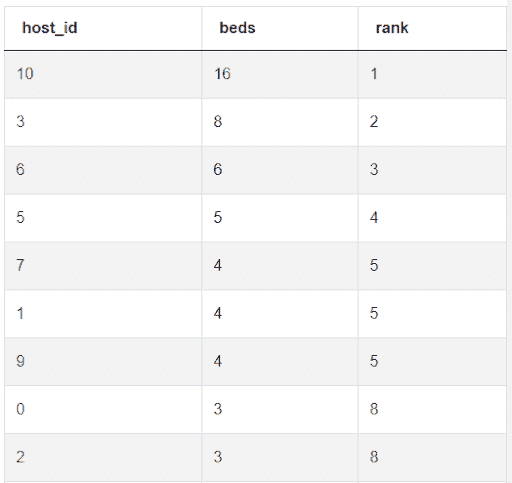
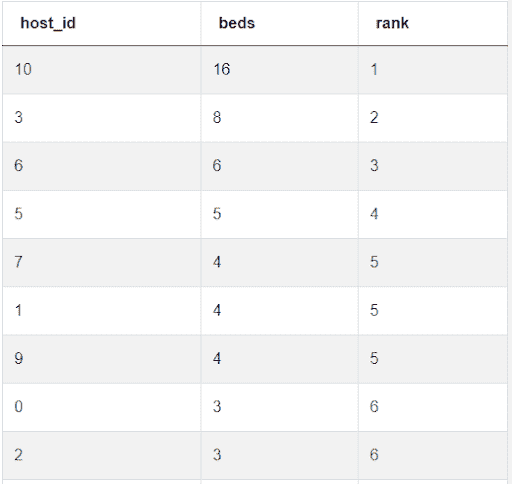

# 为数据分析师工作面试做准备的概念和问题

> 原文：<https://towardsdatascience.com/concepts-and-questions-to-prep-for-your-data-analyst-job-interview-a075d571dae8>

## *对数据分析师的需求正在上升——市场分析显示，高达 85%的公司已经采用了数据分析技术*


作者在 [Canva](https://canva.com/) 上创建的图片

先说一个简单的问题:什么是数据分析师？数据分析师收集并使用数据来回答问题，并提供问题的解决方案。数据分析师的日常任务包括:

*   数据的收集和存储
*   维护整洁有序的数据结构
*   为业务问题收集数据和/或创建报告的查询准备
*   利用收集和组织的数据为日常问题提供真正的解决方案

数据分析师应该熟悉的一些常用工具包括:

*   结构化查询语言
*   计算机编程语言
*   r、SAS 和或 SPSS
*   擅长

但是作为一名数据分析师，你能期望在什么样的公司工作呢？2022 年 1 月，经济时报引用了([数据分析是 2022 年最需要的技能](https://economictimes.indiatimes.com/jobs/big-data-analytics-forecasted-to-be-the-most-in-demand-skill-in-2022-monster-annual-trends-report/articleshow/88810818.cms?from=mdr))。在您的研究中，您可能会遇到 FAANG 这个术语。FAANG 是最著名的五大数据分析公司的首字母缩写:脸书、亚马逊、苹果、网飞和谷歌。然而，选择不仅限于这些业务。随着对数据分析技能的需求迅速增加，市场上充满了各种选择，如电话公司、互联网提供商、杂货店、学校等。这里有一篇很棒的文章( [11 家最适合作为数据科学家工作的公司](https://www.stratascratch.com/blog/11-best-companies-to-work-for-as-a-data-scientist/?utm_source=blog&utm_medium=click&utm_campaign=medium))，关于数据分析师应该关注的其他知名公司。

无论你去哪里，如上所述，SQL 技能是一个数据分析师的必备技能。我们已经确定了每个数据分析师都应该知道的 5 个基本技能:连接、子查询和 cte、等级、聚合函数和 case 表达式。下面是对每个功能的简要介绍，一个利用该概念的示例面试问题，以及一个数据分析师如何处理所提出问题的简短概述。


作者在 [Canva](https://canva.com/) 上创建的图像

# 1.连接

## 什么是联接？

通常，您需要从多个表中收集数据来执行一项任务。为此，必须使用联接。联接将两个表结合在一起，根据查询中指定的约束生成一个新的合并表。连接的一般语法*是:

```
SELECT values
FROM table a
    JOIN table b
    ON a.commonvalue = b.commonvalue
```

指定的联接方法(INNER、LEFT OUTER、RIGHT OUTER、FULL)将不同地利用列和查询。例如，内部联接将只显示右侧表中的数据满足左侧联接条件的行。但是，左外联接首先执行内联接，然后对于参数左侧没有找到匹配项的所有行，将为该行添加一个针对右侧列的 null 值。

## 在查询中使用联接

组织良好的连接可以让您访问优化查询所需的所有数据。这里有一个关于 StrataScratch 的问题，它使用了 JOIN: Product Transaction Count


截图来自 [StrataScratch](https://platform.stratascratch.com/coding/10163-product-transaction-count?code_type=1&utm_source=blog&utm_medium=click&utm_campaign=medium)

问题链接:[https://platform . stratascratch . com/coding/10163-product-transaction-count](https://platform.stratascratch.com/coding/10163-product-transaction-count?code_type=1&utm_source=blog&utm_medium=click&utm_campaign=medium)

```
Select *
FROM excel_sql_transaction_data t
    JOIN excel_sql_inventory_data i
    ON t.product_id = i.product_id
```

## 假设

因为这个问题的数据集存放在两个独立的表中，所以我们使用 JOIN 来收集查询所需的所有数据。这个问题注意到一些产品可能没有交易并忽略它们。因此，应该使用内部联接，因为它只会生成表 a 在表 b 中找到匹配约束的行。您还将看到 COUNT()的使用对这个解决方案的重要性，这将在下面进一步讨论。

## 方法

该解决方案的其余方法需要确定所需的输出(product_name 和事务数量)。SELECT 语句将选择 product_name 和 COUNT()的事务数。这就是此解决方案需要 JOIN 的原因。COUNT()函数必须从 excel_sql_transaction_data 表中提取，但是该项目要求我们也从 excel_sql_inventory_data 表中提取产品名称。内部连接在公共元素 product_id 上完成。最后，结果将按产品分组。

## 用这个问题练习 JOIN

使用下面的代码查看 JOIN 如何处理这个问题中的数据(这不是发布的问题的解决方案)。

```
SELECT *
FROM excel_sql_transaction_data t
JOIN excel_sql_inventory_data i ON t.product_id = i.product_id
```

查看我们的帖子“ [*SQL JOIN 面试问题*](https://www.stratascratch.com/blog/sql-join-interview-questions/?utm_source=blog&utm_medium=click&utm_campaign=medium) ”来练习更多这样的问题。

接下来，我们将讨论的下一个主题是子查询和 cte。我们将包括一个练习题，它结合了连接的使用和下一个技能。

# 2.子查询和 cte

## 什么是子查询？什么是 CTE？

子查询是嵌套在另一个查询中的查询。例如，如果您的任务是数羊，但您不知道羊是什么，那么问题“羊是什么”就变成了“有多少只羊？”。子查询用在当前查询的 WHERE 子句中，并嵌套在括号()内，有时称为带括号的子查询。带括号的子查询用在子查询表达式中，用于查看数据是否存在于查询中，是否可以在表中找到特定的数据，等等。

当使用 WITH 子句调用时，子查询成为 CTE。首字母缩写词 CTE 代表公共表表达式。CTE 的作用类似于临时表，但仅设计用于查询中-一旦查询完成，CTE 将自动销毁。cte 通常用于提高查询的可读性，尤其是在涉及递归的时候。以下是 CTE 如何出现以及如何在查询中使用的一般示例:

```
WITH cte_name_here AS (
   SELECT values
   FROM table
   WHERE...
)SELECT value
FROM cte_name_here
WHERE...
```

## 在查询中使用子查询& CTE

在查询中使用 CTE 可以解决 StrataScratch 平台上的以下问题:


截图来自 [StrataScratch](https://platform.stratascratch.com/coding/10173-days-at-number-one?code_type=1&utm_source=blog&utm_medium=click&utm_campaign=medium)

问题链接:[https://platform . stratascratch . com/coding/10173-days-at-number-one](https://platform.stratascratch.com/coding/10173-days-at-number-one?code_type=1&utm_source=blog&utm_medium=click&utm_campaign=medium)

## 假设

为这个数据分析师访谈问题提供了两个表，因此第一个假设是我们将执行一个连接来收集解决方案所需的所有数据。问题是问一首歌在同一天在美国和世界范围内排名第一的天数，而不是这首歌在美国和世界范围内分别排名第一的总天数。由于输出请求曲目名称和曲目在第一个位置的天数，因此在此查询中需要使用 COUNT()。

## 方法

在这种方法中，将创建一个 CTE 来保存歌曲在全球市场上排名第一的曲目名称和日期。初始化 CTE 后，将在“轨迹名称”列的两个表之间执行左连接。我们将把结果减少到全球表中排名第一的位置，然后按曲目名称、日期对这些结果进行分组。我们现在有了一个新的数据集，它只包括这首歌在全球排名第一的曲目名称和日期。

接下来可以准备一个新的查询，将 CTE 的结果与包含美国排名的表连接起来。由于 trackname 是在 CTE 中返回的，因此这将是执行连接的值。SELECT 语句将从 US 表中请求曲目名称，并从 US 表中请求日期计数()。将在 WHERE 子句中对结果进行筛选，以仅返回美国表中的日期与从 CTE 返回的日期相匹配的结果(该表包含全球表中的日期)。由于使用了 COUNT()，结果将按曲目名称分组，根据说明，ORDER BY 也将按曲目名称按 A-Z 或升序排序。

## 带着这个问题练习 CTE

使用下面的代码来练习创建一个 CTE(这不是张贴的问题的解决方案)。运行此代码以查看在创建 CTE 后查询时所有数据的显示方式。

```
WITH temp_CTE AS
  (SELECT us.trackname,
          ww.date
   FROM spotify_daily_rankings_2017_us us
   LEFT JOIN spotify_worldwide_daily_song_ranking ww ON ww.trackname = us.trackname
   WHERE ww.position = 1
   GROUP BY us.trackname,
            ww.date)
SELECT *
FROM temp_CTE
```

让我们换个话题，转到下一个概念，RANK()和它的类似函数 DENSE_RANK()，来讨论 PostgreSQL 中如何对值进行排序。

# 3.军阶


作者在 [Canva](https://canva.com/) 上创建的图像

# 什么是等级？

[SQL RANK 函数](https://www.stratascratch.com/blog/an-introduction-to-the-sql-rank-functions/?utm_source=blog&utm_medium=click&utm_campaign=medium)是一个为结果集的每一行分配排名的函数。RANK()函数是 [SQL 窗口函数](https://www.stratascratch.com/blog/the-ultimate-guide-to-sql-window-functions/?utm_source=blog&utm_medium=click&utm_campaign=medium)家族的一员。窗口函数使用一组表格行中的数据来执行计算。在这种情况下，计算将根据查询中指定的参数从低到高对这些值进行编号。如果需要，可以指定一个分区，该分区将允许对结果集中的多个类别(分区)进行排序。在分区排名中，每个类别从排名 1 开始，因此一组数据可能会产生多组排名。

与 RANK()类似的是 DENSE_RANK()窗口函数。DENSE_RANK()还为结果集的每一行分配一个排名，但是当结果集中有重复值时，RANK()将显示并列排名，但是它将跳过下一个排名编号，直到它达到唯一值(即 1、2、2、4、4、4、7 等)。)，而 DENSE_RANK()将在达到并列值(即 1、1、2、2、3、4、5 等)后继续按顺序排序。)，如下图。

下面是如何调用 RANK()和 DENSE_RANK()的示例:

```
RANK() OVER(
[PARTITION BY name_of_column_for_partition]
ORDER BY name_of_column_to_rank
)
```

Dense_Rank 是:

```
DENSE_RANK() OVER(
[PARTITION BY name_of_column_for_partition]
ORDER BY name_of_column_to_rank
)
```

请注意，分区表达式在方括号[]中，因为它在使用 RANK 和 DENSE_RANK 时是可选的。当值相等时，RANK 和 DENSE_RANK 的结果相互比较如下:

排名:



密集 _ 排名:



类似于 RANK()和 DENSE_RANK()的最后一个窗口函数是 ROW_NUMBER()。函数的作用是:返回当前行的编号。这与 RANK()和 DENSE_RANK()的初始化相同。以下示例显示了使用 ROW_NUMBER()时结果如何变化:

行号:


## 为什么要用 Rank？

当结果应该排序和编号时，最好使用 Rank。例如，如果您希望根据一组参数来查找公司中表现最好的员工，可以在查询中使用 RANK()或 DENSE_RANK()来轻松识别结果。这两个函数之间的选择通常取决于呼叫者是否希望在结果中包含“ties”。因为表中的数据还可以划分为更小的组来进行排序(每个组从值 1 开始)，所以如果要评估杂货店库存中易腐食品的受欢迎程度，并对水果、蔬菜、熟食等进行单独排序，rank()将会很有帮助。

## 在查询中使用排名

下面的问题是在查询中使用 DENSE_RANK()的一个很好的例子。


截图来自 [StrataScratch](https://platform.stratascratch.com/coding/10161-ranking-hosts-by-beds?code_type=1&utm_source=blog&utm_medium=click&utm_campaign=medium)

问题链接:[https://platform . stratascratch . com/coding/10161-ranking-hosts-by-beds](https://platform.stratascratch.com/coding/10161-ranking-hosts-by-beds?code_type=1&utm_source=blog&utm_medium=click&utm_campaign=medium)

## 假设

因为这个问题清楚地表明输出在寻找一个排名，我们知道将使用 RANK()或 DENSE_RANK()。由于指令没有说明允许相同级别的平局或排名，这里的选择是 DENSE_RANK()。因为一个主机可以有多个属性，所以我们需要合计床位数。最后，由于一个主人可以拥有多处房产，但是所提出的面试问题并没有说明按照房产来划分床位数量，这是你需要向面试官澄清的事情。

## 方法

第一步是准备一条 select 语句来查找每台主机的床位数。使用 SUM()计算床位总数。为了可读性和易用性，我们在查询期间将这些结果保存在一个 CTE 中。找到床位数后，将从 CTE 中选择所需的列，并使用 DENSE_RANK()按床位数最高的行进行排序。务必注意不要过早使用 rank 函数，否则结果会不准确。

## 带着这个问题练习排位

使用下面的代码来看看一个表格中的数据是如何排列的(这不是对发布的问题的解决方案)。运行这段代码来查看结果集。将 RANK()更改为 DENSE_RANK()，然后更改 ROW_NUMBER()，看看结果如何变化。

```
SELECT RANK() OVER(
                   ORDER BY n_beds DESC) AS rank,
       apartment_id,
       apartment_type,
       n_beds
FROM airbnb_apartments
```

接下来，我们将介绍聚合函数，包括上面提到的 SUM()和其他聚合函数。

# 4.聚合函数— COUNT()、SUM()、MAX()、MIN()

[SQL 聚合函数](https://www.stratascratch.com/blog/the-ultimate-guide-to-sql-aggregate-functions/?utm_source=blog&utm_medium=click&utm_campaign=medium)是一种可怕的方式，它总结了许多内置的 SQL 窗口函数，这些函数从一组多个输入值中返回一个结果。聚合函数中有许多可用的功能，例如查找值的总和、查找一组值的范围、计算一列中的行数等。由于这些函数的健壮性，这里不提供如何初始化一个或多个聚合函数的例子，请参考 [PostgreSQL 文档](https://www.postgresql.org/docs/current/functions-aggregate.html)以获得深入的解释。

## SQL 中为什么使用聚合函数？

坦率地说，如果没有聚合函数，查询会很无聊。它们为解决日常任务提供了强大的功能。常见的聚合函数有 SUM()，它对指定列中的行进行求和；COUNT()，它计算符合规范的列中存在的行数；MAX()，它从一列的行中产生最大值；MIN()从一列的行中产生最小值。由于聚合函数提供了广泛的功能，可以说它们是数据分析师可以开发的最强大的技能之一。

## 在查询中使用聚合函数

为了解决一个在解决方案中使用聚合函数的问题，让我们看看下面这个来自 StrataScratch 的问题。


截图来自 [StrataScratch](https://platform.stratascratch.com/coding/9908-customer-orders-and-details?code_type=1&utm_source=blog&utm_medium=click&utm_campaign=medium)

问题链接:[https://platform . stratascratch . com/coding/9908-客户订单和详细信息](https://platform.stratascratch.com/coding/9908-customer-orders-and-details?code_type=1&utm_source=blog&utm_medium=click&utm_campaign=medium)

## 假设

此问题要求从数据集中输出每个城市的订单，该数据集中包含城市名称、订单数量、客户数量以及该城市的订单总成本等列。这意味着我们需要使用 COUNT()获得订单和客户的总数，使用 SUM()获得订单的总成本。这些结果将按城市列分组，但结果将需要仅限于(限制)有 5 个或更多订单的城市。最后，因为本例中有多个表，所以将使用左连接，因为我们希望在计算中包括每个城市的所有客户，甚至包括没有下订单的客户。

## 方法

查看提供的两个表，两个表中的公共值是 custid 列，它将用于连接。通过首先准备 JOIN 语句，我们能够收集从两个表中提取所需的所有数据点。左连接将用于包括所有客户，甚至包括那些没有下订单的客户。准备好 join 子句后，接下来是 SELECT 语句。SELECT 应该返回城市、订单总数、客户总数和总成本。对于订单总数和客户总数，分别使用 COUNT()。因为同一个客户可能下了多个订单，所以使用 DISTINCT 关键字来避免重复。要计算每个城市所有订单的总成本，请使用 SUM()。GROUP BY 子句通常与聚合函数一起使用，在许多情况下，如果省略该子句，将会出现语法错误。结果应该按城市分组。最后，我们希望将结果限制在拥有 5 个或更多订单的城市。将 HAVING 子句与 GROUP BY 结合使用，将订单数限制为 5 个或更多(> 5)。

## 带着这个问题练习集合函数

使用下面的代码练习使用聚合函数(这不是张贴问题的解决方案)。运行此代码，查看如何使用 COUNT 和 SUM 来收集客户的订单总数，并使用 orders 表中的数据对总成本求和:

```
SELECT cust_id,
       COUNT(cust_id) AS num_orders,
       SUM(total_order_cost) AS total_cost
FROM orders
GROUP BY cust_id
ORDER BY cust_id DESC
```

接下来，我们将讨论 sql 中 case 表达式的使用，包括一个例子，您可以在介绍下一个概念的同时继续练习聚合函数。

# 5.格表达式

## 什么是格表达式？

由查询中的 case 表示的 CASE 表达式是一个条件表达式，类似于其他语言中的 If/Else 语句。如果满足某个条件，则在查询中指定该条件以及结果。在许多情况下，术语 case 语句与 case 表达式可以互换使用。有关 CASE 如何出现在查询中的一般示例，请参见下面的内容:

```
SELECT CASE WHEN condition THEN result
    ELSE other_result
    END
```

## 为什么要用 Case 表达式？

当值或动作依赖于特定行或列的状态时，CASE 表达式非常有用。通过 CASE 表达式优化和缩短查询，通常可以节省几十行代码。case 不仅限于一个条件——在一个 CASE 表达式中可以计算多达 255 个单独的条件/参数！如果不使用 case 表达式，查询将是乏味而耗时的。

## 在查询中使用大小写

以下问题是学习和练习如何在查询中使用 case 表达式的好方法。这个数据分析师面试问题还使用了聚合函数，允许您进一步提高该技能。


截图来自 [StrataScratch](https://platform.stratascratch.com/coding/9729-inspections-per-risk-category?code_type=1&utm_source=blog&utm_medium=click&utm_campaign=medium)

问题链接:[https://platform . stratascratch . com/coding/9729-inspections-per-risk-category](https://platform.stratascratch.com/coding/9729-inspections-per-risk-category?code_type=1&utm_source=blog&utm_medium=click&utm_campaign=medium)

## 假设

该问题的解决方案应包括两栏:风险类别和每个类别的检查次数。虽然输出很简单，但在表面之下还有更多。并非所有的健康检查都会导致违规或风险。这意味着对于一行或多行运行状况检查，risk_category 字段可能为空。我们需要识别这些行，并将它们分配给无风险，这就是查询中将使用 CASE 的地方。

## 方法

在 select 语句中，我们将使用 CASE 表达式**首先查找 risk_category 列中值为 NULL 的所有行。这将被分配给无风险。否则，它将保持当前值。接下来，使用 COUNT()查找 inspection _ ids 的总数。在 risk_category 列上将 GROUP BY 与 COUNT 结合使用。结果应该按照检查次数从高到低排序，因此我们将使用“按[值]排序”DESC 来完成查询。

## 用这个问题练习案例

使用下面的代码查看使用此问题中的数据的 case 表达式的示例(这不是已发布问题的解决方案)。运行此代码，查看案例表达式如何根据记录的分数将运行状况检查指定为“通过”或“失败”:

```
SELECT business_name,
       inspection_date,
       CASE
           WHEN inspection_score > 50 THEN 'passed'
           ELSE 'failed'
       END
FROM sf_restaurant_health_violations
ORDER BY inspection_date DESC
```

* *关于使用 CASE 表达式的注意事项:对于这个特殊的问题，COALESCE()是比 CASE 更有效的解决方案。COALESCE()是 CASE 的语法快捷方式。Coalesce 返回其第一个不为 null 的参数。它可以用来用默认值代替空值。在这种情况下，如果 risk_category 列中的值不为空，COALESCE (risk_category，' No Risk ')将返回该值。否则，该行的值将返回“无风险”。

## 结论

在上面几节中，我们已经学习了如何使用连接、子查询和 cte、秩、聚合函数和 case 表达式。我们已经对数据进行了计数，对列表中的项目进行了排序，连接了表，并遍历了案例条件。这些都是数据分析师的日常技能，我们鼓励尽可能提高这些技能。在面试或准备数据科学领域的新职位时，精通这些科目是一个优势。虽然本文涵盖的主题对于所有人来说都是很好的学习基础，但在成为或成长为数据分析师的过程中，还有很多东西需要学习。查看我们的帖子“ [*数据分析师面试问题*](https://www.stratascratch.com/blog/data-analyst-interview-questions-and-answers/?utm_source=blog&utm_medium=click&utm_campaign=medium) ”和“ [*数据分析师 SQL 面试问题*](https://www.stratascratch.com/blog/sql-interview-questions-for-the-data-analyst-position/?utm_source=blog&utm_medium=click&utm_campaign=medium) ”，了解数据分析多样化领域的更多实践。