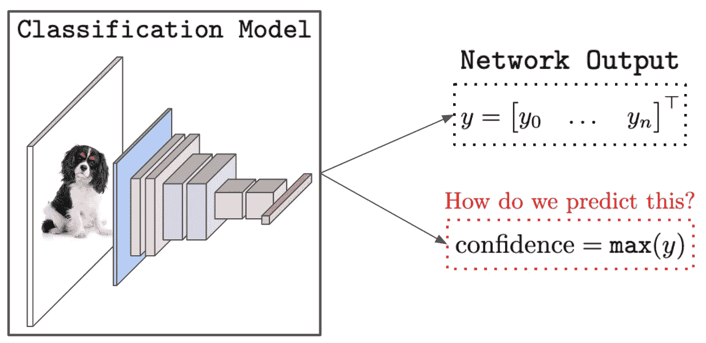
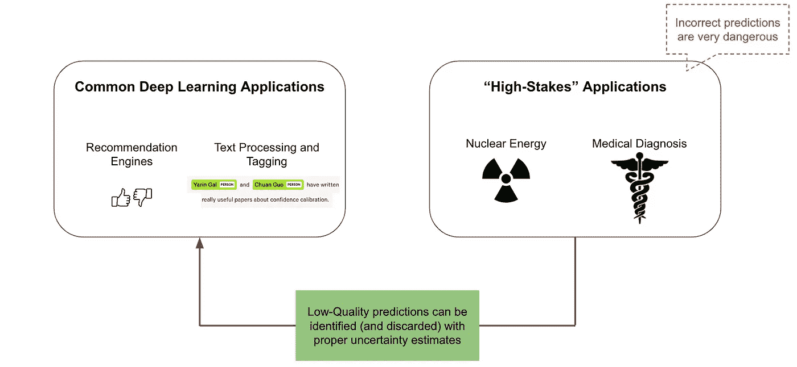
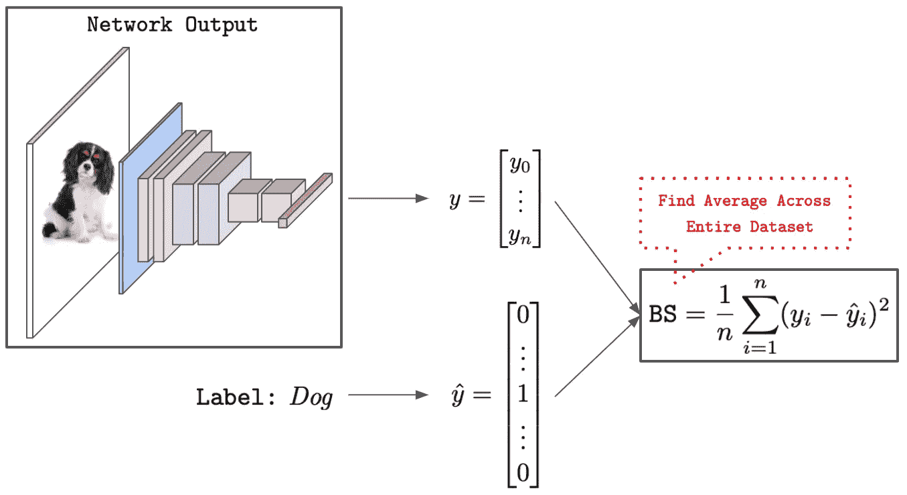
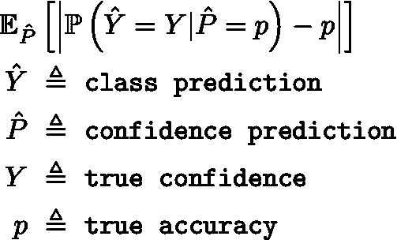
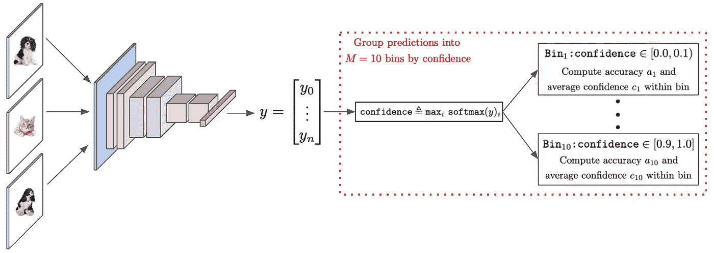
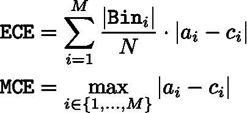
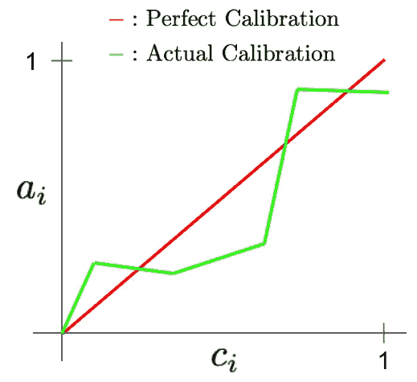
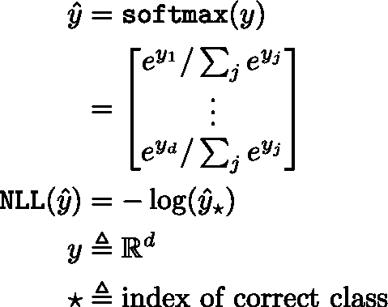
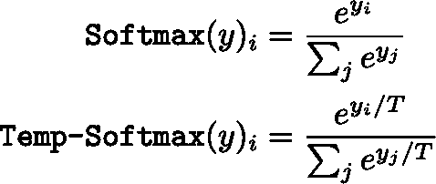
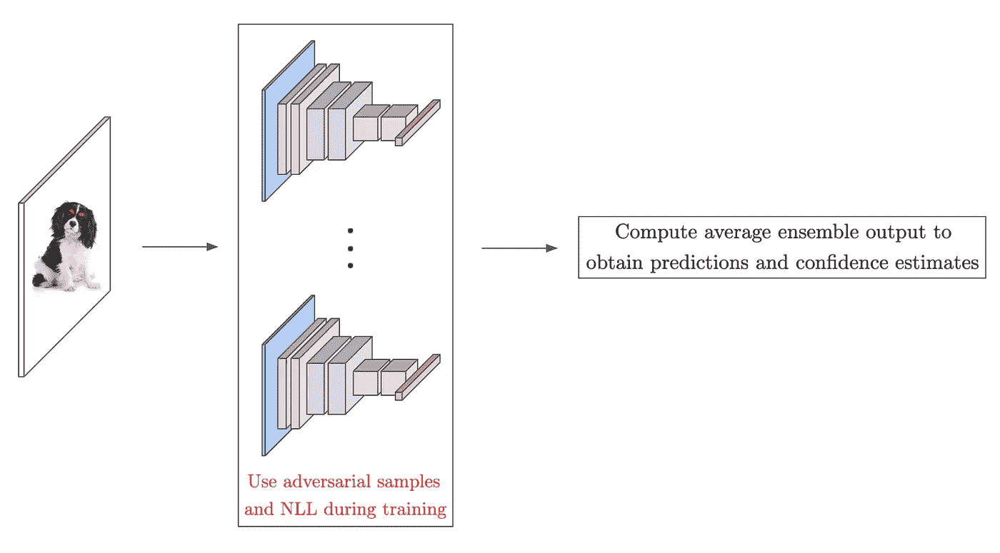

# 深度网络的置信度校准:为什么和如何？

> 原文：<https://towardsdatascience.com/confidence-calibration-for-deep-networks-why-and-how-e2cd4fe4a086>

神经网络的不确定性估计(由作者创建)

置信度校准被定义为某个模型为其任何预测提供准确的正确概率的能力。换句话说，如果一个神经网络预测某个图像是一只置信度为 0.2 的猫，如果神经网络校准正确，这个预测应该有 20%的机会是正确的。这种校准的置信度得分在各种“高风险”应用中非常重要，在这些应用中，不正确的预测非常成问题(例如，自动驾驶汽车、医疗诊断等)。)，因为与每个预测相关联的校准概率分数允许识别和丢弃低质量的预测。因此，即使还不能完全解释神经网络输出，置信度校准通过将每个预测与精确的不确定性/置信度分数相关联，提供了避免实践中的重大错误的实用途径。

在这篇博文中，我将探讨深度学习中的信心校准主题，从信心校准背后的动机、为什么它很重要以及如何使用它开始。然后，我将概述测量置信度校准的常用方法，包括 brier 评分、预期校准误差、最大校准误差等。最后，我将概述深度学习中现有的置信度校准方法，重点关注在大规模应用中最有效和高效的方法。

# 为什么校准很重要？

校准可以扩大深度学习的范围(作者创建)

从业者经常错误地将从神经网络获得的预测概率(即 softmax 分数)解释为模型置信度。然而，众所周知，现代神经网络经常以接近 100%的 softmax 分数做出差的(即不正确的)预测，使得预测概率成为对真实置信度的差的和误导性的估计[2]。虽然早期的神经网络在这方面并不“过于自信”，但从神经网络预测中获得准确的不确定性分数的问题并非微不足道— *我们如何才能使 softmax 分数实际上反映给定预测的正确概率？*

目前，深度学习已经在许多领域(例如，图像/语言处理)中普及，并且通常用于错误是可接受的应用中。例如，考虑一个电子商务推荐应用程序，其中神经网络可能在 90%以上的情况下提供高质量的推荐，但偶尔会发现最相关的产品。虽然这样的应用很多，但将深度学习部署到医疗诊断或核能等高风险领域需要尽可能减少不正确的模型预测。因此，准确预测模型不确定性是一个有影响的问题，有可能扩大深度学习的范围。

## 潜在应用

鉴于置信度校准是一个非常重要的问题，有可能对深度学习社区产生巨大影响，人们可能会想知道哪些类型的应用程序最依赖于正确校准的不确定性。虽然有很多，但我在本节中概述了几个，以提供相关背景并激发实践中置信度校准的益处。

**过滤不良预测。**给定适当校准的模型，可以丢弃具有高不确定性(或低置信度)的预测，以避免不必要的模型误差。这种基于与每个预测相关联的置信度得分来丢弃不正确预测的能力在上述高风险应用中尤其有效。虽然在短期内真正解释或理解神经网络输出可能仍然很困难，但正确校准的不确定性分数为检测和避免神经网络的错误提供了一种实用的途径。

**模型感知主动学习。**适当的不确定性估计可以轻松识别模型难以理解的数据。因此，可以将与低置信度预测相关的数据放在一边，传递给人工注释者进行标记，并包含在模型的训练集中。通过这种方式，模型的不确定性可以用来迭代地识别模型不理解的数据，实现一种模型感知的[主动学习](https://en.wikipedia.org/wiki/Active_learning_(machine_learning))。

**检测食品数据。**具有良好校准特性的模型通常可用于检测不符合分布(ood)的数据，或者与模型的训练集显著不同的数据。虽然校准和 OOD 检测是正交的问题，例如，尽管校准不佳，softmax 分数仍可直接用于检测 OOD 数据[16]，但它们经常被串联研究，其中最佳校准方法是根据校准和检测 OOD 数据的能力进行评估的(即，通过将高不确定性/低置信度分配给此类示例)[6]。

# 测量校准

尽管现在已经很清楚置信度校准是一个有用的属性，但与精度或损失等具体性能指标相比，它并不容易测量。因此，随着时间的推移，已经提出了各种不同的置信度校准度量，每种度量都有自己的优缺点。在本节中，我将按照相关性的顺序概述最广泛使用的度量标准。对于这些指标中的每一个，我将确定它是否是一个合适的[评分规则](https://en.wikipedia.org/wiki/Scoring_rule#:~:text=A%20proper%20scoring%20rule%20is%20said%20to%20be%20local%20if,the%20probability%20of%20that%20event.)——意味着最佳分数对应于一个完美的预测，并且不存在“琐碎的”最佳解决方案——解释分数的直观意义，并描述它是如何计算的。

## 布赖尔分数[1]

Brier 评分(BS)是一种适当的评分规则，它测量预测概率向量和独热编码真实标签之间的平方误差。较低的分数对应于更精确的校准；见下图的描述。

计算 Brier 分数(由作者创建)

直觉上，BS 测量预测概率的准确性。它可以分解为三个组成部分——不确定性([标签上的边际不确定性](https://www.researchgate.net/figure/Marginal-and-conditional-uncertainties-of-a-joint-distribution-function-For-a-joint_fig8_281708234#:~:text=The%20marginal%20uncertainty%20region%20is,related%20to%20the%20conditional%20variances.))、分辨率(个体预测与边际的偏差)和可靠性(真实标签频率的平均违反)——如下所示。

Brier 乐谱的分解(由作者创建)

尽管 BS 是测量网络预测校准的良好指标，但它对与不频繁事件相关的概率不敏感。因此，除了 BS 之外，利用多个指标进行测量校准通常会提供有用的见解。

## 预期和最大校准误差[2]

预期校准误差(ECE)计算置信度和准确度之间的预期差异。期望值的这种差异可以如下所示进行计算。

预期可信度和准确性之间的确切差异(由作者创建)

虽然上述表达式不能以封闭形式计算，但我们可以通过基于相关置信度得分将模型预测划分到单独的箱中来近似计算。然后，可以计算每个条柱内平均置信度和准确度之间的差异，如下图所示。

预期校准误差的置信宁滨(由作者创建)

从这里开始，ECE 计算每个箱内平均置信度和准确度之间的差异，然后根据每个箱的相对大小对这些值进行加权平均。最大校准误差(MCE)遵循相同的过程，但等于各区间的平均置信度和精度之间的最大差值。有关 ECE 和 MCE 的更严格的公式，请参见下图。

预期和最大校准误差的表达式(由作者创建)

对于 ECE 和 MCE，较低的分数对应于较好的校准预测。ECE 和 MCE 都不是正确的评分规则，这意味着平凡的解决方案(例如，预测统一的随机概率)存在最佳校准误差。此外，由于宁滨过程，这两个指标[都不会随着预测的改善而单调下降。尽管如此，由于这些指标能够提供模型校准的简单和可解释的估计，所以它们通常被使用。MCE 通常用于可靠的置信度测量绝对必要的应用中(即校准中的大误差是有害的)，而 ECE 则提供更全面的跨频段平均指标。](https://en.wikipedia.org/wiki/Monotonic_function)

**可靠性图表。**如果希望获得表征校准误差的图，而不是像 ECE 或 MCE 那样的标量度量，则每箱精度和置信度测量可以很容易地转换成可靠性图。这些图表在 y 轴上描绘了准确度，在 x 轴上描绘了平均置信度。然后，将每个条柱内的平均置信度和准确度测量值绘制在图上，形成一个线形图。在这里，完美的校准将在可靠性图上产生一条对角线，其中置信度等于每个独立仓内的精度；请看下面的插图。

可靠性图的描述(由作者创建)

可靠性图表通常有助于可视化所有箱的校准误差。虽然 ECE 和 MCE 将条柱统计数据汇总到一个简单的标量指标中，但可靠性图表可以立即查看每个条柱的属性，从而在一个易于解释的图中捕获更多校准信息。

## 负对数似然

[负对数似然](https://ljvmiranda921.github.io/notebook/2017/08/13/softmax-and-the-negative-log-likelihood/) (NLL)是一个适当的评分规则，可用于评估保留数据的模型不确定性，其中较低的分数对应于较好的校准。尽管通常用作训练的目标函数，NLL 表征了真实标签的预测和实际置信度之间的差异，当所有数据都以 100%的置信度被正确预测时，达到完美的零分。参见下面的 NLL 公式，其中`y`是一些神经网络的原始矢量输出。

负对数似然度量(由作者创建)

然而，NLL 过分强调尾部概率，这意味着与正确、完全自信的预测的轻微偏差会导致 NLL 的大幅增加。这种特性对神经网络的影响可以很容易地观察到，其中 NLL(即目标函数)相对于训练集可能很低，但由于网络倾向于做出高置信度预测以最小化 NLL(即本文开头提到的“过度自信”问题)，因此对测试集的错误预测具有 100%的置信度[2]。

## 熵

通常，我们可能希望对来自不同于训练集的分布的数据评估模型的行为，因此没有模型理解的真实标签(即 ood 数据)。在这种情况下，由于缺乏真正的标签，前面的指标都不能用于评估。相反，模型的行为通常通过测量由这种 OOD 数据产生的输出分布的[熵](https://en.wikipedia.org/wiki/Entropy)来分析。

高熵和低熵输出分布(由作者创建)

直观上，OOD 数据应该导致具有高熵的网络预测，对应于所有可能的输出都被分配均匀概率的不确定状态。另一方面，对于被很好理解的数据的网络预测应该具有低熵，因为如果模型是准确的并且被适当校准，则该模型以高置信度预测正确的类。因此，当在一组包含 OOD 数据的测试实例上评估模型时，正常和 OOD 数据的预测熵应该清楚地分开，表明模型在 OOD 实例上表现出可测量的不确定性。

# 校准方法

在这一节中，我将探讨已经提出的用于改进神经网络置信度校准的许多方法。其中一些方法是可以添加到培训过程中的简单技巧，而其他方法则需要利用保留验证集的后处理阶段，甚至需要对网络架构进行重大更改。在描述每种方法时，我将概述它们的优缺点，重点关注每种方法是否适合在大规模深度学习应用中使用。

## 温度标度[2]

当现代深度神经网络的不良校准首次被发现和探索时(即，本文开头概述的“过度自信”问题)，作者将此类网络做出过度自信、错误预测的趋势归因于最近的发展，如增加神经网络大小/容量、批量标准化、权重衰减较少的训练，甚至使用 NLL 损失(即，由于强调尾部概率，这种损失将网络预测推向高置信度)。令人惊讶的是，这种用于神经网络训练的现代最佳实践——尽管产生了具有令人印象深刻的性能的网络——被发现产生了与前几代架构(例如 LeNet [7])相比具有显著退化的校准属性的网络。

为了解决这种较差的校准,[2]的作者探索了几种不同的事后校准技术，这些技术在训练完成后通过使用一些保留验证集来执行校准。他们发现，调整输出层的 softmax 温度(即，在二进制设置中称为 Platt 缩放[8])以最小化验证集上的 NLL，在校准网络预测时最为有效。因此，softmax 变换被修改为如下所示的正值温度`T`。

带和不带温度缩放的 Softmax 变换(由作者创建)

在该表达式中，`T`的较大值将“软化”输出分布(即，使其趋向均匀分布)，而`T`的较小值将更加强调分布中最大值的输出。因此，`T`参数实质上控制了输出分布的熵。

通过在抑制验证集上调整`T`参数来优化 NLL，[2]的作者能够显著改善网络校准。然而，这一校准过程需要一个验证数据集，并在训练后作为一个单独的阶段执行。此外，后来的工作发现，这种方法不能很好地处理 OOD 数据，并且当暴露于网络的数据是[非 I . I . d .](https://stackoverflow.com/questions/13058379/example-for-non-iid-data)【6】时完全失效。因此，在给定足够陌生或敌对的数据的情况下，网络仍然可以以很高的可信度做出错误的预测。

## 基于系综的校准[9]

众所周知，与单个网络相比，集成(或几组独立训练的网络，共同用于预测)可以提供更好的性能[10]。然而,[9]的作者证明了对系综内的网络预测进行平均也可用于获得有用的不确定性估计。特别地，通过使用适当的评分规则(例如，NLL)作为目标函数的 *i)* 、 *ii)* 用对立的例子[11]扩充训练集，以及 *iii)* 训练网络的集合，来修改训练过程；见下文的描述。

基于集合的校准概述(由作者创建)

集合中的每个网络都是独立地并且在整个数据集上训练的(即，具有不同的随机初始化和洗牌)，这意味着集合中每个成员的训练可以并行执行。然后，通过对所得集合的预测进行平均，即使在大规模数据集上也可以获得高质量的不确定性估计。此外，这种方法被证明对数据集中的变化是鲁棒的，允许食品样本被准确地检测。因此，尽管处理多个网络会导致额外的计算成本，但是基于集合的校准技术是简单的、高度鲁棒的和高性能的。

## 混乱[12]

Mixup 是一种简单的数据扩充技术，通过采用随机采样(来自 [beta 分布](https://en.wikipedia.org/wiki/Beta_distribution))加权的训练样本的[凸组合](https://en.wikipedia.org/wiki/Convex_combination)，并使用这种组合样本来训练网络；请参见下面的示意图。

混合数据扩充程序(由作者创建)

值得注意的是，mixup 结合了输入图像和它们相关的标签。此外，最近的工作[13]已经发现，在训练期间使用混合，除了提供显著的调节和性能益处之外，还可以产生具有改进的校准属性的分类模型。这一发现甚至在大规模上也成立，mix up——包括已经提出的各种变体——甚至被证明在检测 OOD 数据方面是有效的[14]。有趣的是,[13]的作者发现简单地混合输入图像不足以实现校准益处，揭示了输出标签的混合对于校准网络输出是必不可少的。研究标签平滑(即增加标签分布的熵)对网络性能和校准的影响的相关工作进一步支持了这一发现[15]。

## 贝叶斯神经网络[3]

贝叶斯神经网络——其动机是无限宽的神经网络在其权重上的分布收敛到[高斯过程](https://en.wikipedia.org/wiki/Gaussian_process)(因此具有封闭形式的不确定性估计)[4]——可以简单地定义为在其权重上放置分布的有限神经网络。这种公式提供了对过拟合的鲁棒性，并且能够表示网络内的不确定性。然而，贝叶斯神经网络，即使使用了新开发的[变分推理](https://en.wikipedia.org/wiki/Variational_Bayesian_methods)技术，也遭受了令人望而却步的计算和存储成本。事实上，基本模型的大小通常必须加倍，以便能够用贝叶斯公式进行适当的不确定性估计[5]。因此，贝叶斯神经网络还不适合大规模应用，但我推荐任何对这种方法感兴趣的人阅读这篇精彩而实用的[概述](https://arxiv.org/pdf/2007.06823.pdf)。

## 作为贝叶斯近似的辍学[5]

如上所述，贝叶斯网络能够对模型的不确定性进行推理，但是在计算成本方面经常受到限制。然而，最近的工作表明，神经网络训练辍学[17]是高斯过程的贝叶斯近似。此外，通过简单地 *i)* 运行多个随机前向传递(具有不同的丢失实例)和 *ii)* 平均每个前向传递的预测，可以利用该属性来生成深度网络预测的不确定性分数；见下文对这种方法的描述，这通常被称为蒙特卡洛辍学。

剔除后的不确定性估计(由作者创建)

有趣的是，这种作为高斯过程近似的漏失视角支持鲁棒的不确定性估计，而无需改变底层网络或要求任何后处理。事实上，所需要的只是训练一个带有丢失的正常网络，并在测试时执行多个带有丢失的随机前向传递，其中每个不同的前向传递可以并行化，以避免增加延迟。这种方法在大规模应用中工作得非常好，并且被证明既实现了最先进的置信度校准，又以高精度检测 OOD 数据。然而，基于丢失的校准的性能比上面讨论的基于集合的技术稍差。

# 那么…你应该用什么呢？

虽然我们在这篇文章中概述了几种置信度校准的方法，但有人可能会问，哪种方法在实践中最有用。这种确定的相关考虑是简单性、有效性和效率。我们已经看到，温度缩放和利用贝叶斯神经网络的不确定性近似值等方法可能在较大规模下效果不佳，例如，温度缩放在非 i.d .数据上中断，而贝叶斯神经网络的计算成本很高，因此在某些情况下效率较低。其他方法工作得相当好，并提供令人印象深刻的大规模校准结果。因此，假设这些方法通常是有效的，人们可以开始考虑它们的简单性和效率。

Mixup 是一种易于实现的(即，只需参见论文中的参考实现)数据增强技术，可以将其添加到训练中以改善最终网络的校准，使其成为校准神经网络的低成本和简单的选择。类似地，利用网络集合提供了令人印象深刻的校准结果，并且易于实现(即，只需训练更多的网络！).但是，它引入了训练多个网络并将其全部用于预测的额外计算费用，因此与像 Mixup 这样的数据增强技术相比，降低了训练和预测的效率。更进一步，蒙特卡洛退出不会降低训练的效率，并提供令人印象深刻的大规模不确定性校准，但在预测期间需要多次向前传递，并且通常优于基于集合的不确定性估计。因此，方法的选择通常是基于应用的，并且取决于操作的约束条件(例如，训练需要快速，所以使用 Mixup 或 Monte Carlo dropout，效率不是问题，所以使用系综等)。).

## 结论

非常感谢你阅读这篇文章！希望对你有帮助。如果您有任何反馈或担忧，请随时评论该帖子或通过 [twitter](https://twitter.com/cwolferesearch) 联系我。如果你想了解我未来的工作，你可以通过媒体了解我[。我的博客专注于深度学习的实用技术，我试图发布两篇文章，内容涉及从视频上的](https://wolfecameron.medium.com/)[深度学习到使用深度网络的在线学习技术的](/deep-learning-on-video-part-one-the-early-days-8a3632ed47d4)主题。如果您对我的出版物和其他作品感兴趣，也可以随时查看我的个人网站上的内容。这一系列的文章是我作为一名研究科学家在 Alegion 完成的背景研究的一部分。如果你喜欢这篇文章，请随时查看该公司和任何相关的空缺职位——我们总是希望与对深度学习相关主题感兴趣的积极个人进行讨论或雇用他们！

*参考书目*

[1]Glenn w . Brier，“用概率表示的预测的验证”*每月天气回顾*78.1(1950):1–3。

[2]郭，传，等.“论现代神经网络的校准”*机器学习国际会议*。PMLR，2017。

[3]尼尔，拉德福德 M. *神经网络的贝叶斯学习*。第 118 卷。斯普林格科学&商业媒体，2012 年。

[4]克里斯托弗·威廉斯《用无限网络计算》神经信息处理系统的进展 9 (1996)。

[5]加尔、亚林和邹斌·格拉马尼。"作为贝叶斯近似的辍学:表示深度学习中的模型不确定性."*机器学习国际会议*。PMLR，2016。

[6]奥瓦迪亚、亚尼夫等，“你能相信你的模型的不确定性吗？评估数据集变化下的预测不确定性。”*神经信息处理系统进展* 32 (2019)。

[7] LeCun，Yann 等，“基于梯度的学习应用于文档识别”IEEE 86.11(1998):2278–2324 会议录。

[8] Platt，John 等人,《支持向量机的概率输出以及与正则化似然方法的比较》。大间距分类器的进展，10(3):61–74，1999。

[9] Lakshminarayanan、Balaji、Alexander Pritzel 和 Charles Blundell。"使用深度集成的简单和可扩展的预测不确定性估计."*神经信息处理系统进展* 30 (2017)。

10 迪特里希。机器学习中的集成方法。在多分类器系统中。2000.

[11]古德费勒、施伦斯和塞格迪。解释和利用对立的例子。2015 年在 ICLR。

[12]张，，等.“混合:超越经验风险最小化” *arXiv 预印本 arXiv:1710.09412* (2017)。

[13] Thulasidasan，Sunil 等人，“关于混合训练:深度神经网络的改进校准和预测不确定性”*神经信息处理系统进展* 32 (2019)。

[14] Wolfe，Cameron R .，和 Keld T. Lundgaard。" E-Stitchup:预训练嵌入的数据扩充." *arXiv 预印本 arXiv:1912.00772* (2019)。

[15]米勒、拉斐尔、西蒙·科恩布利思和杰弗里·e·辛顿。“标签平滑在什么情况下有帮助？."*神经信息处理系统进展* 32 (2019)。

[16]亨德里克斯、丹和凯文·金佩尔。"检测神经网络中错误分类和非分布样本的基线." *arXiv 预印本 arXiv:1610.02136* (2016)。

[17] Srivastava，Nitish 等人，“辍学:防止神经网络过度拟合的简单方法”*机器学习研究杂志*15.1(2014):1929–1958。