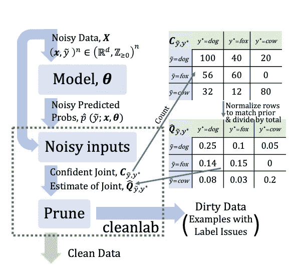
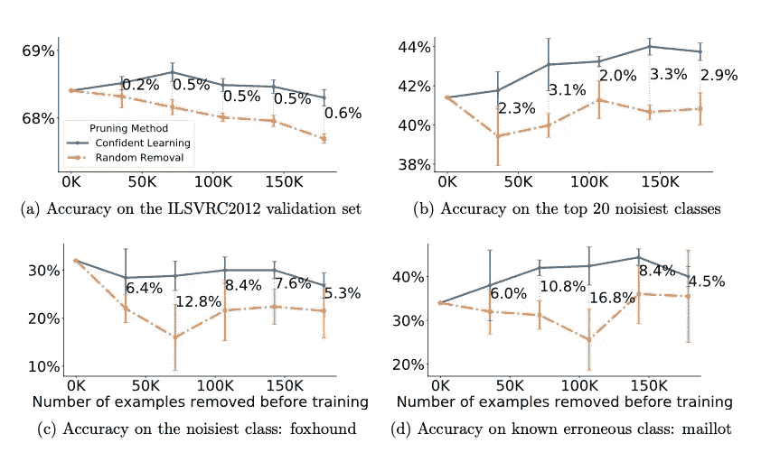
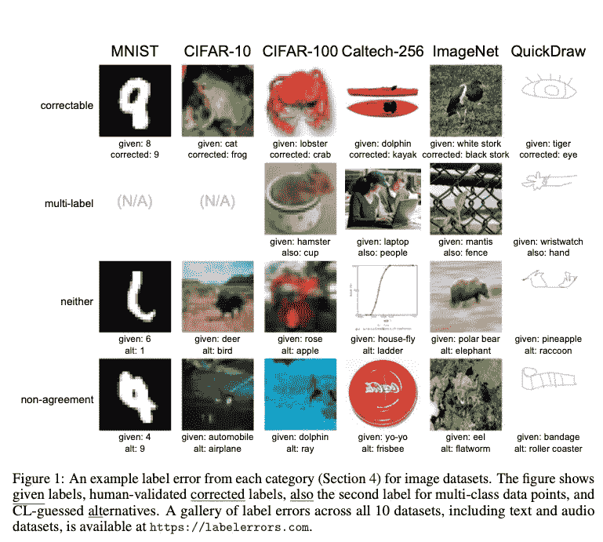
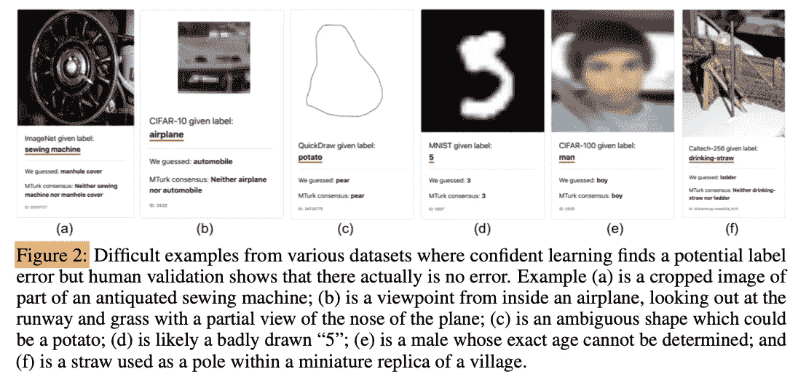
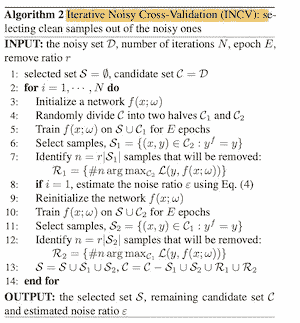
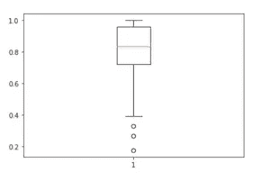
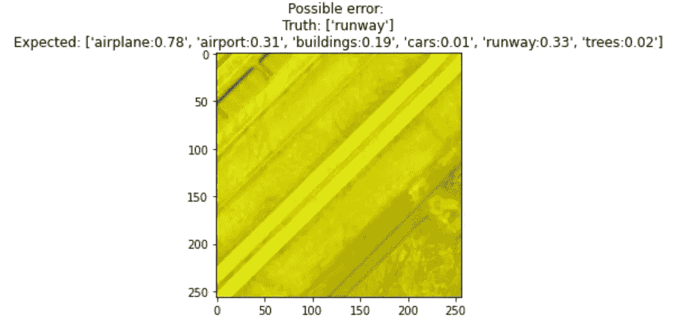
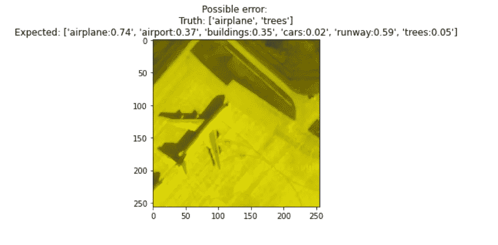

# 标签错误是必须的吗？自信学习有用吗？

> 原文：<https://towardsdatascience.com/confident-learning-err-did-you-say-your-data-is-clean-ef2597903328>

## 以数据为中心的人工智能，深度学习中的数据

## 不管你可能听说过什么，让深度学习如此伟大的是数据！

## 有一句老话总结得很好:

> *型号只有*一样好*一样好* **数据** *！*

这就给我们带来了真正的问题:你的数据到底有多好？收集地面实况/训练数据集是极其昂贵、费力和耗时的。标记的过程包括搜索感兴趣的对象，并应用先验知识和试探法来做出最终决定。表示(感兴趣的)对象是否存在的决定，如果存在，对其进行注释以提供额外的信息，如边界框和分段掩码。

在这个过程中，有几个因素会导致数据集中出现错误。问题是，我们能做些什么？在本帖中，我将涉及标注错误发生的一些原因、标注中的错误为何必不可少，以及可以使用哪些工具和技术来管理标注数据集中的错误。然后，我再深入到[自信学习](https://arxiv.org/abs/1911.00068)的细节。我还将演示如何使用 [cleanlab](https://github.com/cleanlab/cleanlab) ，一个[自信学习](https://arxiv.org/abs/1911.00068)实现【1】，轻松找到数据中的噪声。

**免责声明**:在深入细节之前，我想确认，在我写这篇文章的时候，我没有以任何身份隶属于 [cleanlab](https://github.com/cleanlab/cleanlab) 或受其赞助。

这篇文章分为以下几个部分:

*1。标签错误的原因*

*2。增加贴标错误风险的贴标效率技巧*

*3。标签中的错误是必要的*

*4。确切地说，什么是自信学习？*

*4.1。基础知识*

*4.2。CL 的局限性*

*5。使用 cleanlab 进行多标签分类的实际标签噪声分析*

*5.1。型号信息*

*5.2。使用 cleanlab* 探索噪声

*6。参考文献*

*7。结论*

# 标签错误的原因

让我们先来看看标签中可能出现错误的一些原因。这种错误的一大类是工具/软件错误。这些可以使用良好的软件最佳实践来控制和管理，比如涵盖软件和数据的测试。另一类错误是来自贴标机本身的错误。这些问题难以追踪。因为贴标机毕竟是这个深度学习过程中的神谕！如果我们不相信他们，那我们相信谁？

丽贝卡·克劳利(Rebecca Crowley)有一项非常有趣的工作，她提供了一个详细的图表，列出了为什么在场景中搜索时可能会错过某个(感兴趣的)物体，或者为什么他们可能会做出错误的最终决定。在我看来，一些直接影响标签的因素包括:

1.  **搜索满足**:一旦找到某样东西就停止搜索的倾向，导致过早停止，从而增加了遗漏注释的机会【4】。这更适用于需要多个注释的场景。例如，多标签或分段标注(狗和笔在图像中，但标注者只为狗标注，而没有花足够的时间来发现笔并在标签中捕捉)。
2.  **过度自信&信心不足**:这种类型的标签错误与一个人过度或低估的认知感有关。
3.  可用性(avail ability):如果某件事经常发生或很少发生，对它进行错误的注释会有一种隐含的偏见[4]。对于具有挑战性的贴标任务来说尤其如此。例如，如果一个位置的癌症患病率为 0.01%，那么当标记一个不那么直接的病例时，标记者更可能标记非癌症而不是癌症。
4.  **锚定/确认偏差**:当贴标机对贴标任务的结果做出先发制人的决定，然后寻找支持该决定的信息。例如，相信他们正在看一个癌症病例，他们开始在图像中搜索异常以支持该病例是癌症的发现。在这个不公平的搜索/决策过程中，他们更容易犯错误。
5.  **赌徒谬误**:当他们遇到类似案件的重复模式时，他们很可能会偏离并倾向于打破这种模式的结果【4】。
6.  在所有这些原因中，**认知超载**也是标签错误的一个有效且公平的原因。

# 增加标签错误风险的标签效率技巧

鉴于获取标注数据集的过程非常昂贵，有时会应用一些巧妙的技巧和技术来优化标注漏斗。虽然有些技术侧重于通过标签体验进行优化，如[快速交互式对象注释](https://arxiv.org/abs/1903.06874) [5]，但其他技术侧重于使用自动标签技术来减轻标签负担，以帮助贴标机。特斯拉有一个非常强大的机制来实现大规模的自动标签，正如 Karpathy 在[2021 CVPR](https://www.youtube.com/watch?v=a510m7s_SVI)中所谈到的。他们肯定有反馈的优势(不仅仅是事件值得标记，还有司机做了什么或者是否导致了灾难)。这是不是所有深度学习实践机构都有的优势！令人印象深刻！然后，我们还有一个训练制度的弱监督类，我不会详细介绍(也许是另一天的主题)！

事实是，你用来优化这个过程的技巧越聪明，你的数据集中出错的几率就越高。例如，在标签循环中使用模型越来越多地被用于优化标签过程(如本演示文稿中详述的[)，作为自动标签/预标签技巧，其中预测的标签被显示给贴标签机，而贴标签机仅微调注释，而不是从一开始就进行注释。这个过程有两个主要挑战:](https://suneeta-mall.github.io/talks/She_Builds_on_AWS_2020.html)

a)它可能会在标签[中引入整个范围的偏差，如上文(标签误差](http://0.0.0.0:4000/2022/05/16/confident-learning-clean-data.html#%20reasons-for-labeling-errors)的原因)中所述。

b)如果模型不能与人类标记器相提并论，校正垃圾在先标记的劳动和厌倦增加了数据集中的错误风险。这是认知超载的典型案例。

如果这个例子还不够，让我们来看一个使用本体/知识图自动标注[的例子。这里，如果编码在本体/知识图中的知识有偏差，错误传播的风险就太高了。例如，如果它是一个海洋水体，它可能是一个游泳池。因为，与常识相反，海洋池确实存在(例子可以在这篇博文](https://suneeta-mall.github.io/talks/KGC_NY_2022.html)的[中找到)。或者，如果它是一栋房子，那它就不是水体——因为你知道湖边的房子确实存在！](https://wanderingwheatleys.com/best-rock-pools-in-sydney-australia/)

# 标签中的错误是必然的

鉴于目前所讨论的挑战，可以说错误是不可避免的。在这个过程中的先知是贴标签的，他们只是普通人！

> *我是* **不完美***；我只是* ***人类*** *！*

显然，在 10 个流行的数据集上，估计平均至少有 3.3%的错误，例如，标签错误至少占 ImageNet 验证集 [2](https://arxiv.org/abs/2103.14749) 的 6%。

假设人类贴标机将产生一个完美干净的数据集，嗯，至少可以说有些过火。如果你关心的话，你可以使用多个标签来减少错误，通过一致意见来移除噪音。这是产生高质量数据集的一种很好的技术，但是它也贵很多倍，速度慢，因此作为标准的操作方式是不切实际的。除了昂贵之外，这也不能保证一个干净的数据集。这一点从 Northcutt 的 NeurIPS 2021 [2]的工作中可以明显看出，该工作分析了流行数据集测试集中的错误，这些数据集报告了流行数据集中数百个样本的顺序，尽管查看了贴标机的整理结果，但仍无法就真实情况达成一致(参见论文中的表 2 以供参考)。

在过去的几年里，我一直在使用模型在循环中寻找数据集中与模型不一致的样本。我发现的其他一些有用的技术是利用损失函数，正如 Andrej Karpathy 所说！最近，我已经看到了部署[基于本体的违例](https://suneeta-mall.github.io/talks/KGC_NY_2022.html)来查找样本的巨大好处，这些样本要么是 a)标签错误，要么是 b)我们没有意识到的极端边缘情况(也称为分布外[OOD]样本)。

然而，当我遇到诺斯卡特团队的清洁实验室项目(T21)并开始挖掘这个领域的大量文献时，我意识到我一直生活在遗忘中！我很兴奋地发现了所有的文献，这些文献提出了我迄今为止一直在使用的技巧和窍门，而我并没有意识到它们。不会再有了！！在接下来的章节中，我将讲述我通过阅读这些文献所学到的东西。

# 到底什么是自信学习？

> *所有型号都是错的，但有些是* **有用的** *！*

[自信学习](https://arxiv.org/abs/1911.00068)【1】(CL)就是利用我们手头所有有用的信息来发现数据集中的噪音，提高数据集的质量。它是关于使用一个 oracle(贴标机)并在构建中使用另一个 oracle(即模型)测试它！在很高的层面上，这正是我们通常所说的模型在回路中！

> *学习存在于数据环境中，然而置信度的概念通常关注模型预测，而不是标签质量！*<https://arxiv.org/abs/1911.00068>

*[自信学习](https://arxiv.org/abs/1911.00068) (CL)是一类学习，其重点是尽管数据集中存在一些噪声，但仍能学好。这是通过准确和直接表征数据中标签噪声的不确定性来实现的。CL 依赖的基础就是那个`Label noise is class-conditional, depending only on the latent true class, not the data` [1](https://arxiv.org/abs/1911.00068) 。例如，一个`leopard`很可能被错误地标记为`jaguar`。这是一个非常强有力的论点，实际上是不真实的。我可以认为场景(即数据)对贴标者的决定有影响。例如，一只在水中航行的脏东西如果在水中就不太可能被贴上汽车的标签。换句话说，用卡车运输的脏兮兮的东西会不会比在水上行驶的时候更容易被贴上汽车的标签？所以数据和背景很重要！
这个假设是`in statistics any assumption is fair if you can solve for x!`的经典案例。既然我们已经对此进行了挖掘，公平地说，这一假设在某种程度上是正确的，即使不完全正确。*

*CL 做出的另一个假设是，数据集中的错误率是< 1/2\. This is a fair assumption and is coming from [Angluin & Laird](http://homepages.math.uic.edu/~lreyzin/papers/angluin88b.pdf) 的[3]提出的用于类别条件噪声过程的方法，该方法在 CL 中用于计算噪声和真实标签的联合分布。*

*在[自信学习](https://arxiv.org/abs/1911.00068)中，一个相当好的性能模型被用来估计数据集中的误差。首先得到模型的预测值，然后利用特定类别的阈值设置得到置信度的联合分布矩阵；然后将其归一化以获得误差矩阵的估计。然后，这个估计的误差矩阵为数据集修剪、计数和排列数据集中的样本建立基础。*

> *估计联合分布具有挑战性，因为它需要将认知的不确定性(模型预测的概率)与随机的不确定性(有噪声的标签)区分开来，但这是有用的，因为它的边缘产生了文献中使用的重要统计数据，包括未被破坏的标签之前的潜在噪声跃迁率和反向噪声率。 [1](https://arxiv.org/abs/1911.00068) 。*

**

*[*自信学习*](https://arxiv.org/abs/1911.00068) *图片(图片来自*[*1*](https://arxiv.org/abs/2103.14749)*)**

*特定于类的阈值的作用对于处理每个类的模型性能的变化是有用的。这种技术也有助于处理预测标签中的冲突。*

*[自信学习](https://arxiv.org/abs/1911.00068)和 [cleanlab](https://github.com/cleanlab/cleanlab) (它的 python 实现)的伟大之处在于，虽然它没有提出任何开创性的算法，但它做了一些很少有人做的事情。将 antecedent 作品整合到一个非常好的技术框架中，这个框架如此强大，以至于它理所当然地质疑塑造深度学习进化的主要数据集。他们对包括 MNIST 在内的 10 个流行数据集的[分析](https://arxiv.org/abs/2103.14749)的工作受到了高度赞赏。这也提醒我们，我们正在大规模地让整个深度学习景观过度适应像 MNIST 和 ImageNet 这样的数据集，因为它们几乎必须使用数据集来基准测试和验证更大更好的算法，并且它们至少有 3.3%的误差，如果不是 20%(根据[诺斯卡特的团队](https://arxiv.org/abs/2103.14749)的估计)！*

*这种方法用于并排比较，其中样本被随机修剪(下图中的橙色部分所示)，或者更有策略地通过 CL 仅去除有噪声的样本(下图中的蓝色部分所示)。准确度结果如下所示。CL 比随机修剪做得更好！*

**

**借鉴* [*自信学习*](https://arxiv.org/abs/1911.00068) *(图片来自*[*1*](https://arxiv.org/abs/2103.14749)*)**

*以下是 CL 标记为有噪声/错误的一些样本的示例，还包括边缘情况，其中 a)两者都不正确，b)这是 CL 建议或提供的标签，但不清楚两者中哪一个是正确的(不一致):*

**

*使用[自信学习 2](https://arxiv.org/abs/2103.14749) 纠正的样本示例。*(图片来自* [2](https://arxiv.org/abs/2103.14749) *)**

*CL 显然不是 100%准确。在最好的情况下，这是一种使用认知不确定性预测器(模型)来估计噪声的努力。尽管如此，这些失败的例子也很有挑战性。*

**

*示例示例[自信学习](https://arxiv.org/abs/2103.14749)奋力拼搏！[2](https://arxiv.org/abs/2103.14749)(图片来自 [2](https://arxiv.org/abs/2103.14749) *)**

# *基本原则*

*让我们来看看 CL 构建的基础，深入了解一下构建[自信学习](https://arxiv.org/abs/1911.00068) ( [cleanlab](https://github.com/cleanlab/cleanlab) )的基础的前因和相关著作！*

1.  *如上所述，由 Angluin & Laird 提出的 is 类条件噪声是 CL 使用的主要概念。*
2.  *使用加权损失函数来估计错误分类的概率，如在 [7](https://proceedings.neurips.cc/paper/2013/file/3871bd64012152bfb53fdf04b401193f-Paper.pdf) 中使用的，与化学发光领域非常相关，尽管它没有直接用于由[自信学习](https://arxiv.org/abs/1911.00068)框架文件提出的化学发光技术。*
3.  *使用迭代噪声交叉验证技术，如 Chen 等人提出的。 al[8]，利用模型在环方法寻找噪声样本。该算法如下所示:*

**

*[陈](https://arxiv.org/abs/1905.05040)的 INCV 算法(图片来自【8】)*

*4.CL 不直接使用[mentor net](https://arxiv.org/abs/1712.05055)【6】。然而，这是非常相关的工作，建立在数据驱动的培训方法。简单地说，有一个教师网络，它建立了一个由易到难的样本(使用损失测量得出)的课程，学生在这个课程之外接受培训..*

**

*[MentorNet](https://arxiv.org/abs/1712.05055) 架构(图片来自 [<https://arxiv.org/abs/1712.05055> 6])*

*5.数据驱动教学还有其他变化，一个值得注意的例子是[合作教学](https://arxiv.org/abs/1804.06872)【9】，它看起来像是成对地互相教学，并在学习过程中互相传递无噪声样本(根据损失测量计算)。合作教学试图解决的主要问题是存在于导师网的记忆效应。(又名 M-Net)但由于数据共享，不在[合作教学](https://arxiv.org/abs/1804.06872)【9】中。*

**

*[合作教学](https://arxiv.org/abs/1804.06872) [<https://arxiv.org/abs/1804.06872> 9]方法与 [MentorNet](https://arxiv.org/abs/1712.05055) [6[又名 M-Net(图片来自 [<https://arxiv.org/abs/1804.06872> 9])*

*6.理解小损耗是有用样本和很可能正确样本的良好指标，而跳动的、高损耗产生的样本是有趣的！它们可能是极端的边缘情况或不符合分布的样本，也可能表明是错误的。这只适用于性能合理的模型，其能力至少比随机机会要好，如果不是更好的话！*

# *CL 的局限性*

*关于标签错误，CL 完全忽略的一件事是当一个或多个真正的标签完全丢失时。与多类分类相比，这更可能发生在多标签设置中，甚至更复杂的标签设置中，如分割或检测。例如，如果图像中有一台电视和一个水瓶，并且仅有的注释是针对电视的，而水瓶完全丢失了！这目前没有在 CL 中建模，因为依赖于在给定标签和真实标签之间建立成对的类条件分布。例如，如果给定的标签是猫，而实际的标签是狗。当真正的标签存在时，框架本身不允许它为丢失的标签建模。*

*CL 中提出的成对类别条件分布也限制了其在多标签设置中的使用。当多个标签可以在同一数据上共存时，显式。例如，屋顶和游泳池都可以出现在图像中，它们不一定是唯一的。这种限制来自成对(单类给出与单类预测)建模。这与斯坦福汽车数据集不同，在斯坦福汽车数据集中，品牌和型号被预测为多个标签，但它们是唯一的，即一辆车可以是 ute 或掀背车，但只有丰田或沃尔沃才能生产。在这种情况下，排他性允许对成对的类条件分布进行建模。这些是使用多头网络建模的更多的多标签多类。真正的多标签数据集无法像这些成对联合分布一样建模。它们也许可以用更复杂的联合分布公式来建模，但这种方法不能很好地扩展。[自信学习](https://arxiv.org/abs/1911.00068)【1】目前是一种计算量很大的算法，复杂度为 O(m2 + nm)。*

*说了这些，可能是文献中没有解释的东西，因为似乎 [cleanlab](https://github.com/cleanlab/cleanlab) 本身支持多标签分类。从概念上讲，我不清楚多重标签是如何工作的。随着此工具 [1](https://github.com/cleanlab/cleanlab/issues/263) 、 [2](https://github.com/cleanlab/cleanlab/issues/55) 上问题的解决，对多标签的支持也在发展。*

# *使用 cleanlab 进行多标签分类的实际标签噪声分析*

*既然我们已经介绍了背景和理论基础，让我们使用[置信学习](https://arxiv.org/abs/1911.00068)的实现 [cleanlab](https://github.com/cleanlab/cleanlab) 来测试标签噪声。具体来说，考虑到围绕它的不确定性，我将使用多标签分类(如上所述)！。对于这次实践，我将使用 [MLRSNet](https://paperswithcode.com/dataset/mlrsnet) 数据集。这个尖峰是使用 ResNet 作为多标签图像分类器构建的，预测可以同时共存的 6 个类别。这些类是`['airplane', 'airport', 'buildings', 'cars', 'runway', 'trees']` 并衍生自 [MLRSNet](https://paperswithcode.com/dataset/mlrsnet) 子集——即仅使用`airplane`和`airport`。*

*这个项目的源代码和[这个笔记本](https://github.com/suneeta-mall/label_noise/blob/master/label_noise_notebook.ipynb)是 [label-noise](https://github.com/suneeta-mall/label-noise) Github 库。[笔记本](https://github.com/suneeta-mall/label_noise/blob/master/label_noise_notebook.ipynb)检查 [cleanlab](https://github.com/cleanlab/cleanlab) 在检测标签噪音方面的表现，并识别出未分配的样品、奇怪的样品以及错误！*

# *模型信息*

*使用[标签噪声](https://github.com/suneeta-mall/label-noise)训练 19 个时期的模型的训练和验证损失。注意，对于这个峰值，我选择退出 n 重交叉验证(CV)。使用 CV 可以得到更好的结果，但是速度不快。*

**

*本练习中使用的模型的训练日志(图片由作者提供)*

# *cleanlab 在噪声方面的探索*

*如本笔记本中的[所示，过滤方法提供了一个被认为有噪声的样本列表。这将 38%的样本外数据标记为噪声/错误。](https://github.com/suneeta-mall/label_noise/blob/master/label_noise_notebook.ipynb)*

*等级提供了标签质量在 0-1 范围内的样本顺序，数字越高，样本质量越好。我用`get_self_confidence_for_each_label`方法寻找分布外(OOD)样本和基于熵的排序。每一项的分布如下:*

**

**基于熵排序的置信度排序(图片由作者提供)**

**

**自信排序的自信顺序(图片由作者提供)**

*被选为最低质量或置信度的样本确实是正确选择的。图像中遗漏了一架飞机(显示在突出显示的覆盖图中),另一个样本是 OOD！*

**

*样本被清除标记为噪声(图片由作者提供)*

*更有趣的是，所有三种过滤方法，按置信度和熵排序，都标记了这两个样本！因此，我们提高了阈值，虽然有假阳性(噪声)，但也有一些错误的好例子。*

**

*假阳性样本被清除标记为噪声(图片由作者提供)*

**

*另一个。真阳性样本被清除标记为噪声(图片由作者提供)*

*我不确定我是否遵循了如何解释多标签的[成对计数，所以这是另一天的练习！](https://github.com/cleanlab/cleanlab/issues/263)*

# *结论*

*正如本帖所讨论的，标签错误不可避免有几个原因。虽然需要不小的努力来最小化数据集中的误差，但是数据集中的误差管理也是有保证的。发现噪音数据、不一致数据或代表系统缺陷的数据(软件/工具问题或对定义目标类的概念的理解问题)的管理。像模型在环这样的方法，或者像本体这样的附加信息来发现数据集中这样的噪声或错误是有效的技术。[自信学习](https://arxiv.org/abs/1911.00068)为分析含噪声或 OOD 样本的数据集提供了坚实的基础，这是一种对多类方法非常有效的技术，并不断发展对多标签分类的支持。现在，开始清理数据集！大扫除快乐！*

# *参考*

1.  *C.g .诺斯卡特、l .江和 I .庄。自信学习:估计数据集标签的不确定性。人工智能研究杂志，70:1373–1411，2021。 [1911.00068](https://arxiv.org/abs/1911.00068)*
2.  *c . g . north cutt、a . Athalye 和 j . Mueller(2021 年)。测试集中普遍存在的标签错误会破坏机器学习基准的稳定性。国际学习代表研讨会(ICLR)。 [2103.14749](https://arxiv.org/abs/2103.14749)*
3.  *D.安格鲁因和 p .莱尔德。从嘈杂的例子中学习。机器学习，2(4):343–370，1988 年。[链接](http://homepages.math.uic.edu/~lreyzin/papers/angluin88b.pdf)*
4.  *Crowley RS，Legowski E，Medvedeva O，Reitmeyer K，Tseytlin E，Castine M，Jukic D，Mello-Thoms C .在基于计算机的系统中自动检测病理学家之间的启发和偏见。健康科学教育理论与实践。2013 年 8 月；18(3):343–63.doi:10.1007/s 10459–012–9374-z。PMID:22618855；PMCID: PMC3728442。[链接](https://pubmed.ncbi.nlm.nih.gov/22618855/)*
5.  *黄玲和和 Amlan Kar 和陈和 Sanja Fidler，用曲线快速交互对象注释-GCN。CVPR 2019[链接](https://arxiv.org/abs/1903.06874)*
6.  *姜，周，梁，李，李，，李(2018)。Mentornet:在损坏的标签上学习非常深度的神经网络的数据驱动课程。机器学习国际会议(ICML)。 [1712.05055](https://arxiv.org/abs/1712.05055)*
7.  *名词（noun 的缩写）Natarajan、I. S. Dhillon、P. K. Ravikumar 和 A. Tewari。带着嘈杂的标签学习。神经信息处理系统会议(NeurIPS)，第 1196–1204 页，2013 年。 [NurIPS 2013](https://proceedings.neurips.cc/paper/2013/file/3871bd64012152bfb53fdf04b401193f-Paper.pdf)*
8.  *页（page 的缩写）陈，廖本斌，陈国荣，张绍良。理解和利用用噪声标签训练的深度神经网络。国际机器学习大会(ICML)，2019 年。 [1905.05040](https://arxiv.org/abs/1905.05040)*
9.  *韩，b，姚，q，余，x，牛，g，徐，m，胡，w，曾，I，杉山，m(2018)。合作教学:具有极度噪声标签的深度神经网络的鲁棒训练。神经信息处理系统会议。 [1804.06872](https://arxiv.org/abs/1804.06872)*