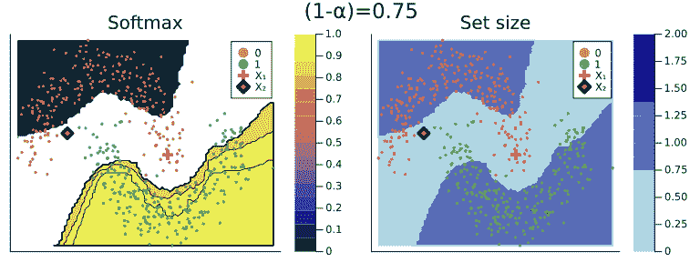

# Julia 中的共形预测

> 原文：<https://towardsdatascience.com/conformal-prediction-in-julia-351b81309e30>

## 第 1 部分—简介


图 1:两个不同样本的预测集和变化的覆盖率。随着覆盖率的增长，预测集的规模也在增长。图片作者。

构建可信的人工智能系统的第一个关键步骤是对**预测不确定性**保持透明。模型参数是随机变量，它们的值是从噪声数据中估计出来的。这种固有的随机性贯穿到模型预测中，至少为了避免对模型的过度自信，应该解决这个问题。

除了这种明显的担忧，事实证明，量化模型的不确定性实际上开启了无数的可能性，以改善上游和下游的建模任务，如主动学习和鲁棒性。例如，在贝叶斯主动学习中，不确定性估计用于指导新输入样本的搜索，这可以使地面实况调查任务更有效(Houlsby et al. 2011)。关于下游任务中的模型性能，不确定性量化可用于提高模型校准和稳健性(Lakshminarayanan、Pritzel 和 Blundell，2016 年)。

在以前的帖子中，我们已经看到了如何在**贝叶斯**环境中量化不确定性(参见[这里](/bayesian-logistic-regression-53df017ba90f)和[这里](/go-deep-but-also-go-bayesian-ab25efa6f7b))。因为在贝叶斯建模中，我们通常关心的是估计后验分布，我们得到的不确定性估计几乎是副产品。这对所有的意图和目的来说都是很好的，但是它依赖于对先前分布的假设。就我个人而言，我不反对做出先验分布假设的想法。相反，我认为贝叶斯框架将在模型中整合先验信息的想法正式化，因此为指导科学提供了一个强大的工具包。尽管如此，在某些情况下，这一要求可能被视为过于严格，或者我们可能只是缺乏事先信息。

进入:**保形预测**(CP)——一种可扩展的**频率主义方法**用于不确定性量化和覆盖控制。在这篇文章中，我们将介绍 CP 的基本概念。Julia 中的许多实际使用示例应该有助于传达一些直觉，并理想地吸引那些有兴趣为新的令人兴奋的开源开发做出贡献的人。

# 📖背景

保形预测有望成为一种易于理解、无分布和模型不可知的方法，以生成统计上严格的不确定性估计。这是相当拗口的，所以让我们来分解一下:首先，正如我希望在这篇文章中说明的那样，基本概念确实是相当容易理解的；第二，CP 确实只依赖于最小的分布假设；第三，生成共形预测的通用程序实际上几乎普遍适用于所有监督模型，因此使得该框架非常吸引 ML 社区；最后，CP 实际上具有频率覆盖保证，确保保形预测集包含具有用户选择的概率的真值。对于这个*边际覆盖*性质的正式证明和对这个主题的详细介绍，我推荐 Angelopoulos 和 Bates (2021)的教程。

> 在下文中，我们将大致把 Angelopoulos 和 Bates (2021)的教程及其设定的一般框架作为参考。不指望你读过这篇论文，但我也不会在这里重复任何细节。

CP 可用于生成回归模型的预测区间和分类模型的预测集(稍后将详细介绍)。最近也有一些关于共形预测分布和概率预测的工作。有趣的是，它甚至可以用来补充贝叶斯方法。例如，Angelopoulos 和 Bates (2021 年)指出，先验信息应纳入预测集，并证明贝叶斯预测分布如何整合，以符合覆盖的频率主义概念。与之相关的是，Hoff (2021)提出了一种贝叶斯最优预测方法。最后，Stanton、Maddox 和 Wilson (2022)最近提出了一种在贝叶斯优化中引入保形预测的方法。我发现这种结合不同思想流派的工作非常有前途，但是我有点偏离主题了…所以，事不宜迟，让我们看一些代码。

# 📦Julia 中的共形预测

在关于 CP 的第一篇短文的这一部分，我们将看看如何在 Julia 中实现共形预测。特别是，我们将研究一种方法，它与在 [MLJ](https://alan-turing-institute.github.io/MLJ.jl/dev/) 可用的许多受监督的机器学习模型中的任何一种兼容:一个由[艾伦图灵研究所](https://www.turing.ac.uk/)和[新西兰战略科学投资基金](https://www.mbie.govt.nz/science-and-technology/science-and-innovation/funding-information-and-opportunities/investment-funds/strategic-science-investment-fund/ssif-funded-programmes/university-of-auckland/)资助的漂亮、全面的机器学习框架。我们将通过一些基本的使用示例，使用我正在开发的一个新的 Julia 包:`[ConformalPrediction.jl](https://github.com/pat-alt/ConformalPrediction.jl)`。

> `ConformalPrediction.jl`是一个通过保形预测对在 [MLJ](https://alan-turing-institute.github.io/MLJ.jl/dev/) 训练的机器学习模型进行不确定性量化的软件包。在撰写本文时，它仍处于开发的早期阶段，但已经实现了一系列不同的 CP 方法。非常欢迎投稿:
> 
> [文档](https://www.paltmeyer.com/ConformalPrediction.jl/stable/)
> 
> [投稿人指南](https://www.paltmeyer.com/ConformalPrediction.jl/stable/#Contribute)

# 分裂共形分类

我们考虑一个简单的二元分类问题。让(Xᵢ，Yᵢ)，i=1，…，n 表示我们的特征-标签对，让μ: 𝒳 ↦ 𝒴表示从特征到标签的映射。为了便于说明，我们将使用 moons 数据集🌙。使用`[MLJ.jl](https://alan-turing-institute.github.io/MLJ.jl/v0.18/)`,我们首先生成数据，并分成训练集和测试集:

```
**using** MLJ 
**using** Random Random.seed!(123) *# Data:* 
X, y = make_moons(500; noise=0.15) 
train, test = partition(eachindex(y), 0.8, shuffle=true)
```

在这里，我们将使用一个称为*分裂共形预测*的 CP 的具体情况，然后可以总结如下:

1.  将训练分成适当的训练集和单独的校准集:𝒟ₙ=𝒟[train] ∪ 𝒟[cali].
2.  在适当的训练集上训练机器学习模型:μ(Xᵢ，Yᵢ)用于 i ∈ 𝒟[train].
3.  使用校准数据𝒟[cali]和拟合模型μ(Xᵢ，Yᵢ)为 i ∈ 𝒟[train].计算𝒮的不合格分数
4.  对于用户指定的期望覆盖率(1-α),计算不一致分数经验分布𝒮.的相应分位数 q̂
5.  对于给定的分位数和测试样本 X[test]，形成相应的保形预测集:C(X[test])={y: s(X[test]，y) ≤ q̂}

这是在`[ConformalPrediction.jl](https://github.com/pat-alt/ConformalPrediction.jl)`中用于分类和回归的默认程序。

你可能想在这里看一下分类案例[的源代码](https://github.com/pat-alt/ConformalPrediction.jl/blob/67712e870dc3a438bf0846d376fa48480612f042/src/ConformalModels/inductive_classification.jl#L1)(或者下面的 Github 要点)。作为第一个重要的步骤[，我们首先定义一个具体的类型`SimpleInductiveClassifier`，它包装了来自](https://github.com/pat-alt/ConformalPrediction.jl/blob/67712e870dc3a438bf0846d376fa48480612f042/src/ConformalModels/inductive_classification.jl#L3)`[MLJ.jl](https://alan-turing-institute.github.io/MLJ.jl/v0.18/)`的监督模型，并为一些超参数保留了额外的字段。作为第二个[步骤，我们定义了训练程序，其中包括数据分割和校准步骤。最后，作为第三个](https://github.com/pat-alt/ConformalPrediction.jl/blob/67712e870dc3a438bf0846d376fa48480612f042/src/ConformalModels/inductive_classification.jl#L26)步骤[,我们执行上述等式中的过程(步骤 5)来计算保形预测集。](https://github.com/pat-alt/ConformalPrediction.jl/blob/67712e870dc3a438bf0846d376fa48480612f042/src/ConformalModels/inductive_classification.jl#L56)

> 上面的永久链接会带你到本文写作时最新的软件包版本。由于该软件包还处于开发的早期阶段，因此代码库和 API 可能会发生变化。

朱莉娅的简单归纳共形分类。来自`[ConformalPrediction.jl](https://github.com/pat-alt/ConformalPrediction.jl).`的代码片段

现在让我们把这个带到我们的🌙数据。为了说明包的功能，我们将演示设想的工作流程。我们首先按照标准的`[MLJ.jl](https://alan-turing-institute.github.io/MLJ.jl/v0.18/)`约定定义我们的原子机器学习模型。使用`[ConformalPrediction.jl](https://github.com/pat-alt/ConformalPrediction.jl)`，我们然后使用标准 API 调用`conformal_model(model::Supervised; kwargs...)`将原子模型包装在共形模型中。为了根据我们的共形模型进行训练和预测，我们可以再次依靠传统的`[MLJ.jl](https://alan-turing-institute.github.io/MLJ.jl/v0.18/)`程序。特别是，我们将保形模型包装在数据中(将它变成一台机器)，然后在训练集上拟合它。最后，我们使用我们的机器来预测新测试样本`Xtest`的标签:

```
*# Model:* 
KNNClassifier = @load KNNClassifier pkg=NearestNeighborModels 
model = KNNClassifier(;K=50) *# Training:* 
**using** ConformalPrediction 
conf_model = conformal_model(model; coverage=.9) 
mach = machine(conf_model, X, y) 
fit!(mach, rows=train) *# Conformal Prediction:* 
Xtest = selectrows(X, first(test)) 
ytest = y[first(test)] 
predict(mach, Xtest)[1]**> UnivariateFinite{Multiclass{2}}**      
     ┌                                        ┐ 
   0 ┤■■■■■■■■■■■■■■■■■■■■■■■■■■■■■■■■■■ 0.94   
     └                                        ┘
```

最终预测是集值的。虽然`SimpleInductiveClassifier`的 softmax 输出保持不变，但预测集的大小取决于所选的覆盖率(1-α)。

当指定覆盖率非常接近 1 时，预测集通常会包括许多(在某些情况下是所有)可能的标签。例如，在下面，当将覆盖率设置为等于(1-α)=1.0 时，两个类别都包括在预测集中。这是直观的，因为高覆盖率实际上要求预测集以高概率覆盖真实标签。

```
conf_model = conformal_model(model; coverage=coverage) 
mach = machine(conf_model, X, y) 
fit!(mach, rows=train) *# Conformal Prediction:* 
Xtest = (x1=[1],x2=[0]) 
predict(mach, Xtest)[1]**> UnivariateFinite{Multiclass{2}}**      
     ┌                                        ┐ 
   0 ┤■■■■■■■■■■■■■■■■■■■■■■■■■■■■■■■■■■■ 0.5   
   1 ┤■■■■■■■■■■■■■■■■■■■■■■■■■■■■■■■■■■■ 0.5   
     └                                        ┘
```

相反，对于低覆盖率，预测集也可以是空的。例如，对于(1-α)=0.1 的选择，我们测试样本的预测集是空的。这有点难以直观地思考，我还没有找到一个令人满意的、直观的解释(如果你有，请分享！).当预测集为空时，`predict`调用当前返回`missing`:

```
conf_model = conformal_model(model; coverage=coverage) 
mach = machine(conf_model, X, y) 
fit!(mach, rows=train) *# Conformal Prediction:* 
predict(mach, Xtest)[1]**>** missing
```

图 1 应该更直观地说明这里到底发生了什么。它说明了所选覆盖率对预测的 softmax 输出和二维特征空间中的集合大小的影响。等高线被月球数据点(包括测试数据)覆盖。以红色突出显示的 X₁和 X₂这两个样本是为了便于说明而手动添加的。我们一个一个来看这些。

首先，请注意 X₁(红十字)属于预测不确定性较高的领域。它正好位于我们零级卫星的右下角🌜(橙色)，这个区域几乎完全被我们的一级卫星所包围🌛(绿色)。对于低覆盖率，X₁的预测集是空的:在左侧，这由 softmax 概率的缺失轮廓指示；在右边，我们可以看到相应的集合大小确实为零。对于高覆盖率，预测集包括 y=0 和 y=1，表明共形分类器不确定真实标签的事实。

关于 X₂，我们观察到，虽然也位于我们的零类卫星的边缘，但该样本填充的区域没有被来自相反类的数据点完全包围。在该区域中，可以预期基础原子分类器对其预测更加确定，但是仍然不是非常有信心。这是如何通过我们相应的共形预测集反映出来的？

对于低覆盖率(大约< 0.9)，保形预测集不包括 y=0:集大小为零(右图)。只有对于更高的覆盖率，我们才有 C(X₂)={0}:。覆盖率高到足以包括 y=0，但是相应的 softmax 概率仍然相当低。例如，对于(1-α)=0.9，我们有 p̂(y=0|X₂)=0.72.

这两个例子说明了一个有趣的观点:对于以高预测不确定性为特征的区域，保形预测集通常是空的(对于低覆盖率)或大的(对于高覆盖率)。虽然集值预测可能需要习惯，但这个概念总体上是直观的。



图 2:覆盖率对保形预测集的影响。最大软概率显示在左侧。预测集的大小显示在右侧。图片作者。

# 🏁结论

这真的是保形预测的短暂停留:一个活跃的研究领域，可能值得更多的关注。不过，希望这篇文章有助于提供一些色彩，如果有的话，让你对这个话题更加好奇。让我们回顾一下上面最重要的几点:

1.  保形预测是一种有趣的不确定性量化的频率主义方法，它甚至可以与贝叶斯相结合。
2.  它是可扩展的和模型不可知的，因此非常适用于机器学习。
3.  `[ConformalPrediction.jl](https://github.com/pat-alt/ConformalPrediction.jl)`在 pure Julia 中实现 CP，可用于从`[MLJ.jl](https://alan-turing-institute.github.io/MLJ.jl/v0.18/)`开始可用的任何监督模型。
4.  在现有的强大的机器学习工具包上直接实现 CP 向 ML 社区展示了这个框架的潜在用途。
5.  标准共形分类器产生集值预测:对于不明确的样本，这些集通常很大(对于高覆盖率)或为空(对于低覆盖率)。

下面我将留给你一些进一步的资源。

# 📚更多资源

你可能已经遇到了令人敬畏的保形预测 [repo](https://github.com/valeman/awesome-conformal-prediction) : Manokhin (n.d .)提供了与保形预测相关的资源的全面、最新的概述。在列出的文章中，你还可以找到 Angelopoulos 和 Bates (2021)，他们启发了这篇文章的大部分内容。报告还指出了其他流行编程语言的开源实现，包括 Python 和 r。

# 参考

安吉洛普洛斯，阿纳斯塔西奥斯 n，斯蒂芬贝茨。2021."保形预测和无分布不确定性量化的简明介绍."https://arxiv.org/abs/2107.07511[。](https://arxiv.org/abs/2107.07511)

霍夫彼得。2021."频率覆盖控制下的贝叶斯最优预测."【https://arxiv.org/abs/2105.14045】T4。

霍尔斯比、尼尔、费伦茨·胡斯扎尔、邹斌·加赫拉马尼和马蒂·朗格耶尔。2011."用于分类和偏好学习的贝叶斯主动学习."[https://arxiv.org/abs/1112.5745](https://arxiv.org/abs/1112.5745)。

拉克什米纳拉亚南、巴拉吉、亚历山大·普里策尔和查尔斯·布伦德尔。2016."使用深度集成的简单和可扩展的预测不确定性估计."[https://arxiv.org/abs/1612.01474](https://arxiv.org/abs/1612.01474)。

马诺欣，瓦列里。"可怕的共形预测"

斯坦顿，塞缪尔，韦斯利·马多克斯和安德鲁·戈登·威尔逊。2022."保形覆盖保证的贝叶斯优化."[https://arxiv.org/abs/2210.12496](https://arxiv.org/abs/2210.12496)。

关于归属，请引用此作品为:

帕特里克·奥特梅尔和帕特里克·奥特梅尔。2022.朱丽亚·🟣的共形预测🔴🟢."2022 年 10 月 25 日。

*原载于 2022 年 10 月 25 日 https://www.paltmeyer.com*[](https://www.paltmeyer.com/blog/posts/conformal-prediction/)**。**