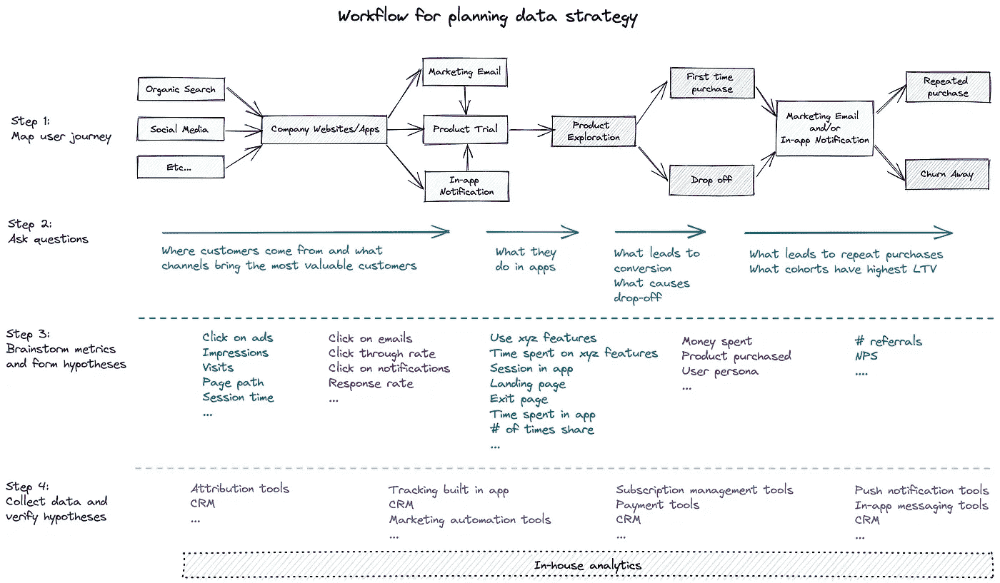
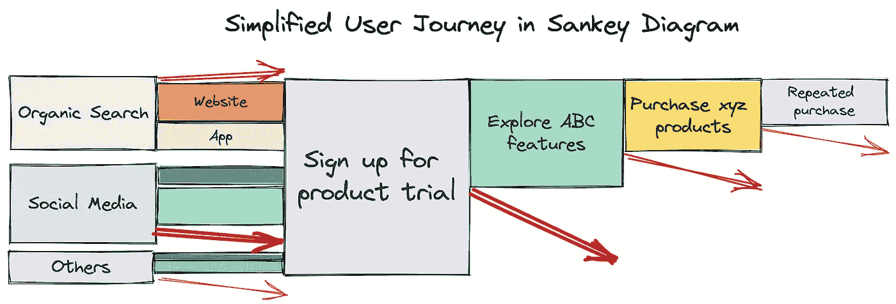

# 将数据战略中的点连接起来

> 原文：<https://towardsdatascience.com/connect-the-dots-in-data-strategy-56f65a1e63a5>

几年前，我在一家上市公司的新业务部门工作。第一年年末，我和联合创始人一起做年度回顾。一切看起来都很好，直到财务预测显示新业务不会产生管理层从一开始就预期的结果。事实证明，在年度评估之前，没有人把所有的业务数据放在一个地方，并解释它的含义。在接下来的一年，该公司根据年度审查的见解对新业务进行了重组。

后来，我在其他几家不同行业的公司工作过，也发生过类似上述的糟糕决策。大多数时候，它们是片面数据的结果。

# 数据驱动的战略正在出现，但大图却不见了

许多公司已经意识到数据分析可以成为决策的超级力量。他们雇佣人才并安装数据收集软件来实施数据驱动战略。然而，很少有公司有能力用数据来理解大局。

需要考虑所有维度的数据，以了解业务绩效和潜在的改进。然而，当团队独立地设置目标和度量标准时，没有人组织起来连接度量标准，不清楚每个团队的工作如何相互影响。

例如，营销追求为公司带来流量，产品努力在他们的平台上吸引用户，销售工作则尽可能多地吸引和拓展客户。每个公司都梦想了解哪个客户群转化最多，他们来自哪里，以及如何判断改变不太理想的客户群的行为是否可能以及如何改变。没有一个团队可以单独回答这些问题。

此外，许多公司在测试其与利润的相关性之前使用指标。他们假设哪些指标可能会影响业务，但在 OKR 使用这些指标之前，他们从未采取措施来验证这些假设。

更糟糕的是，许多公司都有数据科学家从一个请求跑到另一个请求。这些安排消耗了数据科学家的脑力，夺走了他们进行战略思考的时间，并阻止他们为公司带来真正的商业价值。

最后，分析软件正在把公司从连接这些点上拖走。如果没有大量的投资，公司很难让第三方软件互相交流，并提供一个商业的大画面。

# 如何连接数据分析中的点并避免陷阱

第一步是召集数据团队和领域专家一起制定业务流程。数据系统应该是业务流程的“数字孪生兄弟”。为了实现这个目标，团队需要理解在每个节点上跟踪什么。一个简化的 B2C 产品用户旅程如下图所示。

图表 1(图片由作者提供)

在描绘了用户旅程之后，下一步是提出正确的问题。上面的图表中列出了示例业务问题。根据问题，第三步是头脑风暴相关指标，形成假设。例如，为了了解客户来自哪里，团队可能依赖于点击广告、印象和页面访问指标。

接下来，团队需要收集数据，并用可视化或统计方法验证假设。在 OKR 使用这些指标之前，测试它们是至关重要的。否则，指标可能会导致有偏见的投资，比如市场焦点、定价策略等等。

当不同的利益相关者同意度量标准时，团队现在可以构建一个仪表板来监控业务决策如何影响度量标准和利润。桑基图是展示顾客如何沿着管道移动的好方法。

图表 2(图片由作者提供)

当公司创建他们的数据战略时，他们通常在绘制客户旅程和形成假设之前，首先考虑他们需要什么工具。如图 1 所示，全面的数据策略需要复杂的数据堆栈来提供不同的功能。由于数据分析生态系统仍然支离破碎，公司可能需要与十多家供应商打交道来构建数据堆栈。如果公司从评估供应商的每项能力开始，他们可能会很快淹没在信息中，失去大局。因此，**建议公司采用自上而下的方法规划其数据战略**。

最后，公司应该定期检查指标。在一个场景中相关的指标在另一个场景中可能不相关。当业务发展时，指标也应该发展。

要从实践的角度了解更多关于这个话题的信息，你可以参考[增强你的货币化——一种引导得分的实用方法](/supercharge-your-monetization-a-practical-way-to-lead-scoring-99452db89dec)。如果你想更深入地讨论数据策略，请联系 [Ivy](https://www.linkedin.com/in/ivylc/) 。要掌握商业策略和分析，请关注我的 Medium。下一篇文章再见。