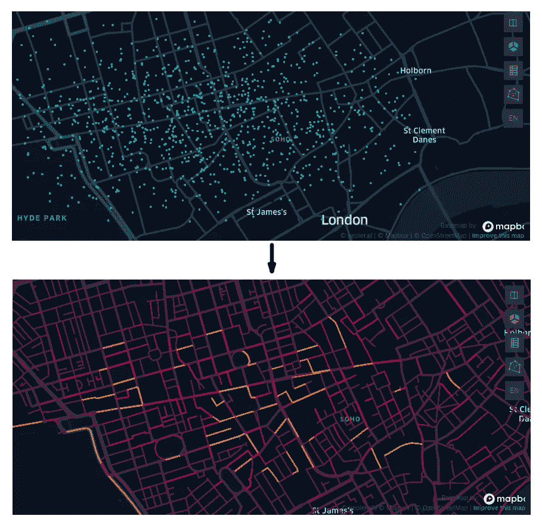
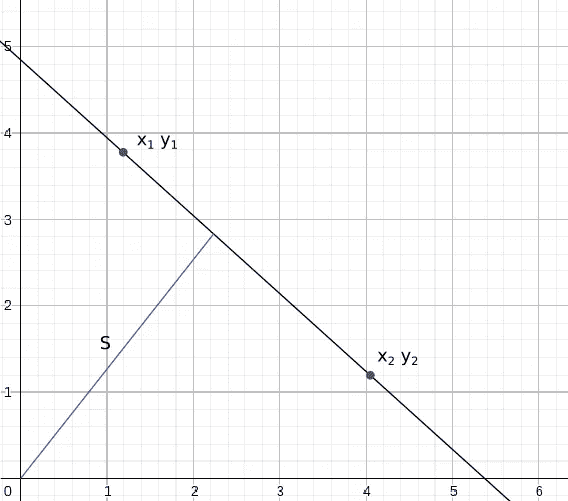
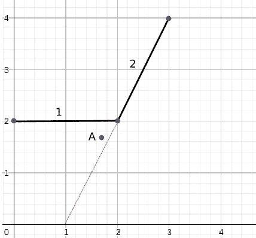
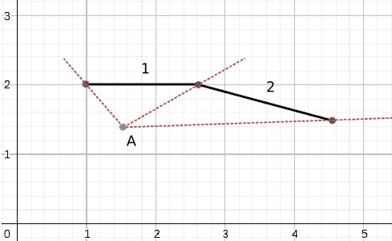
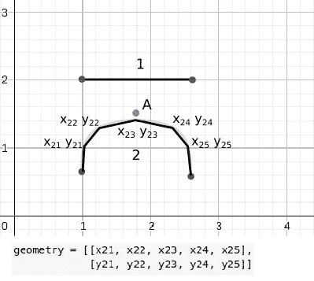
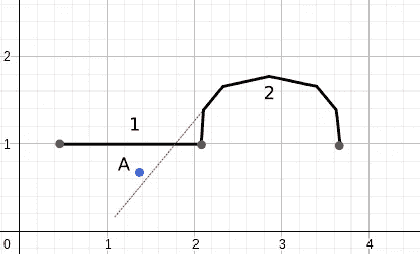

# 用 Python 高效地将数据点连接到道路图

> 原文：<https://towardsdatascience.com/connecting-datapoints-to-a-road-graph-with-python-efficiently-cb8c6795ad5f>

# 用 Python 高效地将数据点连接到道路图

## 如何从头开始构建一个函数，然后用 numba 将它加速 80 倍

美国宇航局在 [Unsplash](https://unsplash.com/s/photos/internet?utm_source=unsplash&utm_medium=referral&utm_content=creditCopyText) 拍摄的照片

一般来说，找到一个给定点的最近的道路是很容易的，但是当我们谈论数百万个点和数千条道路时，事情可能会变得有点复杂。我想告诉你如何从头构建一个这样的函数，然后用 Numba 把它加速 80 倍。

因此，在本文中，我将解决以下任务:

> 考虑到
> 
> -700 万个点，每个点由其经纬度决定
> -图中 1 万条道路。道路以 OSMnx 图形的形式存储
> 
> 去做
> 
> 对于图中的每条道路，找出这条特定道路距离最近的点的数量。

本质上需要的是将第一张地图转换成第二张地图，但是要有更多的点和街道。

颜色表示与给定街道相关的点数。(图片由作者提供)

不幸的是，给定的任务对于标准的 Shapely 函数来说太重了，所以我们需要定制解决方案。

## 1.几何学

作者图片

让我们从最简单的方法开始。从坐标原点到两点定义的直线的距离可以用以下公式计算:

作者图片

我们可以用这个公式来计算从任何给定点的距离。要做到这一点，所需要做的就是转换坐标，使给定点在原点结束。

让我们编写一个简单的函数，遍历所有的街道并找到最近的一条。

唯一的问题是，在现实生活中，街道不是无限的，通常由它们的端点来定义。

作者图片

考虑图中的情况。虽然点 A 更靠近第一个线段，但上面的公式告诉我们，点 A 更靠近第二个线段，因为它的延伸线就在点附近。

作者图片

为了消除这些街道，让我们引入一个规则，即从数据点到街道的垂直线必须在其端点之间相交。否则，街道被认为是不相关的。我想指出的是，这条规则相当于要求从数据点到街道端点的线与街道成锐角。第二个要求更容易检查。我们需要做的就是计算代表三角形边的向量的标量积。如果两个向量之间的角度是钝角，则标量积为负，反之亦然。

下面是检查三角形是否是锐角的代码。

我不会从头开始重写整个函数，只显示发生变化的部分。整个功能会在文末呈现。

我猜你已经知道我们将面临的下一个问题。现实生活中不是所有的街道都是直的。考虑下图中的情况

作者图片

我们刚刚开发的算法将第一条线作为最近的一条线返回，而答案显然是第二条线。这是因为当前的方法只考虑了端点，而没有考虑曲率。幸运的是，OSMnx 图还包含街道的几何形状，可以用街道子段的端点坐标序列的形式来表示。

作者图片

现在，要解决这个问题，我们需要做的就是对每条街道的所有子分段进行迭代。

然而，这又产生了一个意想不到的问题。如果某条远处街道的某一段的延续正好位于数据点附近，会发生什么情况？

作者图片

该点将与街道№2 相关联，而它显然属于第一条街道。然而，这个问题可以通过检查每个子线段的三角形是否尖锐来解决，就像我们已经对街道的端点所做的那样。

这涵盖了所有可能导致问题的情况，因此我们可以进入下一部分，效率优化。

## 2.效率优化

至此，整体算法完成。我们可以添加到函数逻辑中来加速它的唯一方法是检查街道是否太远，如果太远就删除街道。添加一条线后，检查所有端点是否都在一定距离之内，函数如下所示:

不幸的是，经过所有的调整后，计算 700 万个点中每个点的最近街道需要大约一周的时间。我们需要更深入。

我将使用 Numba 库来进一步加速这个函数。它所做的是在运行时使用 LLVM 编译器库将某些 Python 函数翻译成优化的机器代码。唯一的缺点是它不支持动态类型以及一些特定于 Python 的数据类型，如 Pandas 数据框。我故意没有使用不支持的数据类型，所以不会有问题。所以我们所要做的就是指定在加速函数中使用的变量的数据类型。

对于要用 Numba 强制的函数，必须在它之前放置@jit decorator。仅此而已。

现在，为了测试效率增益，让我们加载伦敦市中心的街道图，并生成一千个点。我试着用 Numba 加速和不用 Numba 加速找到所有点最近的街道。结果如下:

*   不含数字——4 分 27 秒
*   数字为 0 分 3.4 秒

代码运行速度提高了 80 倍，令人印象深刻。将 700 万个点与街道相关联的初始任务仅用了几个小时就完成了，而不是一周。

我把所有的代码和更多的图片做了一个笔记本。你可以在这个库中找到它。

感谢您阅读文章，希望您觉得有用！

 [## 丹尼尔·维蒂亚泽夫培养基

### 阅读 Danil Vityazev 在媒体上的文章。数据和商业分析师。我制作商业的数学模型…

vityazevdanil.medium.com](https://vityazevdanil.medium.com/)