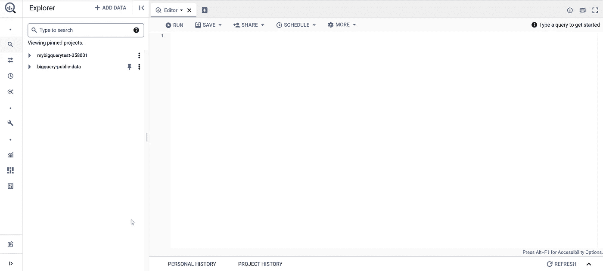
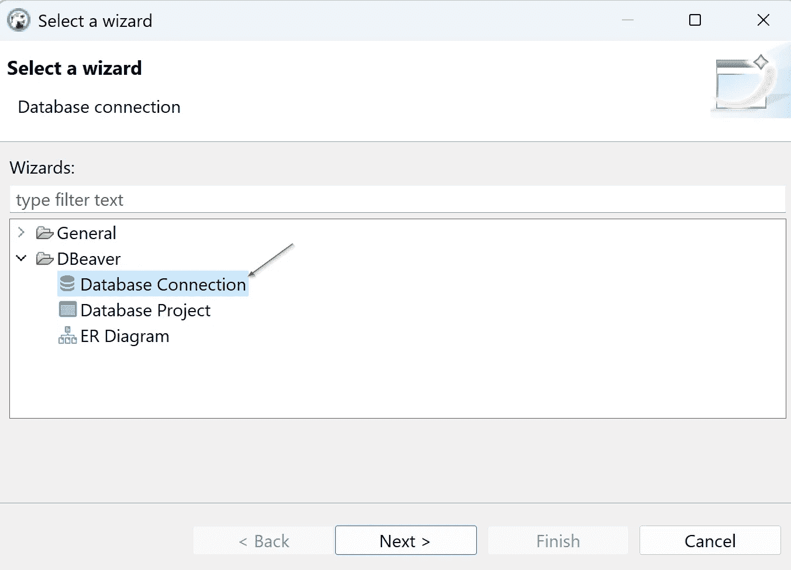
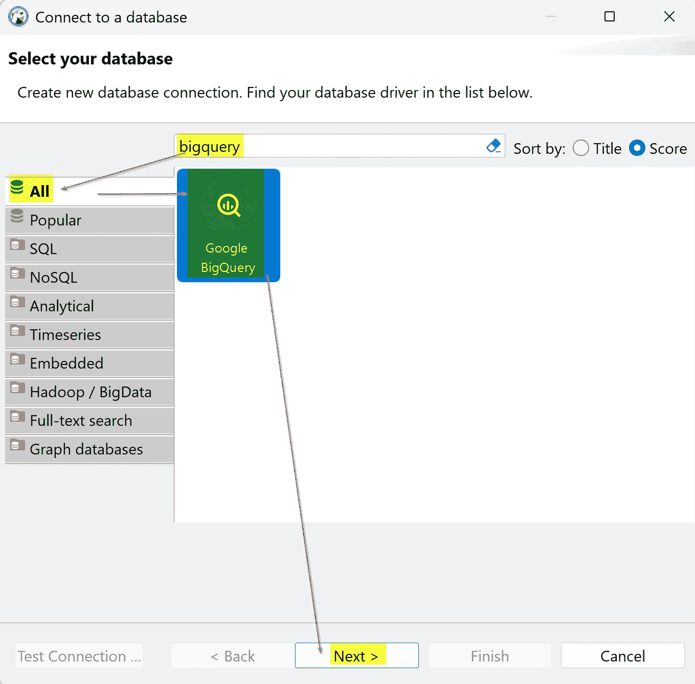
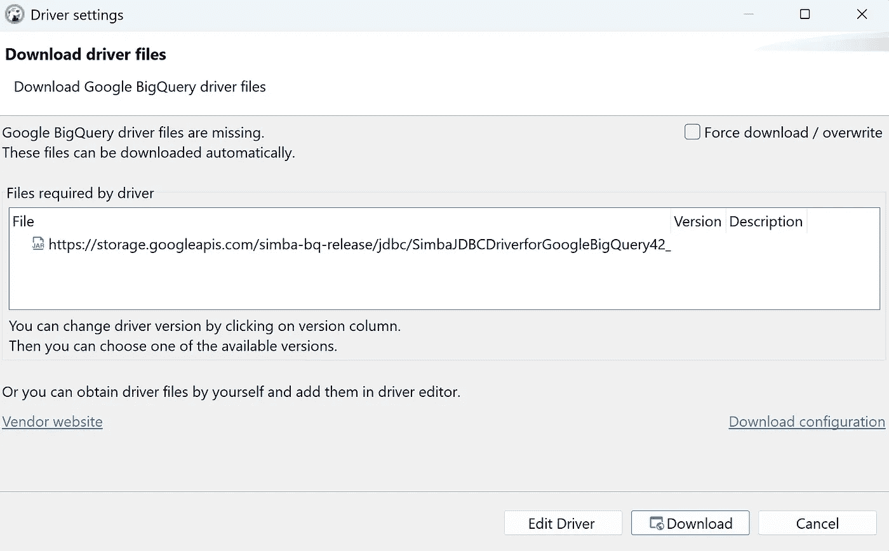
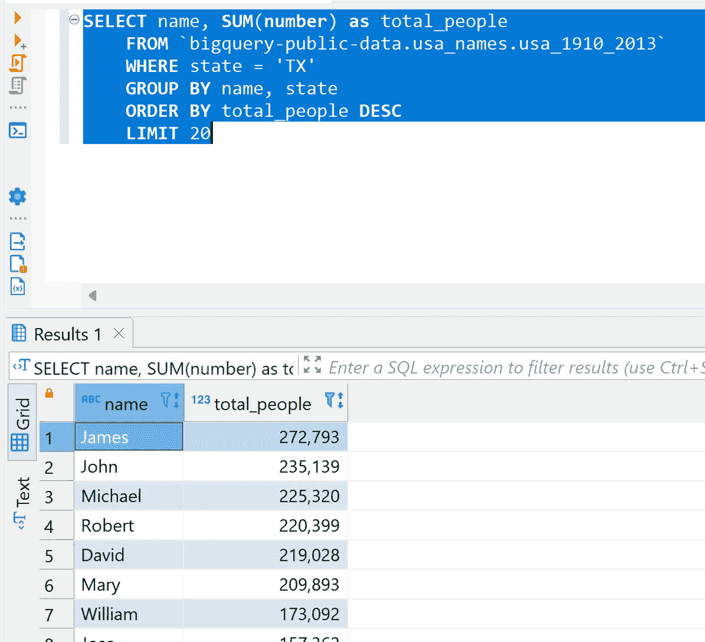

# 将 DBeaver 连接到 Google BigQuery

> 原文：<https://towardsdatascience.com/connecting-dbeaver-to-google-bigquery-23c8a12e55b5>

## 利用 JDBC，一步一步


图片来源于[unsplash.com](https://unsplash.com/photos/IKHvOlZFCOg)



BigQuery Web 界面。作者截图。

从我第一次使用 Google BigQuery 开始，我就觉得有必要连接到本地 IDE，而不是使用 Web 界面。尽管如此，我还是给了使用的时间，心想也许是因为多年使用专业工具像 DataGrip、Toad、SQLDeveloper、SQL Server Management Studio、Workbench J 等，我已经过时了。

也许我没有足够的耐心，或者我是对的，但是无论如何，如果以下任何一个问题正发生在你身上，也许这篇文章会帮助你:

*   你有没有感觉到 Google BigQuery 的网络界面让你的速度变慢了？
*   当你知道你的 SQL 是正确的时候，你有一些奇怪的错误信息吗？
*   您想重用您的代码并拥有一个包含 SQL 的本地文件吗？
*   你用标签输了吗？
*   创建新的数据库对象时，是否需要刷新整个页面？

# 摘要

在本帖中，我们将学习如何使用 JDBC 连接到 BigQuery:

1.  安装 DBeaver
2.  了解先决条件
3.  配置 BigQuery 连接
4.  测试连接

最后，我将添加**感谢**、**结论、**和**有用的资源。**

我建议您查看我之前在[https://towardsdatascience . com/Run-big query-SQL-using-Python-API-Client-b 5287 AC 05 b 99](/run-bigquery-sql-using-python-api-client-b5287ac05b99)上发表的关于[使用 Python API 客户端运行 big query SQL](/run-bigquery-sql-using-python-api-client-b5287ac05b99)的帖子，因为它详细介绍了创建和配置服务帐户以及添加公共数据集的步骤。

# 安装 DBeaver

DBeaver 是面向开发人员和数据库管理员的免费、流行、开源的通用数据库工具。

我选择在以下[链接](https://dbeaver.io/download/)下载并安装 **DBeaver 社区版**:

```
[https://dbeaver.io/download/](https://dbeaver.io/download/)
```


DBeaver 社区安装程序。作者截图。

# 了解先决条件

要使用 JDBC 连接 BigQuery，您需要:

*   **项目**:项目 ID
*   **用户**:服务账号邮箱
*   **密钥路径**:服务账户密钥文件

# 项目

项目名称不起作用。您听说您正在寻找**项目 ID** ，您可以在创建一个项目并选择页面顶部的项目名称后获得它，如下图所示:


项目名称不起作用。您需要一个项目 ID。图片由作者编辑。

# 用户

您可以通过选择**基于用户的**认证来使用您的 Google 帐户，但是当您关闭并打开 IDE 时，它会要求您再次登录。作为最佳实践，建议使用服务帐户。

如果不知道如何创建**服务账号**，可以查看我之前在[的帖子 https://towardsdatascience . com/run-big query-SQL-using-python-API-client-b 5287 AC 05 b 99](/run-bigquery-sql-using-python-api-client-b5287ac05b99)


OAuth 类型，DBeaver 连接。作者截图。

在 DBeaver 中，较新版本不请求**用户**，但是如果您使用的是旧版本，请注意**用户字段**正在等待**服务帐户电子邮件**。你可以进入**IAM&Admin→Service Account:**


服务帐户电子邮件。图片由作者编辑。

# 关键路径

密钥路径是指创建密钥时生成的 JSON 文件。如需了解更多信息，您可以查看我之前在[https://towardsdatascience . com/run-big query-SQL-using-python-API-client-b 5287 AC 05 b 99](/run-bigquery-sql-using-python-api-client-b5287ac05b99)上的帖子


添加关键服务帐户。图片由作者编辑。

# 配置 BigQuery 连接

我们将通过转到**文件→新建**并选择**数据库连接**来连接到 BigQuery:



新连接，DBeaver 向导。作者截图。

然后在搜索栏写 **bigquery** ，选择左边的 **All** ，选择 **Google BigQuery 图标，**和下一步按钮:



连接到数据库。DBeaver。作者截图。

对于连接设置，输入**项目 ID** ，选择**服务库**，选择 **KEY JSON 文件**的路径，如果是询问用户字段，则使用**服务账户邮箱**。


连接到数据库。DBeaver。图片由作者编辑。

然后选择左边的**测试连接**按钮，下载辛巴 JDBC 驱动程序:



下载辛巴 JDBC 驱动程序。DBeaver。作者截图。

# 测试连接

我们将使用美国名称来测试连接。要添加公共数据集，请遵循我在[https://towardsdatascience . com/run-big query-SQL-using-python-API-client-b 5287 AC 05b 99](/run-bigquery-sql-using-python-api-client-b5287ac05b99)上一篇文章中的步骤

使用以下 SQL 查询并按左侧的播放橙色三角形:

```
SELECT name, SUM(number) as total_people
FROM `bigquery-public-data.usa_names.usa_1910_2013`
WHERE state = 'TX'
GROUP BY name, state
ORDER BY total_people DESC
LIMIT 20
```

您将获得以下结果:



使用 DBeaver 的 BigQuery SQL 查询结果。作者截图。

# 结论

使用本地 IDE 连接 Google BigQuery 有两种方式，一种是使用 ODBC，另一种是使用 JDBC。

我发现与 JDBC 连接可能会令人困惑，如果你不知道该做什么，它会花费太多的时间，这就是为什么我解释了如何配置它，我很确定同样的过程可以与其他支持它的数据库工具一起工作。

请注意，您将失去的一个重要东西是要扫描的卷的可见性:


谷歌大查询图形用户界面。作者截图。

# 谢谢

给我的妻子戴安娜，她陪伴着我，忍受着我，并推动我继续分享。

# 有用的资源

[](https://cloud.google.com/bigquery/docs/reference/odbc-jdbc-drivers) [## BigQuery |谷歌云的 ODBC 和 JDBC 驱动程序

### Google 与 Magnitude Simba 合作提供 ODBC 和 JDBC 驱动程序，这些驱动程序利用了 BigQuery 的强大功能…

cloud.google.com](https://cloud.google.com/bigquery/docs/reference/odbc-jdbc-drivers) [](https://dbeaver.io/) [## DBeaver

### 免费的多平台数据库工具，面向开发人员、数据库管理员、分析师和所有需要工作的人…

dbeaver.io](https://dbeaver.io/)