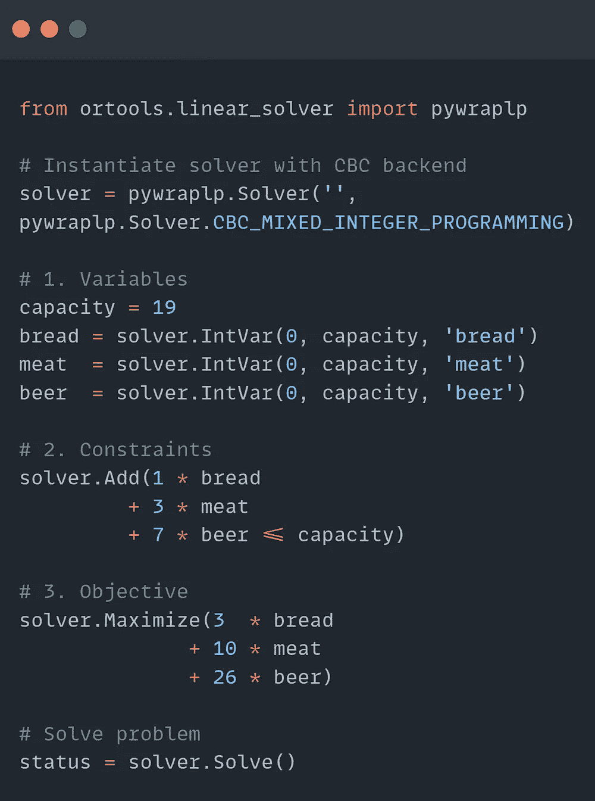
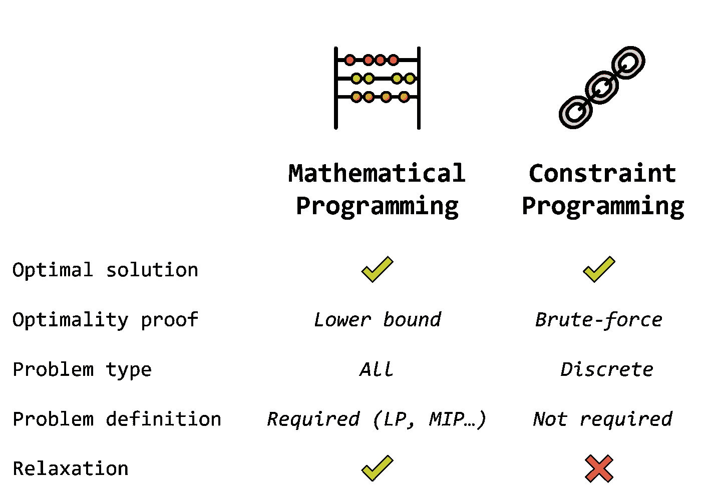

# Python 中的约束编程

> 原文：<https://towardsdatascience.com/constraint-programming-67ac16fa0c81>

## 在 8，080，104 个候选项中找出一个解决方案的编程范例


图片由作者提供，表情符号由[open moji](https://openmoji.org/)([CC BY-SA 4.0](https://creativecommons.org/licenses/by-sa/4.0/#))

约束编程是一种技术，**找到每一个解决方案**，尊重一组预定义的约束。

对于数据科学家来说，它是一个非常有价值的工具，可以用来解决各种各样的问题，比如调度、时间表、排序等等。在本文中，我们将看到如何以两种不同的方式使用 CP:

1.  **可满足性**:目标是通过缩小潜在解决方案的大集合来找到一个或多个可行的解决方案(*即*，考虑我们的约束的解决方案)；
2.  **优化**:目标是根据一个目标函数找到最佳可行解，就像线性规划(LP)一样。

我们将使用来自 [Google 的 CP-SAT 或-Tools](https://developers.google.com/optimization) ，一个优秀的免费开源 CP 求解器。请注意，它与 MPSolver 的**不同，MP solver 专用于线性和混合整数编程。CP 和 LP 之间的区别相当令人困惑，我们将在文章的最后触及这个话题。**

可以用下面的 [Google Colab 笔记本](https://colab.research.google.com/drive/1huTlPTaahdEEO29KKdlW9ic5zAwB3D58?usp=sharing)运行代码。

# **🪖 I.** 三个童子军问题的可满足性


图片作者，表情符号由[open moji](https://openmoji.org/)([CC BY-SA 4.0](https://creativecommons.org/licenses/by-sa/4.0/#))

在[上一篇](/integer-programming-vs-linear-programming-in-python-f1be5bb4e60e)中，我们创造了一支军队来击败对手。但是有一个小问题:我们必须猜测他的军队有多强大。

这次我们就派斥候去了解一下**的确切数字**。我们的 3 名侦察兵观察了敌营，这是他们告诉我们的:

*   **侦察兵 1**:*士兵数量是 13 的倍数*；
*   **侦察兵 2**:*士兵数量是 19 的倍数*；
*   **侦察兵 3**:*士兵数量是 37 的倍数*；
*   他们都同意士兵人数**不超过一万**。

我们的侦察兵有一种个人的清点士兵的方法，但是我们可以**结合**这三种观察做一个模型。

让我们把士兵的数量称为*军*。我们可以将我们的问题转化为以下同余系统:


如果你不熟悉这个符号，这是它在**编程术语**中的意思:


我们用 OR-Tools 来实现吧。我们需要做的第一件事是导入并创建 **CP-SAT 模型和求解器**。

**建模过程**与我们在线性编程中所做的非常相似。

创建我们的 CP 模型的第一步是声明**变量**。在这个例子中，我们只有一个:*军队*，士兵的数量。

我们必须给出下限和上限。**下限**是 1，因为我们知道有军队，而**上限**根据侦察兵的说法是 10，000:


在 OR-Tools 中，我们使用`NewIntVar`方法来创建这个变量。

第二步是声明**约束**。

在这个例子中，我们确定了三个约束。模是一个特殊的运算符，所以我们需要一个特定的函数用 CP-SAT 来处理:`AddModuloEquality`。如果你需要其他方法，你可以在[这个地址](https://developers.google.com/optimization/reference/python/sat/python/cp_model)找到参考指南。

不像线性规划，我们**这里不用定义一个目标函数**。

原因很简单:没什么好优化的！我们只想找到一个满足我们约束的**可行解**，但是没有“好”或“坏”的答案。这是约束编程的一个关键特征。

我们的模型是**完成**，我们现在可以要求或-工具来解决它。

```
================= Solution =================
Solved in 0.00 milliseconds🪖 **Army = 9139**Check solution:
  - Constraint 1: 9139 % 13 = 0
  - Constraint 2: 9139 % 19 = 0
  - Constraint 3: 9139 % 37 = 0
```

我们在不到一毫秒的时间内得到了答案:敌军中有 9139 名士兵。万岁，我们现在可以发射侦察兵了！

我们将搜索空间限制在上限 10000，这给了我们一个**唯一解**。但是如果我们推这个极限，情况还是这样吗？

CP 的另一个好处是能够找到问题的每一个可能的解决方案。当搜索空间很大时，这可能需要很长时间，因为求解器必须强力搜索整个空间(而不是用试探法减少空间)。让我们通过打印每个可能的解来探索这个特性，每个解都有一个新的上限 **100，000** 。

使用 OR-Tools，我们要求求解器根据`enumerate_all_solutions`参数寻找每一个可能的解。然后我们给它分配一个**回调**类，打印求解器找到的每个解。

我们找到了 **10 种解决方案**！这是意料之中的，因为我们将上限提高了十倍:这些解都是 9，139 的倍数。

如你所见，这个例子与优化无关:这是一个纯粹的**可满足性问题**。另一方面，这个同余系统可以用[中国剩余定理](https://en.wikipedia.org/wiki/Chinese_remainder_theorem)手动求解。但是 CP 不仅限于此…

# **🍻二。优化和啤酒**


图片由作者提供，表情符号由[open moji](https://openmoji.org/)([CC BY-SA 4.0](https://creativecommons.org/licenses/by-sa/4.0/#))

再来看另一个问题:我军还有几天就要面对敌人了。与此同时，军需官必须准备好战役中要用到的口粮。

补给车的空间有限，一些口粮比其他的更受 T21 人欢迎。有三种可能的配给:

*   🥖**面包**:只占 1 个空间但是人气 3 士兵没那么喜欢；
*   🥩**肉**:占 3 格，人气 10；
*   🍺**啤酒**:占了 7 个空位但是士兵爱吃，人气 26。


图片由作者提供，表情符号由[open moji](https://openmoji.org/)([CC BY-SA 4.0](https://creativecommons.org/licenses/by-sa/4.0/#))

补给车的容量为 **19 个车位**。如何挑选最好的口粮来使**的知名度最大化**？

这是一个我们已经见过的**优化**问题:实际上，它是著名的[背包问题](https://en.wikipedia.org/wiki/Knapsack_problem)的变体。我们可以重用前一篇文章中的代码，只需更改输入参数。

这一次，我们将使用约束编程来解决它。这种范式并不局限于寻找可行的解决方案。它还可以使用[不同的算法](https://en.wikipedia.org/wiki/Constrained_optimization)来处理这种开销，从而执行优化。

让我们创建一个问题模型。首先，我们必须声明三个变量:🥖**面包**，🥩**肉**，和🍺**啤酒**。可以有 0 个，但数量不能超过最大容量。


这一次，我们只有一个约束:面包、肉和啤酒所占据的空间**不能超过货车的容量** (19)。


我们希望**最大化所选口粮的总受欢迎度**:


模型完成，CP-SAT 可以**解决问题**！

```
================= Solution =================
Solved in 0.00 millisecondsOptimal value = **68 popularity**
Food:
  - 🥖Bread = 2
  - 🥩Meat  = 1
  - 🍺Beer  = 2
```

我们获得了**最高人气** (68)可能容量 19。

约束是否得到尊重？我们赶紧查一下:1×2🥖 + 3×1 🥩 + 7×2 🍺= 19，确实≤ 19。

好的，我想问另一个问题:**这个问题有多少种解决方案**？再次，我们可以用一个具体的回调来回答它，来统计它们。

```
121
```

我们找到了容量为 19 的 121 个解决方案。但是这个数字很快就增加了:容量为 1000，就有**8080104**个可能的解决方案！然而，CP-SAT 在不到一秒的时间内就找到了最优解。怎么可能呢？

CP 求解器不会用穷举搜索来强力解决问题，而是结合**试探法和组合搜索。更具体地说，约束满足问题最流行的三种技术是<https://en.wikipedia.org/wiki/Backtracking>**[**约束传播**](https://en.wikipedia.org/wiki/Local_consistency)[**局部搜索**](https://en.wikipedia.org/wiki/Local_search_(optimization)) 。****

**CP-SAT 很特别，因为它结合了 CP 和 SAT:它是合并 CP、LP、SAT 和元启发式的更广泛趋势的一部分。**

**我们说过前面的问题可以用线性编程来解决，所以让我们比较一下两种解决方案的代码:**

********

**左:LP 码，右:CP 码(图片由作者提供)**

**如您所见，语法非常相似，但并不相同:模型/解算器与解算器，`NewIntVar`而不是`IntVar`，等等。有一点翻译要做，但它很容易管理。**

**这两种技术**非常接近**:它们都处理带约束的变量，并使用数学和启发式方法进行优化。然而，CP 仅限于离散参数，而 LP 处理连续参数。另一方面，您可以在 CP 中实现类似于[【所有不同】](https://www.ibm.com/docs/en/icos/12.9.0?topic=variables-all-different-constraint)的专门化约束，但在 LP 中却不能。下面总结了这两种技术之间的主要区别:**

****

**图片由作者提供，表情符号由[open moji](https://openmoji.org/)([CC BY-SA 4.0](https://creativecommons.org/licenses/by-sa/4.0/#))**

**如果你想了解更多关于这个话题的内容，我推荐 Irvin J. Lustig 的这篇文章和 Jean-Fran ois Puget 的文章[。在建模和优化方面，CPLEX 的文档还详细描述了这个地址](https://medium.com/u/4e50789e7750?source=post_page-----67ac16fa0c81--------------------------------)的不同之处[。](http://ibmdecisionoptimization.github.io/docplex-doc/mp_vs_cp.html)**

# **结论**

****

**作者图片**

**约束编程是**数学优化**工具箱中另一项令人难以置信的技术。与传统的声明式编程相比，这是一种完全不同的方法。在这篇文章中，**

*   **我们看到**CP 的两个应用**具有可满足性和优化性；**
*   **我们在 OR-Tools 中实现了 **CP 模型**，玩了回调函数；**
*   **我们强调了 CP 和 LP 之间的**差异**。**

**在本介绍中，我们将自己限制在简单的问题上，但是 CP 在复杂的调度和路由问题上有着惊人的应用。这是我想在以后的文章中讨论的话题。**

**如果你有兴趣了解更多，请随时在 **Twitter** 上关注我，地址是[@ maxime labanne](https://twitter.com/maximelabonne)。感谢您的关注！**

# **相关文章**

**</introduction-to-linear-programming-in-python-9261e7eb44b>  </integer-programming-vs-linear-programming-in-python-f1be5bb4e60e> **