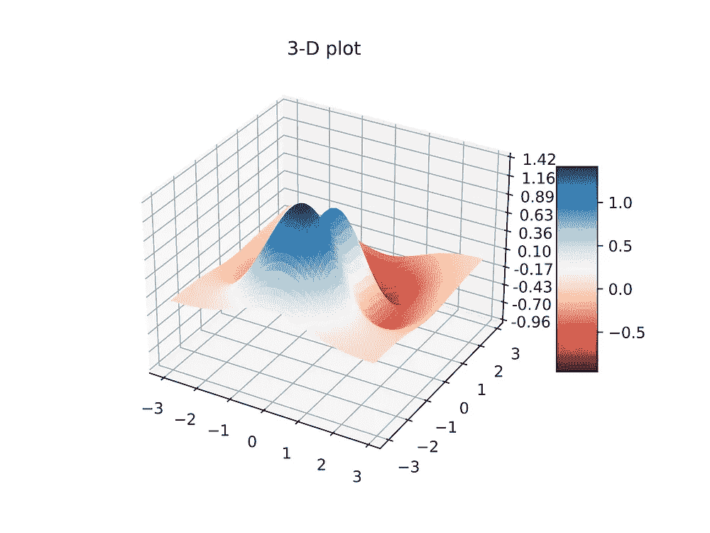
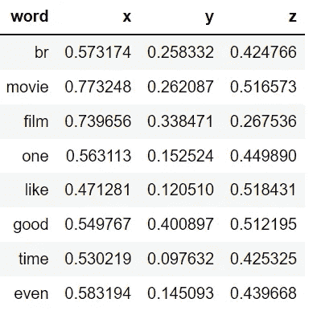
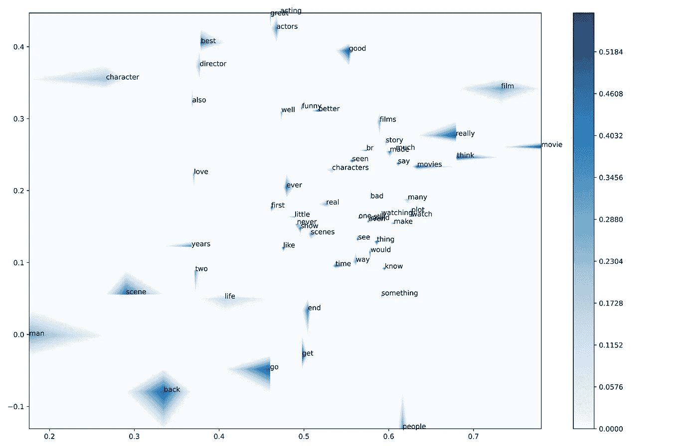
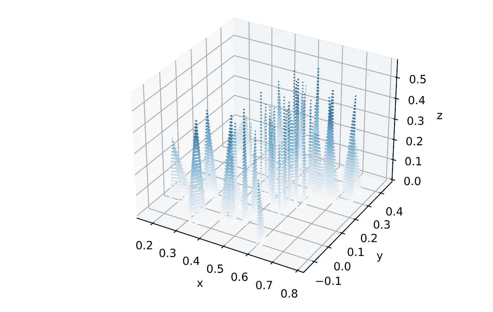

# Python 中的等高线图和单词嵌入可视化

> 原文：<https://towardsdatascience.com/contour-plots-and-word-embedding-visualisation-in-python-9dd2dacff6ac>

## 等高线图对于单词嵌入可视化来说是简单且非常有用的图形。这个端到端教程使用 IMDb 数据来说明 Python 中的编码。

图一。等高线图示例。来源:[commons.wikimedia.org。](https://commons.wikimedia.org/wiki/File:Plot_contour.png)

# 介绍

文本数据矢量化是现代自然语言处理中必不可少的一步。Mikolov 等人(2013a)和 Mikolov 等人(2013b)开发的两个 Word2Vec 模型普及了单词嵌入的基本概念。在高维空间中对文本数据进行矢量化，我们可以针对机器翻译和情感分类等任务调整 ML 模型。

单词嵌入通常被绘制成三维图形，这给在论文和演示中容易地呈现它们带来了一些困难。在这里，**等高线图**是如何处理三维数据可视化的简化，不仅在 NLP 中，而且最初在许多其他学科中。等高线图可用于在二维图形中呈现**单词嵌入**(即，单词的矢量表示)**。**本文提供了在二维空间中可视化单词嵌入的分步指南，并开发了可以使用等高线图的用例。

# 什么是等高线图？

等高线图可以在二维图中显示三维数据。它是一个二维图表，使用圆形(通常是彩色的)来表示第三个轴。圆上的任何一点在第三轴上都有相同的值。以下是等值线图中同一三维数据集的图形表示:

图二。显示 3D 数据的等高线图，来源:代码可从[此处](https://glowingpython.blogspot.com/2012/01/how-to-plot-two-variable-functions-with.html)获得。

这种类型的图形广泛用于制图，其中拓扑地图上的等高线指示相同的高程。许多师兄弟使用等高线图，包括**占星术、气象学和物理学。**等高线通常显示海拔高度(如地理特征的高度)，但它们也可用于显示密度、亮度或电势(Glen，2022)。

# 分步指南

回到 Python 中的 NLP，我们将在经典的 [IMDb 电影评论数据集](https://medium.com/r?url=https%3A%2F%2Fwww.tensorflow.org%2Fdatasets%2Fcatalog%2Fimdb_reviews)上展示等高线图，该数据集与[属性 4.0 国际许可共享。](https://creativecommons.org/licenses/by/4.0/)除了最后一个可视化步骤，实证应用程序遵循我在文章 [**中开发的策略，用 word 2 vec**](https://medium.com/python-in-plain-english/clustering-textual-data-with-word2vec-866dafbd213f)(kolab，2021)对文本数据进行聚类。有完整 python 代码的 Jupyter 笔记本[这里](https://github.com/PetrKorab/Contour-Plots-and-Word-Embedding-Visualisation-in-Python/blob/main/contour.ipynb)。

## **语料准备和** Word2Vec 模型训练

首先，我们将进行精确的数据预处理操作，如( [Korab，2021)](https://medium.com/python-in-plain-english/clustering-textual-data-with-word2vec-866dafbd213f) 。接下来，来自[*Gensim*](https://radimrehurek.com/gensim/models/word2vec.html)*库中的 Word2Vec 模型对文本语料库进行矢量化，并提供单词嵌入。这段代码训练了一个 Word2Vec 模型，其中 *Gensim == 4.2.0* 用于 200 个维度，只考虑出现次数大于 10 的单词:*

## *主成分分析降维*

*下一步，我们需要将数据的维度从 200 维减少到可以在笛卡尔三维空间中可视化的 3 维。这里，[主成分分析](https://www.javatpoint.com/principal-component-analysis) (PCA)是一个标准解:*

*以下是矢量化数据的外观:*

**

*图 3。IMDb 数据用 Word2Vec 矢量化，用 PCA 降维*

## *等高线图可视化*

*最后，我们将在等高线图中显示数据。*

> *使用 Word2vec 获得的向量捕获了单词的语义和语法质量，模型将语义相似的单词分组为彼此接近的单词。等值线图有助于在简单易懂的图中清晰地显示复杂的数据集。*

*可视化部分包括(1)使用[米勒(2020)](https://alex.miller.im/posts/contour-plots-in-python-matplotlib-x-y-z/) 提供的代码将**坐标旋转成矩阵结构**,( 2)**生成等高线**图，(3) **在图中标注文字**。所有这些步骤的 python 代码:*

*这是前 60 次嵌入的等高线图:*

**

*图 4。词嵌入的二维等高线图。*

*我们可以看到，Word2Vec 模型将单词*“film”、“films”、“T9”*“movie”、“T11”和*“movies”*在所有 3 个维度中彼此靠近地分组。同样，*“人物”【导演】**“演员”*也是彼此接近。对于出版质量数字，检查 [Matplotlib 文档](https://matplotlib.org/stable/api/_as_gen/matplotlib.pyplot.annotate.html)以格式化一些重叠单词的注释。***

为了比较，让我们看一下显示相同数据的三维等值线图:

图 5。单词嵌入的三维等高线图。

# 结论

等高线图是很少使用，但非常有用的文字嵌入可视化图形。好的例子包括各种**演示**中的数据故事和**研究论文中的格式图表。**在某个阈值内，论文和演示文稿中的 3d 嵌入可视化可能会变得不清楚和混乱。另一方面，等高线图提高了图形的解释能力，同时保持了它们的信息价值。它们的好处随着三维数据的复杂性而增加，有助于更多地了解数据集的结构。

完整的代码，包括所有的例子，都在我的 GitHub 上。

*PS:你可以订阅我的* [*邮箱列表*](https://medium.com/subscribe/@petrkorab) *在我每次写新文章的时候得到通知。如果你还不是中等会员，你可以在这里加入*<https://medium.com/@petrkorab/membership>**。**

# *参考*

*[1]格伦，S. 2022。*等高线图:定义、示例。*[Statistics show to . com:我们其他人的基本统计数据！](https://www.statisticshowto.com/contour-plots/)*

*[2] Korab，2021 年。[用 Word2Vec](https://medium.com/python-in-plain-english/clustering-textual-data-with-word2vec-866dafbd213f) 对文本数据进行聚类。 *Python 直白的英语。**

*[3]t . miko lov，Sutskever，I .，Chen，k .，Corrado，G. S .，Dean，J. 2013a。[词和短语的分布式表征及其组合性。](https://proceedings.neurips.cc/paper/2013/hash/9aa42b31882ec039965f3c4923ce901b-Abstract.html) *神经信息处理系统进展 26* (NIPS 2013)。*

*[4]t .米科洛夫，陈，k .，科拉多，G. S .，迪安，J. 2013b。[向量空间中单词表示的有效估计](https://scholar.google.com/scholar?oi=bibs&cluster=7447715766504981253&btnI=1&hl=en)。*计算与语言。**

*[5]米勒著，第 2020 页。使用 matplotlib 在 Python 中绘制等高线:像 X-Y-Z 一样简单 [*Alex P. Miller 博客*](https://alex.miller.im/posts/contour-plots-in-python-matplotlib-x-y-z/) ，2020 年 2 月 24 日。*