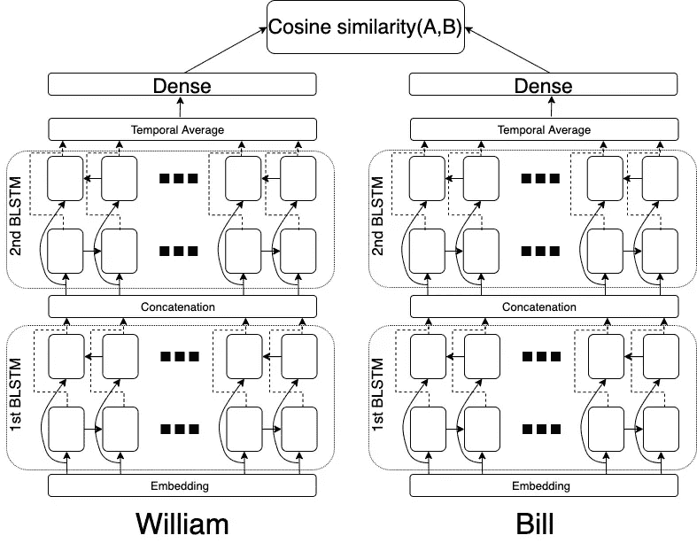
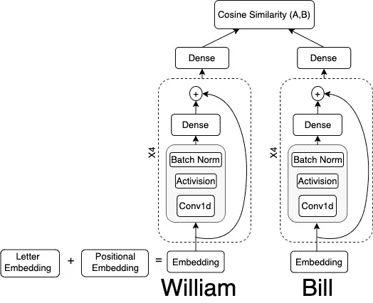
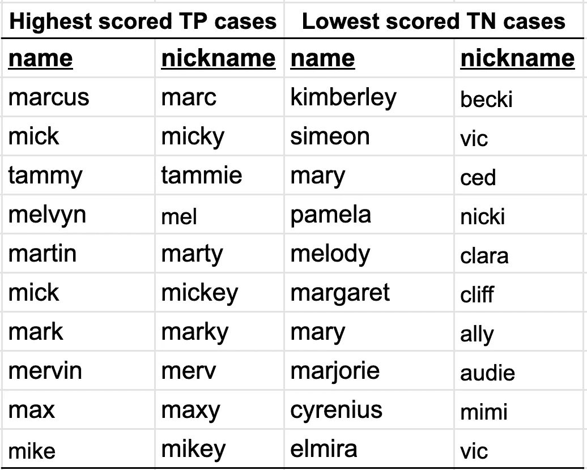
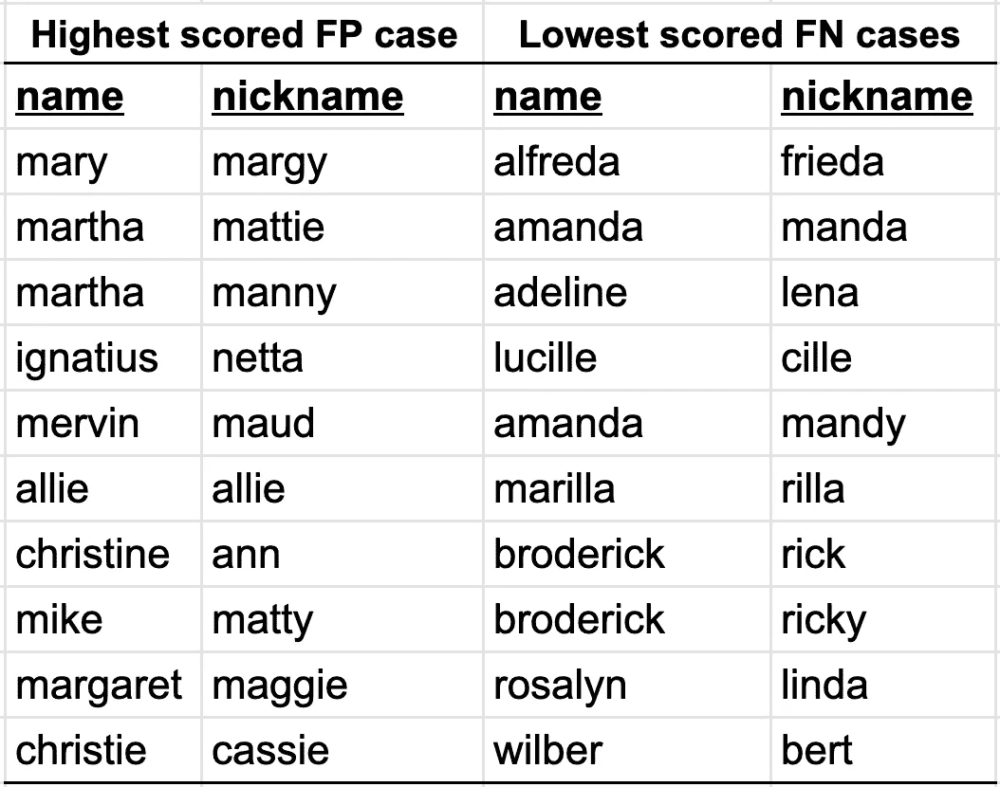
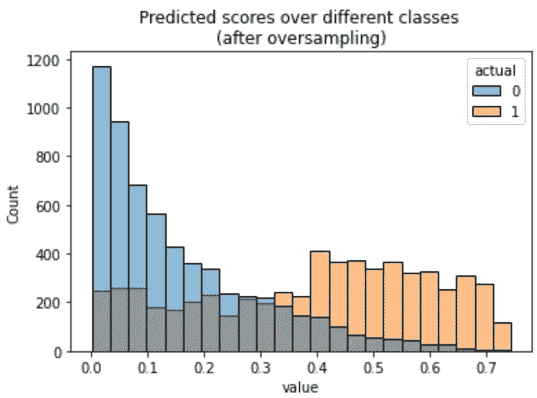

# 转换为音频可能会改善结果:使用暹罗网络的昵称分类

> 原文：<https://towardsdatascience.com/conversion-to-audio-may-improve-results-using-siamese-networks-for-nickname-classification-647cb0f88680>

## 使用暹罗网络学习姓名和昵称之间的相似性。将文本转换为语音可以改善结果。

在 [Unsplash](https://unsplash.com/s/photos/name?utm_source=unsplash&utm_medium=referral&utm_content=creditCopyText) 上由 [Waldemar Brandt](https://unsplash.com/@waldemarbrandt67w?utm_source=unsplash&utm_medium=referral&utm_content=creditCopyText) 拍照

我在本文中使用暹罗网络来学习姓名和昵称之间的相似性度量。训练好的模型告诉我们一个昵称对于一个给定的名字有多可信(假设名字在前面)。我探索了不同的架构，实验表明，对于一个小得多的网络，使用 TTSed 名称和昵称对的频谱图可以改善结果。

目前的项目提出了一个有趣的研究案例，因为查看姓名，这是“上下文无关”的文本，允许我们测试将文本转换为音频对性能的影响，而不考虑可能影响结果的其他因素。例如，在情感分析中，不同的语调可以改变给定文本的整体感觉。因此，将句子转换成语音可能会导致伪像。

这篇文章并不意味着作为一个介绍暹罗网络或对比损失。然而，我为这样的介绍添加了链接，好奇的读者可以参考下面的任何链接。

有关下面实验的更多细节，请参见该项目的 GitHub 页面[这里](https://github.com/DavidHarar/Siamese-Networks-for-name-nickname-similarity)。

## 介绍

了解两个元素之间的相似性对于许多应用程序都很重要。每当人们在手机上使用人脸识别时，他们的图像就会与现有图像进行比较。同一个人的图像可能会因光线、角度、面部毛发等因素而有所不同。所有这些都使得这个比较问题成为一项重要的任务。

相似性可以通过距离度量来衡量，就像 [KNN](https://en.wikipedia.org/wiki/K-nearest_neighbors_algorithm) 所做的那样，但是当面对复杂的数据时，它只会带我们走一段路。这里来帮助我们的暹罗网络架构。在暹罗网络中，我们通常使用两个或三个输入，然后通过相同的权重传递；不是计算输入之间的距离，而是测量它们嵌入之间的距离，并输入适当的损失。这允许我们将两个不同输入的嵌入推得更远，同时将来自同一类的两个输入的嵌入拉向彼此。

暹罗网络有一些有趣的用例。它们已被用于检测场景变化(Baraldi、Grana 和 Cucchiara (2015) [1])。在这篇出色的博文中，雷使用了暹罗网络对数字进行聚类。通过学习不同种类的输入之间的相似性(以及因此的不相似性),暹罗网络被用于零/少数镜头学习，其中我们试图说明一个输入是否熟悉网络熟悉的输入。关于这个主题的更多预览，请访问[这篇](/one-shot-learning-with-siamese-networks-using-keras-17f34e75bb3d)博客文章。

虽然大多数在线示例将连体网络用于计算机视觉，但连体网络在 NLP 领域也有一些很酷的应用。加西亚，Á·阿尔瓦罗等人(2021) [2]使用暹罗网络进行事实检查，建立一个语义感知模型，可以评估两个文本之间的相似程度，其中一个是事实。Gleize，Martin 等人(2019) [3]使用暹罗网络找到更有说服力的论点。他们的数据既包含相同立场的句子对，也包含交叉立场的句子对(即一个支持主题，另一个反对主题)。他们的网络任务是选择辩论的哪一方更有说服力。Neculoiu、Versteegh 和 Rotaru (2016) [4]提出了一种在可变长度字符序列上学习相似性度量的深度架构。他们的模型应用于学习职称之间的相似性(“java 程序员”应该更接近“java 开发人员”，但离“HR 专员”更远)。他们的体系结构包括四层 BLSTM，后面是一个线性层，并且他们使用嵌入之间余弦相似性的对比损失。这是我最初的架构，但它的表现并不好，可能是因为数据量少。

## **上绰号**

> 昵称是对熟悉的人、地方或事物的专有名称的替代。通常用来表达喜爱，一种喜爱的形式，有时是娱乐，它也可以用来表达对人格的诽谤。(来源:维基百科，[此处](https://en.wikipedia.org/wiki/Nickname))

昵称可以包含在名字中，也可以被包含在名字中。有时候，名字和昵称之间的联系并不明显。中世纪的英国人喜欢押韵。因此，“罗伯特”变成了“罗布”，然后，因为它和“鲍勃”押韵，这个昵称就被保留了下来。请看奥斯卡·泰对 Quora 问题的精彩回答。

【比尔】莎士比亚，维基百科，[此处](https://en.wikipedia.org/wiki/File:Shakespeare.jpg)

在很多情况下，人们可以在昵称中看到名字的子串，反之亦然，在保持昵称发音相似的同时改变元音也很常见(例如，“I”到“ea”)。另一个标准变化是用“ie”代替名字的结尾(例如，“萨曼莎”改为“余思敏”)。

创建姓名和昵称之间的相似性度量的任务首先是在学习的同时获得乐趣。这种模型的一些用例可以包括信任评估——例如，一个人在他们的在线帐户中使用的昵称/用户名与他们的姓名(与交易相关)匹配的可能性有多大。密码强度评估——使用自己的名字可能会导致弱密码，使用自己的昵称也可能会导致弱密码。

## 数据

这个项目的数据是通过几个来源创建的:

1.  [这里的男/女小称](https://github.com/jonathanhar/diminutives.db)
2.  安全企业主患者索引(SOEMPI)，[此处](https://github.com/MrCsabaToth/SOEMPI)
3.  common_nickname_csv，[此处](https://github.com/onyxrev/common_nickname_csv)

样本不够大，这极大地限制了我们的网络规模以及学习和归纳的能力。下表对其进行了描述。

样本大小

对于给定的名字，检查昵称是否合理的最简单的方法是使用子串匹配。在某些情况下，名字的子串完全包含在昵称中，反之亦然。令人惊讶的是，第二种更常见(2.2%对 26.5%！).

## 实验

**实验 1** :首先我实现了【4】中的模型。该模型由四个具有 64 长度隐藏状态的双向 LSTM 层组成。最后一个 BLSM 层的隐藏状态(一个向前和一个向后)被平均(“时间平均”)，然后 64 长度的向量通过密集层。在最初的论文中，两个输入，职位，被输入到模型中，在我们的例子中，名字和昵称被传递。

BLSM 模式的启发[4]

**实验 2** :让一个 LSTM 网络工作起来很有挑战性，对于我们所拥有的数据量来说，这可能是不可能的。然后，我在文本上使用 1d-CNN 暹罗网络。在时间序列数据上使用 CNN 的一个限制(例如，匹配两个字母序列的任务)是，它不保留序列中元素之间递归关系的任何信息。为了说明这一点，我同时使用了字母嵌入和位置嵌入(Gehring et al. (2017) [5])。

第二个实验的模型。在前三个块中，relu 用作激活函数，在第四个也是最后一个块中，使用 sigmoid。

实验三:由于昵称通常是通过社会交流创造出来的，所以有些名字听起来更像，而不是写出来的。例如，“Relief”和“Leafa”，在训练数据中是一对。虽然名字中的“lief”部分与昵称中的“Leaf”部分的写法不同，但它们听起来非常相似。为此，我通过谷歌的 [gtts](https://pypi.org/project/gTTS/) 库将所有的名字和昵称转换成语音。然后我使用 [librosa](https://librosa.org/doc/latest/index.html) 包将生成的 *.mp3* 文件转换成光谱图。

第三个实验的模型。D(A，B)是两个元素之间的欧几里德距离。

在实验 2 和实验 3 中，隐藏的 1d/2d-CNN 层都以这样的方式构造，即它们将返回与输入相同维数的张量。然后输入和结果以一种 [ResNet](https://d2l.ai/chapter_convolutional-modern/resnet.html) 的方式相加在一起(he 等人，(2016 a))【6】。

**实验 4** :最后，作为一个基准，我将上述模型与非学习方法进行比较，如 *Jaro，Jaro-Winkler* 和 *Levinstein Distance* (参见 William，Ravikumar 和 Fienberg (2003) [7]了解更多信息)。

## 结果比较

不幸的结果表明，非学习算法的表现比任何网络都好(但这有什么意思呢！).BLSTM 无法学习任何东西，即使在尝试缩小它之后(删除一些 BLSTM 层，输出一个短得多的隐藏状态长度)。1d-CNN 得到了一些不错的结果，但是 2d CNN 得到了更好的结果，因为参数数量少得多。

最终，Jaro Winkler 得到了最好的结果。

对上述结果的一个可能的解释是，我们拥有的数据太少，无法从一开始就训练这样的模型。

然而，两个网络都能够学习，而且不仅仅是在名字中包含昵称的简单情况，反之亦然。

## 结果分析

这部分的结果是 1d-CNN 模型的结果。查看哪些案例被正确分类是很有趣的，但是对不正确分类的仔细分析可以告诉我们一些关于被估计的相似性的信息。

**正确案例**:下表给出了正确分类的配对结果。不出所料，大多数真正的阳性案例都很简单，比如名字包含在昵称中，反之亦然。类似地，真阴性最低分配对案例在字母和发音方面都非常不同，只有“Kimberly”和“Becki”例外(我可能认为“Becki”是“Kimberly”的昵称，但也许这只是我的错)。

**错误案例**:更有趣的群体。看起来大多数 FP 案例都是合理的配对。人们可能会认为“玛蒂”(而不是听起来可能不同的“玛蒂”)实际上是“玛莎”的昵称。“玛丽”和“玛姬”也是如此。艾丽和玛格丽特是特别有趣的例子。我手头的资料包括“Margaret”和“M**eggie”这一对。“Allie”作为名字只有“Ali”作为昵称。“艾丽”作为昵称，是“艾伦”、“爱丽丝”等的昵称。这些例子可能意味着网络能够学习名字和昵称之间的一些潜在逻辑。另一方面，看看 10 个最低的假阴性病例是令人难过的，因为这个组的许多名字都包括他们的昵称，反之亦然。**

有关决策和边界的更多示例，请参见附录。

## 附录:损失函数、训练和提炼

损失函数:在我的实验中，我使用了几个损失函数。首先，我使用了[4]中描述的损失函数。然后我去探索不同的功能。我使用对比损失，灵感来自[这个](https://keras.io/examples/vision/siamese_contrastive/)实现。然后，我还使用了 BCE 损失，受[8]的启发，他使用对比损失和 BCE 损失的加权平均值进行癫痫发作预测。总体而言，对比损失在 ROC AUC 方面取得的结果比 BCE 损失稍差，但其目标略有不同。对比损失的目的是辨别输入向量的特征，随着下面等式中的α减小，将负得分推向零。

对比损失，符号取自此处的。

在所描述的项目中，我没有探究三重态损失，后续项目也可以扩展使用这一点。参见[这篇](https://gowrishankar.info/blog/introduction-to-contrastive-loss-similarity-metric-as-an-objective-function/)帖子，了解 BCE 损失、对比损失和三重损失之间更详细的比较。

下图显示了对比损失在类别之间的区分程度。

按损失类型的分数分布

**训练**:在暹罗网络中，两个输入通过同一个网络(或者，换句话说，我们对它们使用共享权重)。当我们不知道哪个输入将首先被输入时，它是有帮助的。在我们的例子中，从构造开始，这些对以相同的顺序构建—(姓名，昵称)，因此，使用不同的权重对它们中的每一个进行稍微不同的编码，但是在某种程度上使得这些编码的结果仍然具有较低的欧几里德距离，可能会改善结果。确实如此。对名字和昵称使用不同的权重改善了结果，但也使网络的参数数量翻倍。未来的工作可以通过将这种无限制网络的结果与具有共享权重的更深网络的结果进行比较来评估使用非共享权重的益处，使得两者具有相似数量的参数。

**提炼**:根据来自[的 Laura Leal-Taixé教授的建议，这个](https://www.youtube.com/watch?v=6e65XfwmIWE&t=2898s)关于暹罗网络的精彩讲座，暹罗网络的训练可以通过以下步骤进行提炼:

1.  训练网络几个时期
2.  d(A，P)表示同一类的两个输入之间的距离，d(A，N)表示不同类的两个元素之间的距离。在第二步，我们只采取困难的情况下，如

A，锚(名)，正例 P(真实昵称)和反例 N(不正确昵称)之间的相似距离。Laura Leal-Taixé教授的批注讲座[在此](https://www.youtube.com/watch?v=6e65XfwmIWE&t=2898s)

3.只对疑难病例进行训练。

细化网络能够取得稍微改善的结果，但并没有把网络改得面目全非。

**决策界限**:下图显示了每个类别的分数分布。这些分布被分别归一化，所以我们可以把数据看成是平衡的。我选择使用 0.4 的决策边界。

下面是低于阈值的 10 个样本，接下来是最接近阈值的 10 个样本，然后是来自阈值以上区域的另外 10 个样本。

我们看到最接近 0.3 的例子大多是无效对。最接近判定阈值的 10 对中的 4 对是有效的，最接近 0.5 的 10 对中的 7 对是有效的。此外，我们看到在大多数正面例子中，名字不包括昵称，反之亦然。

## 文献学

[1]巴拉尔迪、洛伦佐、科斯坦蒂诺·格拉纳和丽塔·库恰拉。"用于广播视频中场景检测的深度连体网络."第 23 届 ACM 国际多媒体会议会议录。2015.

[2]韦尔塔斯-加西亚、Á·阿尔瓦罗等人，“通过语义感知多语言模型反击错误信息”*智能数据工程和自动化学习国际会议*。施普林格，查姆，2021。

[3]格莱泽、马丁等《你信服了吗？用连体式网络选择更有说服力的证据。” *arXiv 预印本 arXiv:1907.08971* (2019)。

[4]neculiou，Paul，Maarten Versteegh 和 Mihai Rotaru。"用暹罗循环网络学习文本相似性."第一届 NLP 表征学习研讨会论文集。2016.

[5] Gehring，Jonas 等，“卷积序列到序列学习”*机器学习国际会议*。PMLR，2017。

[6]何，，等.“用于图像识别的深度残差学习”*IEEE 计算机视觉和模式识别会议论文集*。2016.

[7]科恩、威廉·w .、帕拉德普·拉维库马尔和斯蒂芬·芬伯格。"名称匹配任务的字符串距离度量的比较." *IIWeb* 。第三卷。2003.

[8] Dissanayake，Theekshana 等，“使用深度学习模型进行独立于患者的癫痫发作预测。” *arXiv 预印本 arXiv:2011.09581* (2020)。