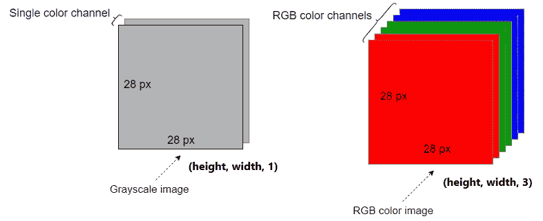
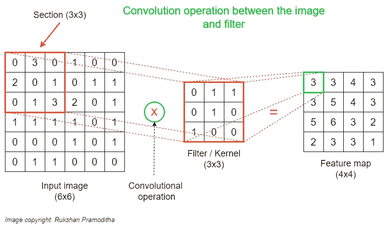
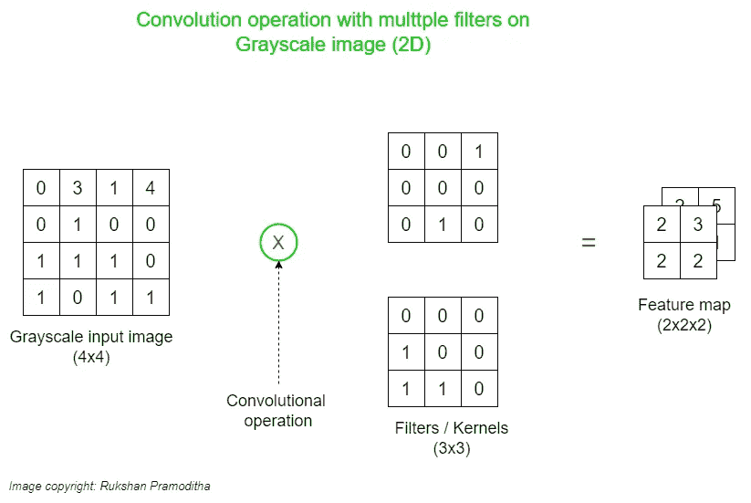
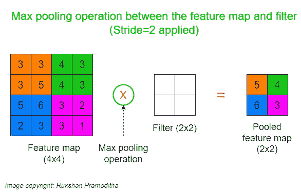
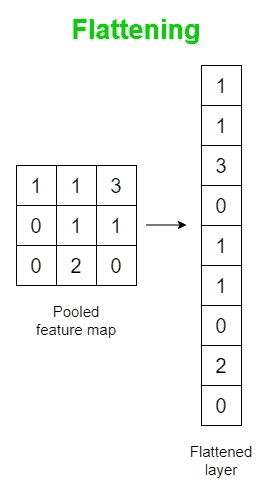
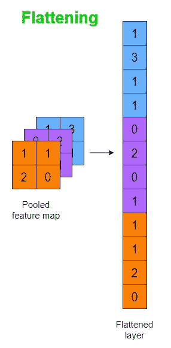

# 卷积神经网络(CNN)架构用简单的图表用简单的英语解释

> 原文：<https://towardsdatascience.com/convolutional-neural-network-cnn-architecture-explained-in-plain-english-using-simple-diagrams-e5de17eacc8f>

## 神经网络和深度学习课程:第 23 部分


原始图片由 [Gerd Altmann](https://pixabay.com/users/geralt-9301/?utm_source=link-attribution&utm_medium=referral&utm_campaign=image&utm_content=7255440) 从 [Pixabay](https://pixabay.com/?utm_source=link-attribution&utm_medium=referral&utm_campaign=image&utm_content=7255440) 获得，由作者编辑

我们已经讨论了一种神经网络架构——多层感知器(MLP)。MLP 不适用于图像数据，因为即使对于小图像，网络中也涉及大量参数。

卷积神经网络(CNN)是专门为处理图像而设计的。它们广泛应用于计算机视觉领域。

# CNN 的动机

以下是在处理图像数据时使用 CNN 而不是 MLPs 的两个主要原因。这些原因会激励你更多地了解 CNN。

*   要对图像使用 MLPs，我们需要使图像变平。如果我们这样做，空间信息(相邻像素之间的关系)将会丢失。所以，准确度会大大降低。CNN 可以保留空间信息，因为它们以原始格式拍摄图像。
*   CNN 可以显著减少网络中的参数数量。因此，CNN 是参数有效的。

## 灰度与 RGB 图像(先决条件)

CNN 处理灰度和 RGB 图像。在我们继续之前，你需要了解灰度和 RGB 图像之间的区别

图像由像素组成。在深度学习中，图像被表示为像素值的数组。

灰度图像中只有一个颜色通道。因此，灰度图像被表示为`(height, width, 1)`或简称为`(height, width)`。我们可以忽略第三维度，因为它是一维的。因此，灰度图像通常表示为 2D 阵列(张量)。

RGB 图像中有三个颜色通道( **R** ed、 **G** reen 和 **B** lue)。因此，一个 RGB 图像被表示为`(height, width, 3)`。第三维表示图像中颜色通道的数量。RGB 图像被表示为 3D 阵列(张量)。



**灰度与 RGB 图像表示**(图片由作者提供，使用 draw.io 制作)

**注意:**这里有更多的资源来了解更多关于灰度和 RGB 图像的信息。

*   [RGB 和灰度图像如何在 NumPy 阵列中表示](/exploring-the-mnist-digits-dataset-7ff62631766a)
*   [0D、1D、2D、3D、4D 和 5D 张量的真实世界示例](https://rukshanpramoditha.medium.com/real-world-examples-of-0d-1d-2d-3d-4d-and-5d-tensors-100b0837ced4)

# CNN 架构

与 MLP 架构相比，CNN 架构比较复杂。在 CNN 架构中有不同类型的附加层和操作。

CNN 以原始格式拍摄图像。我们不需要像在 MLPs 中那样将图像展平以用于 CNN。

## CNN 中的层

CNN 中主要有三种类型的层:**卷积层**、**汇聚层**和**全连接(密集)层**。除此之外，在每个卷积层和全连接层之后添加激活层。

## CNN 中的操作

CNN 中有四种主要类型的运算:**卷积运算**、**汇集运算**、**展平运算**和**分类**(或其他相关)**运算**。

别糊涂了！我将逐一讨论这些内容，并最终将它们结合起来，形成一个 CNN 架构的全貌。

# 卷积层和卷积运算

CNN 的第一层是卷积层。CNN 中可以有多个卷积层。第一个卷积层将图像作为输入并开始处理。

## 目标:

*   从图像中提取一组特征，同时保持邻近像素之间的关系。

卷积层有三个元素:**输入图像**、**滤波器**和**特征图**。 ***卷积运算*** 发生在每个卷积层中。

卷积运算只不过是图像部分和滤波器之间的 ***元素乘和*** 运算。现在，参考下图。



**卷积运算**(图片由作者提供，用 draw.io 制作)

> 卷积操作发生在图像的一部分和过滤器之间。它输出特征图(缩小图像)。

**滤镜:**这也叫 ***内核*** 或者 ***特征检测器*** 。这是一个小矩阵。在单个卷积层中可以有多个滤波器。在卷积层中使用相同大小的滤波器。每个过滤器都有特定的功能。使用多个过滤器来识别图像中不同的一组特征。滤波器的大小和滤波器的数量应该由用户指定为超参数。该尺寸应小于输入图像的尺寸。过滤器内的元素定义了 ***过滤器配置*** 。这些元素是 CNN 中的一种参数，在训练期间学习。

**图像部分:**图像部分的大小应该等于我们选择的滤镜的大小。我们可以在输入图像上垂直和水平移动过滤器，以创建不同的图像部分。图像部分的数量取决于我们使用的 ***步幅*** (稍后将详细介绍)。

**特征图:**特征图存储不同图像部分和滤波器之间的不同卷积运算的输出。这将是下一个池层的输入。特征图中元素的数量等于我们通过移动图像上的过滤器获得的不同图像部分的数量。

## 卷积计算

上图显示了图像部分和单个滤镜之间的卷积运算。您可以得到按行或按列的元素乘法，然后求和。

```
# Row-wise
**(0*0 + 3*1 + 0*1) + (2*0 + 0*1 + 1*0) + (0*1 + 1*0 + 3*0) = 3**
```

该计算的结果被放置在特征图中的相应区域中。

然后，我们通过将图像上的过滤器向右水平移动一步来进行另一个计算。我们在输入图像上移动滤波器的步数(像素)称为**步距**。移动可以水平和垂直进行。这里，我们用`Stride=1`。步幅也是一个应该由用户指定的超参数。


**另一个步长=1 的卷积运算**(图片由作者提供，用 draw.io 制作)

在这里，我们也可以得到按行或按列的元素乘法，然后求和。

```
# Row-wise
**(3*0 + 0*1 + 1*1) + (0*0 + 1*1 + 0*0) + (1*1 + 3*0 + 2*0) = 3**
```

该计算的结果被放置在特征图中的相应区域中。

同样，我们可以通过在图像上水平和垂直移动一步(用`Stride=1`)来进行类似的计算。

特征图的尺寸小于输入图像的尺寸。特征图的大小也取决于步幅。如果我们用`Stride=2`，尺寸会进一步缩小。如果 CNN 中有几个卷积层，那么最后特征图的大小会进一步减小，这样我们就不能在特征图上做其他操作了。为了避免这一点，我们使用应用**填充**到输入图像。填充是一个超参数，我们需要在卷积层进行配置。它会在图像的每一侧添加额外的零值像素。这有助于获得与输入相同大小的特征地图。


**应用于输入图像**的填充(图片由作者制作，用 draw.io 制作)

应用填充后，输入图像的新大小为(8，8)。如果我们现在用`Stride=1`做卷积运算，我们得到一个大小为(6x6)的特征图，它等于应用填充之前原始图像的大小。

上图显示了灰度图像和单个滤镜的卷积运算。当图像是 RGB 并且在处理过程中涉及多个滤镜时，您还应该对卷积运算有所了解。

## 多滤波器卷积运算

在这里，我只改变了过滤器的数量。输入图像类型仍然是灰度。



**多重滤镜的卷积运算****(图片由作者提供，用 draw.io 制作)**

**唯一的区别是在特征图上增加了另一个维度。第三维度表示过滤器的数量。**

## **RGB 图像上的卷积运算**

**这里，我对 RGB 图像应用卷积运算。这里使用单个过滤器。**

****

****用单个滤镜对 RGB 图像进行卷积运算**(图片由作者提供，用 draw.io 制作)**

**当图像是 RGB 时，滤镜应该有 3 个通道。这是因为 RGB 图像有 3 个颜色通道，需要 3 通道过滤器来进行计算。**

**这里，如前所述，计算发生在图像部分和滤波器之间的每个对应通道上。通过将每个通道的所有计算输出相加，获得最终结果。这就是为什么特征地图没有第三维。**

## **用多个滤波器对 RGB 图像进行卷积运算**

**这是最复杂的版本，也是真实世界的场景。**

****

****用多重滤镜对 RGB 图像进行卷积运算**(图片由作者提供，用 draw.io 制作)**

**这里，另一个维度也被添加到特征映射中。第三维度表示过滤器的数量。**

# **汇集层和汇集操作**

**池层是 CNN 中使用的第二种类型的层。在一个 CNN 中可以有多个池层。每个卷积层之后是一个汇集层。因此，卷积层和池层成对使用。**

## **目标:**

*   **通过获取最大数量或平均数量来提取最重要(相关)的特征。**
*   **减少从先前卷积层返回的输出的维数(像素数)。**
*   **减少网络中的参数数量。**
*   **去除由先前卷积层提取的特征中存在的任何噪声。**
*   **增加 CNN 的准确性。**

**池层有三个元素:**特征图**、**滤镜**和**池特征图**。 ***汇集操作*** 发生在每个汇集层中。**

> **汇集操作发生在特征地图的一部分和过滤器之间。它输出汇集的要素地图。**

**有两种类型的池操作。**

*   ****最大池化:**获取应用过滤器的区域的最大值。**
*   ****平均池:**获取应用过滤器的区域中值的平均值。**

**下图显示了应用于从之前的卷积运算中获得的要素图上的最大池化运算。**

****

****最大池**(图片由作者提供，用 draw.io 制作)**

****过滤器:**这一次，过滤器只是一个窗口，因为里面没有元素。因此，在池层中没有需要学习的参数。过滤器仅用于指定特征图中的一个部分。滤波器的大小应由用户指定为超参数。该大小应小于功能图的大小。如果特征图有多个通道，我们应该使用具有相同数量通道的过滤器。池操作将在每个通道上独立完成。**

****特征映射部分:**特征映射部分的大小应该等于我们选择的滤镜的大小。我们可以在特征图上垂直和水平移动过滤器来创建不同的部分。区段的数量取决于我们使用的步幅。**

****汇集特征图:**汇集特征图存储不同特征图部分和过滤器之间不同汇集操作的输出。这将是下一个卷积层(如果有)或展平操作的输入。**

## **合并操作中的步长和填充**

*   ****步幅:**这里的步幅通常等于滤镜的大小。如果过滤器尺寸是(2x2)，我们使用`Stride=2`。**
*   ****填充:**将填充应用于特征图，以调整汇集的特征图的大小。**

**步幅和填充都是我们需要在池层中指定的超参数。**

****注意:**对特征图应用池化后，通道数不变。这意味着我们在特征图和汇集的特征图中具有相同数量的通道。如果特征图有多个通道，我们应该使用具有相同数量通道的过滤器。池操作将在每个通道上独立完成。**

# **展平操作**

**在 CNN 中，从最终汇集层返回的输出(即最终汇集的特征图)被馈送到多层感知器(MLP ),该感知器可以将最终汇集的特征图分类到类别标签中。**

**MLP 只接受一维数据。因此，我们需要将最终的池化要素地图展平到保存 MLP 输入数据的单个列中。**

**与拼合原始图像不同，拼合合并贴图时会保留重要的像素相关性。**

**下图显示了如何展平仅包含一个通道的池化要素地图。**

****

****展平单通道汇集特征图**(图片由作者提供，用 draw.io 制作)**

**下图显示了如何展平包含多个通道的池化要素地图。**

****

****展平多通道汇集特征图**(图片由作者提供，用 draw.io 制作)**

# **完全连接的(密集)层**

**这些是 CNN 的最后几层。输入是前一个展平的层。可以有多个完全连接的层。最后一层执行分类(或其他相关)任务。在每个完全连接的层中使用激活函数。**

## **目标:**

*   **将图像中检测到的特征分类到类别标签中。**

# **CNN 中的层排列**

**在这里，我将讨论如何添加每一层来构建整个 CNN 架构。在典型的 CNN 中，各层按以下顺序排列。**

****

****CNN 整体架构**(图片由作者提供，用 draw.io 制作)**

**CNN 输入照原样获取图像。输入图像经过一系列的层和操作。**

**需要卷积层和汇集层来从图像中提取特征，同时保持重要的像素相关性。它们还减少了原始图像的维数(像素数量)。这些层成对一起使用。**

**ReLU 激活用于每个卷积层。**

**滤波器的数量在每个卷积层中增加。例如，如果我们在第一个卷积层使用 16 个滤波器，我们通常在下一个卷积层使用 32 个滤波器，以此类推。**

**前几层关注图像数据中不太重要的图案(如边缘)。末端层发现更复杂的图案(例如，脸部图像中的鼻子、眼睛)。最后一层完成分类任务。**

**ReLU 激活用于每个完全连接的层，除了最后一层，其中我们使用 Softmax 激活用于多类分类。**

> **通过上图，我们可以把 CNN 想象成 MLP 的一个改良版。绿色框中的图层对图像进行了一些修改。橙色的盒子里装着 MLP。在绿色方框和橙色方框之间有一个展平层。**

****注:**CNN 中图层排列的编码部分将用 Keras 在[单独的文章](/coding-a-convolutional-neural-network-cnn-using-keras-sequential-api-ec5211126875)中完成。**

**今天的帖子到此结束。**

****如果您有任何问题或反馈，请告诉我。****

**我希望你喜欢阅读这篇文章。如果你愿意支持我成为一名作家，请考虑 [***注册会员***](https://rukshanpramoditha.medium.com/membership) *以获得无限制的媒体访问权限。它只需要每月 5 美元，我会收到你的会员费的一部分。***

**[](https://rukshanpramoditha.medium.com/membership) [## 通过我的推荐链接加入 Medium

### 作为一个媒体会员，你的会员费的一部分会给你阅读的作家，你可以完全接触到每一个故事…

rukshanpramoditha.medium.com](https://rukshanpramoditha.medium.com/membership) 

非常感谢你一直以来的支持！下一篇文章再见。祝大家学习愉快！** 

## **加入我的神经网络和深度学习课程**

**[](https://rukshanpramoditha.medium.com/list/neural-networks-and-deep-learning-course-a2779b9c3f75)

**点击此图片进入我的神经网络和深度学习课程**(作者截图)** 

**[鲁克山·普拉莫迪塔](https://medium.com/u/f90a3bb1d400?source=post_page-----e5de17eacc8f--------------------------------)
**2022–06–20****