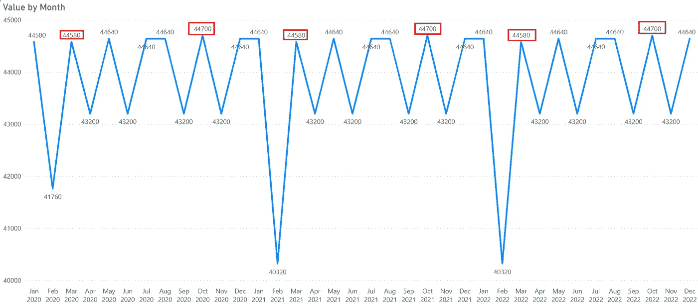
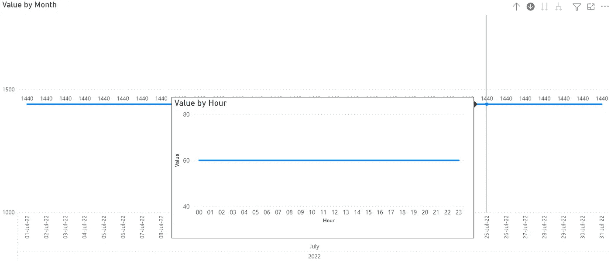
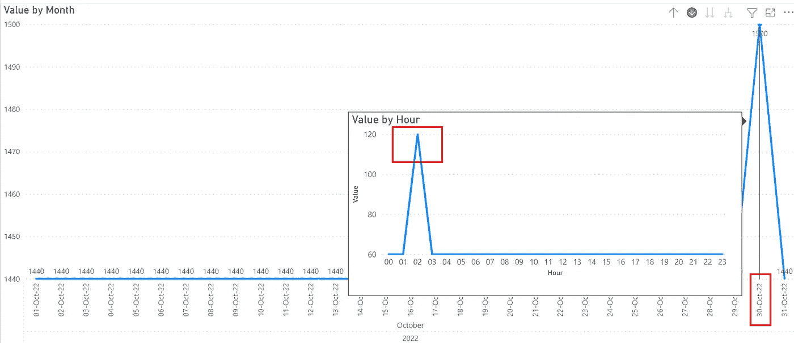
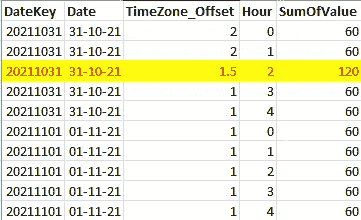
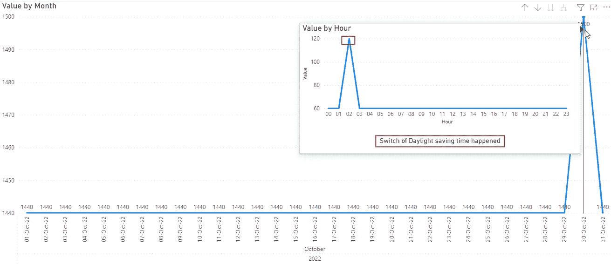
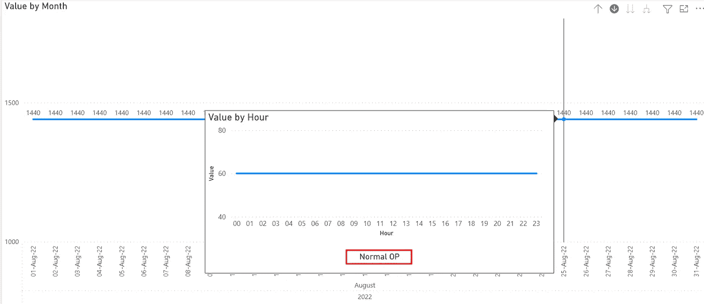

# 在每小时报告中应对夏令时

> 原文：<https://towardsdatascience.com/coping-with-daylight-saving-time-in-hourly-reporting-b753578927a6>

## 当你需要每小时报告一次时，夏令时开关可能是一个真正的问题。我是这样解决的。


照片由[乔恩·泰森](https://unsplash.com/@jontyson?utm_source=medium&utm_medium=referral)在 [Unsplash](https://unsplash.com?utm_source=medium&utm_medium=referral) 上拍摄

# 介绍

通常，我们以天或更低的粒度创建报告。

一段时间以前，我为一个客户工作，该客户为他们的生产线创建能耗报告，这些生产线全天候运行。

他们的数据汇总到 15 分钟。

在这种情况下，切换到夏令时再切换回太阳时会导致报告中出现问题。

对于本文，我创建了一个基于日期和时间的表，时间序列为每分钟一行，每行的值为 1。

这样，我可以直接展示开关的效果。

# 问题

当我将该表加载到 Power BI 中时，当我查看每月级别的数据时，我得到以下报告:



图 1 —问题(作者提供的图)

当我查看其中一个月的每日级别时，在没有开关的情况下，在小时级别的数据上添加工具提示后，我得到以下报告:



图 2——每日平均每月的问题(作者提供的数字)

现在，我们来看一个月的每日数据，其中包含一个开关:



图 3 —带开关的一天的数据(由作者提供)

如你所见，我们的数据在秋季有一个峰值。在春天，当我们从太阳时切换到夏令时时，我们会在数据中得到一个间隙。

问题是，在现实中，数据没有间隙和尖峰，但我们看到它们是因为开关。

这可能会使报告的消费者感到困惑。


Dex Ezekiel 在 [Unsplash](https://unsplash.com?utm_source=medium&utm_medium=referral) 上拍摄的照片

# 解决办法

一个可能的解决方案的第一步是用开关识别日子。

为此，当我在 Azure SQL 数据库中加载我的日期表时，我使用了以下 T-SQL 代码:

```
SET @TimeZone_Offset =
  DATEDIFF(hh,
    DATEADD(hh, 4, @DT),
    CONVERT(datetime2,
      SWITCHOFFSET(DATEADD(hh, 4, @DT),
             DATEPART(TZOFFSET,
                DATEADD(hh, 4, @DT
                AT TIME ZONE ‘Central European Standard Time’)
                )
            )
       );
```

变量@DT 包含一个日期。

然后，我向 DATEDIFF()的第一个参数的日期添加四个小时。

下一步是使用 SWITCHOFFSET()作为 DATEDIFF()的第二个参数切换到 UTC 时区，并获得本地时区和 UTC 之间的差异。在调用 DATEPART(TZOFFSET，…)函数时，需要设置您的时区。

将数据写入数据表后，我使用下面的代码用时间开关在每一行上设置一个特殊值:

```
WITH [Result]
AS
(SELECT [DateKey]
    ,CASE [TimeZone_Offset] — LAG([TimeZone_Offset], 1, 1)
                                   OVER(ORDER BY [DateKey])
       WHEN 1 THEN 2.5
       WHEN -1 THEN 1.5
       ELSE [TimeZone_Offset]
     END AS [TimeZone_Offset_Chg]
   FROM [dbo].[Date])
UPDATE [dbo].[Date]
    SET [TimeZone_Offset] = [R].[TimeZone_Offset_Chg]
  FROM [dbo].[Date] AS [D]
     INNER JOIN [Result] AS [R]
        ON [R].[DateKey] = [D].[DateKey];
```

我使用 LAG()函数将实际行与前一行进行比较，以查看值是否发生了变化。

然后，当事情发生变化时，我设置特定的值(秋天为 1.5，春天为 2.5)。

这样，我就可以找到在太阳时和夏令时之间转换的日子。

接下来是我想如何处理这些信息。

例如，我想在我的报告中显示那天是否发生了切换。

为了实现这个目标，我创造了一种新的方法来编辑动态评论:

```
Comment =
IF(HASONEVALUE(DayLight_SavingTime_Demo[TimeZone_Offset])
     ,”Normal OP”
     ,”Switch of Daylight saving time happened”
   )
```

当某一天发生切换时，HASONEVALUE()为列[TimeZone_Offset]返回 false。

为了实现这一点，我设置了我的演示数据集来在正确的时间切换 TimeZone_Offset:



图 4 —带开关的数据(作者提供的图)

因此，当我用开关检查一天的列[TimeZone_Offset]时，我得到了不止一个值。所以，HASONEVALUE()返回 FALSE。

在 Power BI 中，结果如下所示:



图 5 —带开关和动态标题的一天(作者提供的图片)

在典型的一天，我显示文本“正常 OP”:



图 6 —没有开关的日子和动态标题(作者提供的图片)

这个小小的添加让消费者知道发生了什么，并正确理解数据。

# 结论

虽然这是一个相当奇特的问题，但在处理这个问题时，我学到了很多关于使用时区的知识。

在这种情况下，你可能会找到另一种方式来展示你的结果。

例如，我的客户正在考虑在秋天转换时平滑一天中的值。我还不知道他将如何处理春季数据的缺口。

无论如何，我的方法让你敞开心扉，说出你想如何应对这种情况。它只为您提供了完成这项工作的工具集。


Yianni Mathioudakis 在 [Unsplash](https://unsplash.com?utm_source=medium&utm_medium=referral) 上拍摄的照片

这取决于你和你的用户来制定细节以应对时间的转换。

<https://medium.com/@salvatorecagliari/membership> 