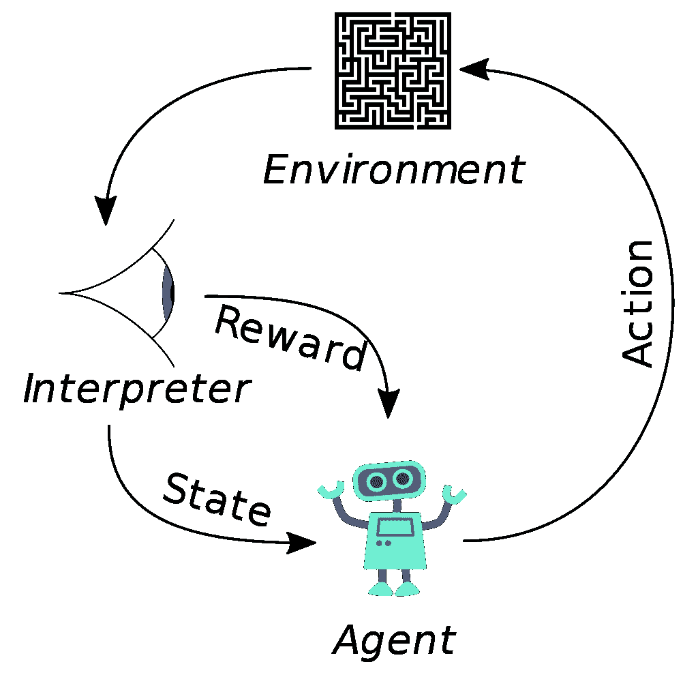

# 企业需求和人工智能的未来，第二部分

> 原文：<https://towardsdatascience.com/corporate-imperatives-and-the-future-of-ai-part-ii-fc086d25060a>

## 美国公司法以及科技公司和强化学习代理的危险工具推理

在 [Unsplash](https://unsplash.com?utm_source=medium&utm_medium=referral) 上由 [Cedrik Wesche](https://unsplash.com/@cedrikwesche?utm_source=medium&utm_medium=referral) 拍摄的照片

过去几年，大型数字平台以及人工智能和数据科学道德领域[的发展和扩张取得了快速增长。数字平台由世界上一些最大的科技公司拥有，这些公司统称为](https://www.liebertpub.com/doi/full/10.1089/big.2018.0083)[**大科技**](https://en.wikipedia.org/wiki/Big_Tech) : *字母表* ( *谷歌*)*亚马逊**苹果**Meta*(*脸书*)和*微软。*

通过数字平台，大技术越来越多地调节和影响我们购买的产品、使用的服务和消费的娱乐。这些上市公司将他们的数字平台和数据共享基础设施联网，以创建规模、社会影响力和经济价值前所未有的全球[平台生态系统](https://link.springer.com/article/10.1007/s12525-019-00377-4)。对于那些对数字平台如何利用基于[行为主义心理学](https://en.wikipedia.org/wiki/Behaviorism)和[强化学习](https://en.wikipedia.org/wiki/Reinforcement_learning)的个性化原则来修改人类用户的“环境”感到好奇的读者，请参见*公司规则*系列的[第一部分。](/corporate-imperatives-and-the-future-of-ai-development-part-i-773f5a1a352b?source=friends_link&sk=9dcf30a0fd0153ddf1e1570693d31b42)

因为上市公司依靠公共金融市场为未来项目获取资本，他们最终必须对全球股东和债券持有人——他们所谓的 [*剩余索取者*的财富寻求需求做出回应。](https://en.wikipedia.org/wiki/Residual_claimant)由此产生的法律考虑约束了企业的推理和行为，并对我们从道德上评估其行为的方式产生了影响，特别是那些运营数字平台的企业，如谷歌、亚马逊和脸书。我特别担心工具理性的公司部署工具理性的 RL 代理，而几乎没有监督。

请注意，许多关于法律约束和工具理性的问题也适用于[私募股权](https://en.wikipedia.org/wiki/Private_equity)和[风险投资](https://en.wikipedia.org/wiki/Venture_capital)，它们越来越多地被用于推动新技术公司的早期增长。

## 企业社会责任与人工智能

大型科技公司在推进人工智能研究、发布政治新闻、教育公民和传播公共卫生信息方面发挥着越来越大的作用。后一类职能传统上由具有正式道德和政治问责制度的公共机构和政府履行。

虽然记者们经常谴责大型科技公司的垄断行为，但我想关注一个略有不同的问题。随着公司拥有的平台日益成为各行各业的数字插孔，人们不禁要问:个人和社会真的从这种安排中受益了吗？鉴于它们在现代生活中的新影响力，企业在我们全球化的社会中应该扮演什么样的角色？

在一份关于[企业社会责任](https://en.wikipedia.org/wiki/Corporate_social_responsibility)的有影响力的系列论文中，商业伦理学家[吉多·帕拉佐](https://wp.unil.ch/hecimpact/people/guido-palazzo/)和[安德烈亚斯·舍雷尔](https://www.business.uzh.ch/de/research/professorships/as/team/staff/scherer.html)认为，全球化需要为企业的巨大社会作用找到新的道德理由。这些道德理由必须超越增加便利或生产效率的实用理由。此外，鉴于公司在全球范围内运作，它们必须吸引不同民族国家和文化的人。也就是说，他们还必须考虑到 [*价值多元化*](https://en.wikipedia.org/wiki/Value_pluralism) *:* 事实上，来自不同文化的通情达理的人可能对善与对有着相互冲突的观念。

帕拉佐和舍雷尔建议在公共领域进行参与性的民主讨论，以此来阐明证明全球公司新发现的社会角色和责任的道德理由。一旦这样的民主机制到位，像谷歌和脸书这样的公司就可以真正谈论做“有益于社会的数据科学”

企业人工智能嵌入在更大的技术、经济、法律和道德体系中。理性的辩护可以在每一个层面上给出，但最终会在一个基于社会群体的“生活形式”的特定道德愿景中出现来源:作者。

## 企业自有数字平台的社会嵌入性

企业开发和拥有的数字平台和人工智能技术位于一套复杂且相互强化的嵌套社会结构中。

股东与公司的关系在公司法和合同法中有明文规定，并在法院判决中得到执行，而法院判决本身是从普通法的先例演变而来的。当然，法官是由政治领导人任命的，或者在某些情况下，由投票公众直接选举产生。最后，伦理考虑证明谁投票、如何投票以及在什么年龄投票是合理的。伦理考量为政治进程的结果提供了*规范*的合法性。我们一致认为[腊肠狗](https://en.wikipedia.org/wiki/Dachshund)不应该投票，它们的政治观点，无论多么可爱，在道德上都是无关紧要的。至少目前是这样。

上图说明了企业所有的数字平台的嵌套性质，在不同层面上提出了新的合法性问题。尽管我们经常认为公司结构是理所当然的，但在现实中，正如新自由主义理论所强调的，它需要一个复杂而强大的法律和政治体系才能繁荣。例如，在经济制度层面，资本主义指的是私人拥有的生产资料。在资本主义体系中，公司需要特定的制度和理念才能存在。私有财产的概念是必要的。合同必须由法院签订和执行。公司章程必须由立法机关起草，等等。

资本主义作为一种经济体系，本身依赖于更大的政治背景和基础理论。政治理论在政治规则和程序中得以实现，这些规则和程序赋予行使政治权力的规范性合法性，即民主选举总统。反过来，这些民主程序又被平等、公正和透明的道德*价值观*所证明，即“一人一票”等*原则*和 [*法治*](https://en.wikipedia.org/wiki/Rule_of_law) 所证明，这使得公民只对那些公开颁布的法律负责。

每个层次都有其自身的正当性，在不同层次上可能会有冲突，尤其是在不稳定的社会系统中。这些辩解的底线在哪里？我追随维特根斯坦，相信伦理体系——实际上是正式体系本身——最终是基于任意的“生活形式”,而不是终极真理或宏大叙事。

公司的性质是什么？一些商业伦理学家将公司视为经济主体，其形式结构与机器人同构。埃里克·克鲁尔在 [Unsplash](https://unsplash.com?utm_source=medium&utm_medium=referral) 上的照片

## 数字平台:盈利组织和自动化决策

数字平台将利润驱动型组织的概念与基于人工智能/人工智能的自动化相结合。对于自主人工智能系统，我指的是数字平台上的系统，旨在使用[强化学习](https://en.wikipedia.org/wiki/Reinforcement_learning) (RL)的形式和算法来生成个性化推荐。

尽管自动化决策似乎是实现更有效的社会资源分配的自然方式，但数字平台的概念在伦理上令人担忧。为什么？因为它结合了两件具有粗略道德记录的事情:自主人工智能系统和一个被称为[公司](https://en.wikipedia.org/wiki/Corporation)的虚拟法律实体。虽然企业确实擅长高效生产产品和服务，但它们也有这样的历史:

*   [**财务会计丑闻**](https://en.wikipedia.org/wiki/List_of_corporate_collapses_and_scandals)
*   [**侵犯人权**](https://en.wikipedia.org/wiki/Sweatshop)
*   [**环境污染**](https://en.wikipedia.org/wiki/Oil_spill)
*   [**支持压制性政权**](https://www.pewresearch.org/internet/wp-content/uploads/sites/9/media/Files/Reports/2012/PIP_Future_of_Corporate_Responsibility_070512.pdf)

奇怪的是，RL-agents 和公司都遭受道德缺陷，因为他们狭隘的工具理性支配着他们的行为。因此，我们可以预期由公司代理部署的 RL 代理也会出现类似的伦理问题。更糟糕的是，通过数字平台将这两个工具理性代理结合起来可能比单独使用任何一个都更糟糕。

## 公司的法律基础和宗旨

为了更好地理解为什么大型科技公司的行为如此有争议(导致了像欧盟的 GDPR 这样的法律)，在头脑中有一个公司到底是什么的图片是有帮助的。这是默认的 MBA 观点。

公司法人是一种法律结构，旨在解决裁定各种股东的独立利益的问题。当自然人团体同意“合并”并集中资源以实现共同目标时，它们就形成了。因此，经常听到正统经济学家把现代公司说成是分布在空间和时间上的理性利己主义者之间的*契约关系。*

美国公司法从经济角度出发，认为公司决策是为理性自利的股东对更高市场价值的偏好服务的。股东权利旨在确保公司管理者尊重股东的“首要利益”——实现投资回报最大化。据说，公司经理对股东负有“信托责任”,要以最有利于他们财务利益的方式行事。至少在理论上，经理是受合同约束的代理人*来执行委托人*即股东的命令。即使是企业的慈善捐赠也必须受到限制，并支持长期财富最大化的目标。

公司作为依法组建的集体决策机构，从其合法和正式的结构中享有一定的财务利益。首先，公司的创建将个人原本不同的利益结合在一起，创造了一种纽带，培养了公司内部的信任，使得内部交易比涉及外部市场的交易成本更低。此外，公司的成立使得几乎无限数量的不同股东的资本被集中起来，用于一个单一的目标。例如，法人股东的*有限责任*意味着个人只能失去他们在合资企业中的个人投资。然而，有限责任也可能创造一种道德风险的场景，投资者承担了比他们应该承担的更多的风险，因为他们只对一些负面影响负责。

## 作为正式组织结构的社会本体论和企业形而上学

这是对公司的另一种看法。在一篇很有影响力的文章中，哲学家约翰·拉德认为公司是正式的组织,*。*它们是本质上是追求目标的机器，其功能部件由个体人类演员组成。组织理论家和人工智能先驱希尔伯特·西蒙同意这一观点，认为正式组织本质上是“决策结构”

形而上学地说，公司不同于其他集体，如家庭。虽然个体数据科学家或股东可能在集体中行动，但行动归于组织，而不是组成组织的个人。公司的雇员可以被解雇或重新雇用，而不改变公司的身份。拿这个和一个家庭比。个体成员的身份是不可替代的——当你把你的祖母和住在你楼上的疯老太太换了位置时，你的家庭就不再是你的家庭了。

公司是看不见的，但在因果关系有效的意义上是真实的。这听起来可能很奇怪，但这是人类独特的能力的结果，人类能够对规范性法律做出反应，就好像它们是物理法律一样。举个例子，你可能会为了捍卫你的荣誉而与人打架。如果荣誉不是你头脑中的一个无形概念，却能因果解释你的行为，那它是什么？

考虑一下这个。你可以踢一栋大楼或公司总部的一张桌子，但无论你如何努力，你都踢不到一家公司。这是因为当某些具有法律和政治合法性的机构宣布它们存在于我们的社会现实中时，它们就存在于我们的集体意识中。就像在 Python 脚本中定义一个函数一样，我们通过声明它是这样来实现它，并通过它在解决我们的问题时的因果功效来判断我们函数的“正确性”。

哲学家约翰·塞尔称这些规范性行为为“声明性言语行为”，其合法性基于“地位功能”，我们作为一个社会同意将其归因于特定的制度。例如，当牧师在适当的场合说“我现在宣布你们成为夫妻”，你们就这样结婚了。他的言语行为立刻创造了它所代表的现实。

公司是经济主体，其任务是优化法律预先规定的目标函数。他们不能思考目的，只能思考实现目的的手段。这种缺乏决定目的的自由意味着他们没有能力承担道德责任。布鲁诺·格雷罗在 [Unsplash](https://unsplash.com?utm_source=medium&utm_medium=referral) 上拍摄的照片

## 弗兰肯斯坦、工具理性和道德责任

公司的存在是为了实现特定的、法律上可强制执行的财富最大化目标，通常会在公司章程中详细说明。然而，作为纯粹虚构的法律实体，公司受到其组织结构和美国公司法的限制，以工具理性*的方式行事。拉德认为，这种正式的组织结构展示了一种语言游戏<https://en.wikipedia.org/wiki/Language_game>*，它定义了一个正式组织意味着什么。根据定义，不符合手段-目的的工具理性不能进入决策过程。**

*什么是工具理性或理性？工具理性是选择最有利于合法强加的利润最大化目标的技术手段。正如希尔伯特·西蒙解释的那样，*

> *【工具理性】不能告诉我们向何处去；充其量它能告诉我们如何到达那里。它是一把出租的枪，可以用来为我们的任何目标服务，无论是好的还是坏的。*

*作为一个纯粹工具理性的代理人有什么道德含义？受其正式组织结构的限制，公司不能被认为是道德代理人。根据康德的观点，拉德声称公司不能行使道德自由，因为他们只能推理手段，而不能推理最终目的。因此，他们缺乏承担道德责任的能力。虽然我们可能会在正常的对话中指责或赞扬企业的行为，好像它们本可以采取不同的行动，但我们犯了一个范畴错误。*

*因此，公司就像一个不道德的弗兰肯斯坦，存在于人类道德共同体的界限之外，如果我们希望保持安全，就必须对其行为进行正式或法律约束。*

*这听起来像 RL 中的 [*值对齐*](https://en.wikipedia.org/wiki/The_Alignment_Problem) 问题吗？*

**

*公司和 RL-agent 以相似的方式组织。两者都依赖于工具推理来最大化由法律或平台数据科学家定义的奖励。产生的行为策略分别是业务环境和平台环境的“解决方案”。来源:[维基百科](https://en.wikipedia.org/wiki/Reinforcement_learning)。*

## *工具理性 RL 和经济主体的病态行为*

*从抽象的意义上来说，公司是正式的*代理*，它们*通过传感器感知*环境的状态(收集输入数据)并且*通过致动器对其做出动作*(做出决定，执行操作)并且在这样做的过程中*修改*(计算)环境——我们的社会。数字平台为企业提供了在数字环境中实际执行感知和行动的技术基础设施。*

*令人担忧的是，RL-agent 和企业都受到工具推理的限制，因为它们的基础是预先选择的目标函数的数值优化。按照美国公司法的要求，公司的预定目标是利润最大化或股东财富最大化。数字平台上的 RL-agent 同样以最大化折扣累积奖励为目标。*

*正如 Nick Bostrom 等作者所指出的，工具理性会导致 RL-agent 中自相矛盾的非理性行为。[批判理论家](https://en.wikipedia.org/wiki/Critical_theory) [马克斯·霍克海默](https://en.wikipedia.org/wiki/Max_Horkheimer)把工具理性描述为一种*

> *过于频繁地削尖剃刀刀片会变得太薄，最终甚至不足以完成它所局限的纯粹形式主义的任务。*

*工具理性也可以解释企业的贪婪。最近[泄露的潘多拉文件](https://www.theguardian.com/news/2021/oct/03/pandora-papers-biggest-ever-leak-of-offshore-data-exposes-financial-secrets-of-rich-and-powerful)揭示了巨富们如何利用空壳公司和信托基金在世界各地的避税天堂隐藏巨额资金，以隐藏他们的身份。利润最大化的工具性目标诱使许多大公司采取了在道德上与我们人类公民相抵触的行为政策。但是法律迫使他们隐喻的手。如果股东认为他们在履行财富最大化的职责时玩忽职守，他们有起诉董事会的合法权利。这是工具理性和胡萝卜加大棒的行为主义心理学。*

*正如一些美国公民对主要科技公司不缴纳公平份额的税收感到愤怒一样，数据和人工智能伦理学家担心基于行为参与度的工具化优化奖励功能的数字“环境”影响——包括其对政治系统和心理健康的潜在离线“泄漏”。经济学家将这些效应称为 [*外部性*](https://en.wikipedia.org/wiki/Externality)*，但它们是被称为企业的经济主体的*代谢废物*。**

**但也许我们只是把期望定得太高了。也许问题不在于公司结构本身，而在于我们把公司想象成有道德情感的人的方式。**

****

**不要被品牌个性所迷惑。与部署在数字平台上的 RL 代理类似，企业行为是在追求最大化预定义目标函数的过程中进行狭义战略工具推理的结果。照片由 [Alexey Mak](https://unsplash.com/@alexxxmak?utm_source=medium&utm_medium=referral) 在 [Unsplash](https://unsplash.com?utm_source=medium&utm_medium=referral) 上拍摄**

## **企业品牌、个性、责备和道歉**

**现代企业在品牌和营销活动上投入了巨大的资源。为什么？这样做为这些经济主体创造了人格代理，并培养了与消费者、雇主和监管者的情感纽带。想想脸书的口号“让世界更紧密地联系在一起”，或者麦当劳的“我爱它”。“更讽刺的是，人们可能会称之为经济主体为了更好地实现其目标而进行的一种战略操纵。**

**不同的公司开发不同的“文化”、“政策”和“业务流程”以适应他们的环境。更成功的人通过反复试验来学习如何根据商业环境采取更有效的行动。他们行为策略的有效性是相对于一个目标函数来定义的。就公司而言，法律定义了目标函数。旁注:特拉华州的公司法对定义公司的宗旨很有影响。小小的特拉华州拥有超过 100 万个商业实体和 66%的财富 500 强企业。相比之下，对于数字平台，数据科学家指定奖励函数，使其与企业目标函数相关联。成功的 RL-agent 和企业学习独特的“个性”或行为策略，以帮助他们“控制”他们的特定环境，并积累最大的回报/利润。**

**奇怪的是，美国法律倾向于将宪法的某些方面解读为适用于公司和自然人。 [Thom Hartmann](https://en.wikipedia.org/wiki/Thom_Hartmann) 解释说，美国最高法院支持[第 14 修正案](https://en.wikipedia.org/wiki/Fourteenth_Amendment_to_the_United_States_Constitution)适用于公司和自然人。公司现在可以在美国宪法中主张自然人的许多权利，比如言论自由。因此，尽管公司既不是道德代理人/病人，也不是有意识的实体(尽管是由个体有意识的人聚集而成)，我们还是给予了它们许多公民权利。**

**公司品牌进一步鼓励将法人与自然人错误类比。如果公司像自然人一样，那么责备或表扬他们似乎是很自然的——采取一种[有意的立场](https://en.wikipedia.org/wiki/Intentional_stance),并赋予他们各种有意的状态，如信念、需求和欲望，以理解他们的行为。但在这样做的时候，如果我们不仔细思考，我们很容易被操纵。**

**以[脸书为其人工智能如何将黑人照片标记为“灵长类动物”而“道歉”为例](https://www.bbc.com/news/technology-58462511)脸书已经学会散发道歉的行为外壳，以实现恢复信任和社会和谐的战略目标，这是一种与大量未来利润相关的商业环境*状态*。这些外部运动只是人类为了追求更大的投资回报而进行的目标导向的试错的可理解的副作用。**

**因此，脸书公司的道歉是表里不一的。脸书本身从未经历过恐惧和痛苦的有意状态，这种状态定义了道歉的经历，并赋予其道德价值(我们倾向于惩罚那些较少宣布自己有罪的人)。没有什么<https://en.wikipedia.org/wiki/What_Is_It_Like_to_Be_a_Bat%3F>*让脸书体验遗憾、内疚或羞耻，只有真诚道歉的数据科学家、经理和董事会成员的经历。***

## ***并非每个公司(总是)都是科学怪人***

***不要误解我。企业偶尔会以道德上值得称赞的方式行事，即使我们在称赞它们时犯了一个类别错误。例如，*鸿海*和 *TSMC* 两家世界上最大的电子/芯片制造商[捐赠了 1000 万剂](https://focustaiwan.tw/society/202107120006)新冠肺炎疫苗来帮助台湾的疫苗接种工作。***

**但是，即使是理性利己的经济代理人也会表现出*看起来*的利他动机行为，如果这是他们长期生存所必需的。仔细观察，这种利他行为是因为它的长期效用而被选择的，而不是出于任何内在的内疚、悔恨或仁慈。**

**公司无疑提高了全球数百万人的物质生活水平，但这些利益的分配并不均衡。在英国非殖民化的余波中，避税天堂和离岸金融中心的爆炸式增长也于事无补。尽管取得了一些进展，但政治理论家认为，提高一些人的生活水平并不足以自动证明公司进入以前由国家行为者关注的生活领域是合理的。与现代全球公司不同，国家可以指出其社会权力背后的实质性道德和政治理由。**

**对于大型科技公司数字平台的社会影响力，有什么同等的道德理由吗？**