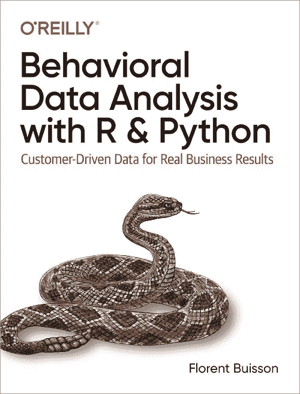

# 相关性不是因果关系…或者是吗？

> 原文：<https://towardsdatascience.com/correlation-is-not-causation-or-is-it-487d842dff23>

# 相关性不是因果关系…或者是吗？

## 当谈到相关性时，你如何超越挥臂

[任思谚](https://unsplash.com/@siyanren?utm_source=medium&utm_medium=referral)在 [Unsplash](https://unsplash.com?utm_source=medium&utm_medium=referral) 上拍照

# 相关性:分析的瓶颈

“相关性不是因果关系”是你在分析学中经常听到的一句话(从现在起，我将把它简称为 CINC，我选择听它为“扭结”)。在我的职业生涯中，我多次看到业务分析师或数据科学家展示数据散点图，显示两个变量 A 和 B 之间的相关性，并发出例行警告。不幸的是，在 90%的情况下，他们会继续做下面两件事情中的一件:

*   他们继续说，就好像他们确实已经证明了变量 A 导致变量 b。例如，“我们可以看到，收到的营销电子邮件的数量与客户的终身价值相关。当然，相关性不是因果关系。话虽如此，现在让我们来谈谈如何加大营销力度，提高客户的 LTV。在这种情况下，CINC 只不过是一个几乎不加掩饰的免责声明，保护分析师的屁股，以防你愚蠢地相信他们的结论。
*   或者，他们说除非你进行随机实验，否则你不能得出任何进一步的结论。这种方法在受过统计学训练的分析师中更常见，它的优势是在智力上更诚实。然而，在实践中，商业伙伴往往只是点头附和，一旦发言者离开房间，他们就根据变量 A 制定计划，导致变量 b。

然而，这种令人遗憾的状况并不一定是常态。每当我们观察数据中的相关性时，实际上变量 A 之外的有限数量的可能情况导致了变量 B:

1.  观察到的相关性并不反映感兴趣人群中的真实相关性，
2.  变量 B 导致变量 A，
3.  变量 A 和变量 B 有共同的原因，
4.  有一个更复杂的因果结构在起作用。

# 1.没有真正的相关性

最简单的情况是，在感兴趣的总体中实际上没有任何相关性。这有两种可能发生的方式:噪音(又名。采样变化)和偏差。

**噪音。**首先，如果你的样本“太小”，或者你连续抽取了太多样本(又名。钓鱼探险)，观察到的相关性可能只是一个随机的侥幸。这是一个真正的问题，尤其是如果你依赖 p 值作为重要性的衡量标准，而不是通过置信区间来确定经济重要性，但我不会纠缠于此:我觉得大多数人都对那个陷阱有很好的把握，在大多数商业情况下，样本不会那么小。如果您有一百万行，那么在您的潜在问题列表中，抽样变化应该非常低。如果你的样本较小，就使用更稳健的指标，比如中值而不是平均值。人们经常低估中位数的稳健性，即使样本非常小(数学在附录中)。

**偏见。**当您的样本不能很好地代表您感兴趣的人群时，就会出现偏差。例如，“去年拥有活动帐户的所有客户”通常是“明年拥有活动帐户的所有客户”的合理替代。另一方面，“去年所有拥有活跃账户的客户*都提供了电子邮件地址*”则不是。偏倚是一个比噪声更隐蔽的问题，因为即使是大样本也可能成为它的受害者，正如最近一项关于 COVID 的研究所示[1]。

避免偏见，或者至少认识到它，并不复杂。简单地尽可能精确地写下你的样本的定义和你感兴趣的人群的定义。如果你的样本真的是从你的人口中随机抽取的，你就可以开始了。在任何其他情况下，可能会有偏见，例如，如果你在你的人群中随机接触一些人，但你的样本只包括那些回答或提供完整答案的人。试着找出你感兴趣的人群中的子类别，这些子类别可能在你的样本中被遗漏或代表不足。推而广之，如果你的人群中有残疾、没有互联网连接的贫穷老年妇女，你能充分接触到她们吗？

如果你在想“但那只是我人口中的极小一部分！”，我请你再想一想。子类别可能会在你的人口中占很大份额，即使每个子类别都很小。仅从你个人的角度来看，它们也可能显得很小。我目前住在西非，最近很难更新一部 iPhone:它需要 1)下载数千兆字节的数据，2)通过 WiFi(另一部手机 hotspotting 无法工作)，3)在充电时。但发展中国家智能手机的典型拥有者可能在家里没有 WiFi(他们的智能手机是他们唯一的互联网接入)，商店里的 WiFi 带宽通常有限，假设他们甚至允许你使用电插头。如果你住在美国西海岸，这可能是一个“边缘案例”，但它可能包含数亿甚至数十亿智能手机用户！

# 2.反向因果关系(B 导致 A)

下一种可能性是变量 A 和 B 之间的相关性可能源于变量 B 导致变量 A，而不是相反。例如，收到的营销电子邮件数量和客户终身价值之间的相关性可能是由于营销通过电子邮件将目标锁定在高 LTV 客户。一旦你考虑到这种可能性，它在你的数据中是如何发生的就很明显了。

# 3.混杂因素(A 和 B 有共同的原因)

最后一种“简单”的情况是当 A 和 B 有共同的原因时。例如，营销预算可能在美国的州一级分配，或者在国际上在国家一级分配。然后加州的客户(分别是美国的)可能比田纳西州的客户拥有更高的 LTV 和收到更多的营销电子邮件。，在尼日利亚)。同样，一旦您考虑到这种可能性，它在您的数据中是如何发生的就很明显了。

# 4.还有什么(更复杂的因果结构)

前三种情况可能代表了你在实践中会遇到的 90%的情况，但是从技术上讲，它们并没有涵盖所有的可能性。为了完整起见，我将简要地谈一谈还有什么。

一类更复杂的因果结构是当你显式或隐式地控制一个你不应该控制的变量。例如，一名军医发现，战场上止血带的使用与存活率呈负相关；问题是他的分析是基于到达野战医院的士兵。但是止血带的主要好处是，它可以让受重伤的士兵存活到他们到达医院，而不是流血过多。这意味着总体上有更多的士兵存活下来，但只有很少一部分被送到医院，因为我们增加了更多的严重病例。顺便提一下，这个例子也可以解释为数据收集中的偏差(即，观察到的负相关不代表感兴趣的人群)，这表明数据收集和数据分析并不像人们通常认为的那样分离。

最后，我们有一些情况似乎是大自然设计的，让科学家们困惑不解。例如，人们已经知道自闭症与简单的肠道微生物群(即肠道中细菌种群多样性较低)有关。这是否意味着微生物组导致自闭症？最近的一项研究表明“不，恰恰相反”:自闭症儿童经常限制饮食，因为感官体验会淹没他们，有限的食物种类导致有限的微生物种类。但是接下来，如何解释粪便移植改善了自闭症儿童的行为？一个新兴的假设是，“粪便移植通过缓解不平衡的微生物群直接带来的不适症状，改善了自闭症儿童的行为，但不影响该疾病的神经基础”[3]。相应的因果图是:

作者图片

最终，科学通过开发越来越精确和完整的模型来解释手头的所有事实而进步。这同样适用于商业:实现对客户(或员工)行为的深入理解需要建立准确的因果图，正如我在我的书 [*用 R 和 Python*](https://amzn.to/35qyneY)*【4】进行行为数据分析中解释的那样。*

**

# *总结和结论*

*每当您在数据中观察变量 A 和 B 之间的相关性时，除了 A 导致 B 之外，正好有 4 种可能性:*

1.  *由于采样噪声或偏差，观察到的相关性不能反映感兴趣人群中的真实相关性；*
2.  *变量 B 引起变量 A；*
3.  *变量 A 和变量 B 有一个共同的原因；*
4.  *有一个更复杂的因果结构在起作用。*

*这意味着，你不必把自己局限于“相关不是因果”。通过仔细思考其他可能性并排除不合理的可能性，你可以得出结论，“这种相关性可能反映了因果关系，一旦我们确定了我们想要采取的行动，就可以通过运行 A/B 测试来确认这一点”。如果事情变得太复杂，您可以构建因果图来确定发生了什么。*

# *参考*

*[1][https://news . Harvard . edu/gazette/story/2021/12/vaccine-surveys-fell-victim-to-big-data-paradox-Harvard-researchers-say/](https://news.harvard.edu/gazette/story/2021/12/vaccination-surveys-fell-victim-to-big-data-paradox-harvard-researchers-say/)。*

*[2]这个例子出自朱迪亚·珀尔(Judea Pearl)和达纳·麦肯齐(Dana MacKenzie)， [*《为什么:因果的新科学*](https://smile.amazon.com/Book-Why-Science-Cause-Effect-ebook/dp/B075CR9QBJ/) 》一书。*

*[3]《经济学家》，[“肠道菌群失调如何与自闭症联系在一起”](https://www.economist.com/science-and-technology/can-an-upset-gut-microbiome-cause-autism/21806337)。*

*[4] Florent Buisson， [*用 R 和 Python 进行行为数据分析:真实业务结果的客户驱动数据*](https://amzn.to/35qyneY) *。**

*你也可以看看我以前在 Medium 上的帖子:*

*   *[你的行为数据真的是行为数据吗？](https://medium.com/behavior-design-hub/is-your-behavioral-data-truly-behavioral-efb258a24a6c)*
*   *[沟 p 值。使用自举置信区间代替](/ditch-p-values-use-bootstrap-confidence-intervals-instead-bba56322b522)*
*   *[Zillow“被诅咒了吗？”行为经济学视角](/is-zillow-cursed-a-behavioral-economics-perspective-5b5165bb085b)*
*   *[财富 100 强公司的行为科学经理是做什么的？](https://medium.com/@florent.buisson/what-does-a-behavioral-science-manager-in-a-fortune-100-company-do-ca5ceb20631)*

# *附录:中位数估计量的稳健性*

*请记住，根据定义，人口的中位数是这样的，一半人口的值低于它，一半人口的值高于它。无论数据分布的形状、峰值数量等如何，这一点都成立。*

*这意味着，如果从总体中随机抽取两个值 x 和 y，有 4 种可能性:*

*   *都低于人口中位数，概率 0.5 * 0.5 = 0.25；*
*   *他们都高于人口中位数，概率也是 0.25；*
*   *一个低于人口中位数，一个高于，概率 0.5。*

*更一般地说，如果你有 N 个值:*

*   *它们都低于 0.5^N 概率的中间值。*
*   *它们都高于 0.5^N 概率的中位数。*
*   *中位数位于概率为 1–2*(0.5^n).的 n 个值的最小值和最大值之间*

*这意味着，即使只有 5 个值的样本，也有 94%的机会将总体中值归入您的样本。有 10 个值时，概率达到 99.8%。现在，我不能保证你会对这个置信区间的大小感到满意，但至少你会非常清楚地意识到，在当前的情况下，抽样变异有多重要。*