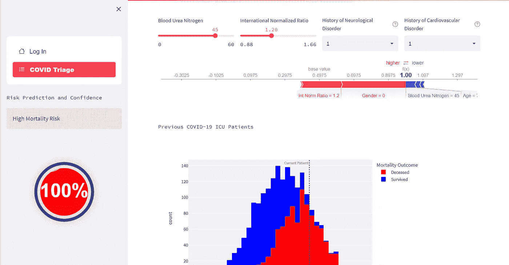
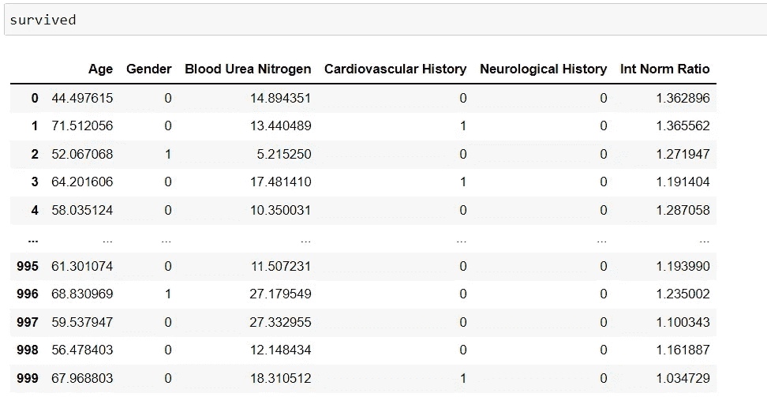
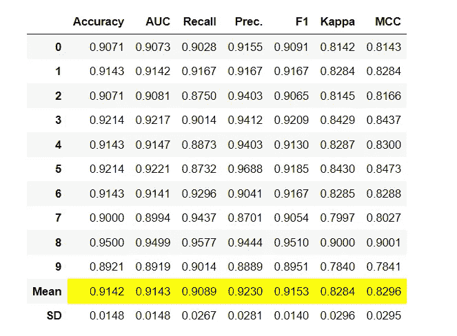
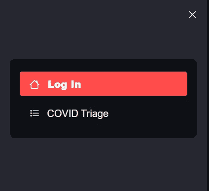
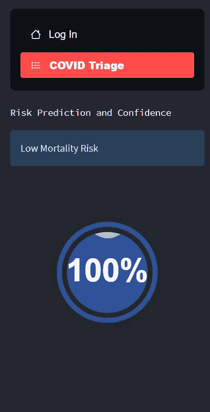
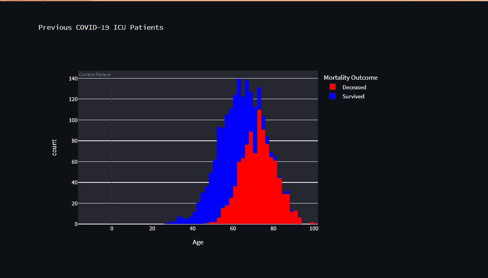
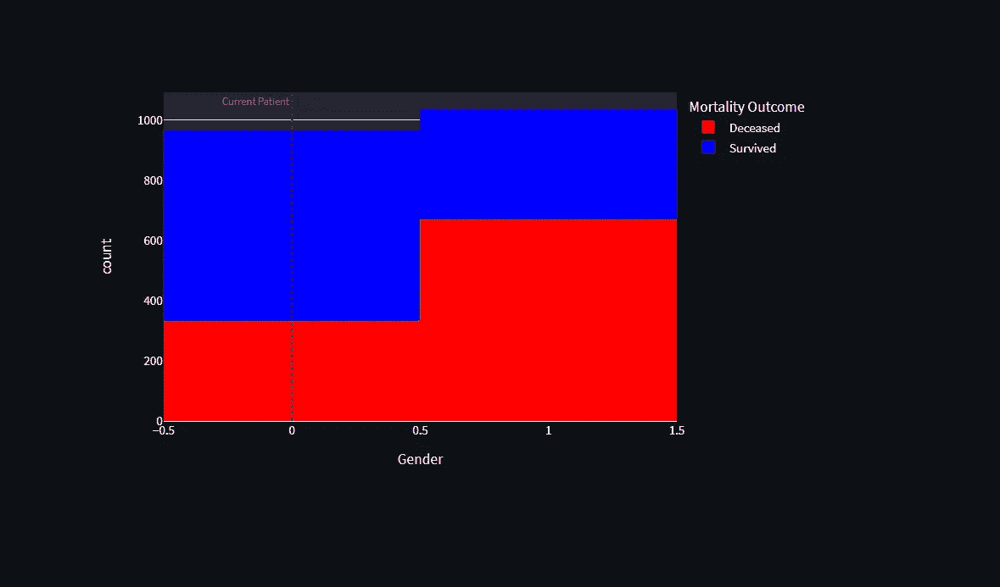
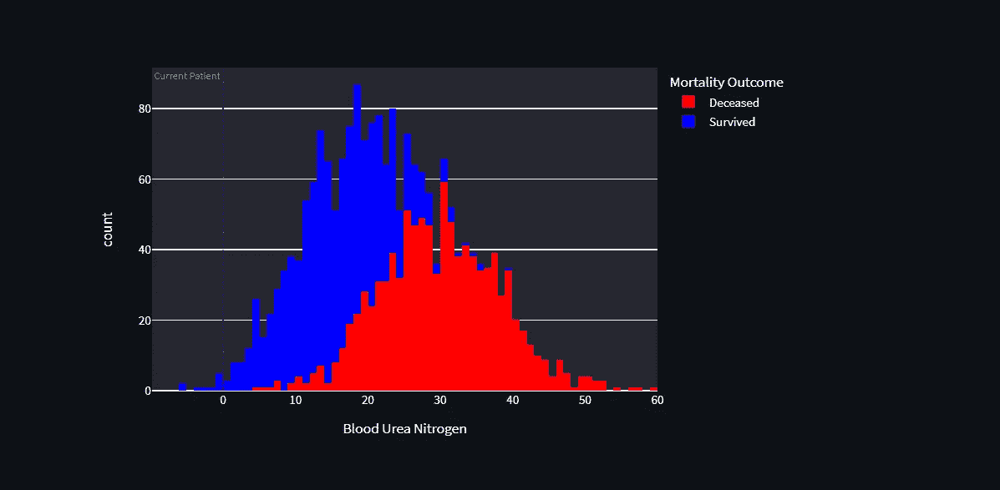
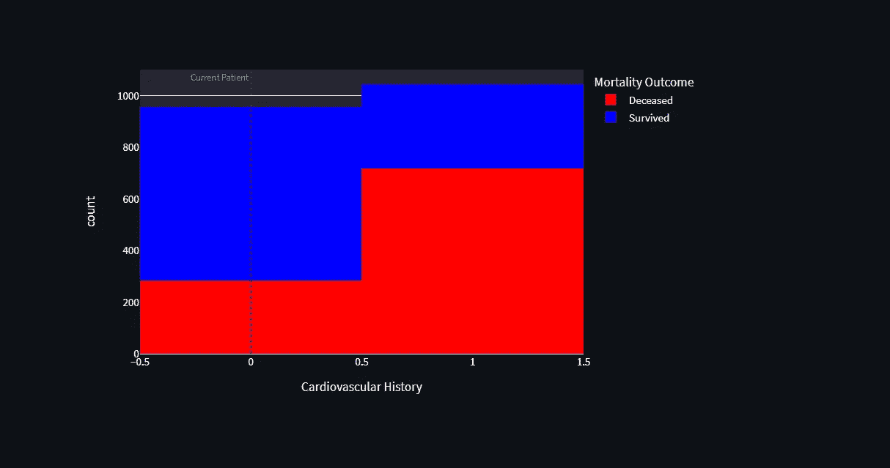
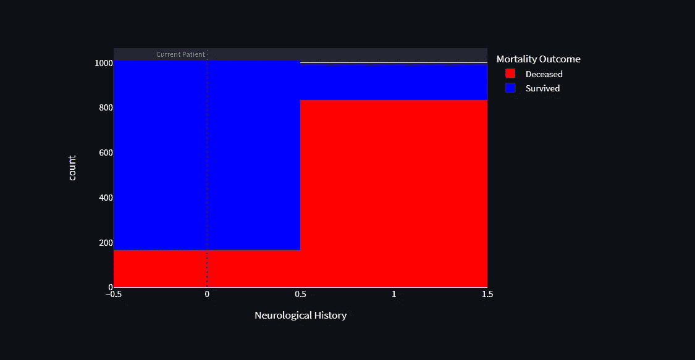

# 使用 Streamlit、Pycaret 和 Shap 进行新冠肺炎死亡率分类

> 原文：<https://towardsdatascience.com/covid-19-mortality-triage-with-streamlit-pycaret-and-shap-a8f0dca64c7d>

## 用强大的 Python 工具构建临床决策支持系统


图片来自[Patrick Assale](https://unsplash.com/@patrickassale)@[Unsplash](https://unsplash.com/)

## 背景

我最近接受了一个项目的任务，目标是设想如何创建一个工具，帮助临床医生识别进入重症监护病房的新冠肺炎患者的死亡风险。这种工具也称为“临床决策支持系统”，需要为临床医生提供数据驱动的健康信息，如以前的新冠肺炎患者结果或当前的患者死亡风险，以做出明智的护理决策。

就像任何真正的修补匠会做的那样，我认为*设想*某事的最好方式是**自己创造**。而且，作为一个 python 爱好者，我认为会有很多工具可以实现这一点。因此，本教程概述了我如何用强大的 python 库创建了一个新冠肺炎临床决策支持系统，并为您提供了自己重新创建或重新构想该项目的资源。



在最终产品上偷瞄:[https://covidtriage.streamlitapp.com/](https://covidtriage.streamlitapp.com/)

## 概述

我从机器学习问题的角度来看待这个项目。因此，该项目概述如下:

1.  获取数据(重症监护室中患有新冠肺炎的患者)
2.  训练和测试机器学习模型(死亡与幸存)
3.  将机器学习模型部署到用户界面

## 安装库

这个项目的核心库包括 Pandas、Pycaret、Shap 和 Streamlit。所有这些都用于解决特定的需求。

*   熊猫:数据处理和分析
*   Pycaret:构建低代码机器学习管道
*   Shap:分析和可视化特征对模型预测的影响
*   Streamlit: python 驱动的应用开发
*   Plotly:高质量的交互式图表

要安装这些库，请打开命令行提示符或终端，并输入以下内容。

```
pip install pandas
pip install pycaret
pip install shap
pip install streamlit
pip install plotly
```

本教程中的其他库是 Streamlit 的组件，用于改善用户界面/体验。

```
pip install streamlit_option_menu
pip install streamlit_shap
pip install streamlit_echarts
```

# 获取数据

这个项目的主要障碍之一是为模型训练获取数据。由于没有来自重症监护的新冠肺炎患者的开源数据库，我认为最好的方法是创建自己的数据库。为此，我找到了一篇解决类似问题的论文。下面的论文概述了影响新冠肺炎患者死亡率预测的几个关键特征。然后，我对这些特征进行了松散的逆向工程，以生成一个代理数据集。

[](https://www.frontiersin.org/articles/10.3389/fdgth.2021.681608/full) [## 使用机器学习预测 ICU 中新冠肺炎患者第 0 天的死亡率

### 理由:考虑到新冠肺炎病例数量的增加和新一波感染的潜在可能，有一种…

www.frontiersin.org](https://www.frontiersin.org/articles/10.3389/fdgth.2021.681608/full) 

```
import random as rand
import pandas as pd
import numpy as np
samples = 1000age_m = 58.0
age_std = 9.0bun_m = 16.0
bun_std = 6.5creatine_m = 1.1
creatine = 0.3inr_m = 1.2
inr_std = 0.1survived = pd.DataFrame()
survived['Age'] = np.random.normal(loc=age_m,scale=age_std,size=samples)
survived['Gender'] = np.random.binomial(1, 0.367, size=samples)
survived['Blood Urea Nitrogen'] = np.random.normal(loc=bun_m,scale=bun_std,size=samples)
survived['Cardiovascular History'] = np.random.binomial(1, 0.291, size=samples)
survived['Neurological History'] = np.random.binomial(1, 0.16, size=samples)
survived['Int Norm Ratio'] = np.random.normal(loc=inr_m,scale=inr_std,size=samples)
```



```
age_m = 72.5
age_std = 8.25bun_m = 30.0
bun_std = 9.0creatine_m = 1.5
creatine = 0.4inr_m = 1.3
inr_std = 0.1deceased = pd.DataFrame()
deceased['Age'] = np.random.normal(loc=age_m,scale=age_std,size=samples)
deceased['Gender'] = np.random.binomial(1, 0.646, size=samples)
deceased['Blood Urea Nitrogen'] = np.random.normal(loc=bun_m,scale=bun_std,size=samples)
deceased['Cardiovascular History'] = np.random.binomial(1, 0.709, size=samples)
deceased['Neurological History'] = np.random.binomial(1, 0.840, size=samples)
deceased['Int Norm Ratio'] = np.random.normal(loc=inr_m,scale=inr_std,size=samples)
```


然后，组合、重组并保存数据帧来表示我的模型训练数据集。

```
train = pd.concat([survived, deceased])
train = train.sample(frac=1).reset_index(drop=True)
train.to_csv('COVID_TRAIN.csv')
```

# 创建模型

接下来，我使用 Pycaret 的监督分类功能来设置、训练和评估一个识别死者和幸存者的模型。



# 创建用户界面

一旦模型适合我的需求，我就开始创建用户界面。我认为临床医生必须具备的三个主要要素是:

*   易用性
*   可解释的模型预测
*   当前和过去患者的特征探索

Streamlit 提供了严格使用 python 语法来构建漂亮的 web 应用程序的能力。因此，用户界面仅由 Streamlit 和相关组件构建。

## 设置

安装库并设置 Streamlit 页面配置。

```
import streamlit as st
import pandas as pd
from streamlit_option_menu import option_menu
from pycaret.classification import *
import plotly.express as px
import shap
from streamlit_shap import st_shap
from streamlit_echarts import st_echarts#set settings for streamlit page
st.set_page_config(layout="wide",
    page_title="COVID Triage",
    page_icon="chart_with_upwards_trend")#hide streamlit menu bar
hide_streamlit_style = """
        <style>
        #MainMenu {visibility: hidden;}
        footer {visibility: hidden;}
        </style>
        """
st.markdown(hide_streamlit_style, unsafe_allow_html=True)
```

## 模型

初始化训练数据和模型。

```
#use pandas to read covid data for model training and creation
train = pd.read_csv('COVID_TRAIN.csv')
#use pycaret to preprocess and train a decision tree supervised ML model
exp = setup(train, target = 'class', silent=True, verbose=False)
dt = create_model('dt')
```

## 菜单栏

创建一个菜单栏，在登录和 COVID triage 之间切换。

```
#option menu from streamlit component streamlit_option_menu
with st.sidebar:
    selected = option_menu(None, ["Log In", "COVID Triage"], 
    icons=['house',  "list-task"], 
    menu_icon="cast", default_index=0, orientation="vertical")
```



## 登录页面

为简单的不起作用的登录页面创建逻辑。

```
if selected == 'Log In':
    st.title('Covid 19 Mortality Risk Clinical Decision Support System')
    if 'user_name' not in st.session_state:
        st.session_state.user_name = 'User Name'
    user_name = st.text_input("User Name", value = st.session_state.user_name)
    st.session_state.user_name = user_name
    password = st.text_input("Password", type="password")
    st.session_state.password = password
    if st.session_state.password:
        sc = "Welcome " + st.session_state.user_name + " please proceed to COVID Triage"
        st.success(sc)
```


## 新冠肺炎分流页面-用户输入

创建小部件以获取与训练数据中的特征相对应的用户输入。

```
#covid triage page
#feature inputs correspond to training data
if selected == 'COVID Triage':
    col1, col2, col3= st.columns(3)
    with col1:
        name = st.text_input("Patient ID")
    with col2:
        gender = st.selectbox("Gender", (0, 1), help = "0 = Female, 1 = Male")
    with col3:
        age = st.number_input("Age", step = 1)ccol1, ccol2, ccol3, ccol4= st.columns(4)
    with ccol1:
        bun = st.slider("Blood Urea Nitrogen", min_value=0, max_value=60)
    with ccol2:
        inr = st.slider("International Normalized Ratio", min_value=0.88, max_value=1.66)
    with ccol3:
        honeuro = st.selectbox("History of Neurological Disorder", (0, 1), help = "0 = No history of neurological disorders, 1 = History of neurological disorders")
    with ccol4:
        hocard = st.selectbox("History of Cardiovascular Disorder", (0, 1), help = "0 = No history of cardiovascular disorders, 1 = History of cardiovascular disorders")

    test = pd.DataFrame({"Age": [age], "Gender":[int(gender)],"Blood Urea Nitrogen":[bun], "Cardiovascular History":[int(hocard)], "Neurological History":[int(honeuro)], "Int Norm Ratio":[inr]})
```


## 新冠肺炎分流页面-模型预测和信心

设置预测值和置信值的显示和逻辑。

```
preds = predict_model(dt, test)
    st.sidebar.text('Risk Prediction and Confidence')
    preds['Mortality Risk'] = preds['Label'].replace([0,1], ['Low Mortality Risk', 'High Mortality Risk'])
    if preds['Label'].iloc[0] == 0:
        #display if label = 0 (low mortality risk)
        st.sidebar.info(preds['Mortality Risk'].iloc[0])
        liquidfill_option = {
            "series": [{"type": "liquidFill", "data": [preds['Score'].iloc[0]]}]
        }
    if preds['Label'].iloc[0] == 1:
        #display if label = 1 (high mortality risk)
        st.sidebar.error(preds['Mortality Risk'].iloc[0])
        liquidfill_option = {
            "series": [{"type": "liquidFill", "data": [preds['Score'].iloc[0]], 'color': ['#ff0000']}]
        }
    with st.sidebar:
        #liquid fill chart with confidence value and color corresponding to mortality risk (high = red, low = blue)
        st_echarts(liquidfill_option)
    #shapley additive explanation of feature weights on model prediction
    explainer = shap.KernelExplainer(model = dt.predict_proba, data = get_config('X_train'), link = "identity")
    shap_value_single = explainer.shap_values(X = test)
    st_shap(shap.force_plot(base_value = explainer.expected_value[0],
                    shap_values = shap_value_single[0], features=test
                    ))
```



## 新冠肺炎分流页面-患者图表

设置逻辑以显示当前患者与以前患者的关系和特征。

```
st.text("Previous COVID-19 ICU Patients")
    df = train.copy()
    for cols in df.drop(['Unnamed: 0', 'class'], axis=1).columns:
        df['Mortality Outcome'] = train['class'].replace([1,0], ['Deceased', 'Survived'])
        fig = px.histogram(df, x = cols, color = 'Mortality Outcome',
                           color_discrete_map = {'Deceased':'red','Survived':'blue'})
        fig.add_vline(x=test[cols].iloc[0], line_dash="dot",
                      annotation_text="Current Patient", 
                      annotation_position="top left",
                      annotation_font_size=10,
                      annotation_font_color="gray"
                     )
        st.plotly_chart(fig, config= dict(
    displayModeBar = False))
```



## 把所有的放在一起

用户界面已准备好进行部署。最后的步骤包括保存需求，将所有文件添加到 GitHub，并部署到 Streamlit 共享服务。要访问最终产品，请访问下面的链接或从我的 [covidtriageStreamlit 库](https://github.com/chags1313/covidtriageStreamlit)在您的本地机器上自行构建。

https://covidtriage.streamlitapp.com/

[](https://github.com/chags1313/covidtriageStreamlit) [## GitHub-chags 1313/covidtriageStreamlit:使用 Streamlit 构建的 COVID triage 应用程序

### 此时您不能执行该操作。您已使用另一个标签页或窗口登录。您已在另一个选项卡中注销，或者…

github.com](https://github.com/chags1313/covidtriageStreamlit) 

# 结论

本教程深入介绍了如何使用 python 强大的工具生态系统来制作有用的产品。在这种情况下，我们使用 Pandas、Pycaret、Shap、Plotly 和 Streamlit 建立了一个临床决策支持系统，以确定进入重症监护的新冠肺炎患者的死亡风险。

*感谢您的阅读！查看我的 GitHub 以获得更多代码和资源，或者在 LinkedIn 上联系我，提出任何问题或评论。*

[](https://github.com/chags1313) [## chags1313 -概述

### 此时您不能执行该操作。您已使用另一个标签页或窗口登录。您已在另一个选项卡中注销，或者…

github.com](https://github.com/chags1313) 

[https://www.linkedin.com/in/cole-hagen/](https://www.linkedin.com/in/cole-hagen/)

# 作者的相关文章

[](/can-you-teach-a-computer-to-see-your-pain-18c0f60eb0e4) [## 你能教电脑看到你的痛苦吗？

### 答案是肯定的，以下是方法

towardsdatascience.com](/can-you-teach-a-computer-to-see-your-pain-18c0f60eb0e4) [](/making-it-rain-with-raincloud-plots-496c39a2756f) [## 用雨云图让它下雨

### 使用 python 实现 ptitprince 库以实现健壮的数据可视化

towardsdatascience.com](/making-it-rain-with-raincloud-plots-496c39a2756f) [](/warp-space-and-time-with-radial-heatmaps-c9a878d2ebf6) [## 使用径向热图扭曲空间和时间

### 使用 Python 和 HoloViews 对时间序列和循环数据进行独特的数据可视化

towardsdatascience.com](/warp-space-and-time-with-radial-heatmaps-c9a878d2ebf6)