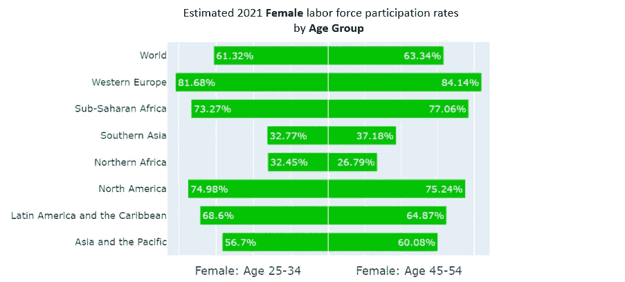
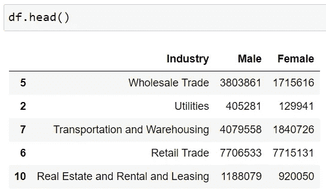
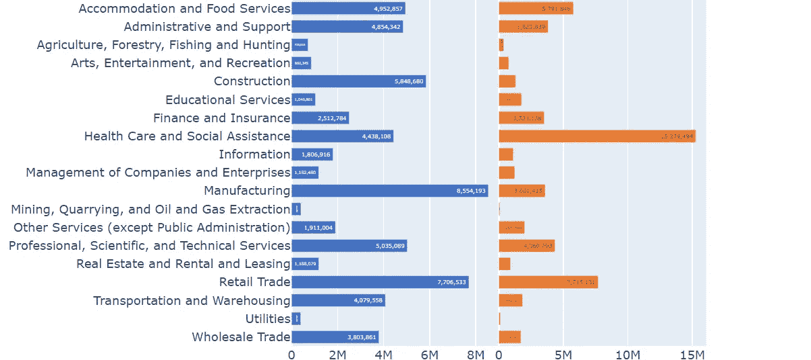

# 使用 Plotly 轻松创建蝴蝶图

> 原文：<https://towardsdatascience.com/create-a-butterfly-chart-easily-using-plotly-aa3d43ba410d>

## 如何用两个简单的步骤创建一个漂亮的蝴蝶图

图片由 [Pixabay](https://pixabay.com/photos/painted-lady-vanessa-cardui-4294793/) 提供

蝴蝶图(也称为龙卷风图或双向图)是一种数据可视化类型，它通过并排显示两个水平条形图来比较两个数据系列。左右横条共享中心的同一 y 轴，并沿 x 轴指向相反的方向，类似蝴蝶翅膀。

蝴蝶图示例(图片由作者提供)

蝴蝶图是在一组维度上可视化两组之间差异的好方法。例如，您可以使用它来可视化两组调查参与者(例如，调查 1 与调查 2)对一组调查问题的响应差异。你可以用它来形象化不同行业的性别薪酬差距。你可以用它来比较两种产品在不同地区的销售情况，等等。

在这篇文章中，我将向你展示如何用两个简单的步骤用`Plotly`创建一个蝴蝶图。`Plotly`没有内置的蝶形图“跟踪”。然而，由于蝴蝶图只是水平条形图的一种特殊类型，我们可以使用一些变通方法来轻松解决这个问题。下面是我们将在本帖中创建的可视化。

作者图片

用于演示的样本数据可以从美国商务部网站上的 [QWI 浏览器](https://qwiexplorer.ces.census.gov/static/explore.html#x=0&g=0)下载。该数据集按不同行业和性别显示了 Q1 2021 的就业人数。让我们导入所有必要的库并将数据读入一个`pandas`数据框架。

作者图片

要使用`Plotly`创建蝴蝶图，我们只需执行以下两个步骤:

步骤 1:创建一个并排有两个水平支线剧情的图形

步骤 2:反转左侧水平条形图的方向

就是这样！让我们看看它是如何工作的。

## 第一步:用两个并排的水平条形图创建一个图形

让我们首先使用`plotly.subplots.make_subplots()`创建两个水平条形图。这允许我们创建一个 1 行 2 列的绘图网格，我们可以用一个共享的 y 轴并排放置两个水平条形图(“跟踪”)。

第 2–3 行:因为我们想并排放置两个水平条形图，我们需要创建一个 fig(绘图网格),它有 1 行 2 列，共享 y 轴。

第 5–13 行:我们将第一个水平条形图添加到绘图中。这个条形图显示了各行业男性员工的就业情况。第 7–8 行使我们能够用千位分隔符显示计数，并在条形上显示数字。第 13 行指定了图表的位置—放置在绘图网格左侧的第 1 行第 1 列。

第 15–23 行:我们将第二个水平条形图添加到绘图中。该柱状图显示了按行业分列的女性员工的就业人数。第 23 行指定第二个条形图的位置——放置在绘图网格右侧的第 1 行第 2 列。

作者图片

## 步骤 2:反转左侧水平条形图的方向

上面的图表看起来不错！现在让我们反转第一个水平条形图的方向，并使图双向。这是通过使用`fig.update_xaxes()`并将`range`参数指定为[16000000，0]来实现的，如下面的代码(第 1 行)所示。

如果两个条形图的 x 轴范围相同，我们也可以使用`autorange='reversed'`。在我们的示例中，左侧条形图的默认 x 轴范围(自动范围)是 0–8M，这比右侧条形图的范围(0–15M)小得多，会使可视化产生误导。因此，我们为左侧图表显式指定范围，并使用[16000000，0]来确保左侧图表的 x 轴反转(从右到左)。

我们还可以添加一个图表标题，并使用`fig.update_layout()`调整图片大小和其他属性。注意，在第 11 行和第 12 行，我们可以指定 x 轴标题的位置在顶部。

作者图片

这就对了。只需两个简单的步骤和几行 python 代码，您就创建了一个漂亮的蝴蝶图，直观地显示了不同行业中男性和女性员工人数的差异。从可视化上，我们可以立刻分辨出哪些行业板块是男性集中 vs .女性集中，结果相当直观！

感谢阅读，我希望你喜欢这个关于`Plotly`的教程。如果你对`Plotly`完全陌生，并且想阅读一篇关于如何使用`Plotly`创建数据可视化的介绍性文章，你可以在这里阅读我的另一篇[文章](/leap-from-matplotlib-to-plotly-a-hands-on-tutorial-for-beginners-d208cd9e6522)。

</leap-from-matplotlib-to-plotly-a-hands-on-tutorial-for-beginners-d208cd9e6522>  

**数据来源:**

Q1 2021 年按行业和性别统计的就业人数:[美国人口普查局，LEHD 经济研究中心](https://qwiexplorer.ces.census.gov/static/explore.html#x=0&g=0)。这是一个免费的开放数据集，可以使用 [QWI 浏览器](https://qwiexplorer.ces.census.gov/static/explore.html#x=0&g=0)下载。不需要许可证。

你可以通过这个[推荐链接](https://medium.com/@insightsbees/membership)注册 Medium 会员(每月 5 美元)来获得我的作品和 Medium 的其他内容。通过这个链接注册，我将收到你的一部分会员费，不需要你额外付费。谢谢大家！