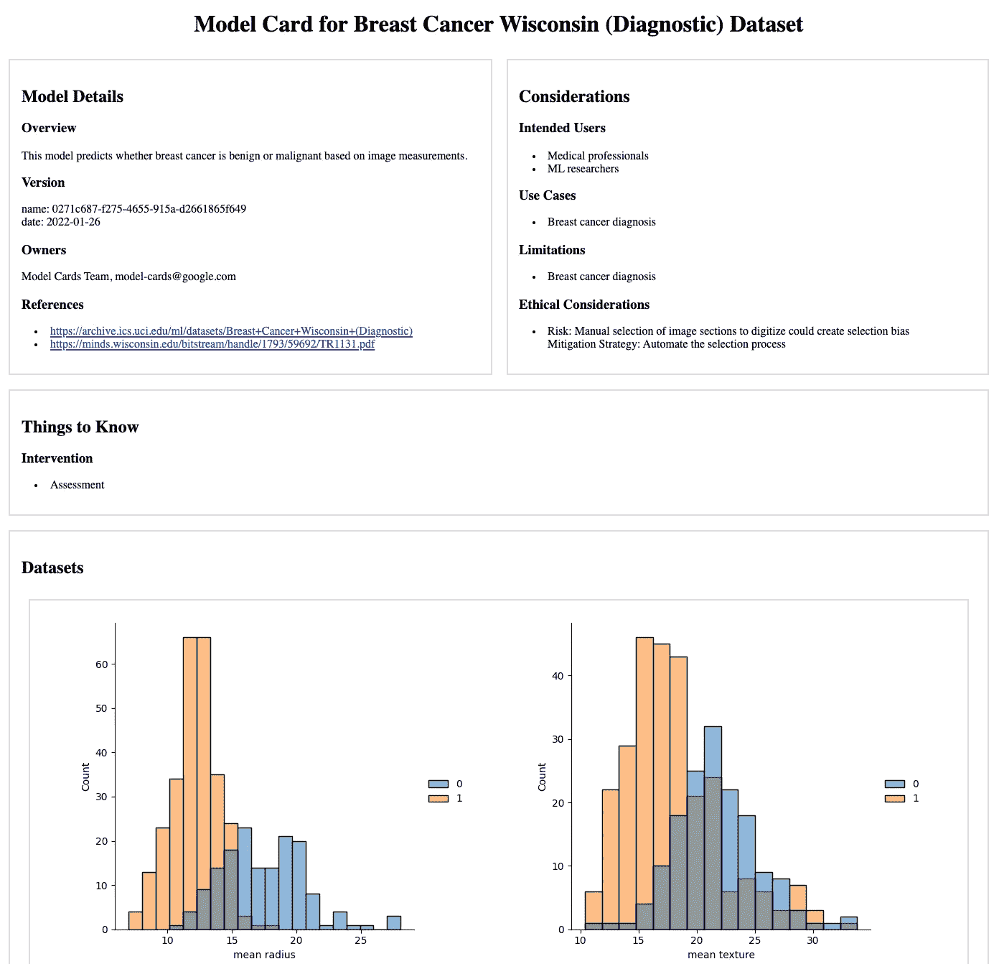

# 用谷歌的模型卡工具包创建一个定制的模型卡

> 原文：<https://towardsdatascience.com/create-a-custom-model-card-with-googles-model-card-toolkit-a1e89a7887b5>

# 用谷歌的模型卡工具包创建一个定制的模型卡

## 如何将您自己的字段添加到 Tensorflow 模型卡工具包模式中，以便自动生成自定义机器学习模型文档


这份文档并不老，而是“老古董”(图片由作者提供。)

随着算法决策的快速采用，模型透明性变得越来越重要。帮助解决这个透明性问题的一个提议的解决方案是[模型卡](https://modelcards.withgoogle.com/about)，它提供了带有模型性能度量和重要考虑事项的简明的便笺或备忘单风格的文档。准确和最新的文档很难获得，但像谷歌的开源 Tensorflow [模型卡工具包](https://github.com/tensorflow/model-card-toolkit) (MCT)这样的新工具可以通过在执行建模脚本时以编程方式自动生成文档并直接插入模型性能指标和图形来提供帮助。

虽然 MCT 为模型卡内容提供了一个很好的模板，但我在使用它时犹豫了，因为我真的需要能够添加额外的信息来适当地记录我的一些用例的工作。对我来说，所提供的模式(在 [protobuf](https://github.com/tensorflow/model-card-toolkit/tree/master/model_card_toolkit/proto) 中定义)是一个真正的限制因素。此外，Python 数据类目前是在模型卡工具包的安装步骤 期间从所提供的模式中生成的 ***。***

那么，如果模式是在安装中硬编码的，我如何扩展模型卡模板模式来添加关于我的模型的更详细的信息呢？我四处查看了一下，找到了所有需要修改的地方，以便添加模型卡内容，并构建了我自己的安装。因为我下周会忘记如何做这件事，除非我今天把它完整地记录下来，所以我想我会把细节以博客的形式发布出来。(嗯，感觉这里面有什么教训……)

# TL；速度三角形定位法(dead reckoning)

所有材料都可以在我的 GitHub [模型-卡片-演示](https://github.com/mtpatter/model-card-demo) repo 中获得。接下来，将 repo 克隆到您的本地环境中。你可以只在你的系统上运行 Docker 的例子，而不需要在本地安装任何东西，它将会与你当前拥有的任何版本的 MCT 隔离开来。在下面列出的文件中，我已经标记了在默认 MCT 模式中添加自定义字段所做的更改。只需搜索“自定义字段”

回购有几个不同的组成部分:

*   一个 [Dockerfile](https://github.com/mtpatter/model-card-demo/blob/main/Dockerfile) ，可用于构建本教程的 Docker 映像。你也可以用它来使用一般的 MCT(我发现它很难自己安装。)
*   一个 [protobuf 模式](https://github.com/mtpatter/model-card-demo/blob/main/data/custom_card_template.proto)，从最初的 MCT 模式修改而来，提供了一个额外的定制字段
*   修改后的[custom _ model _ card _ toolkit . py 文件](https://github.com/mtpatter/model-card-demo/blob/main/custom_model_card_toolkit.py)，定义了 MCT 类
*   修改后的 [custom_model_card.py 文件](https://github.com/mtpatter/model-card-demo/blob/main/custom_model_card.py)，定义模型卡数据类
*   一个 [jinja 模板](https://github.com/mtpatter/model-card-demo/blob/main/template/html/my_template.html.jinja)将在卡片中呈现额外的字段
*   一个示例端到端 [Python 脚本](https://github.com/mtpatter/model-card-demo/blob/main/make_card.py)训练一个 scikit-learn 模型并生成带有附加字段的定制模型卡

生成模型卡的 Python 脚本借用了 Google Cloud 的例子[如何在云中创建和部署 scikit-learn 模型卡](https://cloud.google.com/blog/products/ai-machine-learning/create-a-model-card-with-scikit-learn)。Google 的例子是基于 colab 或 Jupyter 的笔记本，并在笔记本中渲染模型卡。我已经去掉了重要的部分，这样定制的模型卡就作为。您可以单独查看的 html 文件。

# 方向

先克隆 repo，换到根目录。

```
git clone https://github.com/mtpatter/model-card-demo.git
cd model-card-demo
```

接下来，构建一个安装了修改后的 MCT 的 Docker 映像。此图像基于 TensorFlow 提供的 Docker 图像。因为 MCT 工具包在安装时编译 Python 数据类(不是我的错！)，无论何时对原型模式字段进行更改，都需要重新生成映像来重新安装模型卡工具包。

```
docker build -t "cards" .
```

训练模型，生成模型卡。请注意:下面的命令将运行一个 Docker 容器，该容器在本地挂载，对本地目录具有写访问权限，以便写入结果。

```
docker run \
  -u $(id -u):$(id -g) \
  --rm \
  -v $PWD/:/user/cards cards python make_card.py
```

结果被本地写入。`model_cards`目录下的 html 文件。

虽然最初的模型卡看起来像是[这个](https://github.com/tensorflow/model-card-toolkit/tree/v1.2.0)，但是新生成的定制模型卡在第二行有一个额外的框，我在那里添加了更多的信息。在本例中，它是“需要知道的事情”，我在其中插入了另一个标题“干预”，以及一个包含字符串“评估”的列表。



结果代码生成的模型卡。(图片由作者提供，修改自 [Tensorflow MCT](https://github.com/tensorflow/model-card-toolkit/tree/v1.2.0) 示例输出。)

# 粗糙的细节

我不得不做一些改变，下面描述一下。

旁白:这应该有助于更好地理解 MCT 如何用 protobuf 格式构造和保存模型卡，proto buf 格式是一种序列化为文件的结构化数据格式(有点类似于数据库)。使用 protobuf 有很多好处，包括能够保留数据类型(int、str 等)的特性。)当数据被保存并且能够传递与语言无关的数据时。如果你关注我的任何工作，你会知道我更喜欢 Apache Avro，原因我会在另一篇博文中写。

1.  模板。proto 文件需要额外的字段——这里我添加了 *Thingstoknow* 和 *Intervention* 。安装时，会生成一个包含 Python 数据类的新文件，该文件是在工具包的其余部分中导入的，所以不要直接接触它。

(图片由作者提供。)

2.工具包本身需要在 update_model_card()函数中进行编辑。

(图片由作者提供。)

3.模型卡模块本身需要更多的数据类和更新。

(图片由作者提供。)

4.jinja 模板需要修改，以便在 html 中插入一个新的 div。

(图片由作者提供。)

5.现在模型卡有了一个定制属性，*model _ card . thingstoknow . intervention*，它可以在您的模型卡生成脚本中定义。

(图片由作者提供。)

这可能看起来有点粗糙(因为确实如此)，但它确实有效。四处探索也有助于更好地揭示工具包的工作方式，这对于它的 protobuf 序列化组件来说尤其有趣。这些信息在任何地方都没有真正描述过，但它似乎是模型卡的整个基础…无论如何，请继续关注未来的协议缓冲区博客帖子！