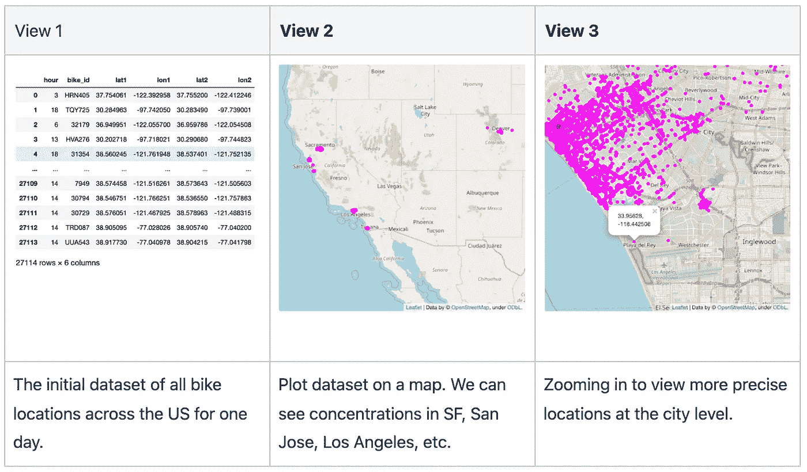
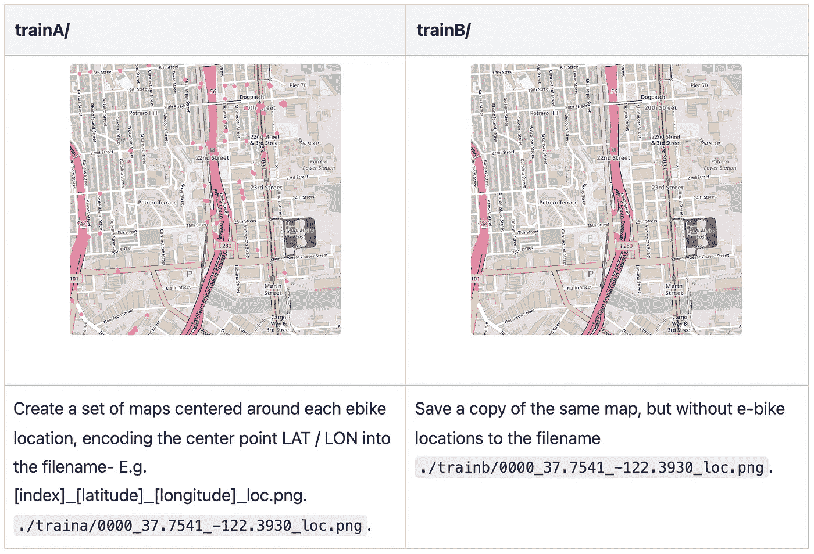
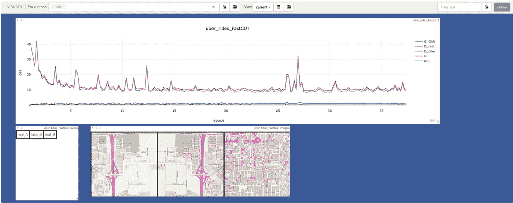
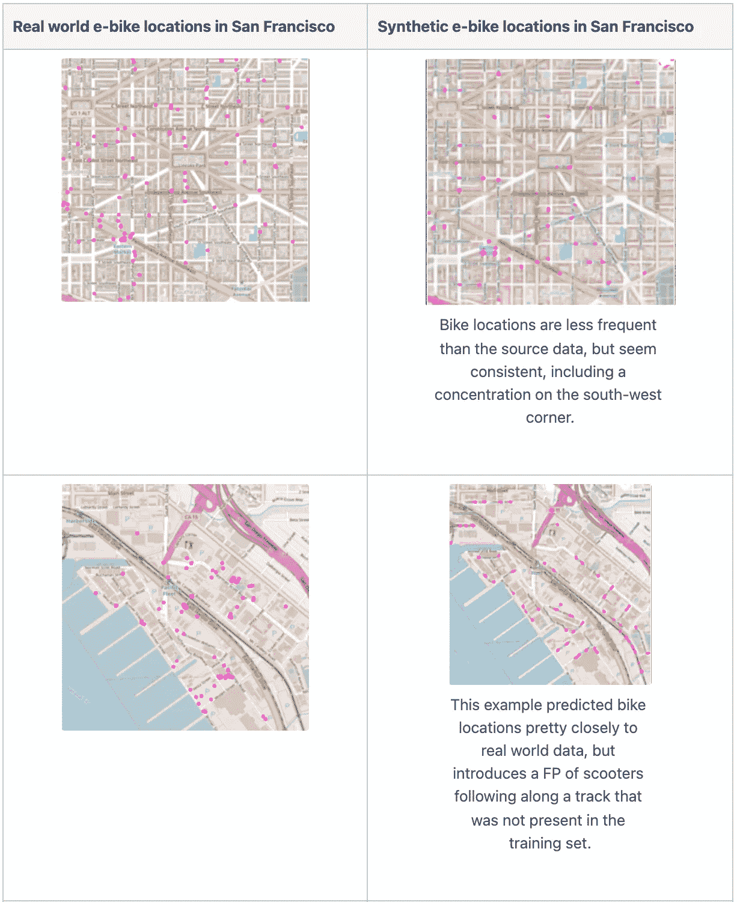
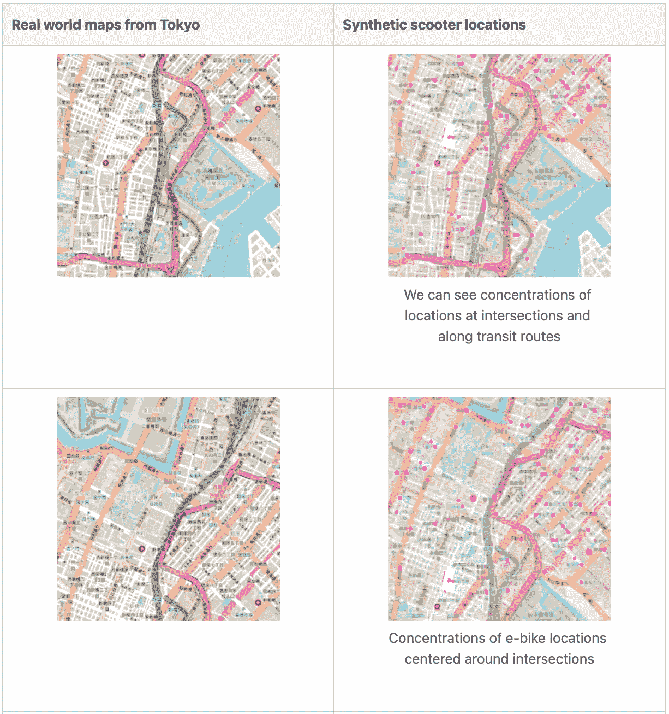
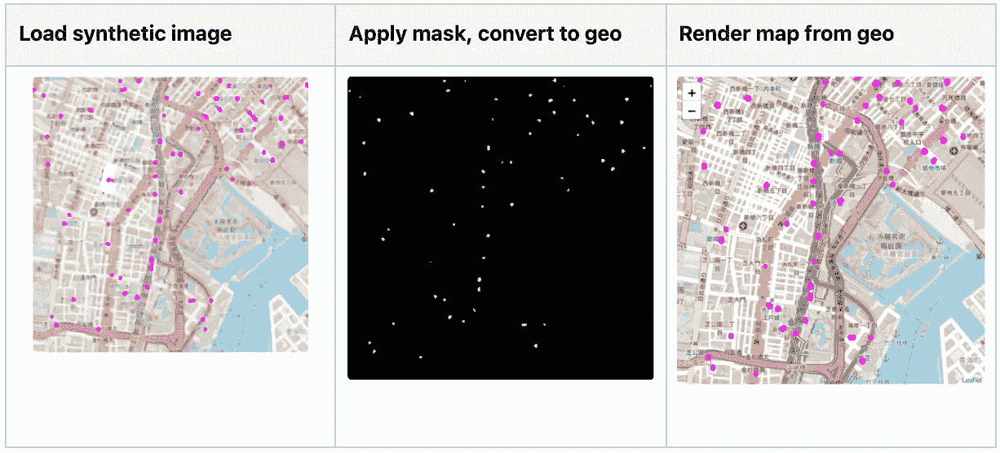
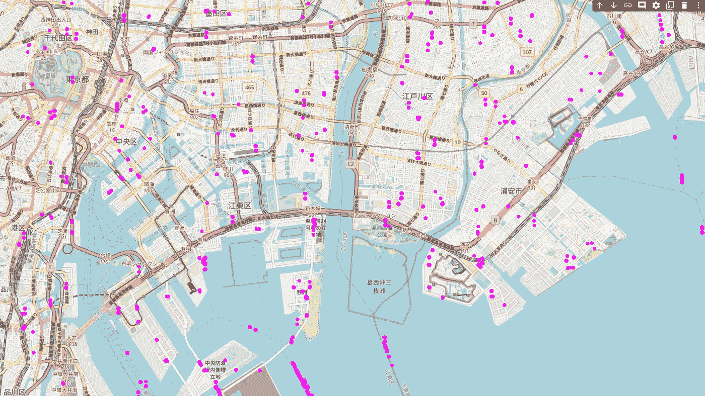
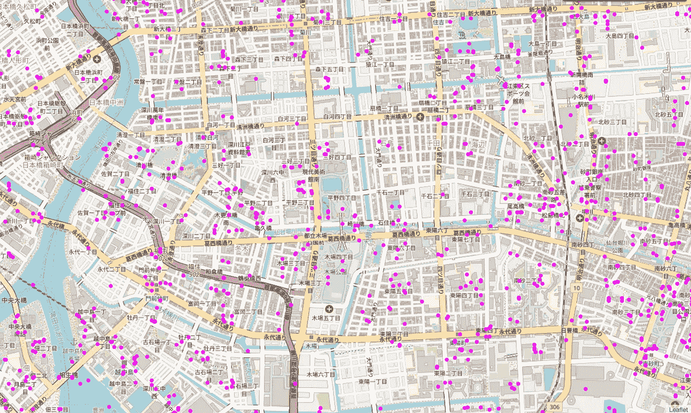

# 创建位置生成器 GAN

> 原文：<https://towardsdatascience.com/create-a-location-generator-gan-33680d81289f>

## 根据几个城市的公共位置数据训练一个快速 GAN，以预测电动自行车在世界各地的实际位置

在本帖中，我们将探索在美国各城市的地图数据和公共电动自行车反馈上训练一个[捷径](https://arxiv.org/pdf/2007.15651)生成对抗网络(GAN)模型。然后，我们可以通过为包括东京在内的世界各地的城市创建[合成数据集](https://gretel.ai/blog/what-is-synthetic-data)，来测试模型的学习和归纳能力。如果您愿意跟随，请[从 GitHub 克隆示例 repo](https://github.com/gretelai/GAN-location-generator) 👇并为您自己的城市创建合成位置数据集！


信用:sylv1rob1 via ShutterStock

```
git clone [https://github.com/gretelai/GAN-location-generator.git](https://github.com/gretelai/GAN-location-generator.git)
```

在[之前的一篇博客](https://gretel.ai/blog/using-generative-differentially-private-models-to-build-privacy-enhancing-synthetic-datasets-from-real-data)中，我们训练了一个[基于 LSTM 的语言模型](https://github.com/gretelai/gretel-synthetics)关于来自电动自行车反馈的精确位置数据，并使用该模型为相同地区(例如加利福尼亚州圣莫尼卡)生成合成的和隐私增强的数据集。通过以不同的方式构建问题并结合地图数据，我们可以**创建一个模型，生成人类可能在世界各地访问的精确位置**。



使用地图数据向地理数据集添加上下文。来源:Gretel.ai

# 入门指南

我们可以通过将电动自行车的位置数据作为像素编码到图像中来建模，然后训练为类似于 CycleGAN、Pix2pix 和 [StyleGAN](https://github.com/NVlabs/stylegan) 的图像翻译任务。在这篇文章中，我们将使用由 pix2pix 和 CycleGAN 的作者创建的较新的[对比不成对翻译](https://github.com/taesungp/contrastive-unpaired-translation) (FastCUT)模型，因为它的内存效率高，训练速度快(对高分辨率位置有用)，并且通过最少的参数调整就可以很好地推广。跟随 GitHub[https://github.com/gretelai/GAN-location-generator.git](https://github.com/gretelai/GAN-location-generator.git)上完整的端到端示例，或者为您自己的城市创建合成位置数据

# 步伐

## **模型训练步骤**

1.  从地图上精确的电动自行车位置库创建域名
2.  从相同的地图创建域名，但没有位置
3.  翻译域名的培训捷径 B →域名

## **合成数据生成步骤**

1.  对于目标地理位置，请下载新地图(DomainC)
2.  对捷径模型运行推理以预测指示器位置(translate DomainC->DomainA)
3.  使用 CV 处理图像以查找踏板车位置并转换为纬度/LON

# 创建训练数据集

安装完依赖项后，运行`python -m locations.create_training_data`创建一对 512x512px 的地图图像，包括和不包括来自 e-bike 数据集的位置数据。



来源:Gretel.ai

接下来，在数据集上训练我们的模型——本质上是训练捷径模型来预测电动自行车的位置将在哪里得到地图。

快捷模型将数据记录到 [Visdom](https://github.com/fossasia/visdom) ，这让我们可以监控模型训练。在下图中，我们可以看到模型损失在训练过程中减少，也可以看到图像转换任务的预览。第一个图像是真实的 DomainA 地图数据，第二个是带有预测的 scooter 位置(假)的 DomainA 图像的翻转版本，第三个是真实的 DomainB 位置。我们可以看到，即使在 25 个时代之后，该模型也在学习预测什么看起来像合理的踏板车位置——例如，街角和道路沿线。



来源:Gretel.ai

当运行推荐的 200 个时代时，模型似乎过拟合，预测的踏板车位置从图像中消失。对于这个例子，我在更早的纪元(纪元 30)中看到了最好的性能。这是一些模型预测的来自旧金山的真实世界 v .合成图像。



来源:Gretel.ai

# 创建测试数据集

运行以下命令创建东京市区地图位置 15x15 格网的训练数据集，或修改纬度和经度参数以创建任何地理区域的合成位置。注意，根据快捷 python 代码的工作方式，我们需要将地图网格图像复制到`testA`和`testB`目录中。

```
python -m location_utils.create_test_dataset --lat 35.652832 --lon 139.839478 --name Tokyo
```

我们现在可以使用我们的模型来处理为上面的网格创建的每个图像，以预测电动自行车在东京的位置。

查看单个图像的结果:



东京市中心综合生成的电动自行车位置。来源:Gretel.ai

# 将合成图像转换回坐标

现在，我们的任务是从东京的图像中获取合成的电动自行车，并将它们转换为现实世界的坐标，以建立我们的合成位置数据集。为了提取电动自行车的位置，我们使用 OpenCV 应用了一个图像蒙版，在图像中搜索任何洋红色像素组。一旦创建了蒙版，我们就可以计算蒙版中任何像素到图像文件名中编码的中心点纬度和经度的距离。

请注意，根据城市在世界上的位置，每个纬度或经度之间的物理距离可能会有很大差异，当将像素映射到位置时，我们需要使用基于椭球的模型来计算精确的偏移。幸运的是，`geopy` Python 库使这变得容易。

下图使用了`cv2.imshow()`函数来预览蒙版图像，然后我们将蒙版图像转换回经纬度坐标。



使用 OpenCV 检测合成图像中的踏板车位置。来源:Gretel.ai

# 把所有的放在一起

现在，我们可以处理所有图像，并将合成位置拼接成一个新的东京数据集。

在查看整个东京的数据时，尤其是针对水路生成位置时，肯定会出现一些误报。也许进一步的模型调整，或在训练数据中提供更多的水道的负面例子(domainA 或 domainB)会减少假阳性。



为东京市中心组装合成踏板车。来源:Gretel.ai

然而，结果是令人鼓舞的(给定很少的模型或数据集调整)-模型似乎能够模拟电动自行车数据集的分布和位置，该数据集是使用世界不同地区的地图进行训练的。



东京市中心的电动自行车位置预测。来源:Gretel.ai

# 结论

在本帖中，我们尝试应用视觉领域的上下文(例如地图数据)和表格数据，来创建世界上任何地方的真实位置数据。

如果你喜欢这个例子或者有任何问题，请在 GitHub 上留下 [⭐️，或者在我们的](https://github.com/gretelai/GAN-location-generator) [Slack](https://gretel.ai/slackinvite) 上告诉我们！

# 信用

下面的作者为我们在这个例子中应用的快速算法提供了优秀的论文和代码。由朴、埃夫罗斯、张、朱(2020)

在 [Gretel.ai](https://gretel.ai) ，我们构建 API，让[合成数据](https://gretel.ai/blog/what-is-synthetic-data)对开发者和数据科学家来说变得简单和可扩展。