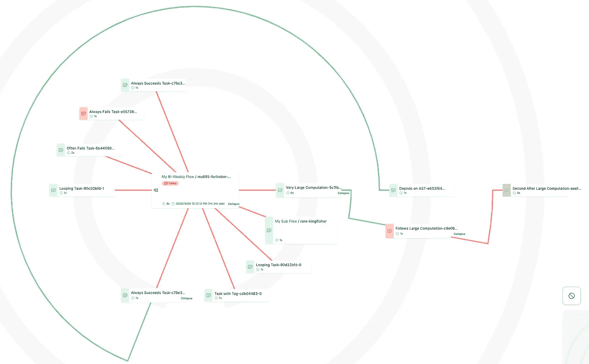
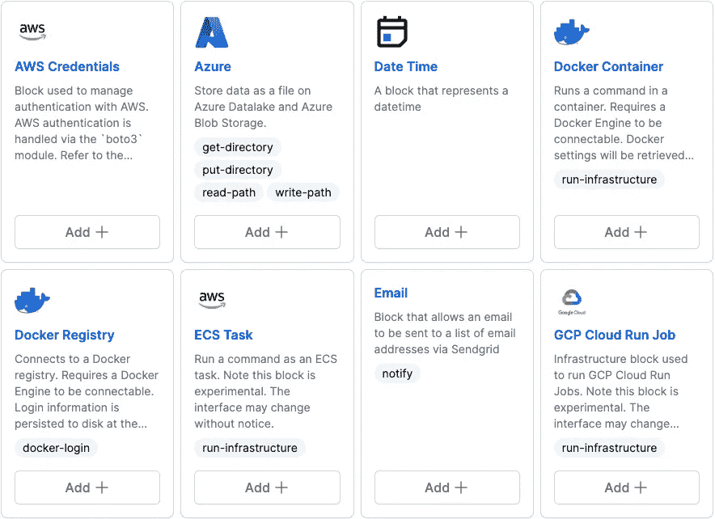
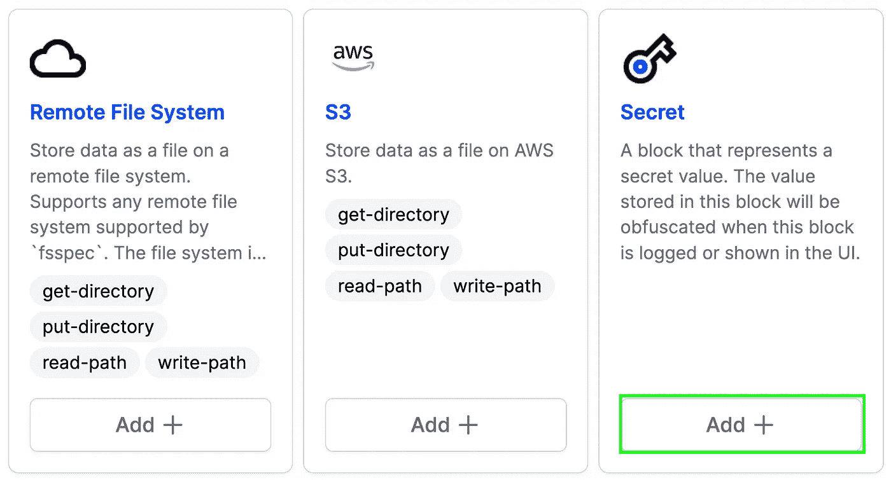
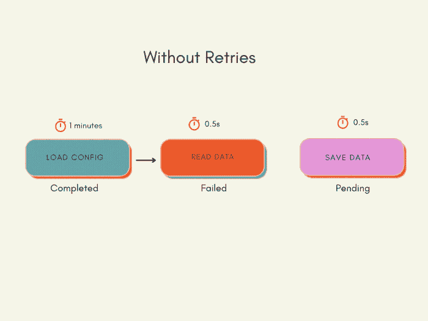
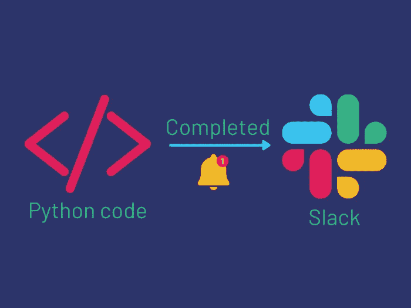

# 用提督和 DVC 创建一个可维护的数据管道

> 原文：<https://towardsdatascience.com/create-a-maintainable-data-pipeline-with-prefect-and-dvc-1d691ea5bcea>

## 使您的管道更易于支持和维护

# 动机

在工程中，可维护性是指产品维护的难易程度:

*   满足新要求
*   应对不断变化的环境
*   提高产品的性能

在数据科学项目中，构建可维护的管道至关重要，因为:

*   数据的特征可能会经常改变
*   数据科学家需要尝试处理数据的新方法，引入新功能和模型来提高产品质量
*   项目的最终目标可能会改变
*   该项目需要扩大规模以满足新的需求
*   管道在其生命周期中可能由不同的数据科学家构建和修改

那么如何构建一个可维护的管道呢？让我们从识别可维护管道的一些特征开始。

可维护的管道应该:

*   **容易对**对**对**对**理解**
*   **很容易看出**对管道的改动
*   **可重用**减少需要验证和维护的代码总量
*   **可观察的**便于调试或确保管道正常工作
*   **快速试验**有效改进现有模型


作者图片

在这篇文章中，**你将学习如何使用提督和 DVC 的组合来创建一个可维护的管道。**

# 什么是 DVC？

[DVC](https://dvc.org/doc/start) 是数据版本控制系统。它本质上类似于 Git 的数据。

</introduction-to-dvc-data-version-control-tool-for-machine-learning-projects-7cb49c229fe0>  

# 什么是提督？

[perfect](https://www.prefect.io/)是一个开源库，允许你编排和观察用 Python 定义的数据管道。

<https://medium.com/the-prefect-blog/orchestrate-your-data-science-project-with-prefect-2-0-4118418fd7ce>  

让我们来看看如何利用提督和 DVC 一起创建一个可维护的数据管道。

# 容易理解

当管道的组件被很好地定义和适当地命名时，评审者可以关注更高层次的构建块以及它们如何组合在一起，而忽略每个块的细节。

为了使管道更容易理解，您可以:

*   将代码分成更小的组件，每个组件只做一件事
*   为每个组件指定一个描述性名称

</python-clean-code-6-best-practices-to-make-your-python-functions-more-readable-7ea4c6171d60>  

例如，在下面的代码中，可能很难理解`compare_two_keywords`函数的每一行代码。

让我们将流程分成更小的函数，每个函数只做一件事。


作者图片

现在，由于内部函数的描述性名称，评审者可以理解`compare_two_keywords`函数是做什么的。

# 可观察量

能够观察您的管道使得理解逻辑和调试代码更加容易。在本节中，您将学习如何通过以下方式使您的代码可被观察到:

*   记录正在执行的组件
*   可视化管道中的组件
*   可视化管道的输入和输出

## 记录正在执行的组件

目前，我们不知道执行文件时运行的是哪个组件，这使得调试变得很困难。

为了了解哪个组件正在运行，我们可以将`@flow`添加到外部函数，将`@task`添加到内部函数。

一个[流程](https://docs.prefect.io/concepts/flows/)是所有完美工作流的基础。一个[任务](https://docs.prefect.io/concepts/tasks/)代表一个流程中执行的不同的工作。

简单地说，任务是做一件事的功能，而流是包含几个任务的功能。

现在，当执行 Python 脚本时，您应该看到正在执行哪个任务及其状态。

## 可视化流程中的组件

Prefect UI 中的雷达图允许您可视化流程中任务及其状态之间的依赖关系。

例如，在下面的雷达图中，红色节点是失败的任务，而绿色节点是成功的任务。如果两个任务由一条线连接起来，它们就相互依赖(例如，一个任务使用另一个任务的输出)。



作者图片

通过查看雷达图，审阅者能够更快地理解任务之间的关系。

## 用 DVC 可视化输入和输出

*阶段*代表单独的数据过程。有时，您可能希望可视化管道不同阶段的输入和输出。

DVC 允许你通过文件`dvc.yaml`指定管道中的阶段及其依赖关系

比如在[这个项目](https://github.com/khuyentran1401/prefect-dvc)中，我用`dvc.yaml` : `process_data`和`train`指定了两个阶段。在每个阶段，

*   `cmd`指定执行阶段的命令
*   `deps`指定阶段的依赖关系
*   `outs`指定阶段的输出
*   `plots`指定该阶段的情节
*   `params`指定代码中使用的影响结果的值

现在，评审者可以通过运行`dvc dag --outs`来可视化每个阶段的输出文件:

```
 +----------+                    
                          | data/raw |                    
                          +----------+                    
                                *                         
                                *                         
                                *                         
                      +-------------------+               
                      | data/intermediate |               
                      +-------------------+               
                  ****          *          *****          
              ****              *              ****      
           ***                  *                  ***   
+------------+         +-------------------+         +-------+
| data/final |         | model/cluster.pkl |         | image |
+------------+         +-------------------+         +-------+
```

# 可重复使用的

很多时候，您可能想要重用管道的一些组件，比如配置和凭证。这减少了需要验证和维护的代码总量。

Prefect 允许你用[块](https://docs.prefect.io/concepts/blocks/)做同样的事情。块提供了一种安全的方式来存储配置和功能，以便与外部系统(如 AWS、GitHub、Slack 或 Microsoft Azure)进行交互。



作者图片

让我们尝试通过[提督 UI](https://docs.prefect.io/ui/overview/) 使用 secret 块存储一个秘密。



作者图片

要在机密块中存储值，请单击添加，然后插入名称和值。


作者图片

现在，您和任何有权访问您的工作空间的人都可以在不同的 Python 脚本中访问这个秘密。

# 很容易看出变化

当您对代码和参数进行更改时，了解这些更改是有用的。

DVC 允许您使用命令`dvc status`查看管道中的变化:

```
$ dvc status
process_data:                                                                                                       
        changed deps:
                modified:           src/process_data.py
```

您也可以使用命令`dvc params diff`跟踪参数的变化:

```
$ dvc params diff
Path                           Param                             HEAD    workspace
config/process/process_1.yaml  remove_outliers_threshold.Income  60000   61000
```

# 快速实验

建立管道也很重要，这样数据从业者就可以快速地试验不同的代码、参数和模型。

有了 Prefect，您可以通过下面解释的概念快速进行实验。

## **时间表**

您可以安排流程定期运行，例如每天或一周中的某一天。


作者图片

## 重试次数

假设您正试图连接到一个数据库。有时行得通，有时行不通。通常，如果无法连接到数据库，整个管道都会失败，您需要重新运行整个流程。



作者图片

在这种情况下，重新运行失败特定次数的任务比重新运行整个管道更有效。


作者图片

提督允许你自动重试失败。要启用重试，请向您的任务添加`retries`和`retry_delay_seconds`参数:

在上面的代码中，`read_data`将最多重试 3 次，并在每次重试之间等待 5 秒钟。

## 通知

你的血流可能需要几个小时。您可以在流程完成或失败时向 Slack 通道或电子邮件发送通知，而不是经常检查代码的状态。



作者图片

<https://medium.com/the-prefect-blog/sending-slack-notifications-in-python-with-prefect-840a895f81c>  

## 贮藏

想象你运行一个流程两次。流程中的最后一个任务在您第一次运行时失败，因此您修复了您的任务，流程成功运行。

但是任务`fill_missing_description`运行时间比较长，需要等待第二次运行完成。


作者图片

不需要重新运行`fill_missing_description`，您可以在第一次运行时使用缓存来保存任务的结果，然后在第二次运行时重用它的结果。


作者图片

要在提督中使用缓存，请指定`cache_key_fn`。缓存关键字指示一次运行是否与另一次运行相同。如果 Prefect 找到一个带有匹配缓存键的运行，它将使用缓存的运行。

要根据输入缓存任务，使用`task_input_hash`。如果任务输入没有改变，提督将使用缓存的结果。

## 仅当管道更改时才触发运行

有时，当有变化时，您可能希望只运行管道**。这可以防止你在不必要的跑步上浪费时间和资源。**

要在有变化时运行管道，使用命令`dvc repro`。

例如，当我的代码没有变化时，这是我运行命令时得到的输出:

```
$ dvc repro
'data/raw.dvc' didn't change, skipping                                                                              
Stage 'process_data' didn't change, skipping                                                                        
Stage 'train' didn't change, skipping                                                                               
Data and pipelines are up to date.
```

如果`train`阶段的代码发生变化，则只执行`train`阶段的代码。

# 结论

恭喜你！您刚刚学习了如何使用 DVC 和提督创建可维护的管道。通过几个步骤来建立您的管道，您的团队在进行更改时会更有信心。

查看这个资源库，了解一个全面的项目，该项目包括“提督”和“DVC ”:

<https://github.com/khuyentran1401/prefect-dvc/>  

我喜欢写一些基本的数据科学概念，并尝试不同的数据科学工具。你可以在 LinkedIn 和 Twitter 上与我联系。

如果你想查看我写的所有文章的代码，请点击这里。在 Medium 上关注我，了解我的最新数据科学文章，例如:

</validate-your-pandas-dataframe-with-pandera-2995910e564>  </dagshub-a-github-supplement-for-data-scientists-and-ml-engineers-9ecaf49cc505>  <https://pub.towardsai.net/github-actions-in-mlops-automatically-check-and-deploy-your-ml-model-9a281d7f3c84>  </create-robust-data-pipelines-with-prefect-docker-and-github-12b231ca6ed2>  

# 参考

维基媒体基金会。(2022 年 10 月 9 日)。*可维护性*。维基百科。检索于 2022 年 10 月 11 日，发自 https://en.wikipedia.org/wiki/Maintainability

*可维护的 ETL:让您的管道更容易支持和扩展的技巧*。多线程。(未注明)。2022 年 10 月 11 日检索，来自[https://multithreaded . stitchfix . com/blog/2019/05/21/maintainable-etls/](https://multithreaded.stitchfix.com/blog/2019/05/21/maintainable-etls/)