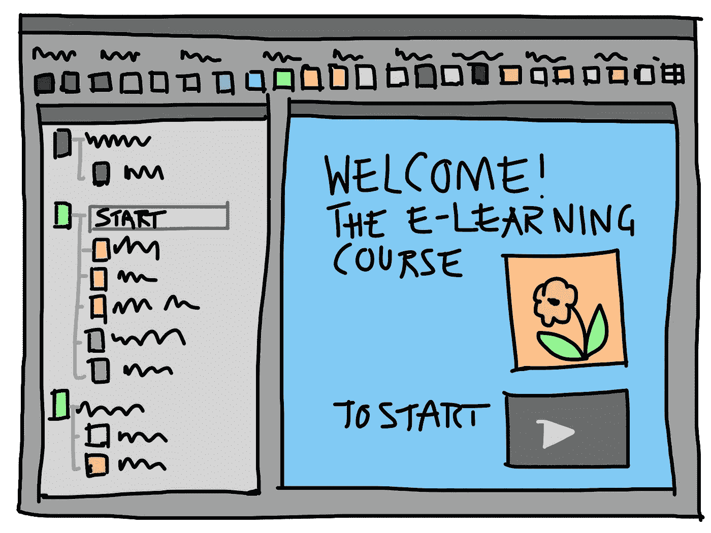
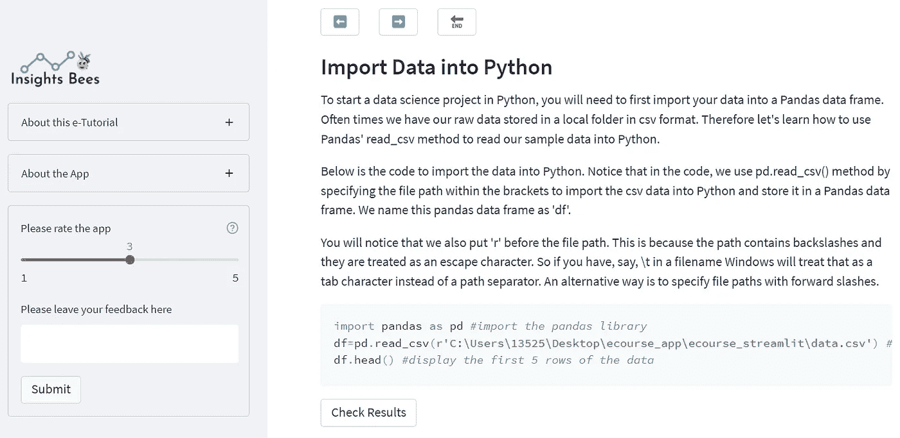
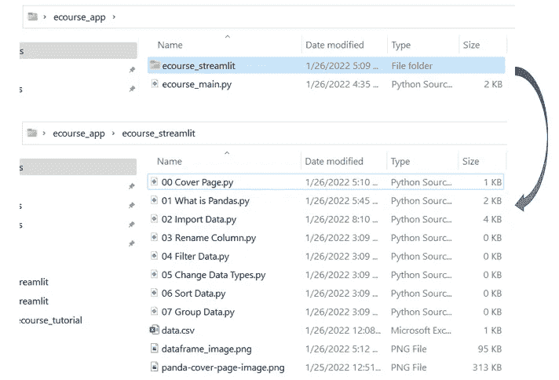
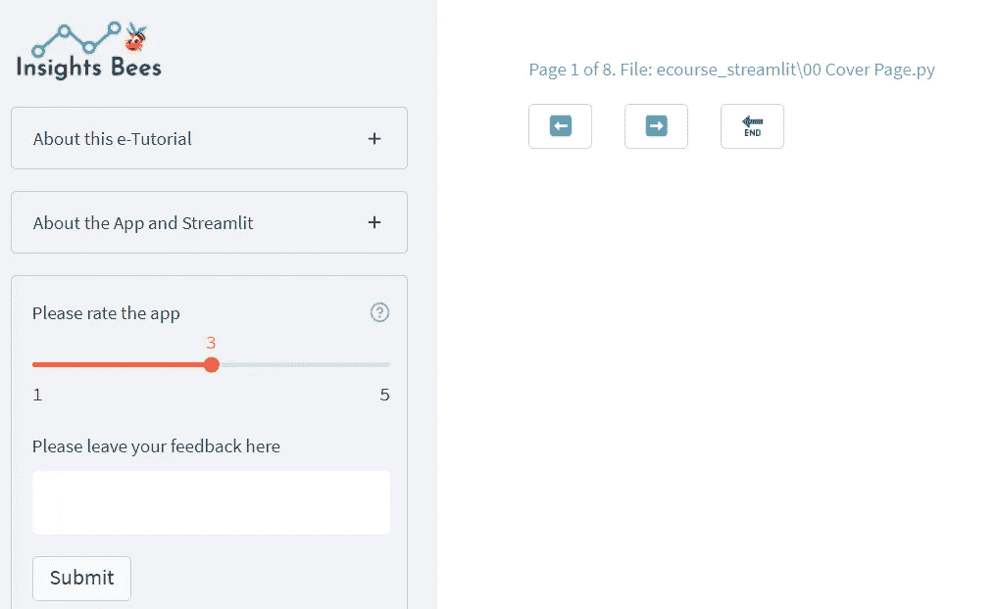
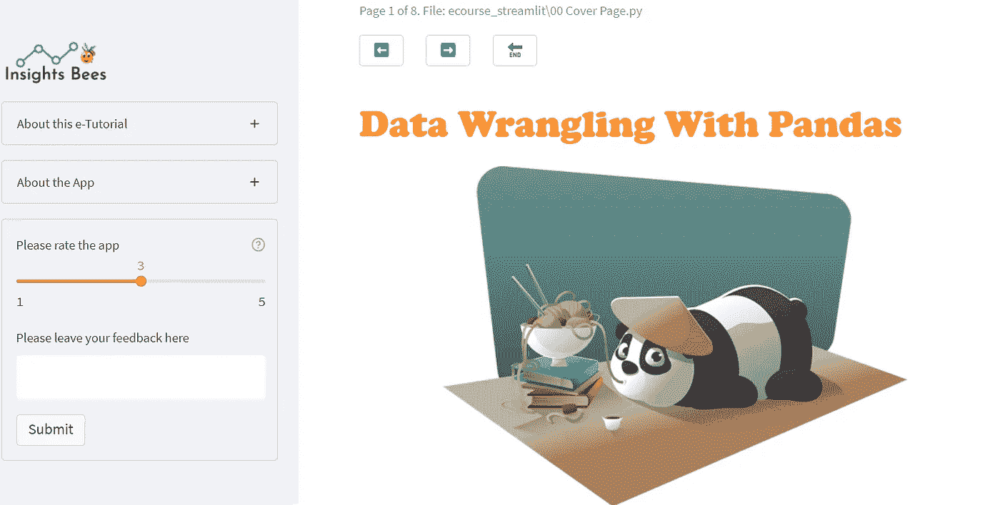
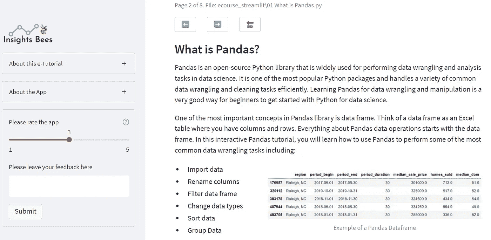

# 使用 Streamlit 创建交互式数据科学电子课程应用程序

> 原文：<https://towardsdatascience.com/create-an-interactive-data-science-e-course-app-using-streamlit-b9f093aa64a1>

## 探索 streamlit_book -一个新的 streamlit 伙伴库-用于创建交互式电子书/电子教程/电子课程



图片由 [Pixabay](https://pixabay.com/illustrations/presentation-gui-e-learning-course-341444/) 提供

# 介绍

如果你关注我的 Medium 博客已经有一段时间了，你应该知道我是 Streamlit 的忠实粉丝。我写过几篇关于 Streamlit 的文章，从完整的初学者教程到动手的应用程序构建项目。我永远不会对它感到厌倦，并且每天都在寻找新的特性、很酷的技巧或令人兴奋的能力来探索和学习。

作为一名数据科学家，Streamlit 让我探索 web 应用程序开发的世界变得可能和超级容易，我发现这非常迷人和令人大开眼界。我最近偶然发现了一个新的 streamlit 伙伴库 streamlit_book，它是由 Sebastian Flores Benner 创建的，旨在供教师和内容创建者使用 Streamlit 框架创建交互式电子课程、教程或演示文稿。

我超级感兴趣，马上开始探索，玩起来。使用 Streamlit 和 streamlit_book，我创建了一个样本数据科学电子教程应用程序，它有多个页面，用户可以与之交互的代码示例，以及测试知识的测验。尽管在这个过程中我遇到了一些小问题(我不得不使用一些变通方法)，但总的来说，我发现这个新库非常有用和方便。

在本文中，我将与您分享创建数据科学电子教程应用程序的想法、步骤和代码。这里的主要想法是试验 Streamlit 框架，看看我们是否可以在数据科学教程中引入某种程度的交互性，例如在多个页面中安排内容，允许用户运行并检查代码示例的输出，以及为用户提供测验以增强他们的学习体验。

下面是一个 YouTube 视频短片，演示了这款应用程序:

作者提供的视频



示例教程页面(图片由作者提供)

# 先决条件

如果您还没有这样做，您需要在您的计算机上安装 Streamlit 和 streamlit_book 来构建此应用程序。

**#1:细流安装:**

可以参考下面的[文章](/streamlit-hands-on-from-zero-to-your-first-awesome-web-app-2c28f9f4e214)，按照说明安装 Streamlit，学习基础知识。

[](/streamlit-hands-on-from-zero-to-your-first-awesome-web-app-2c28f9f4e214) [## 简化实践:从零到你的第一个优秀的网络应用

### 学习核心概念并使用 Streamlit 创建您的第一个 Web 应用程序的分步指南

towardsdatascience.com](/streamlit-hands-on-from-zero-to-your-first-awesome-web-app-2c28f9f4e214) 

**#2:安装 streamlit_book**

按照 streamlit_book 文档页面上的说明安装 streamlit_book 库:

```
pip install streamlit_book
```

 [## 安装-简化 _ 书籍文档

### 代码库位于 https://github.com/sebastiandres/streamlit_book.当前的实现…

streamlit-book.readthedocs.io](https://streamlit-book.readthedocs.io/en/latest/install.html) 

# 创建项目文件夹和文件

在我们启动 Streamlit 并开始构建应用程序之前，让我们创建一个项目文件夹和一些空的 python(。py)文件，遵循如下所示的步骤和结构。

首先，让我们创建一个名为“ecourse_app”的项目文件夹，该文件夹将存放该项目所需的所有文件。在项目文件夹中，创建一个名为“ecourse_streamlit”的子文件夹和一个空 python(。py)名为“ecourse_main.py”的文件。这个 python 文件将是设置应用程序结构和属性的主要文件。

在“ecourse_streamlit”子文件夹中，创建几个空的 python 文件，这些文件将存放所有课程内容。每个 python 文件都充当应用程序中的一个页面。由于 streamlit_book 按字母顺序对内容文件进行排序和读取，因此在文件名前加上数字有助于获得所需的排序。在该文件夹中，您还需要包含一个示例数据 CSV 文件和一个将用作封面图像的图像。



作者图片

现在我们可以从 Anaconda 终端窗口启动 Streamlit。一个空白的 Streamlit 应用程序应该会出现在您的本地 web 浏览器中。


作者图片

# 创建主文件(ecourse_main.py)

打开 ecourse_main.py 文件，插入下面的代码。第 6 行设置了 streamlit_book 属性，并允许您配置应用程序的行为。您需要使用 path 参数指定 streamlit_book 应该在其中查找所有内容文件的文件夹名称。您还可以通过选取自己的图标或文本来自定义“上一页”和“下一页”按钮的外观。

我们还可以向应用程序添加一个侧栏，并提供一些关于应用程序的附加信息。为了节省空间，我们可以使用 st.sidebar.expander()小部件。我们还将创建一个反馈部分，要求用户对我们的应用程序进行评级并提供任何反馈。



作者图片

# 创建内容文件(00 封面. py 等。)

## 创建封面(00 封面. py)

让我们首先为我们的电子教程创建一个封面。打开“00 Cover Page.py”文件并插入以下代码。

第 5–9 行:我们给应用程序的封面添加一个标题。我们选择 st.markdown()而不是 st.title()的原因是，我们可以使用 CSS 来设置文本的样式，使其在视觉上更具吸引力。

第 11–19 行:我们给应用程序添加了一个封面图片。我们在这里使用了一个小技巧来使图像居中。使用 st.columns()我们可以创建 3 列，其中第二列(放置图像的列)的宽度是第一列和第三列的 6 倍，因此将图像放置在中间。

我们的封面完成了！看起来是这样的:



作者图片(熊猫图片由 [Pixabay](https://pixabay.com/vectors/panda-character-chinese-noodle-1892023/) 提供)

## 创建介绍页面(01 什么是熊猫. py)

在封面之后，让我们创建一个介绍页面，给读者一个关于熊猫图书馆和这个电子教程的介绍。打开“01 什么是 Pandas.py”并插入下面的代码:

因为简介页面是一个文本丰富的页面，所以您不必总是使用 python(.py)文件。您可以使用降价文件(.md 文件)，如果您想对文本应用更多的自定义样式和格式。



作者图片

## 创建“导入数据”页面(02 导入数据. py)

现在让我们进入第三页，即“导入数据”页。在这一页，我们想向读者展示如何导入一个 CSV 文件到熊猫。我们希望通过允许用户运行代码示例并检查输出来使页面具有交互性。我们还希望在页面的末尾包含一些小测验，以便用户可以自测他们的知识。这是一个有趣的页面！

打开“02 Import Data.py”文件并插入以下代码:

让我们详细检查一下上面的代码:

第 5–6 行:我们使用 st.subheader()向页面添加标题，并使用 st.markdown()添加一些文本来解释如何将数据导入 Python。

第 8–10 行:我们将第一段代码放在一个字符串中，然后使用 st.code()显示它。

第 12–18 行:我们创建了一个 Streamlit 按钮，这样当用户点击“检查结果”按钮时，我们使用 st.write()显示第一段代码的输出。

第 20–30 行:我们对第二段代码做同样的事情。

第 32–46 行:我们将第三段代码放入一个字符串中，并使用 st.code()显示它，就像我们对前两段代码所做的那样。但是，由于这段代码的输出不是数据帧，所以我们不能只使用 st.write()来显示输出。相反，我们需要将输出转换成一个字符串，并使用 st.text()来显示结果，如第 39–44 行所示。

第 48–58 行:我们创建了一个测验部分，并使用两个内置的 streamlit_book 小部件添加了两个问题:stb.single_choice()和 stb.true_or_false()。


作者图片

这就是教程的第三页。它有几段解释概念和代码，然后显示代码示例，并允许用户运行和检查输出！它还有一个很好的测验部分，为应用程序带来额外的交互性。

现在，您只需遵循相同的代码模板，并在此应用程序中创建其余的页面！一定要看看 streamlit_books 的[文档](https://streamlit-book.readthedocs.io/en/latest/)页面，因为它还有一些其他很酷的功能可以尝试，比如多选题小部件、待办事项小部件等。要有创意，要有乐趣！感谢阅读，我希望你喜欢这篇文章。

作者提供的视频

# 参考:

1.  [如何用 5 个步骤](https://blog.streamlit.io/how-to-create-interactive-books-with-streamlit-and-streamlit-book-in-5-steps/)用 Streamlit 创作互动书籍 [Sebastian Flores Benner](https://blog.streamlit.io/author/sebastian/)
2.  Streamlit_book 文档:[https://streamlit-book.readthedocs.io/en/latest/](https://streamlit-book.readthedocs.io/en/latest/)

你可以通过这个[推荐链接](https://medium.com/@insightsbees/membership)注册 Medium 会员(每月 5 美元)来获得我的作品和 Medium 的其他内容。通过这个链接注册，我将收到你的会员费的一部分，不需要你额外付费。谢谢大家！