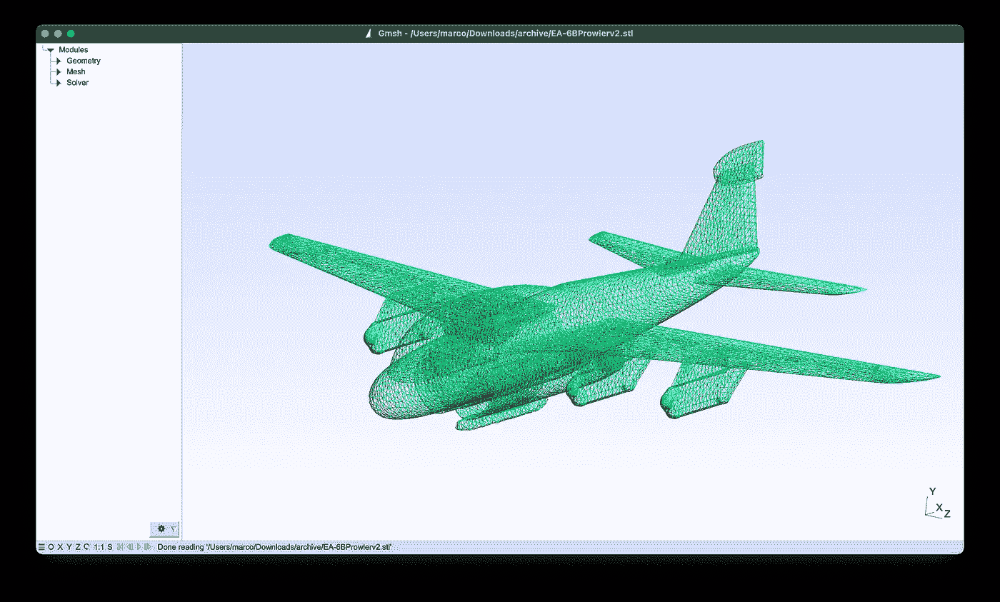
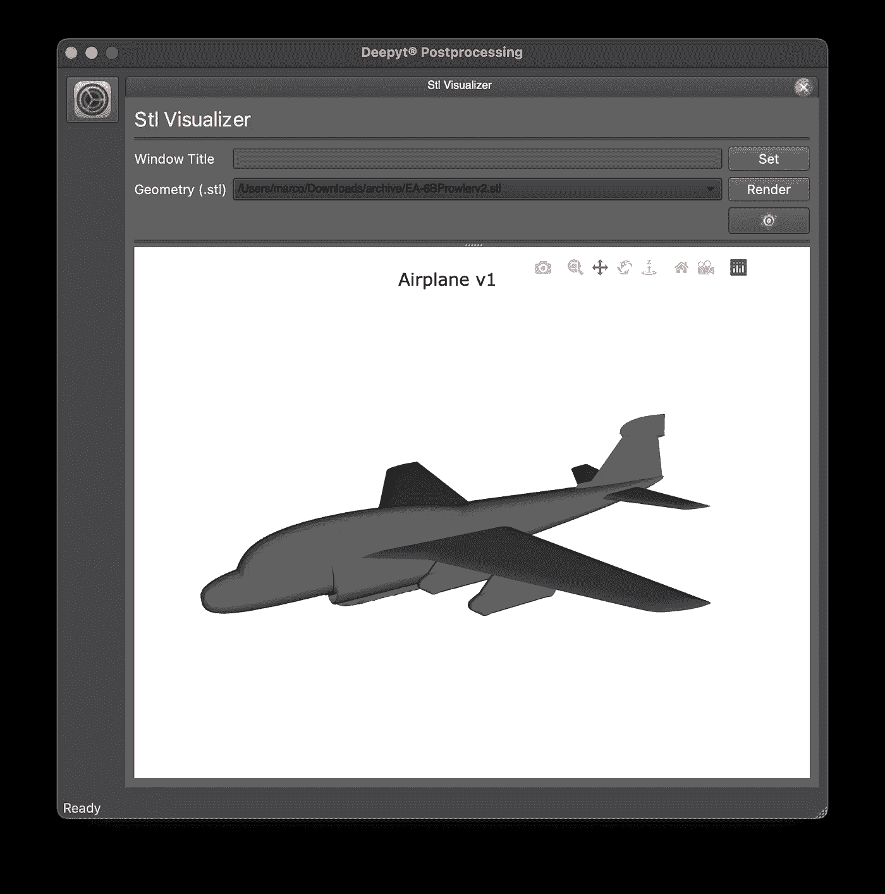

# 创建 Cad 并将其部署到。stl 转换器:Streamlit 和 Python

> 原文：<https://towardsdatascience.com/create-and-deploy-a-cad-to-stl-converter-streamlit-and-python-28a01240726a>

## 快速高效地创建并投入生产

这篇文章提出了两个主题:

*   渴望尝试使用工具来部署**【python】****项目**作为 **web** **应用**，快速与朋友、客户和同事分享自己的工作，并拥有一个响应迅速、令人愉悦的界面
*   实现一个定制系统，用于将 **CAD** **几何图形** (step 和 iges)转换为 **STL** **格式**，用于工程和人工智能应用。

我发现这个工作流程(和最终结果)真的**让**满意**让**满意，考虑到最终结果的质量和实现所需的时间之间非常高的比率。根据这篇文章，你可以**尝试**这个应用程序，**复制**它，**从它那里获得灵感，创造一个新的应用程序！**

您可以在以下位置尝试此应用程序:

[https://share . streamlit . io/git Marco 27/deepcadconverter/main/main . py](https://share.streamlit.io/gitmarco27/deepcadconverter/main/main.py)

# 什么是简化

[](https://streamlit.io/)  

> [Streamlit](https://www.streamlit.io/) 是一个开源的 Python 库，可以轻松创建和共享漂亮的、定制的机器学习和数据科学 web 应用。只需几分钟，您就可以构建和部署强大的数据应用程序。

当我第一次读到这个项目时，我立刻被这个想法吸引住了。

自由地用主机部署应用程序的能力令人难以置信。除此之外，还能拥有具有吸引力和响应性的图形，而无需使用 **Html** 和 **CSS** 。只需创建一个格式良好的 **Github** 库，就大功告成了:我们已经准备好使用和共享我们的 web 应用程序了。这开启了一个潜在应用的海洋:例如，我们可以以快速、实用、有效的方式实现复杂的人工智能算法，进行训练，并将我们的模型投入最终用户的生产。


CAD 到 STL 转换器 streamlit 应用程序—图片由作者提供

关于什么是 streamlit，它是如何工作的，我就不多说了。你可以在[](https://marcosanguineti.medium.com/subscribe)**上找到很多关于它的非常有趣的文章(我提醒你，成为[会员](https://marcosanguineti.medium.com/subscribe)你就可以接触到无限的文章，支持我们的工作)。**

**您可以在下面找到该应用程序的完整代码:**

**[](https://github.com/GitMarco27/DeepCadConverter)  

可以随意复制，叉或者改进！

# 为什么是 Cad 到 Stl 的转换器

在**机械**和**工业**工程**领域工作，以及在人工智能和软件开发领域工作，恰好要处理各种格式的实体( **CAD** )，用各种软件制作。**

**各种**格式**之间的转换** **绝非小事，尤其是在不借助专业软件的情况下，从许可的角度来看通常非常昂贵(尤其是如果仅用于几何图形的转换)。**

有很多在线工具可以将 IGES 和 STEP 转换成 STL，但是这些工具通常有:

*   使用限制
*   操作问题
*   缺少设置
*   成吨的横幅广告。

这导致了用 T21 GMSH T22 Python 和 Streamlit 开发我们自己的转换工具的想法。

> Gmsh 是一个开源的 3D 有限元网格生成器，内置 CAD 引擎和后处理器。它的设计目标是提供一个快速、轻便和用户友好的网格工具，具有参数输入和高级可视化功能。Gmsh 围绕四个模块构建:几何、网格、求解器和后处理。对这些模块的任何输入的说明或者使用图形用户界面以交互方式完成，在 ASCII 文本文件中使用 Gmsh 自己的脚本语言(`.geo`文件)，或者使用 C++、C、Python 或 Julia 应用编程接口(API)。

此工具允许您使用大量参数对几何体进行三角剖分，以最大化您的需求(几何体特征、网格密度……)。



Gmsh —作者图片

# **工作原理**

为了使用 streamlit 实现应用程序，首先需要在您的虚拟环境中安装同名库( *pip install streamlit* )。

我们的应用程序将从 python 脚本启动:在本例中，我的应用程序指向脚本 main.py

要在本地启动我们的应用程序，只需在我们的操作系统中打开一个终端，然后启动(在您的虚拟环境中):

```
>> (venv) streamlit run main.py
```

在我们的应用程序中添加组件非常简单和直观，因为它们已经在大量的小部件中可用。

在我们的应用程序中编写文本支持我们习惯使用的 **markdown** 格式。我们有一个简单的工具来添加标题，一个用于文本，同样，添加图像也非常简单:只需指向正确的路径。我们还可以使用典型的 markdown 语法添加外部链接。

同时，创建多选菜单的语法非常简单:用“ **with** ”语句打开一个上下文，并在其中添加小部件。在这种情况下，此类对象(**扩展器**)用于设置 gmsh 参数，不会使主屏幕过于混乱，并且它也将在转换固有的日志之后使用。

**file_uploader** 小部件允许用一个对话框窗口加载一个(或多个)文件，或者在屏幕上拖动它们，将加载的数据存储在变量“data”中。

应用程序等待加载文件，直到使用适当的**按钮**激活转换触发器。

首先，执行任何先前运行的**清除**。首先，对所有以前的运行进行清理。如果加载的几何图形数量大于或等于 1，代码执行**开始**:在调用脚本执行真正的 cad 转换**之前，几何图形保存在一个临时文件夹中(这样做是为了在主线程中执行 gmsh，避免信号问题)。**

一旦所有几何图形的**转换**完成，文件被**压缩**并可供用户下载。

还会写入一个关于所执行操作的**日志**，并显示转换成功(或失败)的几何计数。

因此，让我们看看用于执行实际转换的脚本。

正如预期的那样，这个脚本通过**系统** **参数**调用 gmsh，加载一个几何体(阶梯或 IGES)并根据指定的设置创建一个新的表面网格，导出一个新的 STL 到我们的临时文件夹。

要部署我们的应用程序，必须添加一个**需求**文件和一个**包**文件，其中包含关于 python 和系统库的详细信息，它们必须安装在 docker 中，docker 将在远程主机上管理我们的应用程序。

从 streamlit 站点部署非常简单:一旦您将您的 **Github** **帐户**与 streamlit 帐户连接，您就可以连接您的存储库(在我的例子中是 GitMarco27/DeepCadConverter)、主脚本(在我的例子中是 main.py)并选择 python 的版本(在我的应用程序中是 3.8)以在最终 docker 上使用。

# **结论**



飞机。stl 渲染—作者提供的图像

我们已经看到了如何使用 Streamlit 快速高效地构建一个 **python** **应用程序**，使用简单而强大的小部件实现 UI，并尝试解决一个与曲面网格相关的重要工程问题。我们看到了如何使用这些工具与朋友、同事或客户共享应用程序，以及在本地测试和部署(甚至免费)web 应用程序的可能性。

📚在我的[个人资料](https://marcosanguineti.medium.com/)上阅读更多文章

📨成为电子邮件订阅者，了解最新动态

💻加入媒体没有阅读限制

✏️对疑点或新内容的评论

下次见，马可**