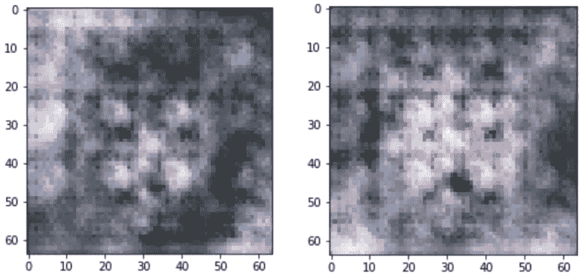
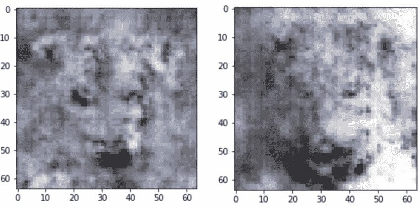

# 使用 DCGAN 和 PyTorch 创建新动物

> 原文：<https://towardsdatascience.com/create-new-animals-using-dcgan-with-pytorch-2ce47810ebd4>

## 从野生动物身上学习特征来创造新的生物

图一。动物脸的 DCGAN。作者在 [Unsplash](http://unsplash.com) 的帮助下创建的图像。

生成网络已经开辟了大量有趣的项目，人们可以用深度学习来做这些项目——其中一项是基于一组逼真的照片生成图像。我们在之前的文章中可以看到，一个非常简单的 GAN 网络在生成数字上可以有很好的效果；但是如果我们有一个更复杂的数据集，比如一群野生动物，会怎么样呢？阿甘看到狐狸、老虎、狮子在一起会产生什么？在本教程中，让我们使用 PyTorch 构建这个实验并找出答案。

*边注:本文假设生成性敌对网络的先验知识。请参考之前的* [*文章*](/building-a-gan-with-pytorch-237b4b07ca9a) *了解更多关于 GANs 的信息。*

# PyTorch 的 DCGAN

为了测试这一点，我们将需要创建一个更复杂的 GAN，最好是一个 DCGAN，其中我们为这一代涉及了卷积。卷积使它们非常适合学习图像表示。该架构比我们之前构建的 GAN 的 FC 层复杂得多，因为我们必须在生成阶段加入转置卷积。幸运的是，PyTorch 提供了一个非常深入的 [*教程*](https://pytorch.org/tutorials/beginner/dcgan_faces_tutorial.html) 自己在创建一个可行的生成器和鉴别器，所以我们将直接使用它的架构如下:

# **动物面孔数据集**

Choi 等人的[动物面孔数据集(afhq)](https://github.com/clovaai/stargan-v2) 首次在他们的论文 StarGAN 中介绍，可以在 [Kaggle](https://www.kaggle.com/andrewmvd/animal-faces) 上找到，野生动物文件夹将直接满足我们在数据集中拥有多个动物的需求。然而，这些图像具有相当高的分辨率(512x512)，对于使用 CPU 或不太好的 GPU 进行训练来说可能不可行。因此，我们对 64x64 的维度执行额外的自适应平均池。这也符合用于生成的默认 DCGAN 的原始尺寸。以下是数据集创建的代码:

# 实施环境

虽然 CPU 的训练时间可能要长得多，但我已经在免费版本的 Google Colab 上测试了整个管道，GPU 应该足以执行我们的实验。但是，这需要您将整个数据集放到 Google Drive 上，并将其安装到 Colab 笔记本上。

# 培养

DCGAN 的训练与普通 GAN 的训练相同。本质上，我们试图玩一个极大极小游戏，试图鼓励鉴别者确定一个图像是真实的还是生成的，同时鼓励生成者愚弄鉴别者。以下是 DCGAN 的代码:

# 可视化

我们在 30 和 100 个时期后绘制一些随机生成的结果。

30 个时期后:

100 个时期后:

从粗糙的补丁开始，网络似乎通过越来越多的时代逐渐学会了动物的精细表示，并开始生成“动物”，这些“动物”类似于确切有助于成为生物的东西，尽管不知道我们输入的动物的标签或类型！

# 结论

所以你有它！希望这篇文章提供了如何自己构建 DCGAN 的概述。你甚至可以应用不同的数据集，生成完全不同的东西，比如汽车、飞机，甚至梵高的画！(记住，如果你没有太多的 GPU 资源，一定要平均使用它！).

完整的实现可以在下面的 Github 资源库中找到:

 [## GitHub-ttchen ab/MnistGAN

### 实施 PyTorch 的 GAN 和 DCGAN 没有实施保存/加载保存检查点。请适应你的…

github.com](https://github.com/ttchengab/MnistGAN) 

*感谢您坚持到现在*🙏*！* *我会在计算机视觉/深度学习的不同领域发布更多内容，所以* [*加入并订阅*](https://taying-cheng.medium.com/membership) *如果你有兴趣了解更多！*