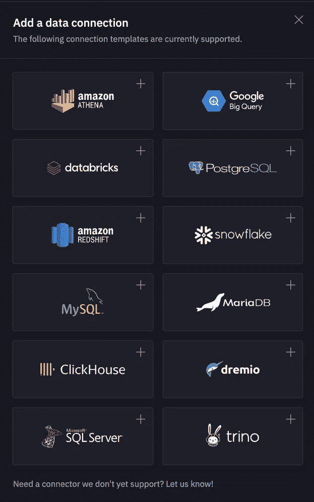
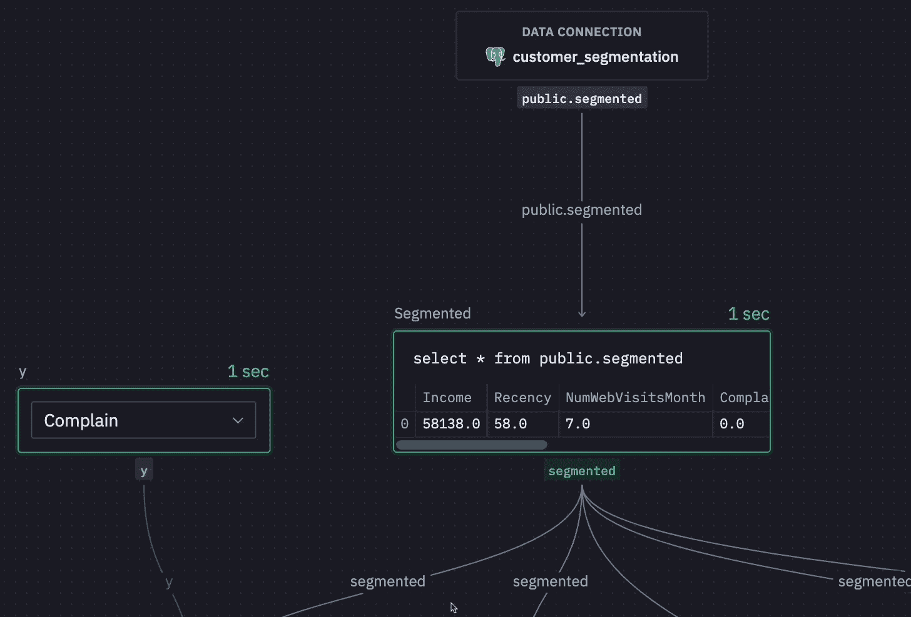
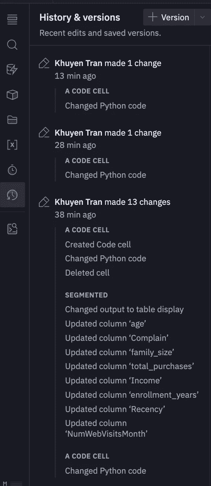
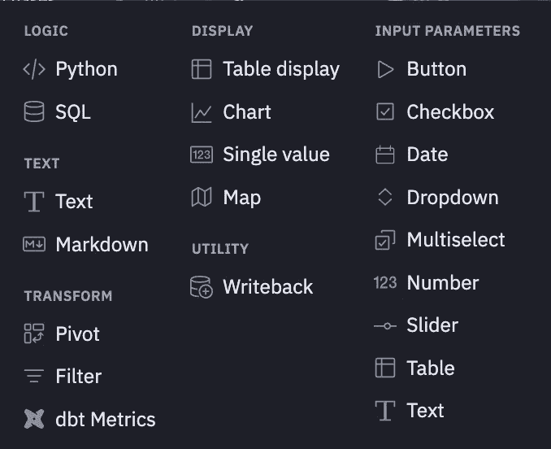
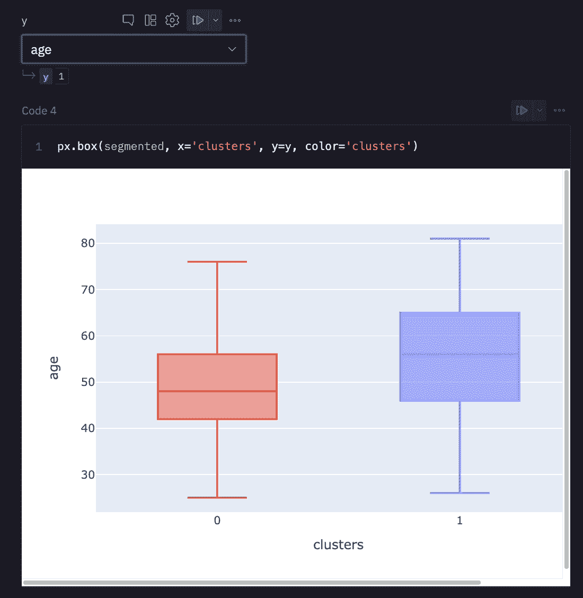
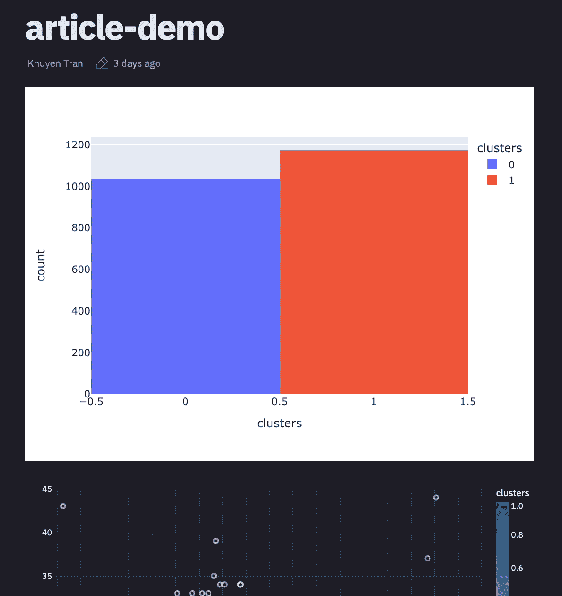
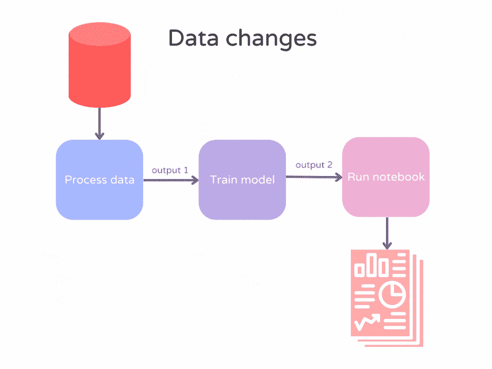
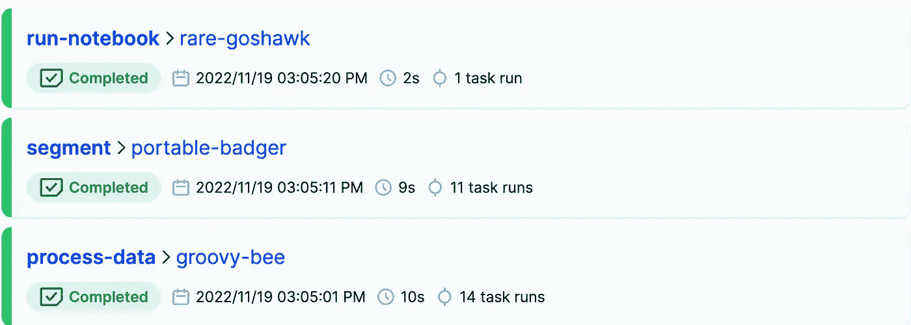

# 使用 Hex 创建可观察和可复制的笔记本

> 原文：<https://towardsdatascience.com/create-observable-and-reproducible-notebooks-with-hex-460e75818a09>

## 如何将笔记本电脑集成到您的数据管道中

# 动机

Jupyter Notebook 是数据科学家探索和处理数据的流行工具，因为它易于检查代码输出。

然而，Jupyter 笔记本有几个缺点，包括:

*   **可解释性问题**:随着代码变大，单元之间的关系变得越来越复杂。因此，当一个单元格发生变化时，很难知道接下来要执行哪个单元格。
*   **再现性问题:**因为笔记本中的单元格可以以任何顺序执行，所以以不同的顺序执行同一个笔记本可能会导致不同的输出。
*   **版本问题:**很难用 Git 比较一个笔记本两个不同版本的变化。

幸运的是，所有这些问题都可以用 Hex 笔记本解决。Hex 允许您通过依赖关系链接单元，并只执行依赖关系发生变化的单元。


作者图片

在本文中，您将了解 Hex 的一些有用特性，以及如何使用 Prefect 将它集成到您的数据管道中。


作者图片

通过使用 Hex 笔记本来查询和可视化您的管道的最终输出，您团队中的数据分析师不再需要通过管道来分析数据。

*免责声明:我与 Hex 没有任何关系。我在工作中发现了 Hex，并写下了它，因为我发现它很有用。*

# 什么是 Hex？

[Hex](https://hex.tech/) 是一个现代化的数据工作空间，可以轻松连接数据并创建可复制的笔记本。

Hex 提供了很多很酷的特性，但是我喜欢 Hex，因为它使我能够:

*   轻松连接到数据源
*   使用 SQL 和 Python 来分析数据
*   理解细胞之间的关系
*   仅当单元的依赖关系发生变化时才重新执行单元
*   给笔记本版本
*   创建动态报告

让我们在接下来的几节中探索这些特性。

## 轻松连接到数据源

Hex 允许您通过几个简单的步骤连接到各种数据源。



作者图片

添加数据连接后，您只需从下拉列表中选择即可在笔记本的任何单元格中访问它。


作者图片

## 使用 SQL 和 Python 来分析数据

Hex 还允许您在一个笔记本中同时使用 SQL 和 Python。

在下面的截图中，有一个 SQL 单元和一个 Python 单元。SQL 单元(`segmented`)创建的输出随后被用于 Python 单元。


作者图片

这对于那些想在同一个笔记本中同时使用 SQL 和 Python 的人来说很方便。

## 理解细胞之间的关系

如前所述，在 Jupyter 笔记本中很难找到单元格之间的关系。

Hex 使得用图形视图观察单元之间的关系变得容易。

下面的 GIF 显示了一个十六进制笔记本的图形视图。每个节点代表一个单元。每条边显示单元格之间的依赖关系。



作者图片

## 仅当单元的依赖关系发生变化时才重新执行单元

当输入改变时，Hex 将自动只重新运行使用该输入的单元格。

因此，您不再需要花费时间**寻找执行**的单元，或者花费资源运行不相关的单元。

笔记本也是**可复制的**,因为一个变化将通过图表触发一个可预测的、一致的重新计算集。


作者图片

## **版本笔记本**

给 Jupyter 笔记本版本总是一件痛苦的事。使用 Hex，您可以比较同一工作区中笔记本版本之间的差异。



作者图片

## 创建动态报告

使用 Hex，您可以创建一个带有内置小部件的动态报告，比如下拉菜单、复选框、按钮、日期、多选、数字和滑块。



作者图片

在下面的 GIF 中，我使用 dropdown 小部件根据选择的值更新绘图。



作者图片

Hex 还允许你通过一个漂亮的 GUI 创建一个简单的图表。


作者图片

如果你想向 CEO 或利益相关者展示你的见解，你可能想隐藏代码。要仅查看笔记本的输出，请从笔记本顶部的逻辑模式切换到应用模式。


作者图片

现在您将看到一个没有代码的漂亮报告。



作者图片

# 如何将 Hex 集成到您的数据管道中

现在我们知道了 Hex 有多有用，让我们将它集成到我们的数据管道中。我们将使用 Hex 笔记本从数据的最终输出中获得洞察力。


作者图片

您可以在此处找到此数据管道的代码:

[](https://github.com/khuyentran1401/customer_segmentation/tree/prefect2) [## GitHub-khuyentran 1401/prefect 2 处的客户 _ 分段

### 关于客户细分的端到端项目。通过以下方式为 khuyentran 1401/客户细分发展做出贡献…

github.com](https://github.com/khuyentran1401/customer_segmentation/tree/prefect2) 

## 概观

我们将使用[perfect](https://www.prefect.io/)来观察和编排我们的数据管道。Prefect 是一个开源库，允许您编排和观察 Python 中定义的数据管道。

[](https://medium.com/the-prefect-blog/orchestrate-your-data-science-project-with-prefect-2-0-4118418fd7ce) [## 使用 Prefect 2.0 协调您的数据科学项目

### 让您的数据科学管道能够抵御故障

medium.com](https://medium.com/the-prefect-blog/orchestrate-your-data-science-project-with-prefect-2-0-4118418fd7ce) 

管道中有四种流量:`process_data`、`segment`和`run_notebook`。这些流程的详细信息:

*   [*process_data*](https://github.com/khuyentran1401/customer_segmentation/blob/prefect2/src/process_data.py) :从 Postgres SQL 数据库中提取原始数据，进行处理，并将处理后的数据保存到数据库中
*   [*段*](https://github.com/khuyentran1401/customer_segmentation/blob/prefect2/src/segment.py) :从数据库中提取处理后的数据，训练一个 ML 模型，并将最终数据保存到数据库中
*   [*run_notebook*](https://github.com/khuyentran1401/customer_segmentation/blob/prefect2/src/run_notebook.py) :运行 Hex notebook，它将从数据库中提取数据，并运行依赖关系发生变化的单元格
*   [*main*](https://github.com/khuyentran1401/customer_segmentation/blob/prefect2/src/main.py) :运行上面列出的所有三种流量

在下一节中，我们将更深入地研究`run_notebook`流程。

## 用提督运行十六进制笔记本

我们将使用[perfect-hex](https://prefecthq.github.io/prefect-hex/)库在一个 perfect 流中运行一个 Hex 笔记本。要安装此库，请键入:

```
pip install prefect-hex
```

要访问特定的 Hex 笔记本，您需要[项目 ID 和令牌](https://learn.hex.tech/docs/develop-logic/hex-api/overview#setup-needed-for-the-api)。获得凭证后，您可以通过从`prefect_hex.project`调用`get_project_runs`函数在 Python 脚本中运行笔记本。

```
from prefect import flow
from prefect_hex import HexCredentials

from prefect_hex.project import get_project_runs
from prefect_hex import HexCredentials

@flow
def run_notebook():
    hex_credentials = HexCredentials(token="your-token")
    project_id = 'your-project-id'
    return get_project_runs(
        project_id=project_id,
        hex_credentials=hex_credentials,
    )

if __name__ == "__main__":
    run_notebook()
```

就是这样！现在，当输入数据改变并且管道重新运行时，报告将被更新。



作者图片

使用完美的 UI，您还可以观察到流程的所有组件。



作者图片

# 结论

我希望这篇文章能给你建立一个可观察和可复制的管道所需的知识。

总而言之，提督和十六进制的结合:

*   允许数据工程师协调和观察管道
*   允许数据分析师专注于分析笔记本电脑中的数据

多酷啊。

我喜欢写一些基本的数据科学概念，并尝试不同的数据科学工具。你可以在 LinkedIn 和 T21 Twitter 上与我联系。

如果你想查看我写的所有文章的代码，请点击这里。在 Medium 上关注我，了解我的最新数据科学文章，例如:

[](/dvc-github-actions-automatically-rerun-modified-components-of-a-pipeline-a3632519dc42) [## DVC + GitHub 动作:自动重新运行修改过的管道组件

### 快速迭代 DS 项目的完美组合

towardsdatascience.com](/dvc-github-actions-automatically-rerun-modified-components-of-a-pipeline-a3632519dc42) [](/create-robust-data-pipelines-with-prefect-docker-and-github-12b231ca6ed2) [## 使用 Prefect、Docker 和 GitHub 创建强大的数据管道

### 将您的工作流存储在 GitHub 中，并在 Docker 容器中执行它

towardsdatascience.com](/create-robust-data-pipelines-with-prefect-docker-and-github-12b231ca6ed2) [](/how-to-structure-a-data-science-project-for-readability-and-transparency-360c6716800) [## 如何构建可读性和透明度的数据科学项目

### 以及如何用一行代码创建一个

towardsdatascience.com](/how-to-structure-a-data-science-project-for-readability-and-transparency-360c6716800) [](/hypothesis-and-pandera-generate-synthesis-pandas-dataframe-for-testing-e5673c7bec2e) [## 假设和潘德拉:生成用于测试的综合熊猫数据框架

### 用基于属性的测试创建干净和健壮的测试

towardsdatascience.com](/hypothesis-and-pandera-generate-synthesis-pandas-dataframe-for-testing-e5673c7bec2e)