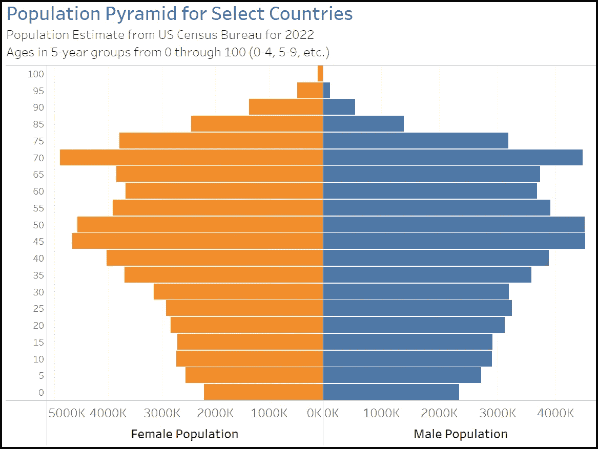
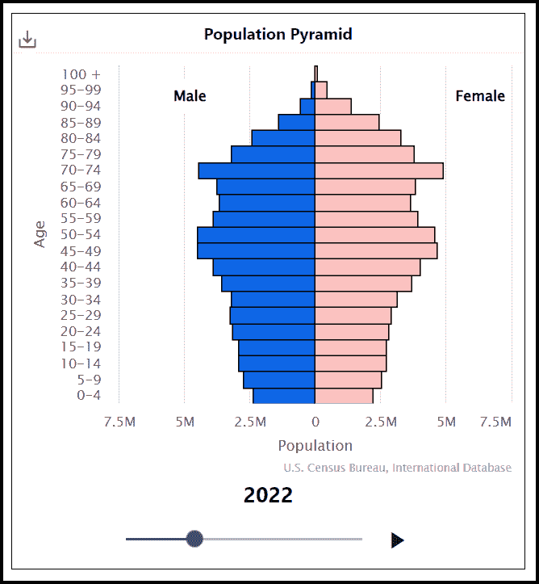
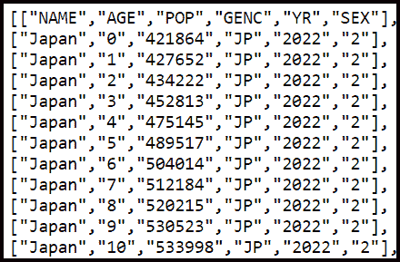
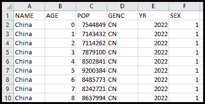

# 用美国人口普查局的数据创建任何国家的人口金字塔

> 原文：<https://towardsdatascience.com/create-population-pyramids-for-any-country-with-the-us-census-bureau-data-7f48281a5a4a>

## 数据分析、数据工程、Python 编程和人口统计学

## 使用人口普查数据 API、Python 和 Tableau Public 按国家、年龄、性别和年份创建 2100 年的动态人口金字塔

一群人。2022 年 11 月 15 日，联合国报告世界人口已达 80 亿..圣佛明潘普洛纳摄:[https://www . pexels . com/photo/bird-s-eye-view-of-group-of-people-1299086/](https://www.pexels.com/photo/bird-s-eye-view-of-group-of-people-1299086/)

虽然人口数据有许多来源，但美国人口普查局在其国际数据库中保存了到 2100 年世界上人口在 5000 或以上的 227 个国家和地区的人口估计和预测数据。本文将向您展示如何使用 Python 通过 Census Data API 从国际数据库中检索数据，并将其从非标准的 JSON 格式转换为 CSV 文件。然后将该文件加载到 Tableau 中，将其可视化为人口金字塔。

# 什么是人口金字塔？

人口金字塔是按性别和年龄组显示一个国家或地区人口分布的图表。下面显示的 2022 年年中日本的人口金字塔示例表明，该国没有替换其老龄化人口。

2022 年日本的人口金字塔。图表由 Randy Runtsch 创建，Tableau Public。

# 人口普查数据 API

[人口普查数据应用编程接口(API)](https://www.census.gov/data/developers/guidance/api-user-guide.html) 让公众能够直接访问美国人口普查局作为其各种计划的一部分收集的原始统计数据。该局在[的表格](https://api.census.gov/data.html)中描述了它的每个数据集，称之为 API 发现工具。

统计局声称，其人口普查数据 API 提供了方便的数据访问。像大多数数据 API 一样，它可以直接从 web 浏览器调用，也可以从各种编程语言中调用，包括 Python 和 r。

虽然许多美国政府数据 API 以标准的 JavaScript 对象表示法(JSON)格式返回数据，有时以逗号分隔值(CSV)格式返回数据，但人口普查数据 API 以非标准的 JSON 格式返回数据。这增加了一个难题，因为程序员和数据工程师必须重新格式化检索到的数据，以使其在 Excel 或 Tableau 等工具中可读和可用。例如，在下面的示例中，请注意，在数据集和记录级别，返回的数据被包装在方括号中。

尝试将以下 URL 粘贴到 web 浏览器中，然后按 enter。它将返回 2015 年法国年中人口的估计值，按年龄(以一年为增量)和性别(男性和女性的综合人口值)进行统计。混合性别的性别代码为 0，男性为 1，女性为 2。GENC 是感兴趣的国家的双字符代码。在这种情况下，法国的 GENC 值是“FR”。

[https://api.census.gov/data/timeseries/idb/1year?get=NAME，AGE，POP&GENC = FR&YR = 2015&SEX = 0](https://api.census.gov/data/timeseries/idb/1year?get=NAME,AGE,POP&GENC=FR&YR=2015&SEX=0)

上面显示的 URL 查询返回的数据。Randy Runtsch 截图。

本文后面显示的 Python 程序对四个国家的人口普查数据 API 进行了类似的查询。然后，它从返回的数据集中去掉前后的方括号(“[”和“]”)。最后，它将每条记录(包括提供列标题的第一条记录)写入一个 CSV 文件。然后，该文件被加载到 Tableau Public 中，用于根据数据创建人口金字塔。

# 人口普查局国际数据库

您可以使用人口普查数据 API APIs 从国际数据库中检索世界上人口在 5，000 或以上的所有国家和地区的年中人口估计和预测。您可以检索这些数据集:

*   **时间序列>IDB>1 年**:该数据集包括某一年按年龄和性别、国家或地区、年龄和性别划分的人口。
*   **时间序列>美洲开发银行>5 年**:该数据集包括按年龄划分的 5 年组人口，以及某一年的性别、国家或年龄以及性别。它还包括生育率、死亡率和移民指标。

本文将展示如何使用**时间序列>IDB>1 年**数据集来检索数据并构建四个国家的人口金字塔。

# 普查数据 API 文档

[人口普查数据 API 用户指南](https://www.census.gov/content/dam/Census/data/developers/api-user-guide/api-guide.pdf)提供了关于如何使用 API 检索数据的信息。它与该局在 [API 发现工具](https://api.census.gov/data.html)中为每个 API 提供的信息一起，提供了检索任何可用数据集的数据所需的大部分指令。

除了上面链接的文件，该局的[国际数据库(IDB)演示页面](https://www.census.gov/data-tools/demo/idb/#/country?COUNTRY_YEAR=2022&COUNTRY_YR_ANIM=2022)使用来自**时间序列>IDB>1 年或 5 年**数据集的数据展示了一个动态人口金字塔。演示页面将有助于与您创建的人口金字塔进行比较，以确认其准确性。

美国人口普查局国际数据库演示页面上显示的日本人口金字塔。Randy Runtsch 截图。

# 性别代码和国家代码

国际数据库可以按性别和国家或地区查询。查询还会在每个记录中返回这些数据点。

以下是性代码:

0 =双方
1 =男性
2 =女性

在 [ISO 3166 国家代码标准](https://www.iso.org/iso-3166-country-codes.html)中，双字符国家代码被定义为“Alpha-2 代码”。例如，美国的 Alpha-2 代码是“US”，法国的代码是“FR”国家名称和代码的完整列表记录在 ISO 在线浏览平台的[页面上。但是你可能会发现这个](https://www.iso.org/obp/ui)[ISO 3166-1 alpha-2 维基百科页面](https://en.wikipedia.org/wiki/ISO_3166-1_alpha-2)使用起来更方便。

# IDB 查询和结果示例

人口普查数据 API 国际数据库(IDB)的基本 URL 是[http://api.census.gov/data/timeseries/idb/1year](http://api.census.gov/data/timeseries/idb/1year)。在 web 浏览器中调用这个 URL 会返回一个描述查询的 JSON 结构。

以下 URL 将按女性(性别代码 2)的年龄返回 2022 年日本(GENC 代码“JP”)的数据:

[https://api.census.gov/data/timeseries/idb/1year?get=NAME，AGE，POP&GENC = JP&YR = 2022&SEX = 2](https://api.census.gov/data/timeseries/idb/1year?get=NAME,AGE,POP&GENC=JP&YR=2022&SEX=2)

除了显示姓名(国家或地区)、年龄和 POP(人口)列之外，返回的数据集还将显示 GENC、YR(年份)和 SEX 列的查询值。示例返回值如下所示。

上面显示的 URL 查询返回的数据。Randy Runtsch 截图。

# 人口普查数据 API 键

根据 [Census Data API 用户指南](https://www.census.gov/content/dam/Census/data/developers/api-user-guide/api-guide.pdf)，用户可以在不注册密钥的情况下，每天为每个 IP 地址提交多达 500 个 API 查询。每天需要进行 500 次以上查询的用户需要获得一个 API 密钥，并将该密钥附加到他们的每个查询中。要申请密钥，点击[开发者页面](https://www.census.gov/data/developers.html)上的“申请密钥”。

请求人口普查数据 API。图片来自人口普查数据网页。

注册密钥后，您将通过电子邮件收到密钥。然后，您可以将该键追加到查询中，如下例所示:

【https://api.census.gov/data/timeseries/idb/1year? get=NAME，AGE，POP&GENC = CN&YR = 2022&SEX = 1**&KEY = YOUR _ KEY _ GOES _ HERE**

# 用于此项目的工具

对于下面几节中介绍的项目，我使用 Microsoft Visual Studio Community 2022 进行 Python 编程，使用 Tableau 公共桌面和 Tableau 公共网站进行数据可视化。对于 Python 编程，可以随意使用您喜欢的任何编辑器或集成开发环境(IDE)。

Visual Studio Community 和 Tableau Public 是免费工具，您可以从以下位置安装:

*   [**Visual Studio 社区**](https://visualstudio.microsoft.com/vs/community/)
*   [**Tableau 公共**](https://www.tableau.com/community/public)

请注意，虽然 Tableau 的商业版本允许您将数据可视化工作簿保存到本地驱动器或服务器，但在 Tableau Public 中，所有可视化工作簿只能保存到 Tableau Public 服务器。此外，公众也可以看到可视化效果。

# Python 程序从国际数据库中检索数据

现在，您已经对人口普查数据 API 及其国际数据库有了基本的了解，让我们回顾一下检索 2022 年四个国家(按年龄和性别)人口估计数据的 Python 代码。该程序包括两个模块，类 c_country_pop.y 和调用该类的模块 get_population_estimates.py。

# 乡村流行音乐

总之，c_country_pop 类使用人口普查数据 API 查询国际数据库，将其非标准的 JSON 记录重新格式化为 CSV 格式，并将每个记录写入输出文件。以下伪代码描述了它的功能:

使用以下参数实例化(function _ _ init _ _())c _ country _ pop:

*   *out_file_name* :人口数据将以 CSV 格式写入的文件。
*   *country_code* :获取数据的国家的双字符代码。
*   *年份*:要检索数据的四位数年份。
*   *sex_code* :检索数据的性别，其中 0 =双方，1 =男性，2 =女性。
*   *write_type* : 'w '将返回的记录写入新文件，而' a '将记录追加到现有的输出文件。write_type 的目的将在下面解释。
*   *api_key* :您的个人普查数据 API key。

调用 get_data()函数来执行这些任务:

*   构建人口普查数据 API 查询 URL。
*   用 URL 调用 API。
*   将返回的数据从二进制格式转换为字符串。

调用 write_data_to_csv()函数来执行这些任务:

*   用指定的 write_type 值打开输出文件。
*   遍历从 get_data()函数返回的记录。
*   仅当 write_type 为“w”时，才写入包含列标题的第一条记录。如果 write_type 为“a”，则不要写入第一条列标题记录，因为这是文件将包含的第二个或以后的数据集。
*   从记录字符串中去掉任何前导和尾随的方括号和逗号。
*   将记录字符串写入输出文件。

# get_population_estimate.py

我称之为驱动程序的模块 get_population_estimate.py 只是为每个感兴趣的国家调用 c_country_pop 类的一个实例。对于它调用的第一个国家，它包含一个 write_type 值“w”，该值指示 c_country_pop 创建一个新的输出文件来写入 CSV 记录，并写入一个列标题作为它的第一条记录。以下是该模块的伪代码:

1.  获取 2022 年中国(国家代码“CN”)的男性(性别代码 1)记录。指示 c_country_pop 创建一个新的输出文件(文件名为“c:/population _ data/pop _ 2022 . CSV”，文件类型为“w”)，并写入一个列标题作为其第一行。
2.  获取 2022 年中国女性(性别代码 2)记录。使用相同的输出文件名，写入类型为“a”。这将指示 c_country_pop 打开在步骤 1 中创建的文件，并将其记录(不包括标题列记录)追加到文件中。
3.  对日本(国家代码“JP”)、挪威(国家代码“NO”)和美国(国家代码“US”)重复上述步骤。在所有情况下，请使用上述步骤 1 中指定的相同文件名。但是，使用“a”写入类型将记录追加到步骤 1 中创建的文件中。

# CSV 输出文件

成功运行程序后，检查输出文件。当在 Excel 中打开时，它应该类似于下面的示例。

中国的样本人口数据显示在 Excel 中。Randy Runtsch 截图。

# 代码

以下是 get_population_estimates.py 和 c_country_pop.py Python 模块的代码。

本文中描述的代码。代码是由 Randy Runtsch 编写的。

# Tableau Public 中的人口金字塔示例

本节不会提供在 Tableau 中创建人口金字塔的详细说明。要在 Tableau 中创建人口金字塔，详见 Tableau 帮助中的这些说明[。](https://help.tableau.com/current/pro/desktop/en-us//population_pyramid.htm)

我在 Tableau Public 中构建的人口金字塔版本使用了由上述 Python 程序创建的 CSV 文件中的数据。它允许用户通过点击一个**国家**单选按钮来切换国家。你可以在这里看到可视化[的现场版本](https://public.tableau.com/app/profile/randall.runtsch/viz/PopulationPyramidforSelectCountries/PopulationPyramid)。如果您愿意，也可以下载 Tableau 工作簿并根据您的需要进行修改。

# 摘要

这篇文章提供了关于人口普查数据 API 及其国际数据库(IDB)的信息。它还展示了一个 Python 程序，用于从 IDB 检索数据并将其写入 CSV 文件。最后，它显示了使用数据的人口金字塔。

随着人口增长和气候变化等主题的出现，通过人口普查数据 API 获得的数据肯定会引起全球数据分析师和数据科学家的兴趣。我希望这篇文章能为您使用人口数据的项目提供有用的信息。