# 使用 Prefect、Docker 和 GitHub 创建强大的数据管道

> 原文：<https://towardsdatascience.com/create-robust-data-pipelines-with-prefect-docker-and-github-12b231ca6ed2>

## 将您的工作流存储在 GitHub 中，并在 Docker 容器中执行它

# 动机

您是否曾经想要在两个位置存储和执行您的工作流，但发现很难做到这一点？

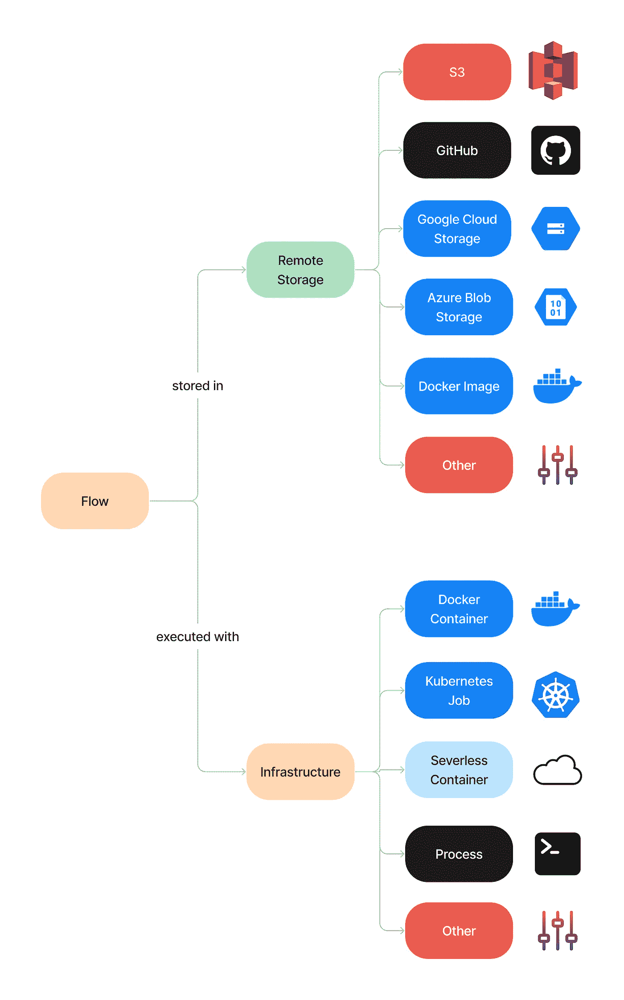

作者图片

如果您可以轻松地在不同的位置存储和执行您的代码，那不是很好吗？Prefect 允许您在上面列出的所有环境中轻松存储和执行您的工作流，同时在一个漂亮的仪表板中跟踪所有运行。

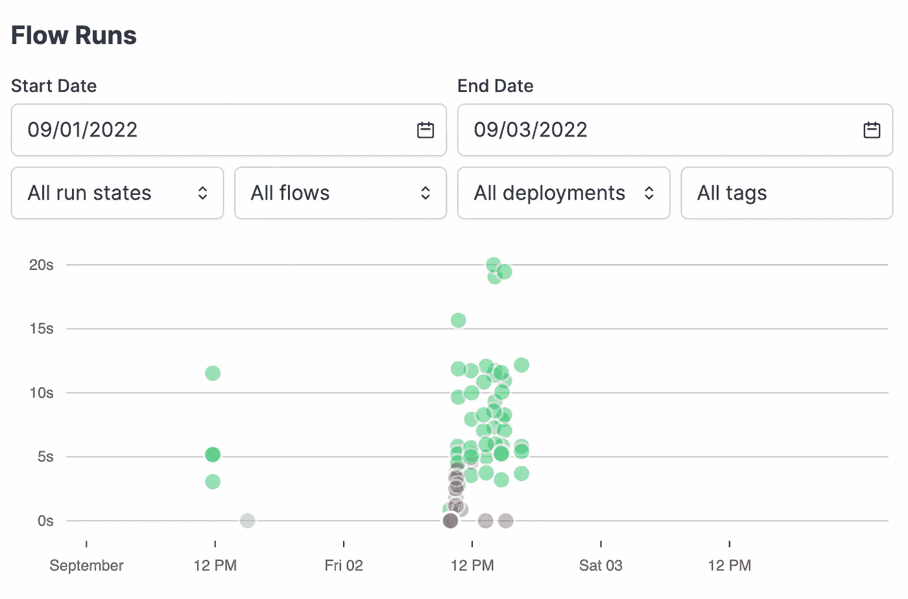

作者图片

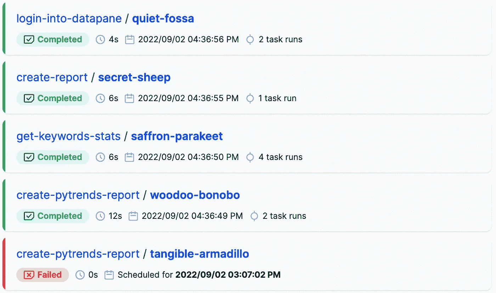

作者图片

在本文中，您将学习如何在 GitHub 中存储工作流代码，并在 Docker 容器中运行工作流。

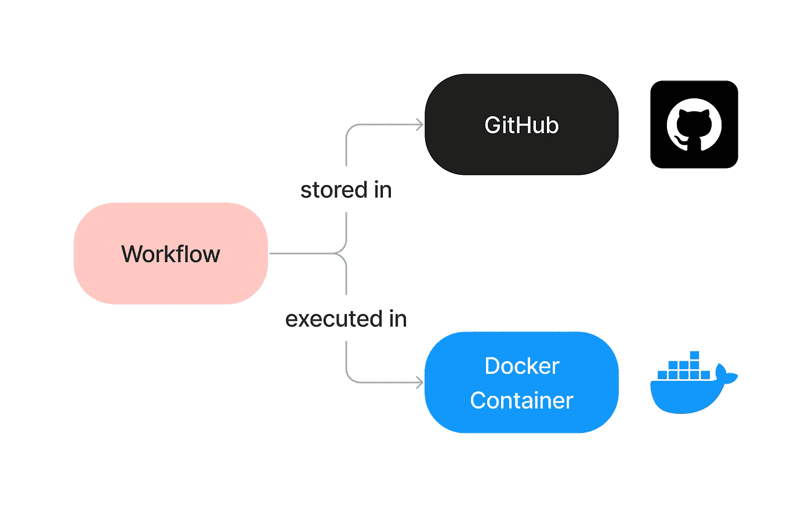

作者图片

# 什么是提督？

[perfect](https://www.prefect.io/)是一个开源库，可以让你在 Python 中协调数据工作流。

要安装提督，请键入:

```
pip install -U prefect
```

本文中使用的提督版本是 2.3.2:

```
pip install prefect==2.3.2
```

# 项目目标

在本文中，我们将创建一个工作流:

*   从 Google Trends 获取统计数据并创建报告
*   存储在 GitHub 上
*   在 Docker 容器中执行
*   以`keyword`、`start_date`和`num_countries`为自变量
*   计划每周运行

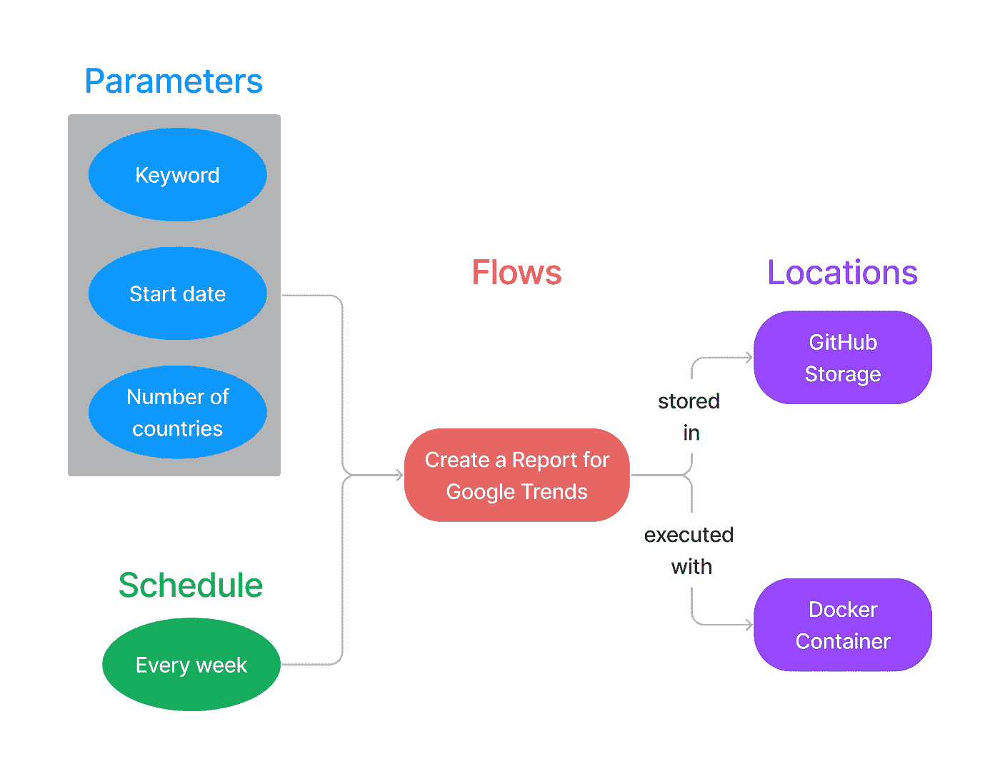

作者图片

每当执行工作流时，都会创建以下报告。然后，您可以与您的队友或经理分享该报告。


[链接到报告](https://datapane.com/reports/dA9oEY7/covid-report/)

# 创建一个流程

流程是所有完美工作流程的基础。要将 Python 函数转换成完美的流，只需向该函数添加装饰器`@flow`:

[*完整代码创建一个流。*](https://github.com/khuyentran1401/prefect-docker/tree/master/src)

# 创建简单的部署

一个[部署](https://docs.prefect.io/concepts/deployments/)存储关于流的代码存储在哪里以及流应该如何运行的元数据。通过部署流程，我们可以:

*   指定流程运行的执行环境基础结构
*   指定提督代理如何存储和检索您的流代码
*   使用 UI 中的自定义参数创建流运行
*   创建运行流程的计划

还有更多。

下图显示了具有不同计划、基础架构和存储的两个部署中的相同流程。

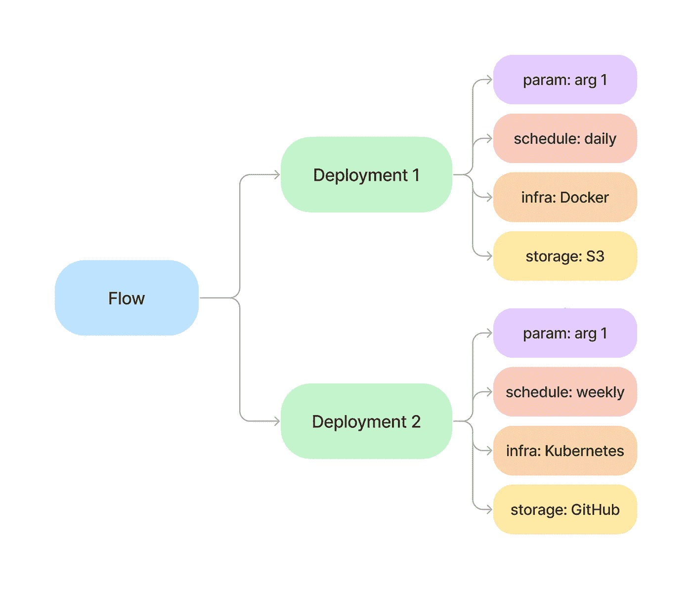

作者图片

创建部署有两个步骤:

1.  构建部署定义文件，并有选择地将您的流上传到指定的远程存储位置
2.  通过应用部署定义来创建部署


作者图片

## 构建部署

要构建部署，请键入:

例如，要从文件`src/main.py`中为流`create_pytrends_report`创建部署，在您的终端上键入以下内容:

其中:

*   `-n google-trends-gh-docker`指定部署的名称为`google-trends-gh-docker`。
*   `-q test`指定工作队列为`test`。一个[工作队列](https://docs.prefect.io/concepts/work-queues/)将部署组织到队列中以供执行。

运行该命令将在当前目录下创建一个`create_pytrends_report-deployment.yaml`文件和一个`.prefectignore`。

```
.
├── .prefectignore
├── create_pytrends_report-deployment.yaml
```

这些文件的功能:

*   `.prefectignore`防止某些文件或目录上传到配置的存储位置。
*   `create_pytrends_report-deployment.yaml`指定流程代码的存储位置以及流程应该如何运行。

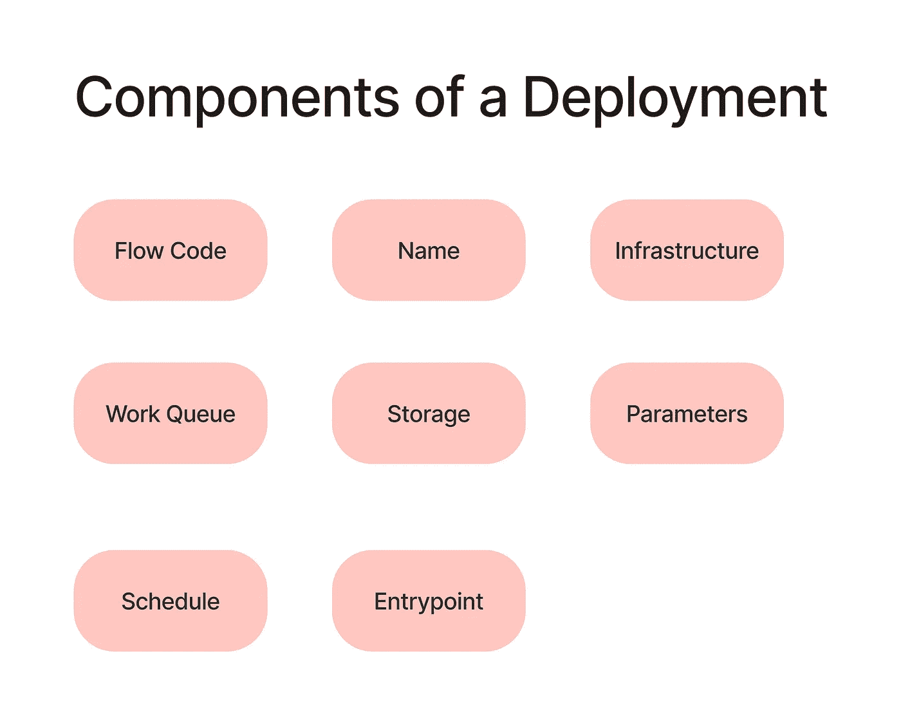

作者图片

## 通过 API 创建部署

在创建了`create_pytrends_report-deployment.yaml`文件之后，我们可以通过键入以下命令在 API 上创建部署:

如果您想将`prefect deployment build`和`prefect deployment apply`步骤合并为一个步骤，将`--apply`选项添加到`prefect deployment build`:

现在，当进入猎户座府尹 UI 上的“部署”选项卡时(通过键入`prefect orion start`或[府尹云](https://docs.prefect.io/ui/cloud/)，您应该会看到以下内容:


作者图片

# 创建块

[模块](https://docs.prefect.io/ui/blocks/)使您能够:

*   **存储配置**:安全地存储凭证，以便使用 AWS、GitHub、GCS、Slack 等服务进行身份验证
*   **与外部系统交互**:创建定制的基础架构块和存储块

“块”选项卡下提供了所有块。

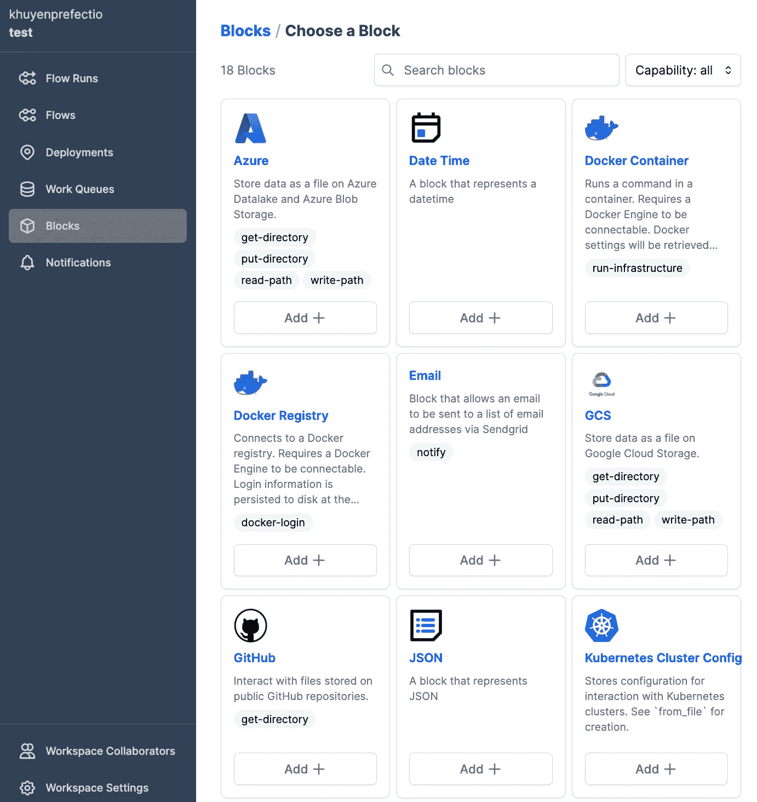

作者图片

## 实例化 Docker 容器块

要实例化 Docker 容器块，首先单击 Docker 容器块上的`Add`按钮。

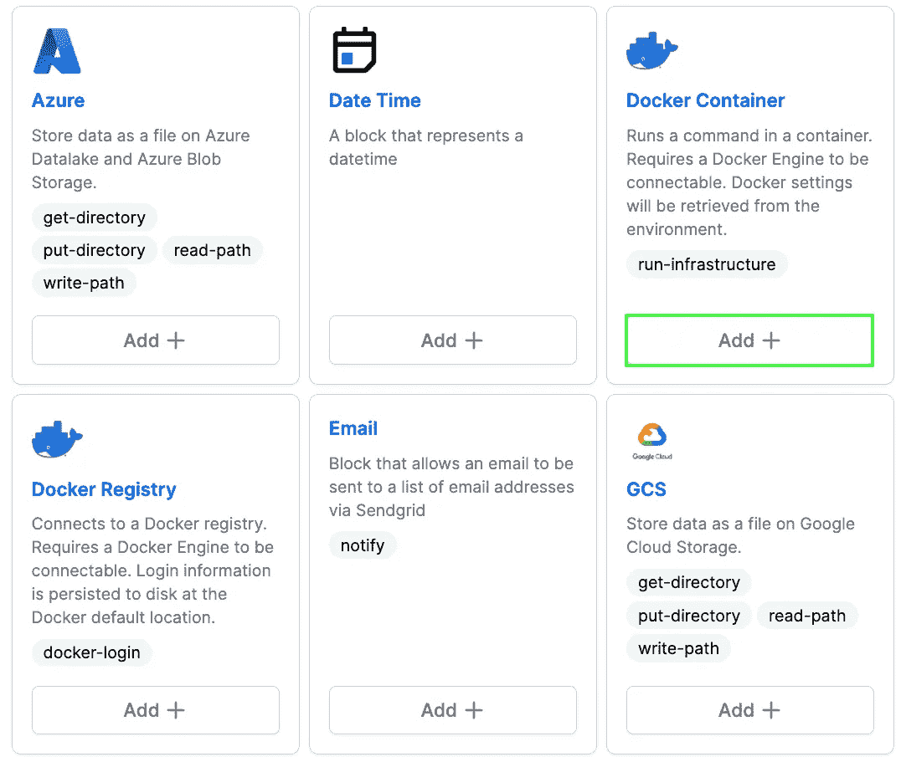

作者图片

在本文中，我们将只填写以下字段:

*   **块名:**块名
*   **Env** :要在已配置的基础设施中设置的环境变量。我们可以使用`EXTRA_PIP_PACKAGES`在运行时安装依赖项
*   **类型**:基础设施的类型。在这种情况下，它是`docker-container`
*   **流输出**:如果设置，输出将从容器流到本地标准输出

下图显示了我用于我的`docker-container/google-trends`模块的配置。

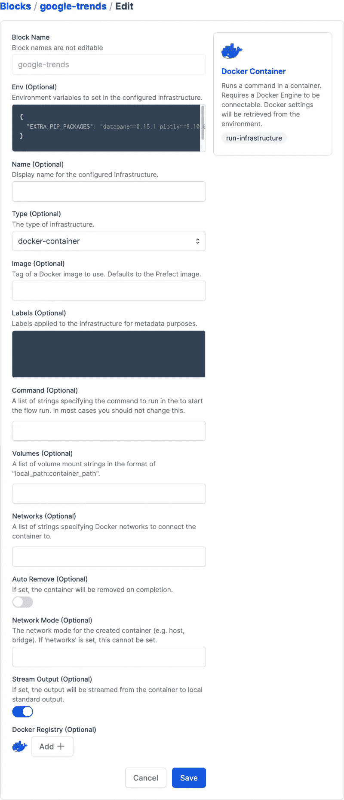

作者图片

这应该是你点击`Save`按钮后看到的。


作者图片

您还可以通过添加 Docker 图像的标签来使用自定义 Docker 图像。


作者图片

## 实例化一个 GitHub 存储块

要实例化 GitHub 存储块，首先单击 GitHub 块上的`Add`按钮。

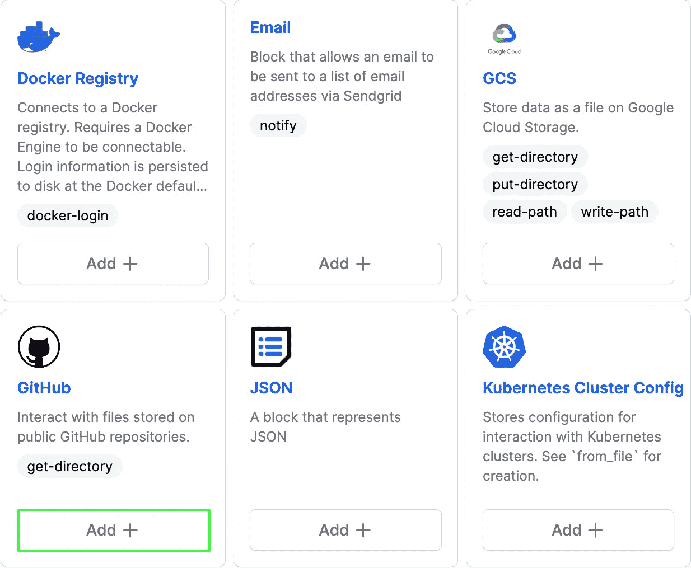

作者图片

下图显示了我的 GitHub 块的配置。

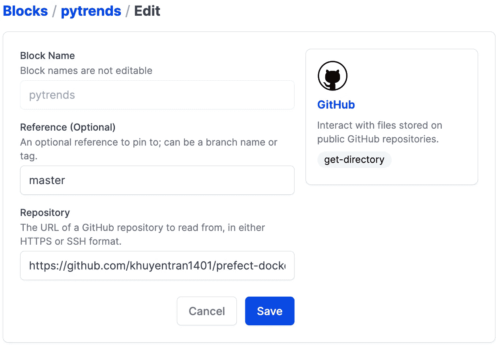

作者图片

点击`Save`按钮后，您应该会看到以下内容。

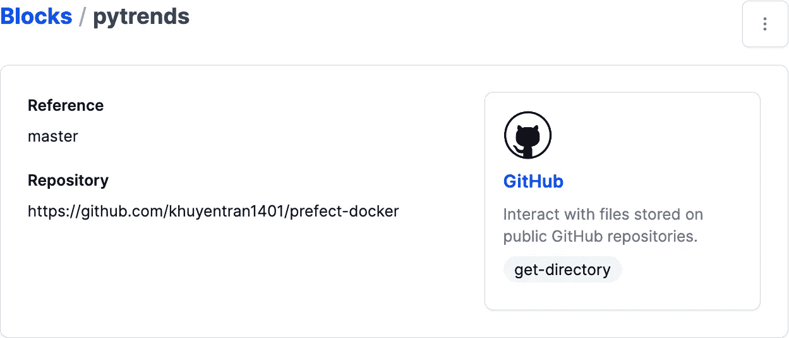

作者图片

实例化的块将显示在“块”选项卡下。

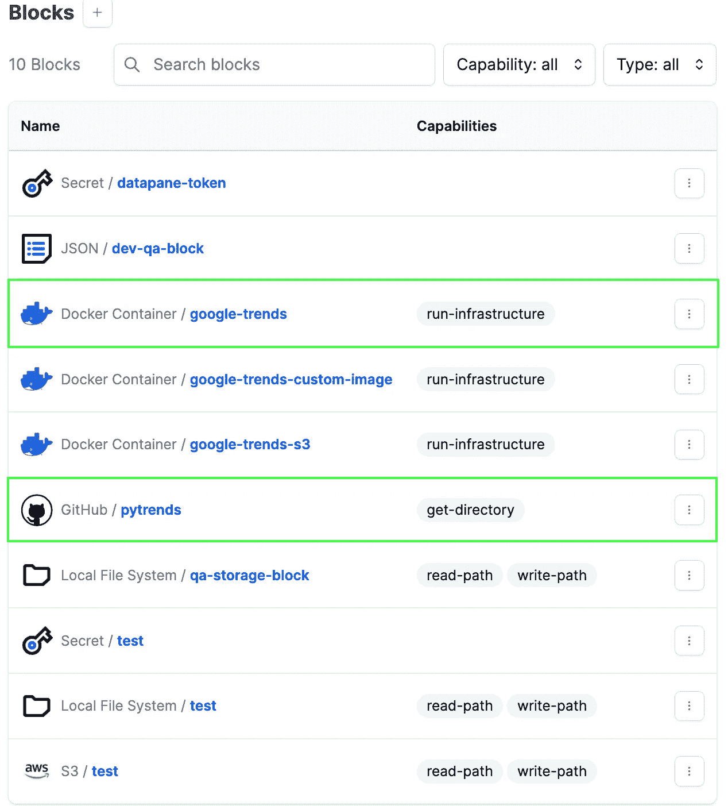

作者图片

# 使用 Docker 基础架构+ GitHub 存储创建部署

要使用我们刚刚创建的两个块创建部署，请在您的终端上键入以下命令:

其中:

*   `-n google-trends-gh-docker`指定部署的名称为`google-trends-gh-docker`
*   `-q test`指定工作队列为`test`
*   `-sb github/pytrends`指定存储为`github/pytrends`块
*   `-ib docker-container/google-trends`指定基础设施为`docker-container/google-trends`块
*   `-o prefect-docker-deployment`指定 YAML 文件的名称为`prefect-docker-deployment.yaml`

运行该命令后，您应该会看到以下输出:

新部署将出现在“部署”选项卡下。

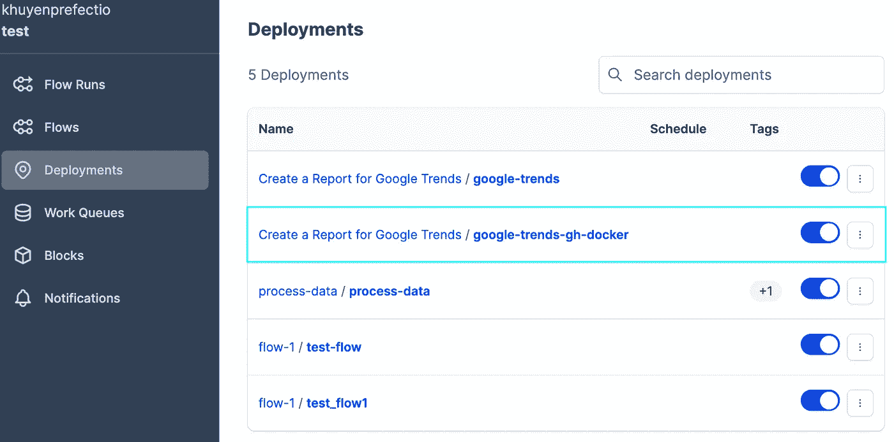

作者图片

要查看有关部署的更多详细信息，请单击该部署。

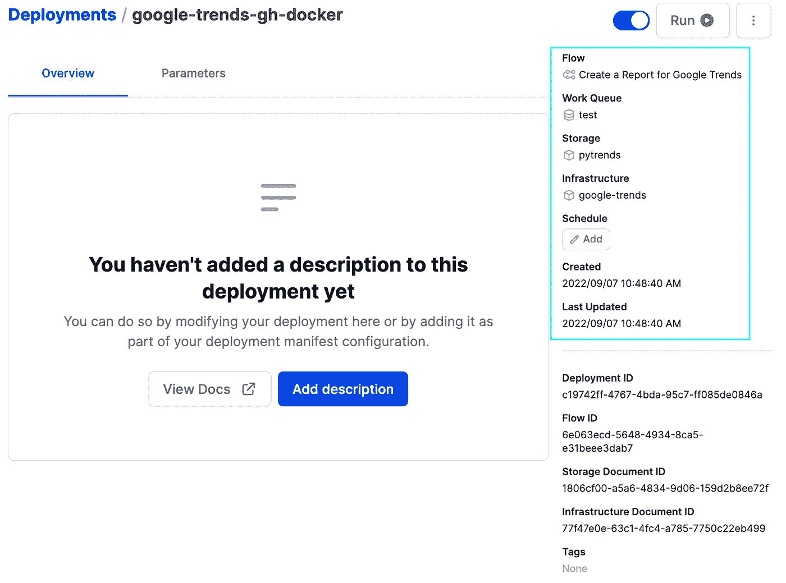

作者图片

# 运行部署

为了从这个部署执行流运行，启动一个代理从`test`工作队列中提取工作:

```
prefect agent start -q 'test'
```

输出:

接下来，单击`google-trends-gh-docker`部署中的`Run`按钮，并选择`Now with defaults`以使用默认参数运行部署。


作者图片

您应该在代理启动的终端上看到以下输出。

单击输出末尾的 Datapane 链接后，您将看到以下报告:


[报告链接](https://datapane.com/reports/dA9oEY7/covid-report/)

# 使用自定义参数运行部署

你可能会对 Google Trends 上关键字`TikTok`的统计数据感兴趣，而不是 COVID。通过点击`Run`按钮下的`Custom`，Prefect 可以很容易地使用自定义参数运行部署。

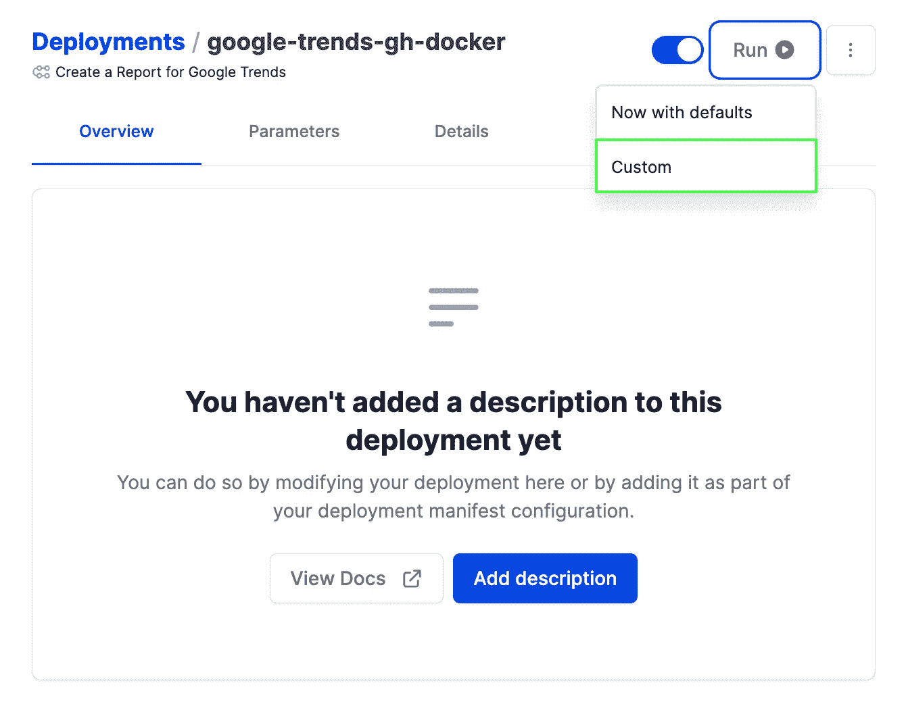

作者图片

以下是我的自定义配置:

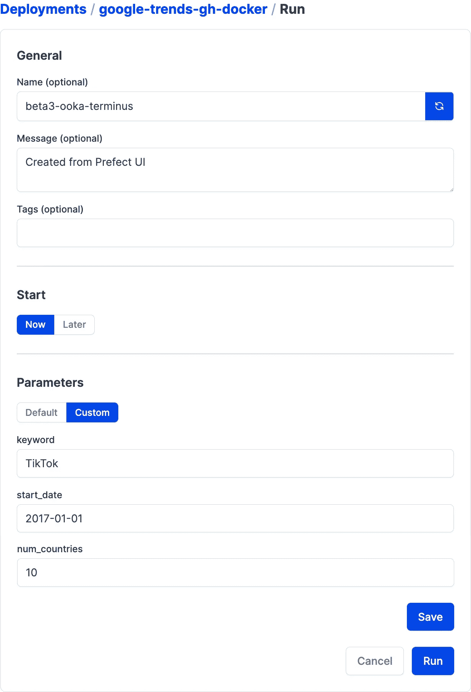

作者图片

流程运行完成后，将会为您创建一个新的报告！

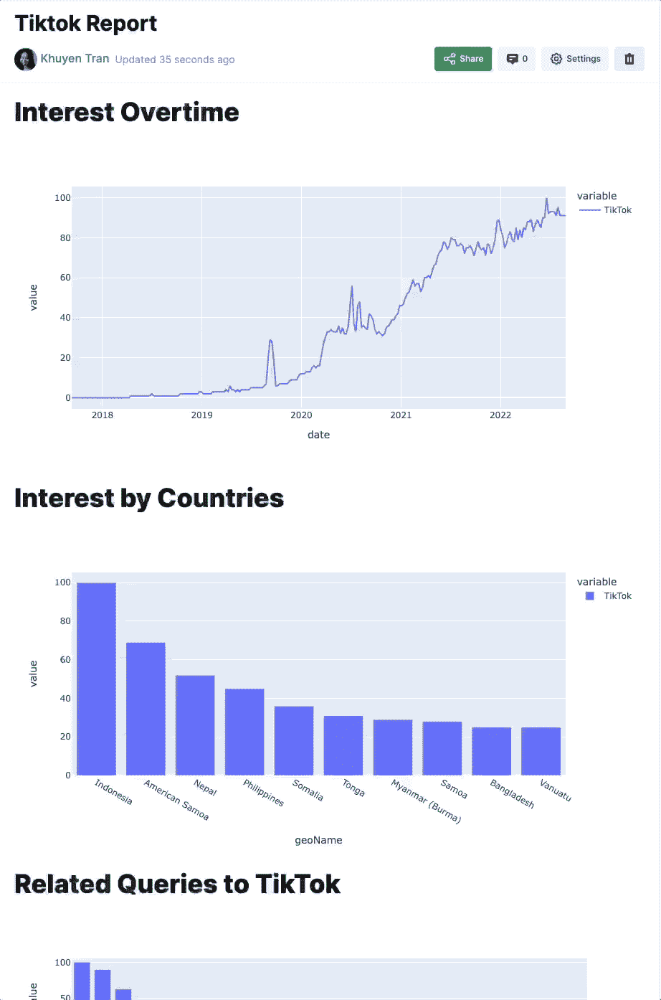

[链接到报告](https://datapane.com/reports/0kzdW23/tiktok-report/)

# 向部署添加时间表

您还可以通过单击部署中的`Edit`按钮，然后单击 Scheduling 部分下的`Add`按钮，向部署添加一个时间表。


作者图片

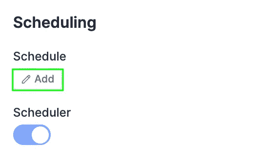

作者图片

提督支持三种类型的时间表: [Cron](https://docs.prefect.io/concepts/schedules/#cron) 、 [Interval](https://docs.prefect.io/concepts/schedules/#interval) 和 [RRule](https://docs.prefect.io/concepts/schedules/#rrules) 。我们将使用 Cron 来安排在周日上午 12:00 运行部署。

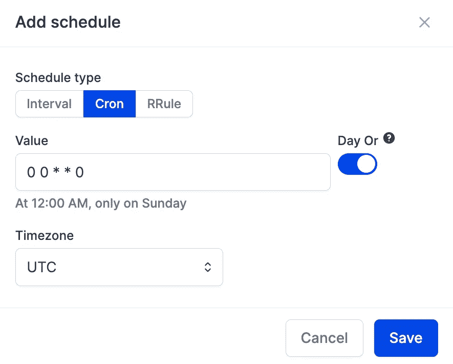

作者图片

# 下一步

恭喜你！您刚刚学习了如何使用 Prefect 将工作流代码存储在 GitHub 中，并在 Docker 容器中运行管道。我希望这篇文章能给你自动化你自己的工作流所需要的知识。

随意发挥，并在这里叉这篇文章的源代码:

[](https://github.com/khuyentran1401/prefect-docker)  

我喜欢写一些基本的数据科学概念，并尝试不同的数据科学工具。你可以在 LinkedIn 和 Twitter 上与我联系。

如果你想查看我写的所有文章的代码，请点击这里。在 Medium 上关注我，了解我的最新数据科学文章，例如:

[](https://medium.com/the-prefect-blog/orchestrate-your-data-science-project-with-prefect-2-0-4118418fd7ce)  [](/4-pre-commit-plugins-to-automate-code-reviewing-and-formatting-in-python-c80c6d2e9f5)  [](/how-to-structure-a-data-science-project-for-readability-and-transparency-360c6716800)  [](/pytest-for-data-scientists-2990319e55e6) 