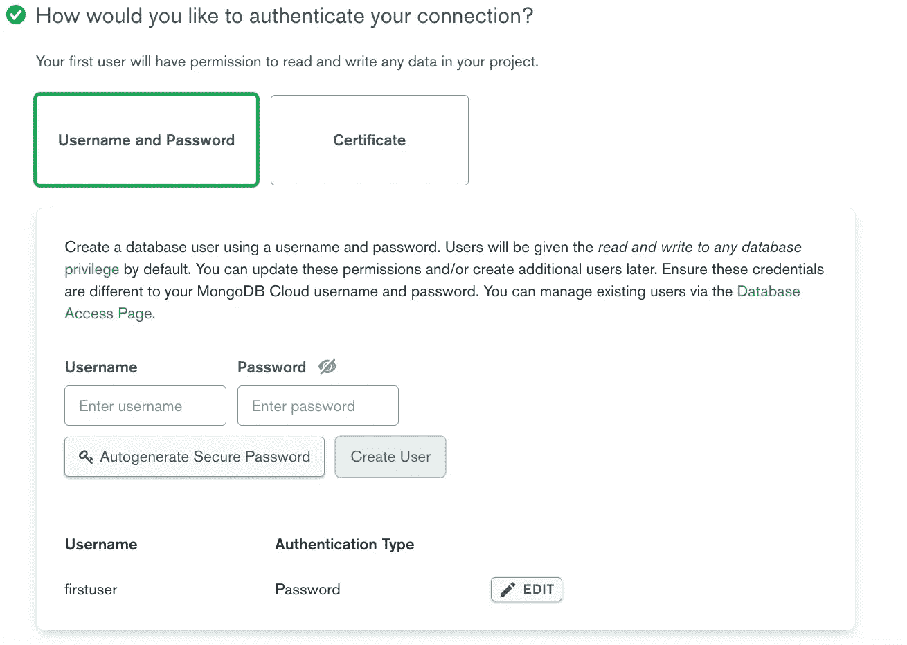
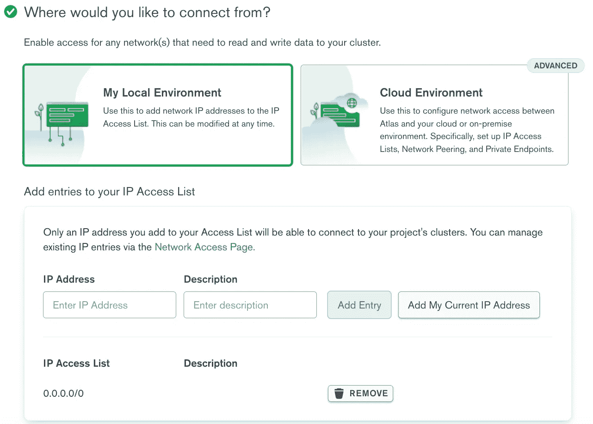
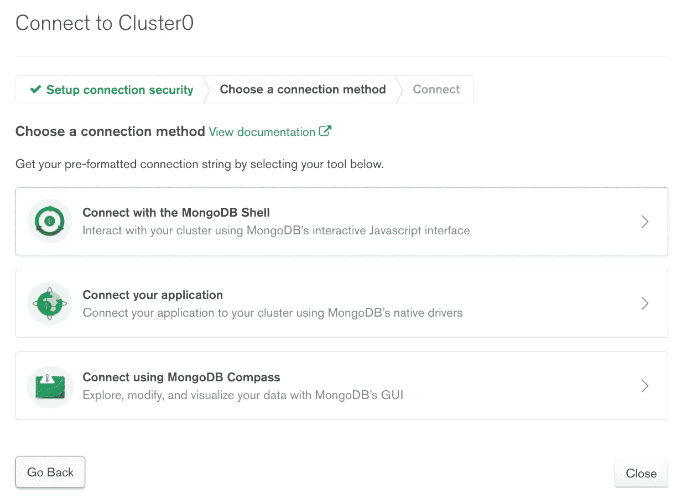
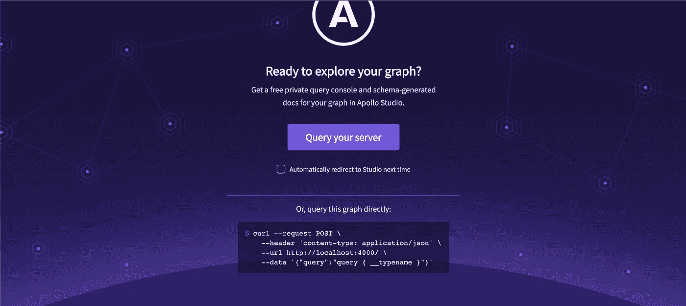
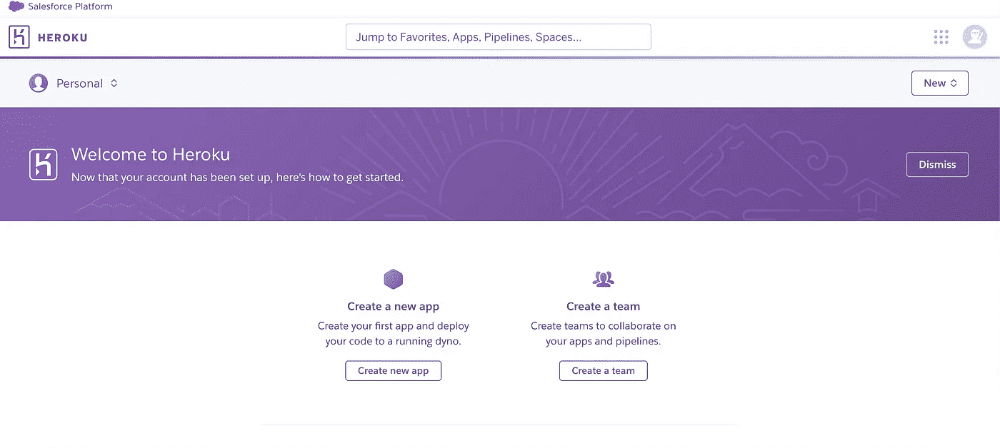

# 创建 GraphQL API，通过 Apollo 服务器访问 mongoDB 数据库

> 原文：<https://towardsdatascience.com/create-your-graphql-api-and-access-your-mongodb-database-via-apollo-server-deployed-on-heroku-9bf8ca410dc8>

## 如果你从头到尾遵循这个教程，你将学会如何组织和创建你自己的数据科学项目的后端。GraphQL API 将通过部署在 Heroku 上的 Apollo 服务器实例公开您的数据库。

道格拉斯·洛佩斯在 [Unsplash](https://unsplash.com?utm_source=medium&utm_medium=referral) 拍摄的照片

# 你能期待什么

本教程面向那些知道一些数据科学技能，如可视化、分析数据，甚至应用机器学习模型，但没有创建连接到持久数据库的 API 的经验的人。如果你想拥有后端技能，通过 API 让你的数据科学技能更加公开，那么这里是我们将在本教程中创建的进一步展望。

在本教程中，我们将更多地关注基础架构方面，这将包括以下步骤。我们将创建一个 GraphQL 模式，定义一个查询和三个不同的突变。此外，我们将编写一些解析器函数。此外，为了使数据持久，我们连接到云中的 mongoDB 集群。我们将一起创建该集群，如果您以前没有这样做过，请不要担心。为了让我们的小教程在现实世界中适用，我们将使用 heroku 在云中部署一个 apollo-server 实例。此外，将服务器实例部署到云中也将逐步介绍。

## 通过本教程解锁的技能🔓

如果你从头到尾遵循这个教程，你将学会如何为你自己的数据科学项目组织一个后台。例如，您可以创建一个仪表板，显示由您的 graphQL API 提供的一些数据，这些数据是由 apollo-server(您已经创建)提供的，它在后台访问一个数据库(由您控制)。带有 GraphQL 的 Apollo 服务器非常适合组合来自各种资源的信息。你可以维护一个给你一些数据的数据库，apollo 让你访问它，就像你在本教程中看到的那样。此外，你可以从你喜欢的数据源访问不同的 API。您的仪表板只需要连接到您的 apollo 服务器，并从不同的 API 以及您的数据库中获取数据。你甚至可以有多个数据库。我希望你能看到这有多强大。所以让我们解开这个野兽！

*注意，我们不打算介绍 graphQL 语法的含义。本教程重点介绍使用 GraphQL、apollo-server、nodejs、heroku 和 mongoDB 为数据驱动的应用程序创建后端结构的总体原则。*

# 基本设置(文件夹和包. json)

首先，创建一些文件夹。进入您的文件夹，其中有您的编程项目和教程，并创建一个名为 graphqlAPI 的文件夹。这是存放教程中所有代码的文件夹。在这个名为 graphqlAPI 的文件夹中创建一个名为 server 的文件夹。进入这个文件夹，通过`npm init-y`初始化一个 npm 包。

总结:

1.  `mkdir graphqlAPI`
2.  `cd graphqlAPI`
3.  `mkdir server`
4.  `cd server`
5.  `npm init -y`

打开 IDE，在服务器文件夹的级别上。打开由 npm init 创建的 package.json 文件。我们将对该文件进行一些更改。将文件更改如下:

*   行`"test": "echo \\"Error: no test specified\\" && exit 1”`将被替换为`"start": "nodemon src/index.js"`

nodemon 将是一个有助于开发的包，因为我们的更改将直接反映在我们的服务器上，无需完全重启。但是要使用 nodemon，我们需要安装它。在 ide 中打开您的终端，并确保它位于服务器文件夹中。简单的写输入`npm i nodemon`

如果你想比较你的 package.json 和我的:

# 创建文件夹 src

然后我们在一个名为`src`的新文件夹中创建一个名为`index.js`的文件。

此外，我们创建一个名为`types`的文件夹，它位于`src`文件夹中。这是我们将要存储 graphQL 模式的地方。

我们的文件夹结构应该是这样的。

因为我们通过 apollo-server 访问 graphQL API，所以在后面的步骤中我们需要 apollo-server 连接，因此我们需要另一个包。添加第二个依赖项，在您的终端中编写并输入以下内容。

`npm i apollo-server`

# 创建我们的 graphQL 模式

我们在`types`文件夹内的一个名为`coin.js`的文件中编写我们的模式，并对我们的模式使用以下代码行，以便我们可以创建、读取、更新和删除(完整的 CRUD 应用程序)我们的数据。

此外，我们在 types 文件夹中创建了一个`index.js`文件，以便于导出我们的模式。如果您愿意，以后添加和删除其他类型会更容易。

# 存储数据

现在，我们只有一个模式，但是我们缺少数据库、解析器功能和服务器。让我们继续数据库。为了存储我们的数据，我们为我们的项目添加了一个名为 mongoose 的附加依赖项。这是一个与 mongoDB 交互的框架。

编写`npm i mongoose`以将其添加到我们的依赖项中。

我们创建一个名为`models`的文件夹，并在里面创建一个名为`coin.js`的文件

`coin.js`的内容看起来是这样的:

接下来，我们将名为`index.js`的文件添加到我们的模型文件夹中

# 我们需要解决方案

解析器函数是为 GraphQL 查询生成响应的函数的集合。因为我们从 mongoDB 数据库中提供数据，所以我们将使用之前在 models 文件夹中创建的 models 对象，该对象为我们提供了到数据库的连接。但是我们不必把它包含在这个文件中。稍后，当我们创建 apollo 服务器时，模型、模式和解析器功能是同一个上下文的一部分。然后，解析器函数可以访问模型。所以我们现在的任务是写解析器函数。

让我们创建三个文件夹。首先在`src`里面创建一个名为`resolvers`的文件夹。在 resolvers 文件夹中创建两个文件夹，一个名为`mutations`，另一个名为`queries`。如果您完成了这一步，您可以为名为`coins.js`的`queries`文件夹创建第一个文件

好的，我们要在文件中添加什么？这个:

让我们快速浏览一遍。

这是一个异步函数，检索我们存储在数据库中的所有 ERC 20 硬币。调用解析器函数包括三到四个参数。

1.  第一个是父解析器函数，如果有的话，但是我们没有，因此我们使用`_`来表示
2.  第二个参数是 graphQL 查询的参数。但是请记住，我们在模式中只定义了一个查询(参见`src/types/coin.js`)，如下所示:`type Query{ coins: [ERC20Coin]}`我们看到它没有任何参数，因此我们使用一个空对象作为第二个参数
3.  第三个参数是 models 对象，它连接到我前面提到的 mongoDb 数据库。
4.  第四个参数叫做`info`，但是你不应该为这个而烦恼，因为只有高级用例才需要它。

因为我们已经完成了单个查询的解析器函数，所以我们可以继续处理变异的解析器函数。

# 突变

在我们的模式中，我们定义了三种不同但简单的突变:`create`、`update`和`delete`。

我们从最简单的开始(尽管所有的都很容易)。

## **创建**

一般结构与非变异查询相同。但是这次第二个参数不是空的，而是我们在模式中定义的输入对象。(如果你愿意，你可以再查一遍`src/types/coin.js`)

## **更新**

参数与之前略有不同，因为我们在模式中定义，为了更新 ERC20Coin，我们需要一个`id`和一个`input`(例如名称)。通过使用 mongoose 框架，我们可以访问数据库中的 ERC20Coin，它具有我们在函数`findOne`中提供的 id

下一步是遍历输入对象(一个普通的 javascript 对象),它可能包含数据库条目的新的更新字段，在我们的例子中，这可能是一个不同的名称。如果需要，可以用更多的字段更新模式。最后的步骤包括再次将更新的模型保存到我们的数据库中，我们用这个函数返回新的更新的模型。

## **删除**

如果你检查我们的模式，你会知道我们只使用了`id`，没有输入对象。就像我们使用猫鼬框架之前一样。在我们完成了三个旋变函数之后，这是非常简单的。

# 为我们的解析器文件夹创建 index.js 文件

解析器、突变和查询这三个文件夹都缺少一个`index.js`文件。让我们改进这一点。

在我们创建一些`index.js`文件之前，我想指出我们在这里用来导出的名字必须与我们给不同的突变和查询的名字相匹配。例如，我们的模式`src/types/coin.js`中的查询和突变如下所示。

我们需要为我们的出口选择的名称是`coins`、`createCoin`、`updateCoin`、`deleteCoin`。

在`src/resolvers/queries`中创建一个`index.js`文件，内容如下:

使用以下内容在`src/resolvers/mutations`中创建一个`index.js`文件，名称`createCoin`、`updateCoin`、`deleteCoin`再次与模式中的名称相匹配。

此外，我们在`src/resolvers`中创建一个`index.js`文件

我们可以使用扩展操作符`...`,这样一旦我们添加了新的突变或查询，就不必更改这个文件。

现在我们已经有了模式以及允许我们从 mongoDB 数据库中检索数据的功能代码。我们将继续在云中创建一个数据库。

# 在 cloud.mongodb 上创建一个数据库

我们将在一个免费的云服务器上使用一个数据库来进行演示和教学。去[https://www.mongodb.com/atlas/database](https://www.mongodb.com/atlas/database)免费试用。登录后:

*   寻找一个写着创建的绿色按钮
*   选择共享云
*   选择离您的物理位置最近的空闲层位置
*   跳过其他设置，直到进入**安全快速入门**

在这里，您应该选择用户名和密码来验证您的连接。选择一个你能记住的用户名和密码并写下来。

作者截图

然后会询问您想从哪里连接。

作者截图

从**本地环境**中选择连接，并添加 IP 地址 0.0.0.0/0，这将允许所有 IP 地址连接到您的数据库(**这是一个安全问题，不建议用于生产**，但由于这是一个教程，我们坚持使用它，因为一旦我们使用 heroku，事情会变得更容易。但是请记住，如果您想要创建一个真实世界的项目，请在这里认真对待这一点，并在您自己对这一主题的研究中投入一些时间)。

当您继续时，您应该会看到类似这样的内容。点击 Cluster0 旁边的按钮`Connect`

作者截图

就拿这张图片中的“连接您的应用程序”选项来说，它是中间的选项。单击“连接应用程序”后，下一页将让您选择一个驱动程序。使用最新版本的 Node.js。

重要信息:复制连接字符串！就在下面。

作者截图

# 通过 node.js 连接到数据库的设置

复制连接字符串后。回到您的编辑器，在服务器目录中创建一个`.env`文件。我在这里列出了文件夹结构应该是什么样子。

在这个文件中，将您从 cloud.mongodb 仪表板上复制的字符串分配给一个名为`DATABASE_URL`的变量

`DATABASE_URL = mongodb+srv://...`

为了使用这个`.env`文件及其变量，你需要安装一个名为`dotenv`的包

`npm i dotenv`

此外，我们应该在`src`中创建一个名为`config`的新文件夹，其中包含一个名为`db.js`的文件

在这个文件`db.js`中，我们将编写一些连接到数据库的基本代码。完成后，我们就可以创建我们的服务器了。

首先，我们要求包读取我们之前创建的`.env`文件。

*   `require('dotenv').config();`

这是我们访问变量的方式:

*   `const DATABASE_URL = process.env.DATABASE_URL;`

我们需要一个让我们与 mongoDB 数据库连接并封装其 API 的包

*   `const mongoose = require('mongoose');`

下一步包括编写一个函数，让我们连接到数据库，我们称之为`connectDB`。我们导出这个函数，因为我们以后需要它与我们的 apollo 服务器结合使用。

此外，我们创建一个对象来帮助我们记录连接失败。

到目前为止，我们已经介绍了:我们编写了一个 graphQL 模式，编写了解析器函数来填充对我们的 API 所做的查询，并且我们设置了连接到我们的数据库的所有东西。因此，让我们创建公开 API 的 apollo 服务器。之后，我们将把这台阿波罗服务器部署到 heroku。

# 创建一个阿波罗服务器

转到 src 目录中的`index.js`,这个目录是我们之前创建的，但是仍然是空的。

我们首先列出我们之前编写的代码以及 apollo-server 包中的所有需求。

在连接到我们的 apollo 服务器之前，我们确保连接到我们的数据库:

将`connectDB();`添加到该文件的下一行

然后我们创建一个服务器对象并开始运行它

来测试一下吧！转到您的终端的`server`文件夹中，运行`npm run start`

我附上了我的终端响应和我的浏览器的截图供你参考。

我的终端(第一个)和我在[本地主机](http://localhost:4000)的浏览器(第二个)

作者截图

作者截图

在你的浏览器中按下显示`Query your server`的按钮

# 测试您的 API

我们现在将探索我们的 GraphQL API 的功能。我们将使用我们在模式中定义的所有突变和单个查询，并将对象从 mongoDB 写入我们的数据库。如果一切正常，我们甚至可以使用 Heroku 将我们的 apollo 服务器实例部署到云中，使其公开可用。

# 在我们的服务器上编写我们的第一个查询

我们定义了一个名为`coins`的查询，它返回一个包含 ERC20Coin 类型对象的数组。

结果看起来像这样

我们得到了一个空数组。这并不令人惊讶。因为它从我们的 mongoDB 数据库返回数据，但是我们还没有向这个数据库写入任何东西。所以让我们改变这一点。

# 书写突变

所以让我们在数据库中添加一些硬币。我选了以太坊，索拉纳，通量，氦。

让我们再次从数据库中查询硬币。

# 多写一些突变

我们只研究了一种变异，即在我们的数据库中创建条目。让我们尝试删除硬币，然后更新硬币的数据。

永远记住，当我们编写模式时，我们需要坚持这一点。变异要求我们提供硬币的身份。id 来自 mongoDB 数据库，并引用数据库中的一个实体。这样，我们的解析器就能够向我们的数据库发送正确的指令。

我决定从数据库中删除以太坊。我从之前的查询中知道以太坊数据库条目的 id 是什么。

让我们查询数据库中的条目，看看数据库是否反映了我们的更改。

如我们所见，更改已成功写入数据库。

# 更新

到目前为止，我们还没有使用的最后一种 graphQL API 查询是 updateCoin 变体。我们的模式告诉我们，我们需要提供数据库中文档的 id，此外，我们还需要输入。输入是用于更新数据库条目的数据。我决定更新氦入口的名称，并用符号(HNT)扩展字符串。如果成功，变异将返回数据库条目的 id 和名称。我在这里也包含了这段代码

如前所述，变异会返回数据。看起来很有希望。

如果我们从头开始重复代码，我们可以看到我们有三个条目，我们从以太坊副本和索拉纳的删除反映在我们的数据库中。此外，我们对氦的更新发生了，我们可以从回应中看到

一切都如我们所料。我们的 graphQL API 对我们来说是可访问的，没有任何错误。如果我们想与他人分享我们的数据，我们需要一台其他人也能访问的服务器。我建议你也做这一部分，以了解为数据科学项目创建后端的整体情况。

# 在 Heroku 上部署服务器

Heroku 是一个云平台即服务。我们可以将应用程序部署到 heroku，然后我们的应用程序就可以通过云使用了。要上传我们的阿波罗服务器，我们需要一个帐户。请注册或登录 heroku。然后选择创建新的应用程序。

作者截图

然后选择一个名称(必须对每个人都是唯一的)和一个服务器位置。在撰写本文时，免费层仅在欧洲和美国两个地方提供。

由于我们通过命令行界面(CLI)部署我们的应用程序，如果您以前没有使用过，您需要自己安装。但是这很简单，看下面这个链接[https://devcenter.heroku.com/articles/heroku-cli](https://devcenter.heroku.com/articles/heroku-cli)或者对于 macOS，你可以在假设你已经安装了 brew 的情况下，用最少的努力来安装 CLI。在您的终端中编写并执行:

`brew tap heroku/brew && brew install heroku`

在你做完那件事之后。我们继续用 heroku 初始化和部署我们的阿波罗服务器。

接下来使用`heroku login`(它使用 CLI 登录 heroku)

然后确保你终端中的当前文件夹是我们项目中的`server`。我按正确的顺序列出了你需要采取的以下步骤。

1.  `git init`
2.  `heroku git:remote -a <yourprojectName>`
3.  `git add -A`(暂存您的文件)
4.  `git commit -m "first commit"`

但是先不要推送到 heroku，因为我们需要将来自`.env`的 DATABASE_URL 存储在 heroku 应用仪表板的`Config Vars`下

在左侧，您添加了`DATABASE_URL`,并为该值取您的 mongoDB 数据库的连接字符串。

作者截图

在你添加了这一对之后，你可以将你的项目推送到 heroku。

`git push heroku master`

当你成功地将它推送到 heroku 的远程存储库后，你可以在右上角打开你的应用程序。

作者截图

这将是一些通用的阿波罗网页，说你现在可以提出一些职位的要求。哇你完成了。

# 结束语

如果我是你，我会为我所做的感到骄傲。现在，您对让每个人都能访问您的数据驱动应用程序所需的技能有了更全面的了解。您希望与他人共享您创建的哪个仪表板？让互联网上的其他人看到你的仪表板是一个具有挑战性的进一步练习，但在完成这里的一切后，你可以做到。

## 一个更简单的练习:

你可以试着通过 postman 访问你的 API。请求的内容和以前在操场上一样，唯一的不同是现在你通过万维网发送请求。

我很乐意在我写的其他博客上欢迎你，或者在 linkedin 或 twitter 上收到你的消息。

</node-embeddings-for-beginners-554ab1625d98>  </testing-mock-requests-for-api-wrapper-752359807ad7>  </learn-git-branches-with-your-ml-project-7f58bdf1ae80> 