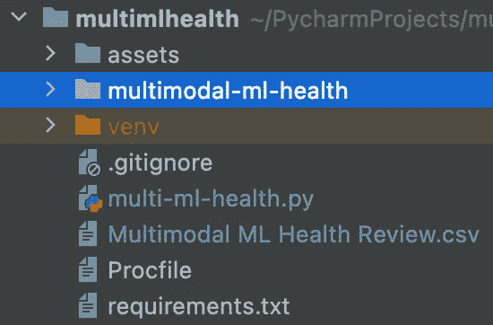

# 使用 Dash/Heroku 创建仪表板应用程序:简化的流程

> 原文：<https://towardsdatascience.com/creating-a-dashboard-app-with-dash-heroku-a-streamlined-process-26bce4fbf2c8>


在 [Unsplash](https://unsplash.com?utm_source=medium&utm_medium=referral) 上由 [Carlos Muza](https://unsplash.com/@kmuza?utm_source=medium&utm_medium=referral) 拍摄的照片

一直想创建一个仪表板，但担心你必须在哪里托管它，学习 CSS 和 HTML 似乎令人生畏？那这篇文章就送给你了！

Dash/Plotly 协同工作，因此您可以在单独使用 Python [1]时轻松创建令人惊叹的视觉效果。Dash 是一个 python 库，作为 HTML 代码的包装库。事实上，这种符号看起来有点类似于 HTML，并与一般的框架和格式相呼应，只是略有不同。

本文致力于使用 Dash 构建和使用 Heroku [2]托管的仪表板的部署，假设您对使用. py 文件构建 Dash 应用程序有足够的了解。如果你想看更多关于 Dash 的信息/文章，请在下面留言。: )

## 在 Heroku 上创建帐户/安装必要的依赖项:

1.  在 Heroku 上注册一个账户:【https://id.heroku.com/login 
2.  创建您的应用程序名称(这最终将成为 URL 的一部分，因此请明智选择！)
3.  下载并安装[Heroku CLI](https://devcenter.heroku.com/articles/heroku-cli):
    ——这允许您使用 git 从命令行更新和更改您的仪表板


## 在选择的 IDE 中:

4.在文件夹中创建新项目，并使用您喜欢的编辑器(PyCharm，VSCode 等)。)

*   在 PyCharm 中选择“创建新项目”,这将提示您为文件的位置指定一个带有文件夹的路径名。名称/文件夹应该是特定于项目的
*   在单击项目的“创建”之前，选择“新环境使用”,并使用下拉菜单选择 **Virtualenv**
*   venv 应该使用您的基本 Python 解释器环境在项目文件夹中构建自己的 venv
*   最后，选择“创建”


5.在项目 venv 中，在终端中安装依赖项:

```
pip install numpy
pip install pandas
pip install dash
pip install plotly
pip install gunicorn
```

Gunicorn 允许您通过在单个 dyno(支持所有 Heroku 应用程序的构建块)中运行多个 Python 进程来同时运行一个 Python 应用程序。

6.在项目文件夹中创建一个**。gitignore** 文件(告诉我们的 git 要忽略哪些文件)并在其中复制/粘贴:

```
venv
.DS_Store
.env
*.pyc
```

7.在项目文件夹中创建一个 **Procfile** 并粘贴这个 **:**

```
web gunicorn projectname:server
```

其中 projectname 是您的。您在项目创建开始时指定的 py 文件。你不会使用。以文件名结尾的 py 文件(所以去掉文件名的这一部分)。

8.创建 **requirements.txt** 。该命令应该从您的项目文件夹和 venv:

```
(venv) /projectfolder$ pip freeze > requirements.txt
```

9.您的 **project.py** 文件是您编写应用程序代码的地方。我将在另一篇文章中介绍 Dash 和 Plotly 的一些基础知识。

10.在你的应用程序的主 **project.py** 文件中，你需要添加下面两行。这标志着我们正在建立一个应用程序。当我们单击右上角的“运行”时，它将在本地运行，并提供一个 URL 链接，您可以根据需要调整我们的控制面板。

```
app = dash.Dash(__name__)
server = app.server
```

您的文件结构应该如下图所示。在我的例子中，我的项目(python 文件)是 **multi-ml-health.py** 。我们还需要确保我们的。csv(数据被提取)也在我们的项目文件夹中。



11.希望您已经位于您的项目文件夹中，并且您的 venv 是活动的。如果没有，这是下一步所需要的，因为我们将我们在 Heroku 网站上实例化的项目连接到我们使用 Python 中的 Dash 创建的仪表板。登录 Heroku:

```
(venv) /projectfolder$ heroku login
```

它将提示您选择任意键来打开浏览器，并使用您的凭据登录。

12.在项目文件夹中创建一个新的 git repo:

```
(venv) /projectfolder$ git init
(venv) /projectfolder$ heroku git:remote -a projectnameonHeroku
```

**projectnameonHeroku** 是你在 Heroku 上创建的名字(不是你上传的文件夹)。并准备将更改转移到 git:

```
(venv) /projectfolder$ git add .
```

提交更改并为初始应用程序启动添加消息！这将使我们对 Heroku 上的项目进行修改。: )

```
(venv) /projectfolder$ git commit -am "launch app"
```

将变更推送到 Heroku 上项目的主(主要)分支:

```
(venv) /projectfolder$ git push heroku master
```

最后三个 git 命令将用于在将来根据需要对您的 dashboard 应用程序进行调整。

## 更新仪表板:克隆回购

再次登录 Heroku。使用 Git 将 multimodal-ml-health 的源代码克隆到您的本地机器上。从初始部署开始，这应该理想地嵌套在您的本地文件夹系统中。

```
(venv) /projectfolder$ heroku login
(venv) /projectfolder$ heroku git:clone -a multimodal-ml-health 
(venv) /projectfolder$ cd multimodal-ml-health
```

## 部署您的更改

对刚刚克隆的代码进行一些修改，并使用 Git 将它们部署到 Heroku。

```
(venv) /projectfolder$ git add .
(venv) /projectfolder$ git commit -am "updated figure 2"
(venv) /projectfolder$ git push heroku master
```

## **仪表板示例**

这是我的仪表板的链接，它是作为一个例子创建的，与提交给*Nature Machine Intelligence*的一篇评论文章一起开发的:

[https://multimodal-ml-health.herokuapp.com/](https://multimodal-ml-health.herokuapp.com/)

此外，如果你喜欢看到这样的文章，并希望无限制地访问我的文章和所有由 Medium 提供的文章，请考虑使用下面的我的推荐链接注册。会员费为 5 美元/月；我赚一小笔佣金，这反过来有助于推动更多的内容和文章！

<https://medium.com/@askline1/membership>  

## 参考资料:

[1] Dash Enterprise，[plotly.com](https://plotly.com/)，访问时间:2022 年 6 月 5 日
【2】Heroku， [Heroku:云应用平台](https://www.heroku.com/)，访问时间:2022 年 6 月 6 日