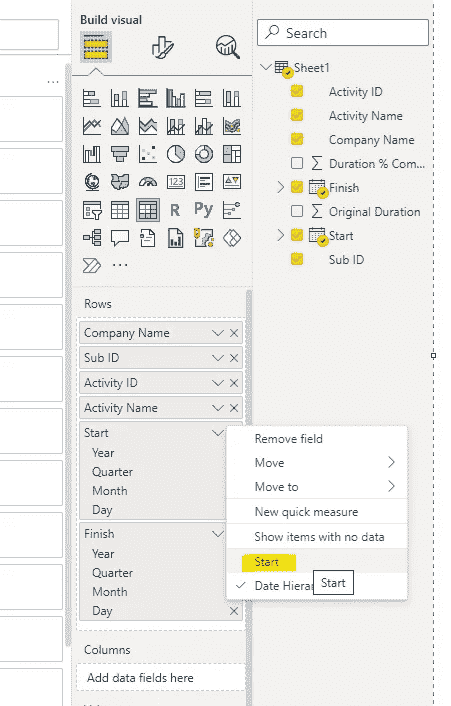
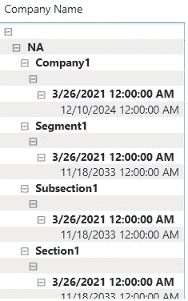
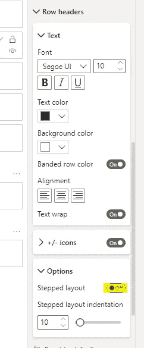
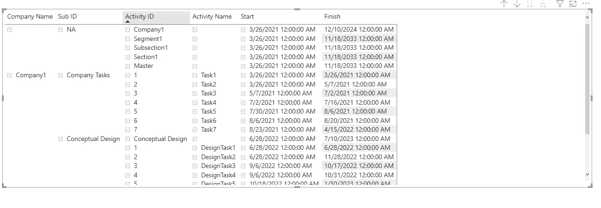
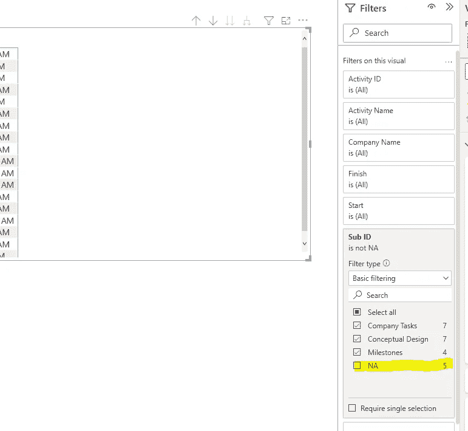
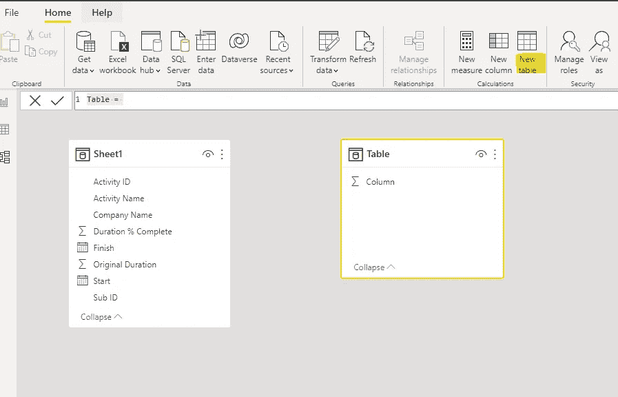
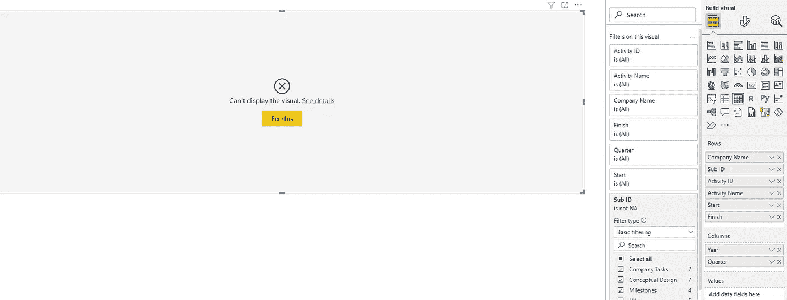
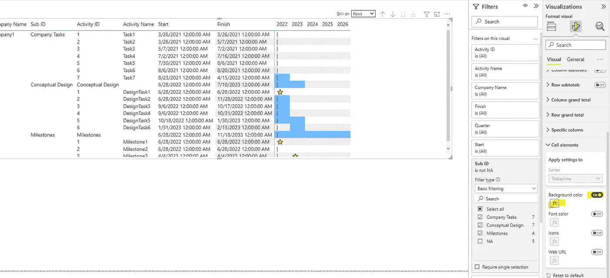
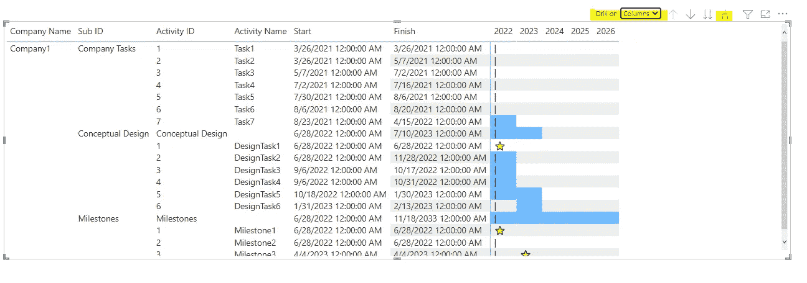
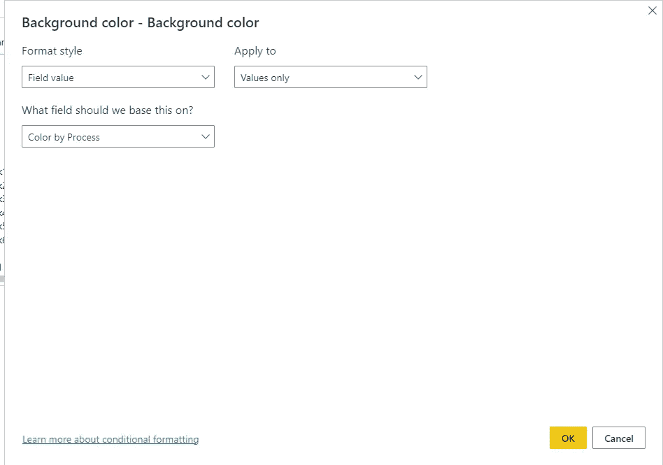

# 用 PowerBI 创建甘特图

> 原文：<https://towardsdatascience.com/creating-a-gantt-chart-with-powerbi-a6039dad7fe4>

## 在多次使用现有的可视化工具创建甘特图失败后，我决定使用 PowerBI 中的矩阵可视化工具自己创建一个甘特图

实际上，我已经用一个 PowerBI 可视化工具来创建甘特图了。然而，当我试图分享它时，我意识到没有付费订阅是不可能的。你不仅需要为自己订阅，还需要为所有需要看到你的甘特图的人订阅。


照片由 Bich Tran 拍摄:[https://www . pexels . com/photo/photo-of-planner-and-writing-materials-760710/](https://www.pexels.com/photo/photo-of-planner-and-writing-materials-760710/)

我认为构建它最简单的方法是在 PowerBI 中使用矩阵视觉来创建一个类似于在 Excel 中创建它们的方法，通过改变单元格颜色使单元格看起来像进度栏。然后，我的需求极大地增加了，因为我想为今天的日期画一条线，我必须区分过程和里程碑，等等。

我在网上找到了很多视频，它们非常有用。这是其中之一。

第一件事是将数据加载到 PowerBI。我在做春华的日程表。当 Primavera 计划导出到 Excel 文件时，它会使用各种缩进级别自动划分流程级别。缩进在 PowerBI 上不能正常工作，因此，如果您可以用一些进程 ID 来标记每个任务，它会非常有用。这是我的日程数据的快照。


在这里，子 ID 很大程度上定义了过程的级别，无论它是公司任务、里程碑还是概念设计。通过这种方式，仪表板可以建立各种任务之间的关系，并可以分别理解和可视化流程。

下图显示了 PowerBI 上的上传屏幕。一旦上传，如果还没有这样做，就使用第一行作为标题。请确保开始日期和完成日期的格式正确。我还使里程碑的开始和完成日期相同，这样当这两个日期相同时，它就不会给单元格着色。相反，它将显示一个里程碑图标。


如果你需要，这里是高级编辑器中的代码。


如您所见，我在 DAX 代码中为每一列定义了列类型。

一旦数据上传到您的仪表板，创建一个空的矩阵视觉。开始将公司名称、子 ID、活动 ID、活动名称、开始和结束添加到可视的行部分。



确保通过单击下拉菜单并选择开始和完成来删除日期层次结构。

一旦你添加了所有这些列，你会发现现在在公司名称旁边有一个**“+”**按钮。如果您展开所有级别，它将如下图所示。



要改变这一点，你需要做的第一件事就是关闭阶梯式布局选项。如果你点击矩阵视觉，然后格式视觉，你需要找到“ ***行标题*** ”下拉菜单。在那里，你会看到 ***选项底部的*** 按钮。



您也可以在此视图中关闭行和列分类汇总

同一个选项页面也可以让你关闭 **+/-** 图标。现在，你的矩阵视觉应该看起来像下面的图像。



我们可以在这个页面上使用一个过滤器来不显示任何带有“ ***NA*** ”的行。在筛选器窗格上，选择子 ID，然后选择全部。取消选中 NA，这将从您的视图中删除子 id 为 NA 的行。



要创建日期括号，我们需要一段 DAX 代码。回到左侧菜单中的模型屏幕，让我们为我们的计划生成一个日历。



点击顶部菜单“计算”下的“新表格”。这将在您的模型中创建一个新的空表。

一旦你点击“新表格”，PowerBI 将让你写一个以“表格=”开头的 DAX 代码。下面是我们将用来创建日历的代码。我们的约会将从 2022 年 1 月 1 日开始，一直持续到 2026 年。如果您的日程表中不需要季度、周和/或日，您不必添加它们。

```
Calendar =VAR _start = DATE(2022,1,1)VAR _end = DATE(2026,1,1)RETURN ADDCOLUMNS( CALENDAR(_start,_end) ,"Year", YEAR([Date]) ,"Year Month", YEAR([Date]) & " " & FORMAT([Date], "mmmm") ,"Quarter", "Q" & QUARTER([Date]) ,"Month Number", MONTH([Date]) ,"Month", FORMAT([Date], "mmmm") ,"Week", WEEKNUM([Date], 1) ,"Day", DAY([Date]) ,"Date Slicer" , IF([Date] = TODAY(), "Today" , IF( [Date] = TODAY() - 1, "Yesterday" , FORMAT([Date], "dd mmmm yyyy") & "" ) )
)
```

如果创建了日历，您需要将日期变量添加到矩阵视图的列中。我只打算添加年份和季度。



当您用日期填充列时，您的可视化将失败，并且您将看到一条消息说“不能显示可视化”，因为没有与我们创建的这些日期相关联的值。

下一件事是向我们创建的这些日期列添加一些值。我们需要编写一个函数来查看流程日期，并根据日期范围添加 0 或 1。如果日期范围(项目的开始和结束)与我们创建的日历日期一致，则单元格应该为 1，否则为 0。为此，您需要在您的计划数据中创建一个新的度量。

```
BetweenDates = VAR beginning = min ( Sheet1[Start] ) VAR finish = max ( Sheet1[Finish] ) VAR duration = max ( Sheet1[Original Duration] ) VAR colorVar = 0RETURNSWITCH (TRUE(),AND ( MAX ( 'Calendar'[Date] ) >= beginning ,  MIN ( 'Calendar'[Date] ) <= finish ) && duration >0,1
)
```

我们还想显示今天的日期线，并使用图标来说明里程碑。因此，代码将首先检查流程的开始和结束日期是否相同。如果是，它会用 a⭐.填充单元格否则，它将在单元格中使用“|”来模仿一行，在每一行中重复该行。为此，我们应该创建另一个称为“TodayLine”的衡量标准。

```
TodayLine = VAR TodayLine = "|" VAR beginning = min ( Sheet1[Start] ) VAR finish = max ( Sheet1[Finish] ) VAR duration = max ( Sheet1[Original Duration] )RETURNSWITCH ( TRUE (), duration == 0 && MAX ( 'Calendar'[Date] )  >= beginning && MIN       ( 'Calendar'[Date] ) <= finish ,  "⭐", ISINSCOPE( 'Sheet1'[Sub ID]), IF ( TODAY () IN DATESBETWEEN ( 'Calendar'[Date], MIN ( 'Calendar'[Date] ), MAX ( 'Calendar'[Date] ) ), TodayLine, ""))
```

一旦创建了这两个度量值，请将 TodayLine 拖动到矩阵视觉值。


TodayLine 函数将突出显示今天的日期。如果流程开始和结束日期相同，它还会添加 a⭐。

我们需要做的最后一件事是根据我们创建的 BetweenDates 度量来更改矩阵视图中的单元格颜色。



要做到这一点，点击你的矩阵视觉，去它的视觉设置，并打开背景颜色。之后，点击 fx 图标来设置正确的配色方案。

一旦点击 *fx，*输入屏幕将需要一个格式样式。选择规则，然后查找作为规则基础的中间日期字段。如果单元格等于 1，它应该有颜色。


现在，我们的时间表已经准备好了，它应该看起来像下面的图像！



如果您使用钻取(突出显示)选择“列”，然后单击“在层次结构中向下全部展开一级”，计划将显示更多日期功能，如季度。

有一种方法可以根据流程类型给每个流程着色。我们需要创建另一种方法来用颜色区分不同的任务。如果不需要，可以跳过下一部分。

如果它不是一个里程碑，并且我们想用它的过程名来给它着色，那么 DAX 代码的结构应该如下:

```
Color by Process = IF ( [BetweenDates] <> 0 , SWITCH ( MAX ( Sheet1[Sub ID] ), "Conceptual Design", "#14375A","Company Tasks", "#CC7B29"))
```



这将为各种过程赋予不同的颜色。但是，它将删除里程碑等流程的颜色。我不需要给一般的过程上色。所以我用了这个功能。

如果你使用它，你的时间表会是这样的:


每个过程使用一个 HTML 颜色代码。如果你想找一种颜色，你可以使用在线资源，比如 https://htmlcolorcodes.com/的

总之，我们都知道甘特图是一种众所周知的、成功的项目管理和进度安排方式。对于计划、监视和控制项目过程的一种有效、高效和实用的方法是创建嵌入甘特图的仪表板，其中许多活动都要在特定的时间范围内完成。

我希望创建一个带有甘特图的仪表板可以确保所有的事情都按时完成，让你很容易看到关键的日期和里程碑，并为你的项目设置依赖关系。

如有疑问，留言评论。

仪表板 Github 回购:【https://github.com/ak4728/PowerBI-schedule 

感谢阅读！