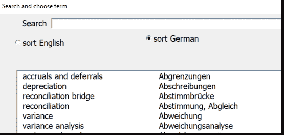
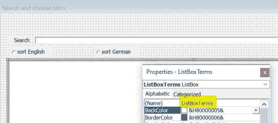
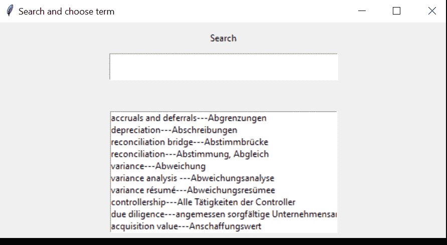

# 创建自动完成搜索表单

> 原文：<https://towardsdatascience.com/creating-autocomplete-search-forms-e8bc3f2c1669>

## Tkinter vs Excel VBA


自动完成功能让搜索变得更容易

在今天的数据洪流中，用户友好的搜索掩码几乎是不可或缺的。在这篇文章中，我们将看到如何使用 Tkinter 开发一个用于翻译目的的响应搜索，并与 VBA 进行比较。



响应搜索表单(图片由作者提供)

**背景:**

我们的表由两列组成。第一列包含英语术语，第二列包含相应的德语翻译。


德-英金融术语摘录(图片由作者提供)

我们希望为用户提供一个用户友好的输入掩码来搜索翻译。两种语言都要搜索。为了好玩，我们将在 Excel VBA 中创建一次，然后将其与 Python 的 Tkinter 匹配。这样我们将再次认识到为什么 Python 是如此伟大的编程语言。玩笑归玩笑，这主要是针对那些来自 VBA，现在想学习 Python 的人。希望这能帮助你更容易理解基本概念。

**解决方案:**

搜索到的单词会立即与相应的翻译一起列在命中列表中。搜索栏中每输入一个字母，命中列表的范围就会相应缩小。


(图片由作者提供)

要在 Excel VBA 中实现这一点，需要一系列不同的步骤。我只说明最重要的几个方面，这些方面我们也和 Tkinter 比较。但是如果您想详细研究代码，可以在我的 Github 资源库中找到完整的文件和代码。

Excel 表格被分成称为“SearchText”的用户输入:


(图片由作者提供)

结果显示在“ListBoxTerms”中时:



(图片由作者提供)

如果搜索成功，您可以双击每个匹配项，将翻译转移到搜索选择选项卡:

```
Private Sub ListBoxTerms_DblClick(ByVal Cancel As MSForms.ReturnBoolean)
If ListBoxTerms.ListIndex = -1 Then
    MsgBox "No dataset selected"
    Exit Sub
End If
Dim wks As Worksheet
Set wks = Worksheets("SearchSelect")
With Me.ListBoxTerms
wks.Range("F11:F12").ClearContents
wks.Range("F12").Value = .List(.ListIndex, 0)
wks.Range("F11").Value = .List(.ListIndex, 1)
End With
Unload Me
End Sub
```

如果没有输入搜索，默认情况下，列表中会填充范围 A1 至 B1000(数据来自“标准”选项卡):

```
Sub ListFill()
Dim SD As Worksheet
Set SD = Sheets("Standards")
Dim LastRow%
LastRow = Sheets("Standards").Range("A1000").End(xlUp).Row + 1
ListBoxTerms.RowSource = "Standards!A1:B" & LastRow
End Sub
```

根据最近的字符串搜索显示的过滤列表可能值得更仔细地观察一下。我们使用大写字母(UCase)来确保搜索不区分大小写。然后，我们比较 Standards 选项卡中第一列(包含英文单词)中的每一行，以查看它是否包含在搜索文本(SearchText)的字符串(InStr)中。如果大于 0，则“标准”选项卡中的单词将显示在 ListBoxTerms(显示与用户当前搜索相对应的匹配项的列表框)中。这个英语单词使用 VBA 的 AddItem 显示在 ListBoxTerms 中。“标准”选项卡的第二列也是如此，其中包含德语翻译(SD。细胞(I，2))。借助 VBA 的 ListCount 函数，这个德语单词被插入到 ListBoxTerms 中。

```
Sub ListFillFilter()
If SearchText = "" Then
    Call ListFill
    Exit Sub
End If
Dim SD As Worksheet
Set SD = Sheets("Standards")
Dim LastRow%
Dim i%
LastRow = Sheets("Standards").Range("A1000").End(xlUp).Row + 1
ListBoxTerms.RowSource = ""
i = 1
Do
    If InStr(UCase(SD.Cells(i, 1)), UCase(SearchText)) > 0 Or InStr(UCase(SD.Cells(i, 2)), UCase(SearchText)) > 0 Then
        ListBoxTerms.AddItem SD.Cells(i, 1)
        ListBoxTerms.List(ListBoxTerms.ListCount - 1, 1) = SD.Cells(i, 2)
    End If
i = i + 1
Loop Until i > LastRow
End Sub
```

使用 Excel VBA 的初始化功能，每当打开文件时都会填充列表表单:

```
Private Sub SearchText_Change()
Call ListFillFilter
End Sub
```

其次，使用 VBA 的 change 函数，我们在每次向搜索表单中输入内容时调用 ListFillFilter:

```
Private Sub UserForm_Initialize()
Call ListFill
End Sub
```

这是在 Excel 中设置搜索表单的方法。
现在让我们看看在 Python 中使用 Tkinter 解决这个问题的完整方案。



用 Tkinter 解决 Python 中的响应搜索(图片由作者提供)

本文的目的不是争论哪个解决方案是更好的选择。但是对您来说，比较 VBA 和 Python 可能会很有趣，特别是对于本例中三个最重要的函数。Python 代码对你来说看起来也更苗条了吗(或者只是我不同的截图技术扭曲了这种印象)？


ListFill，VBA 左对 Python 右(图片由作者提供)

至少从上面的 ListFillFilter 我们可以清楚的看到，Python 让对比变得更加方便。Python 中的循环不太费力，因为我们不必一直数到翻译字典的末尾。


ListFillFilter，VBA 左 vs Python 右(图片由作者提供)


ListBoxTermsDoubleClick，VBA 左 vs Python 右(图片由作者提供)

**概要:**

恭喜您，您已经编写了一个动态搜索程序，使用户更容易输入数据。在这个例子中，我们只搜索了字符串的匹配，这是一个非常简单的搜索功能。但是对于我们的翻译需求，这已经足够了。在[的另一篇文章](/high-scalable-fast-search-with-haystack-8b7bb103df8e)中，我们将把这种“字符串匹配方法”与高度可扩展的认知搜索进行比较(这里有一个小玩笑:Haystack 和 Elasticsearch 是神奇的词)。

在此之前，非常感谢您的阅读！希望这篇文章对你有帮助。请随时在 [LinkedIn](https://de.linkedin.com/in/jesko-rehberg-40653883) 、 [Twitter](https://twitter.com/DAR_Analytics) 或[工作室](https://jesko-rehberg.medium.com/virtual-reality-vr-for-education-a532aa5b6272)与我联系。

<https://jesko-rehberg.medium.com/membership>  

您可以在我的 [Github](https://github.com/DAR-DatenanalyseRehberg/SearchSelectAutocomplete) 资源库中找到完整的代码和文件。请随时在 [LinkedIn](https://de.linkedin.com/in/jesko-rehberg-40653883) 、 [Twitter](https://twitter.com/DAR_Analytics) 或[工作室](https://jesko-rehberg.medium.com/virtual-reality-vr-for-education-a532aa5b6272)与我联系。