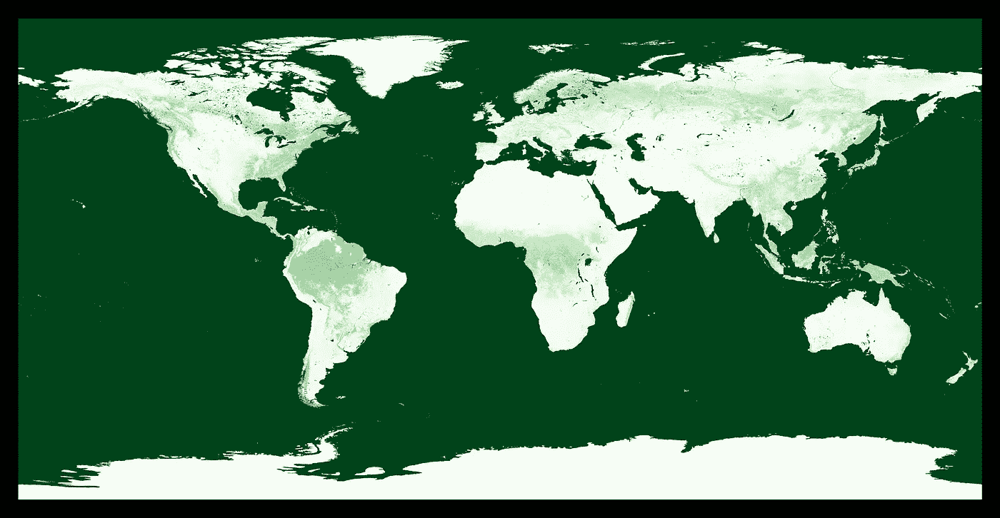
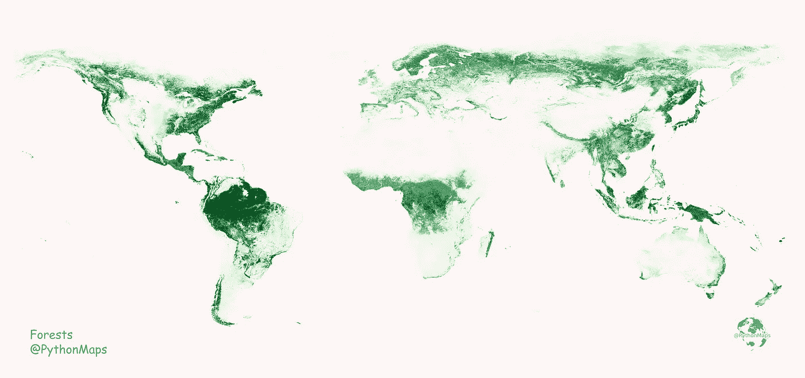
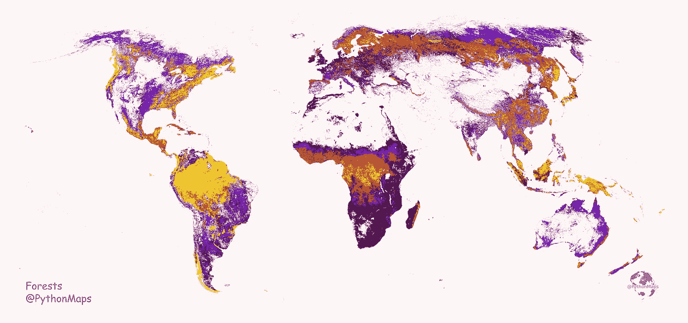

# 用 Python 创建漂亮的森林地图

> 原文：<https://towardsdatascience.com/creating-beautiful-forest-maps-with-python-59a60fba3e27>

## 通过 Matplotlib 使用光栅文件生成引人注目的可视化效果

世界森林。作者图片

## 介绍

森林和植被一直是人类在地球上生存的核心。它们提供我们呼吸的空气，我们吃的食物和建造我们家园的材料。多亏了大量有趣的研究项目，现在有几个公开来源的数据集来展示地球上森林和植被的分布。借助 Python 的魔力，我们可以获取这些数据集，分析它们，操纵它们，并使用它们来生成如上所示的有见地且引人注目的可视化效果。

虽然可以说数据可视化是游戏的目标，但这是一个以数据操作和重新投影为核心的练习。我们将使用`rasterio`和`rioxarray`生成上面的可视化以及一些其他有趣的情节。

## 数据探索

有许多数据集，在本教程中，我们将使用来自日本地理空间信息局、千叶大学和合作组织的百分比树覆盖率(PTC)数据集([链接](https://globalmaps.github.io/ptc.html)到数据集和许可信息)。

数据很旧，显示的是 2003 年的森林，这显然是很久以前的事了，但是这里使用的方法将适用于其他森林数据集和/或存储在该存储库中的一些更新的(但更大的)数据。事实上，该存储库中存在更高分辨率的数据集，但是数据被分解为 12 个独立的 tif 文件，代表世界上 90x60 度的大块。组合不同的 tif 文件是可能的，但是超出了本教程的范围，因此将在以后的文章中讨论。

数据存储在 tif 文件中，分辨率为 30 弧秒(约 1 平方公里)。tif 文件的每个网格点都有一个介于 0-100 之间的值，对应于 1 平方公里区域内的树木覆盖率。水体给数值 254，无数据给 255。

下面，使用`rasterio`打开并读取数据。请注意，文件的加载和打开分两个不同的步骤。使用`numpy`打印最小值和最大值，显示数值范围从 0-254，意味着没有丢失数据。

对于任何数据可视化问题，要做的第一件事是绘制数据，以了解我们正在处理的问题。下面是使用`Greens`颜色图的标准`imshow`数据图(因为你为什么要用其他东西来描绘森林？).

显示世界森林的原始数据。作者图片

显而易见的问题是，海洋被染成了绿色，那里显然没有森林。对于树木覆盖率百分比，数据在 0-100 之间缩放，但对于水体还有一个额外的数据点-254。绘制数据时,`matplotlib`创建一个颜色图，颜色在数据集中的最小值(0)和最大值(254)之间线性缩放。我们真正关心的数据被映射到前 101 种颜色(约占颜色图的 40%)，有 153 种颜色完全没有使用(101–253)，一种颜色用于海洋(254)。所以色彩图中大约 60%的颜色没有被使用。下面直观地说明了这一点。

图解说明颜色映射问题的示意图。作者图片

出于本练习的目的，我们将假设海洋的树木覆盖率为 0%，这可能是一个非常安全的假设，但至少值得一提，因此，在下面的代码中，所有大于 100 的值都被更改为 0。因此，在随后的图中，将有 101 个值(0–100 ),颜色图将完美地映射到最低值(0 森林覆盖和水体的区域)到最高值(100%森林覆盖)。

我想为森林覆盖率为 0 的 gridpoints 设置一个自定义背景色，所以我们使用下面的代码生成一个有 101 种颜色的 colourmap，用我们的自定义值替换第一种颜色，然后从颜色列表中创建一个新的 colourmap。

为了从一个颜色列表中创建一个颜色图，我们可以使用`ListedColormap`方法，该方法获取一个颜色列表并从这些颜色中生成一个颜色图。由于数据是值在 0-100 之间的线性范围，我们不需要担心边界，我们可以使用颜色图而不归一化颜色图(关于颜色图和归一化颜色图的更多信息，我已经写了大量关于它们的内容[这里](https://medium.com/p/4c21ed75117f))。

然后，可以将颜色图应用于之前生成的绘图代码。虽然这里有一些补充，但是轴已经被关闭以使情节看起来更艺术，并且情节的边缘已经被修剪以减少空白空间的数量。这些都是风格上的变化，任何试图学习本教程的人都可以并且确实被鼓励忽略。数据可视化应该更多地是关于表达而不是科学，因此每个人都应该发展自己的风格。

世界森林。作者图片

数据看起来像预期的那样，重要的是看着一个可视化，问问你自己它是否有意义。显而易见，颜色图处理水体的方式存在问题，这将在下面讨论，但总体来说，事情都在意料之中。有与亚马逊、刚果和东南亚雨林相对应的深绿色区域，北半球显示出与北美和欧亚大陆的落叶林相对应的连续的浅绿色区域，甚至在伊朗北部海岸线上有一片细长的绿色雨林区域。

我们可以就此结束，但是我更喜欢罗宾逊投影的地图，所以需要一个额外的步骤来重新投影数据。罗宾逊投影是绘制全球数据集的一种更现实的方法，因为地球不是平的。

重新投影地理空间形状(如点和面)很简单，但不幸的是，对栅格数据进行同样的操作更具挑战性。为了做到这一点，我们可以。`rioxarray`使用`rio`访问器扩展了`xarray`，并允许裁剪、合并和重新投影 tiff 和 geotiff 文件中的栅格。下面，用`rioxarray`打开原始的 tif 文件(它利用了一些底层的`rasterio`功能，因此有了`open_rasterio`方法)，Robinson 投影被定义为一个`rasterio.CRS`对象，然后光栅被重新投影到这个`CRS`上。需要注意的一点是，`rasterio.CRS`对象是从一个`pyproj`字符串中创建的。`pyproj`是一个处理地图投影和坐标转换的极好的库，我将在以后的文章中介绍它。

然后，可以使用与之前相同的彩色地图绘制数据，从而在罗宾逊投影中给出我们的森林地图。

使用罗宾逊投影的世界森林。作者图片

另一方面，当使用线性单色颜色图时，通常可能会丢失颜色图较亮一端的数据，所以为了好玩，你可以使用一个奇怪而奇妙的颜色图，这样每个数据点都清晰地显示出来，0-100。下图和之前一样，但是这次使用了`gnuplot`颜色图。

一些东西现在会跳出来，美国的西部荒野，南美洲的大部分地区，撒哈拉沙漠的部分地区，中亚，澳大利亚和南非，这些地方的森林覆盖率很低。尼罗河和三角洲也出现了。本文中使用的绿色色图完全适合手头的任务，但是探索其他色图仍然是有用的，只是为了充分理解数据以及创建有趣的图。

使用罗宾逊投影和 gnuplot 彩色地图的世界森林。作者图片

# 结论

我们有它，一个美丽的地图显示如何产生引人注目的数据可视化显示世界的森林。这是计划展示如何使用 Python 使地理空间数据看起来令人惊叹的许多文章中的第一篇，请订阅以便您不会错过它们。我也喜欢反馈，所以请让我知道你会如何做不同或建议改变，使它看起来更棒。我每周都会在我的推特账户上发布数据可视化，看看地理空间数据可视化是不是你的菜[https://twitter.com/PythonMaps](https://twitter.com/PythonMaps)

medium 提供的额外收入确实有助于这个项目继续进行，所以如果你是一个粉丝，想取消你的帐户，然后用我的推荐重新注册，那就太好了。https://pythonmaps.medium.com/membership

## 参考

本教程所需的数据源和库的链接。

数据—【https://globalmaps.github.io/ptc.html 

matplotlib—[https://matplotlib.org/](https://matplotlib.org/)

numpy—[https://numpy.org/](https://numpy.org/)

拉斯特里奥—[https://rasterio.readthedocs.io/en/latest/](https://rasterio.readthedocs.io/en/latest/)

里约—[https://corteva.github.io/rioxarray/stable/](https://corteva.github.io/rioxarray/stable/)

pyproj—[https://pyproj4.github.io/pyproj/stable/](https://pyproj4.github.io/pyproj/stable/)