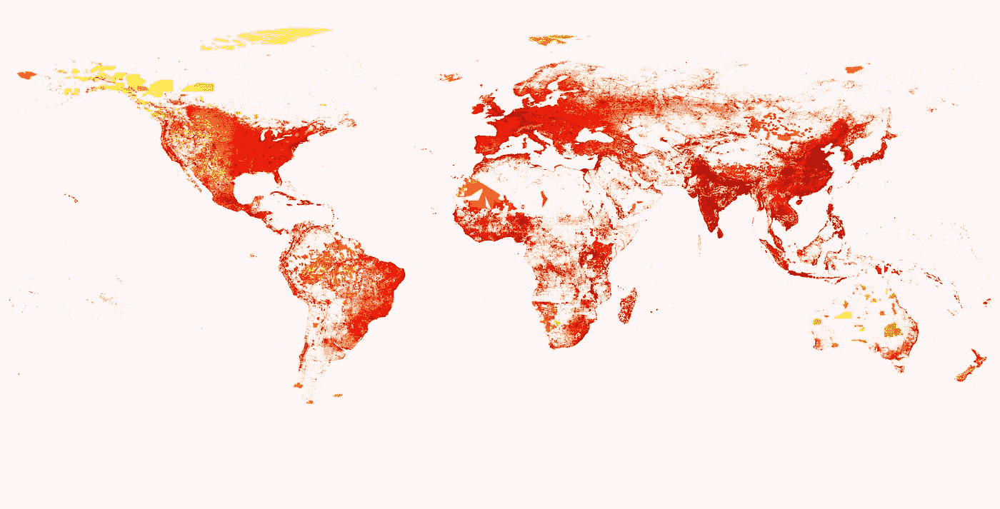
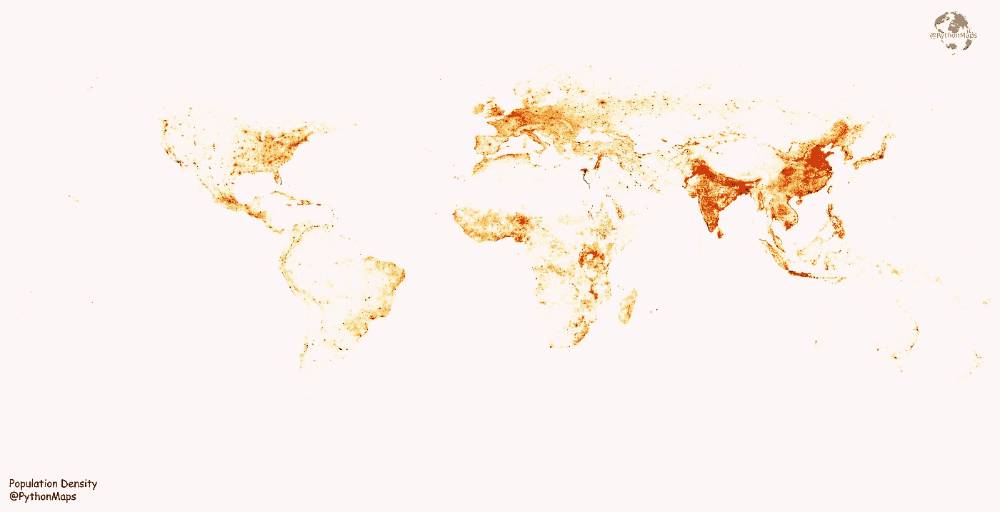
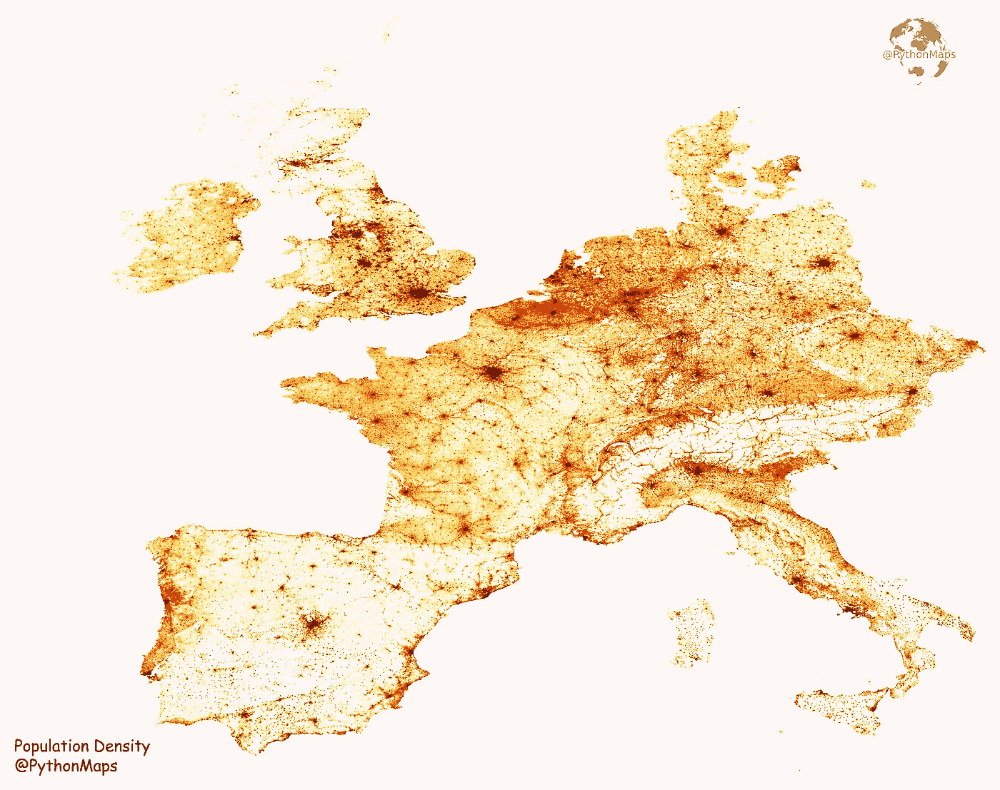
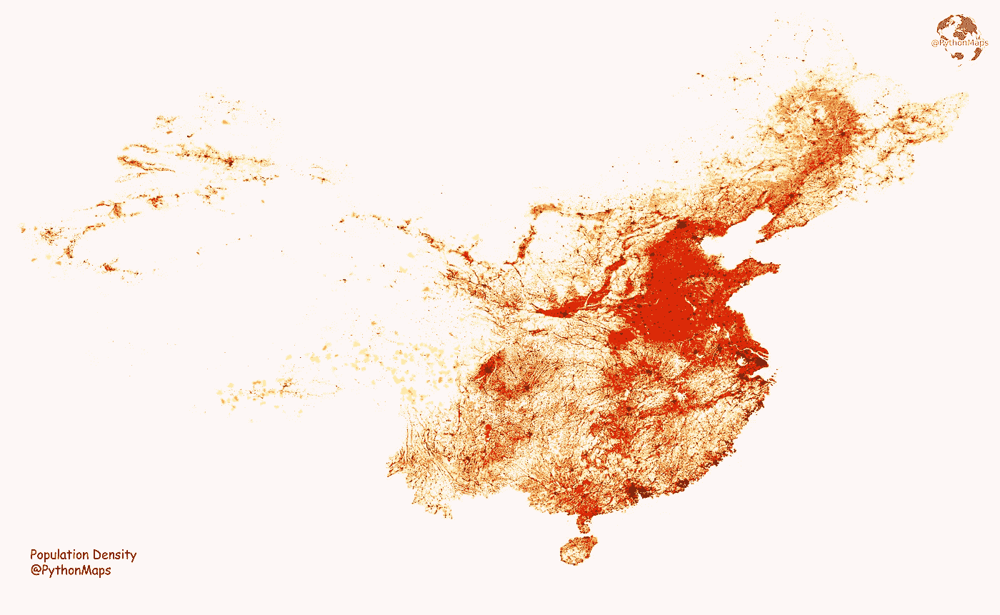
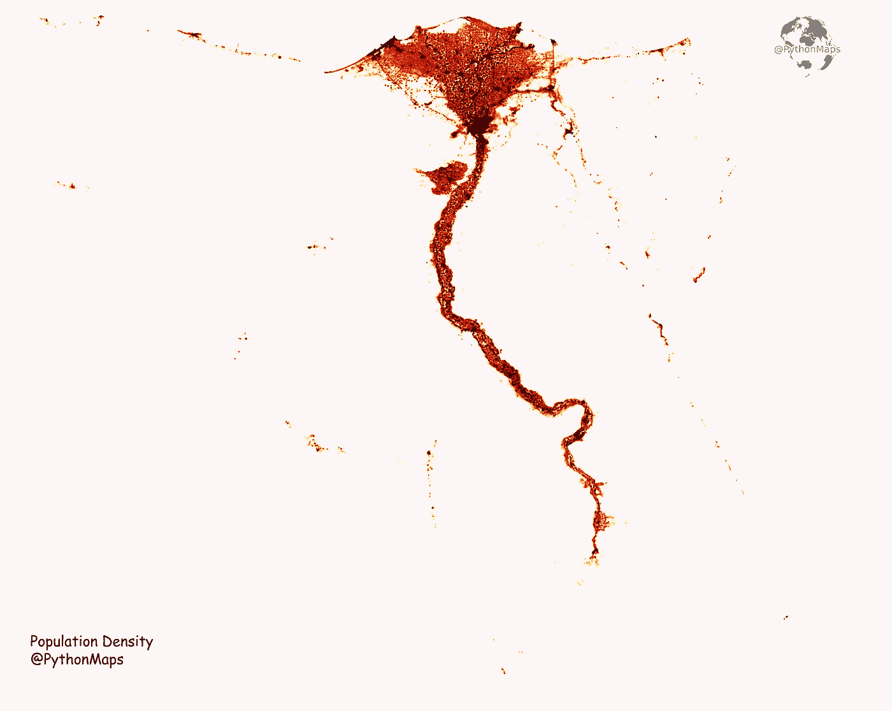

# 使用 Python 创建漂亮的人口密度地图

> 原文：<https://towardsdatascience.com/creating-beautiful-population-density-maps-with-python-fcdd84035e06>

## 使用 Python 绘制全球 78 亿人口的居住地地图

作者图片

这篇文章很大程度上是受 subreddit r/[people live incities](https://www.reddit.com/r/PeopleLiveInCities/)的启发。人类已经在地球上广泛传播，触及了每一个大陆，并在世界的广大地区产生了影响。然而，当你真正观察人口密度图时，你会发现大多数人都聚集在一起，尽管世界上有广阔而空旷的空间。如果世界人口平均分布，那么每平方公里大约有 50 人。事实上，有些地区完全无人居住，有些国家的人口密度为每平方公里数千人。这是一个真正令人着迷的概念，有了正确的人口密度地图，你就可以分辨出单个的城市、城镇甚至村庄，还可以识别出世界上真正偏远的地区。这就是你在封面图像中看到的，黑暗的热点表示人口密集的城市和城镇，混杂在人口稀少的明亮区域中。因此，在本文中，我将概述如何使用开源人口密度数据，通过 Python 来构建自己的人口密度地图。

## 数据准备

有许多人口密度数据集，但是出于本练习的目的，我们将使用 [GHSL](https://ghsl.jrc.ec.europa.eu/download.php?ds=pop) —全球人类居住层。数据免费提供，服务条款可在[此处](https://ghsl.jrc.ec.europa.eu/documents/GHSL_Data_Package_2019.pdf?t=1478q532234372)找到。

首先要做的是将数据下载到你想进行数据可视化的任何地方。数据在此处[可用](https://ghsl.jrc.ec.europa.eu/download.php?ds=pop)，所需的具体文件是 GHS 人口，2018 年的 30 弧秒数据集。需要注意的是，本教程需要 WGS84 投影。数据以 tif 文件的形式出现，可以用`rasterio.`读取

这个数据集很大，在标准笔记本电脑上工作需要很长的执行时间，因此做一些基本的探索来了解您正在处理的东西是很重要的。

数据的单位是 30 弧秒，每个区块包含该区块记录的人数。所以单位是每平方公里的人数(30 弧秒= 1 公里)。

最大值为 459434.69 人/平方公里。值得注意的是，虽然该值大于谷歌搜索人口密度最大的城市或国家后引用的值，但这对应于单公里，城市和国家的值为平均值。例如，纽约中央公园的人口密度与一些住宅区的人口密度非常不同。

最小值是-200，对应于空值。在此地图中，没有数据和人会被视为同一事物，因此任何低于 0 的值都将被设置为零。我想我会尝试的第一件事是一个对数图。如果可能的话，我尽量避免使用对数图，因为由此产生的图可能很难解释，而且数据通常没有意义。但是，当有一小部分数值数量级大于大多数(城市)时，以及在试图显示乘法因子的图中(喜马拉雅山脉与上海)，对数图是很好的。我们的数据符合这两个类别，因此在这种情况下是合适的。

## 测绘

我们将使用一张`hot`彩色地图。我希望色彩映射表的底部是一个中性的背景色，所以下面我将热色彩映射表对象作为一个列表，从中提取 460 种颜色，添加一个背景色到列表的开始，然后从列表中构建一个新的色彩映射表。因为背景色已被添加为色彩映射表中的第一种颜色，所以最小值(本例中为 0)将被映射到该颜色。

然后可以使用对数标度和刚刚创建的颜色图将数据绘制在下面。这些数据看起来很像预期的那样，但是非常混乱，也不是特别吸引人。这是因为人类倾向于生活在一起，所以数据中有大量高密度值的人口，也有大量低密度值的人口。因此，高密度值将被映射到颜色图的一端，而低密度值被映射到另一端。结果是，我们可能期望显示为“已填充”的所有区域都具有相似的颜色。

使用对数标度绘制的每平方公里的人口密度。作者图片

人口密度地图倾向于使用自定义比例。例如，google images 的第一批结果之一使用了 0、1、5、10、20、50、100、200、1000 人/平方公里的比例，因此在这种情况下，他们只是将所有人口众多的地区一视同仁。这些地图是定性的，而不是定量的，因为在一天结束时，我们希望产生一个发人深省和引人注目的图像。这不是一张用来制定疫情疏散计划的照片。所以经过一点试验，我决定用一组稍微不同的值来映射我们的人口值。默认情况下，在`matplotlib`中使用色图的对象将色图中的颜色从数据集中的最小值线性映射到数据集中的最大值，间隔由色图中的颜色数量决定。`BoundaryNorm`类允许你将颜色图中的颜色映射到一组自定义值。在下面的代码中，我们创建了一个有 10 种颜色的颜色图和一个`BoundaryNorm`对象，它将根据预定义的级别把数据中的值映射到颜色图。

使用自定义比例绘制的每平方公里人口密度。作者图片

这张图片看起来越来越像了，放大后显示的正是我认为我们期望找到的东西。然而，这很难通过这种特殊的通信媒介来实现，您可能决定要生成特定国家的人口地图。所以下面我们将制作世界特定地区的人口地图。要做到这一点，我们需要分离出特定于一个国家的部分人口数据。幸运的是，`rasterio` 提供了一种基于地理配准形状(如多边形)裁剪栅格的有用方法。在这种情况下，我使用了属于 [NaturalEarth](https://www.naturalearthdata.com/) 数据集的多边形，通过`rasterio.mask.mask` 函数来裁剪栅格。

我想从西欧开始，所以我需要建立一个与这些国家相对应的`GeoDataFrame`多边形。我加载了 NaturalEarth shapefile，并使用`geopandas`提取了英国、法国、奥地利、德国、捷克、意大利、丹麦、卢森堡、比利时、瑞士、西班牙、葡萄牙、荷兰和爱尔兰的多边形。不幸的是，法国、西班牙、葡萄牙和荷兰都有海外领地，这是它们自然地球几何的一部分。因此，下面的代码提取了这些几何图形的欧洲大陆部分，并丢弃了其余部分。

然后可以使用`mask`函数将栅格数据匹配到西欧多边形。它获取开始时创建的`tif_file`对象和一个映射的几何图形列表，并生成一个新的栅格，排除几何图形之外的值。

西欧每平方公里的人口密度。作者图片

为了好玩，下面是为美国、中国、印度和埃及制作的一些地图。人口密度相当有趣且独特的国家。

美国每平方公里的人口密度。作者图片

中国每平方公里的人口密度。作者图片

印度每平方公里的人口密度。作者图片

埃及每平方公里的人口密度。作者图片

## 结论

我们有了它，一个美丽的地图显示了如何生成引人注目的数据可视化，显示了地球上人们生活的地方。这是计划展示如何使用 Python 使地理空间数据看起来令人惊叹的许多文章中的第一篇，请订阅以便您不会错过它们。我也喜欢反馈，所以请让我知道你会如何做不同或建议改变，使它看起来更棒。我每周都会在我的推特账户上发布数据可视化，看看地理空间数据可视化是不是你的菜【https://twitter.com/PythonMaps 

medium 提供的额外收入确实有助于这个项目继续进行，所以如果你是一个粉丝，想取消你的帐户，然后用我的推荐重新注册，那就太好了。【https://pythonmaps.medium.com/membership 

## 参考

全球统一制度数据集——马尔切洛，斯齐亚维纳；塞尔吉奥·弗莱雷；麦克马努斯、凯特(2019 年):全球统一制度人口网格多时段(1975-1990-2000-2015 年)，R2019A。欧洲委员会，联合研究中心

概念与方法:—弗雷尔、塞尔吉奥；麦克马努斯，基特；马蒂诺·佩萨雷西；埃林·多克西-怀特菲尔德；Mills，Jane (2016 年):开发新的 250 m 分辨率的开放和免费的多时相全球人口网格。变化中的地理空间数据；欧洲地理信息实验室协会。敏捷 2016