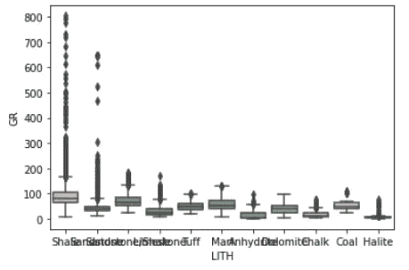
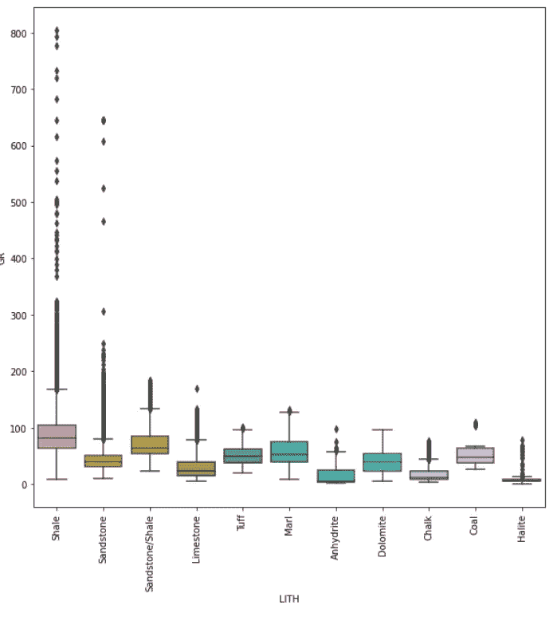
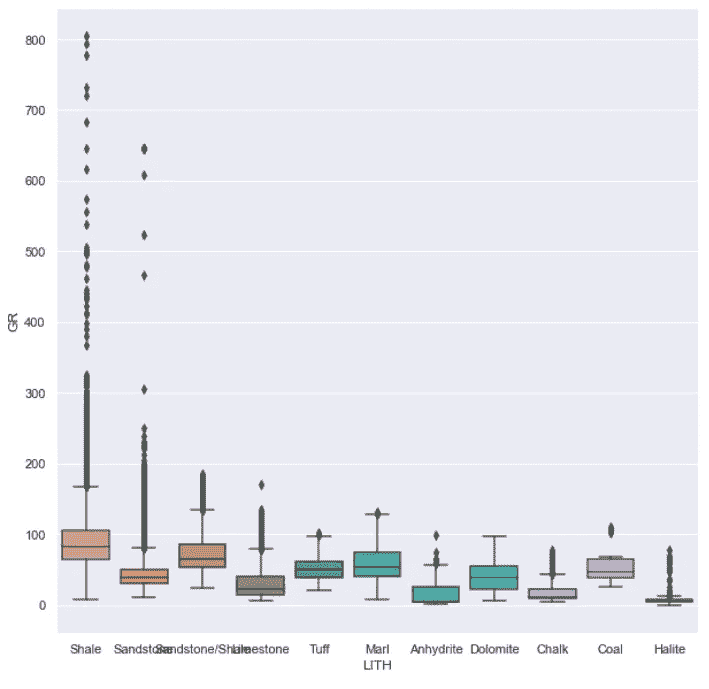
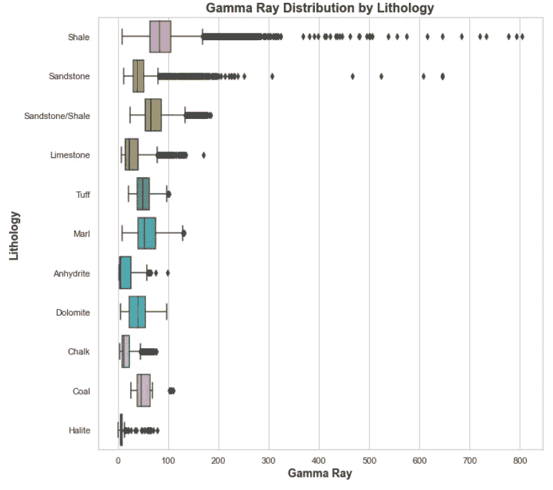

# 使用 Seaborn Python 库创建箱线图

> 原文：<https://towardsdatascience.com/creating-boxplots-with-the-seaborn-python-library-f0c20f09bd57>

## Seaborn 箱线图快速入门指南


[图片来自 Pixabay](https://pixabay.com/photos/binary-binary-system-computer-2904980/)

[箱线图](https://seaborn.pydata.org/examples/horizontal_boxplot.html)是可视化数据的伟大统计工具，通常用于数据科学项目的探索性数据分析(EDA)阶段。它们为我们提供了数据的快速统计摘要，帮助我们了解数据是如何分布的，并帮助我们识别异常数据点(异常值)。

在这个简短的教程中，我们将看到如何使用流行的 [Seaborn Python 库生成箱线图。](https://seaborn.pydata.org/)

# 什么是箱线图？

一个[箱线图](https://seaborn.pydata.org/examples/horizontal_boxplot.html)是一种基于五个关键数字显示数据分布的图形化和标准化方法:

*   “最低”
*   第一个四分位数(第 25 个百分位数)
*   中位数(第二个四分位数/第五十个百分位数)
*   第三个四分位数(第 75 个百分位数)
*   "最大值"

最小值和最大值分别定义为 Q1-1.5 * IQR 和 Q3 + 1.5 * IQR。任何超出这些限制的点都被称为异常值。


箱线图的图形描述，突出显示关键组成部分，包括中位数、四分位数、异常值和四分位数间距。作者创建的图像。

箱线图可用于:

*   识别异常值或异常数据点
*   来确定我们的数据是否有偏差
*   了解数据的分布/范围

为了构建箱线图，我们首先从中间值(第 50 百分位)开始。这代表了我们数据中的中间值。

然后在第 25 和第 75 个百分点之间形成一个方框(分别为 Q1 和 Q3)。这个方框表示的范围称为四分位间距(IQR)。

从这个盒子延伸出两条线，也就是众所周知的胡须。这些延伸到 Q1-1.5 * IQR 和 Q3 + 1.5 * IQR，或者延伸到小于该值的最后一个数据点。

任何超出晶须极限的点都称为异常值。

# 资料组

我们在本教程中使用的数据集是作为 Xeek 和 FORCE 2020 *(Bormann et al .，2020)* 举办的机器学习竞赛的一部分使用的训练数据集的子集。

完整的数据集可以通过以下链接获得:[https://doi.org/10.5281/zenodo.4351155](https://doi.org/10.5281/zenodo.4351155)。

竞赛的目的是利用测井测量从现有的标记数据预测岩性。完整的数据集包括来自挪威海的 118 口井。

此外，您可以从 GitHub 资源库下载本教程中使用的数据子集:

[](https://github.com/andymcdgeo/Petrophysics-Python-Series)  

# 锡伯恩图书馆

[Seaborn](https://seaborn.pydata.org/) 是一个建立在 [matplotlib](https://matplotlib.org/) 之上的高级数据可视化库。它为创建更高级的绘图提供了更容易使用的语法。与 [matplotib](https://matplotlib.org/) 相比，默认数字也更具视觉吸引力

# 使用 Seaborn 构建箱式地块

## 导入库和数据

首先，我们首先需要导入将要使用的库: [pandas](https://pandas.pydata.org/) 用于加载和存储我们的数据，以及 [Seaborn](https://seaborn.pydata.org/) 用于可视化我们的数据。

```
import seaborn as sns
import pandas as pd
```

导入库后，我们可以从 CSV 文件导入数据并查看文件头。

```
df = pd.read_csv('Data/Xeek_train_subset_clean.csv')
df.head()
```


在数据集内，我们有关于油井、地质分组和地层的详细信息，以及我们的测井测量。如果您不熟悉这些数据，请不要担心，因为下面的技术可以应用于任何数据集。

## 创建简单的箱线图

我们可以生成第一个箱线图，如下所示。在括号内，我们传入想要从数据帧中访问的列。

```
sns.boxplot(x=df['GR']);
```


由 Seaborn 生成的简单箱线图。图片由作者提供。

我们也可以旋转我们的绘图，使方块是垂直的。为了做到这一点，我们为`y`而不是`x`提供一个值。

```
sns.boxplot(y=df['GR']);
```


Seaborn 生成的垂直箱线图。图片由作者提供。

我们可以结合`x`和`y`参数来创建多个盒状图。在本例中，我们将 y 轴设置为 GR(伽马射线),它将被 LITH(岩性)列分割成单独的箱线图。

```
sns.boxplot( x=df['LITH'], y=df['GR']);
```



根据岩性划分的伽马射线数据的海底生成的垂直箱线图。图片由作者提供。

从表面上看，我们现在有一个按岩性划分的多个箱线图。不过，有点乱。我们可以整理一下，用几行额外的代码使它变得更好。

# 整理默认的 Seaborn 箱线图

## 更改图形大小和旋转 x 轴标签

由于 Seaborn 构建在 matplotlib 之上，我们可以使用 matplotlib 的功能来提高我们的绘图质量。

使用 matplotlibs `.subplots`函数，我们可以使用`figsize`定义图形的大小，还可以调用图形的元素，如 xticks。在下面的例子中，我们将图形大小设置为 10 乘 10，并将`xtick`标签的旋转角度设置为 90 度。

```
import matplotlib.pyplot as pltfig, ax = plt.subplots(1, figsize=(10, 10))sns.boxplot(x=df['LITH'], y=df['GR']);
plt.xticks(rotation = 90)
plt.show()
```

当我们运行这段代码时，我们得到了一个更容易阅读的图。



在定义图形大小和旋转 x 轴标签后，由按岩性划分的伽马射线数据的海底生成的垂直箱线图。图片由作者提供。

## 更改 Seaborn 箱线图的图形大小方法 2

改变 Seaborn 地块大小的另一种方法是调用`sns.set(rc={“figure.figsize”:(10, 10)})`。使用这个命令，我们可以很容易地改变绘图的大小。

然而，当我们使用这条线时，它会将所有后续的图设置为这个大小，这可能并不理想。

```
sns.set(rc={"figure.figsize":(10, 10)})
sns.boxplot( x=df['LITH'], y=df['GR']);
```



Seaborn 在使用 sns.set()更改图形大小后生成的垂直箱线图。图片由作者提供。

# 设计 Seaborn 箱线图

Seaborn 提供了五种预设样式(深色网格、白色网格、深色、白色和刻度),可以快速轻松地改变整个地块的外观。

要使用其中一种样式，我们调用`sns.set_style()`，并传入其中一种样式作为参数。在本例中，我们将使用白色网格。

```
sns.set_style('whitegrid')
sns.boxplot( y=df['LITH'], x=df['GR']);
```

当我们运行代码时，我们得到了下面的图。请注意，我还交换了 x 轴和 y 轴，这样方框就可以水平绘制了。


Seaborn 箱线图显示应用 Seaborn 主题后不同岩性的伽马射线值。图片由作者提供。

如果我们想改变方框图的颜色，我们只需使用`color`参数，并传入我们选择的颜色。

```
sns.set_style('whitegrid')
sns.boxplot( y=df['LITH'], x=df['GR'], color='red');
```

这将返回以下带有红框的图。


Seaborn 盒状图显示了设置盒的颜色后不同岩性的伽马射线值。图片由作者提供。

除了固定的颜色，我们还可以对箱线图应用调色板。这将使每个盒子有不同的颜色。在这个例子中，我们将调用蓝调调色板。你可以在这里了解更多关于 Seaborn 调色板[的细节。](https://seaborn.pydata.org/tutorial/color_palettes.html)

```
sns.set_style('whitegrid')
sns.boxplot( y=df['LITH'], x=df['GR'], palette='Blues');
```


Seaborn 盒状图显示了应用调色板给盒子着色后不同岩性的伽马射线值。图片由作者提供。

## 设定 Seaborn 图的 X 轴和 Y 轴标签的样式

默认情况下，Seaborn 将使用轴标签的列名。

首先，我们必须将我们的箱线图赋给一个变量，然后访问所需的函数:`set_xlabel`、`set_y_label`和`set_title`。当我们调用这些方法时，我们还可以设置字体大小和字体粗细。

```
p = sns.boxplot(y=df['LITH'], x=df['GR'])
p.set_xlabel('Gamma Ray', fontsize= 14, fontweight='bold')
p.set_ylabel('Lithology', fontsize= 14, fontweight='bold')
p.set_title('Gamma Ray Distribution by Lithology', fontsize= 16, fontweight='bold');
```

当我们运行这段代码时，我们得到了一个更好看的图，带有易于阅读的标签。



对标题、x 轴和 y 轴标签应用格式后的 Seaborn Boxplot。图片由作者提供。

## 设计 Seaborn 箱线图的异常值

除了能够设计盒子的样式，我们还可以设计离群值的样式。为了做到这一点，我们需要创建一个变量字典。在下面的例子中，我们将改变标记的形状(`marker`)、标记的大小(`markersize`)、异常值的边缘颜色(`markeredgecolor`)和填充颜色(`markerfacecolor`)以及异常值透明度(`alpha`)。

```
flierprops = dict(marker='o', markersize=5, markeredgecolor='black', markerfacecolor='green', alpha=0.5)p = sns.boxplot(y=df['LITH'], x=df['GR'], flierprops=flierprops)
p.set_xlabel('Gamma Ray', fontsize= 14, fontweight='bold')
p.set_ylabel('Lithology', fontsize= 14, fontweight='bold')
p.set_title('Gamma Ray Distribution by Lithology', fontsize= 16, fontweight='bold');
```


更改默认异常值(flier)属性后的 Seaborn 箱线图。图片由作者提供。

# 摘要

在这个简短的教程中，我们看到了如何使用 Python Seaborn 库来生成测井数据的基本箱线图，并按岩性对其进行拆分。与 matplotlib 相比，Seaborn 直接提供了更好的绘图。

我们可以使用箱线图来可视化我们的数据，并了解数据的范围和分布。然而，它们是识别数据异常值的优秀工具。

*感谢阅读。在你走之前，你一定要订阅我的内容，把我的文章放到你的收件箱里。* [***你可以在这里做！***](https://andymcdonaldgeo.medium.com/subscribe)**或者，您可以* [***注册我的简讯***](https://fabulous-founder-2965.ck.page/2ca286e572) *免费获取更多内容直接发送到您的收件箱。**

*其次，通过注册会员，你可以获得完整的媒介体验，并支持我自己和成千上万的其他作家。它每个月只花你 5 美元，你可以完全接触到所有令人惊叹的媒体文章，也有机会用你的写作赚钱。如果你用 [***我的链接***](https://andymcdonaldgeo.medium.com/membership)**报名，你直接用你的一部分费用支持我，不会多花你多少钱。如果你这样做了，非常感谢你的支持！***

# **参考**

**博尔曼，彼得，奥桑德，彼得，迪里布，法哈德，曼拉尔，投降，&迪辛顿，彼得。(2020).机器学习竞赛 FORCE 2020 井测井和岩相数据集[数据集]。芝诺多。[http://doi.org/10.5281/zenodo.4351156](http://doi.org/10.5281/zenodo.4351156)**